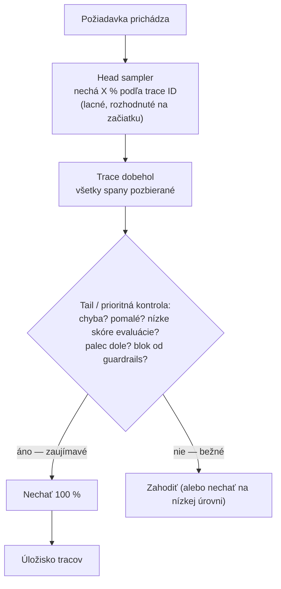
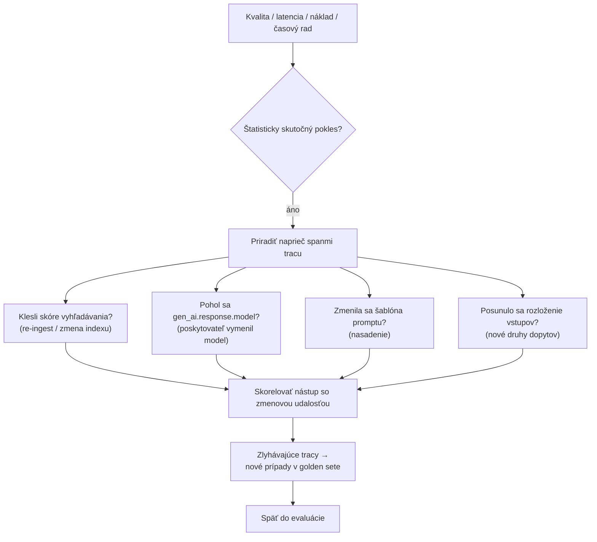

# Nechať si tracy, na ktorých záleží, uložiť ich bez úniku a rozpoznať, kedy systém so stavom 200 OK potichu zlyháva

[Časť 1](./index.md) postavila rámec: trace je úplný záznam jednej požiadavky, span po spane; tri piliere sú traces, metrics, logs; loguješ špecifiká RAG — nájdené chunky so skóre, finálny prompt, surový výstup, latenciu, tokeny a náklad na každý krok; náklad a latencia sú prvoradé; a observability dáva evaluácii ďalší prípad, lebo zlá produkčná odpoveď je jej najbližší golden-set prípad.

Táto stránka sa venuje tomu, čo sa mení, keď je prevádzka reálna a nepretržitá — keď sa z jedného tracu stane milión za deň a každé rozhodnutie musí obstáť pri veľkom rozsahu.

Observability (pozorovateľnosť) sa tu mení na produkčnú disciplínu: pri veľkom objeme si nemôžeš nechať každý trace, tak vzorkuješ; nemôžeš uložiť všetko, tak sa rozhoduješ, čo je bezpečné nechať si; nemôžeš sledovať každý graf, tak si stanovíš ciele a alerty spustíš len na to, čo používateľ pocíti; prepad kvality musíš priradiť k príčine; a to, čo toto všetko minie, musíš zastropovať.

Nie je to opätovné rozvedenie tracu ako základného prvku (to má Časť 1), ani katalóg nástrojov (Časť III), ani návod, ako opraviť pipeline (to sú stránky vrstiev [Retrieval](../../retrieval/) a [Generation](../../generation/)). Predmetom skúmania je tu samotný systém observability.

## Prečo si nenecháš každý trace

Pri produkčnom objeme je uchovávať 100 % tracov (trace — úplný záznam jednej požiadavky) neúnosne drahé — úložisko sa plní tak rýchlo, ako priteká prevádzka, a väčšina záznamov je nezaujímavá. Nechaj si teda reprezentatívnu a zaujímavú podmnožinu a zvyšok zahoď. To je vzorkovanie (sampling); celá otázka znie, ktoré tracy si necháš.

**Head-based sampling** (vzorkovanie na začiatku tracu) rozhoduje o zachovaní alebo zahodení hneď na začiatku tracu, na koreňovom spane (jeden krok tracu), zvyčajne deterministickým pomerom podľa trace ID — jeden z desiatich si necháš, deväť zahodíš. Lacné, bezstavové, s objemom predvídateľným do posledného bajtu.

Jeho obmedzenie je pre tracy, na ktorých ti záleží, osudné: v čase rozhodovania ešte nevieš, ako sa požiadavka skončila. Nemôžeš prednostne držať tracy s chybou — zatiaľ žiadna nenastala. Čisté head sampling zahodí väčšinu tracov, ktoré by si bol chcel, a nechá si náhodnú desatinu tých nudných.

**Tail-based sampling** (vzorkovanie na konci tracu) obracia načasovanie. Collector (zberač tracov) si odkladá každý span, kým požiadavka nedobehne, a potom rozhodne podľa celého tracu — jeho latencie, chybového stavu, atribútov spanov. Teraz sa dá vyjadriť „nechaj si tie pomalé, nechaj si chyby, nechaj si označené“.

Cena: collector je teraz stavový — spany jedného tracu drží v pamäti a zoskupuje ich podľa trace ID, takže každý span daného tracu musí doraziť na tú istú inštanciu collectora (load-balancing, teda rozloženie záťaže podľa trace ID), a účet za pamäť a CPU rastie. OpenTelemetry Collector Contrib to dodáva ako procesor `tail_sampling`.

Na čom sa skúsené tímy zhodnú: **priority sampling** (prioritné / hybridné vzorkovanie) — nechať si 100 % tracov, ktoré nesmieš nikdy stratiť (chyby, prekročenia rozpočtu latencie, odpovede, ktoré používateľ alebo guardrails (bezpečnostné mantinely) označili za zlé), a nudné úspechy vzorkovať na nízkej základnej úrovni. Bežné usporiadanie tie dva reťazí: najprv head sampler zoškrtá surový prúd na únosný objem a potom tail sampling nad zvyškom spraví skutočné rozhodnutie o zachovaní podľa výsledku.

LLM zvrat v tom, čo je „zaujímavé“: pri obyčajnej službe sú zaujímavé chyby a pomalé odpovede, oboje viditeľné v transportnej vrstve. Pri LLM systéme môže byť odpoveď so stavom 200 OK aj tak halucinácia, jemne nesprávna odpoveď alebo odmietnutie — kvalita je pre stav HTTP neviditeľná.

Prioritný signál preto musí popri latencii a chybe niesť aj signál kvality: skóre z online evaluácie pripnuté k tracu, palec dole, blok od guardrails, odmietnutie. Práve preto je vzorkovanie pri LLM aplikácii napojené na slučku evaluácie, nie len na chybu a latenciu — často sa totiž oplatí nechať si práve požiadavku, ktorá v transportnej vrstve vyzerala úplne zdravo.

## Čo najviac chceš logovať, to si najmenej smieš nechať

Najužitočnejšia vec pri ladení LLM aplikácie, celý odoslaný prompt a celý vrátený výstup, je zároveň to najcitlivejšie, čo držíš. Tieto telá správ bežne nesú používateľské a osobné údaje; najlepšie odladiteľný trace je zo svojej podstaty ten najviac zaťažený súkromím. Práve v tomto napätí spočíva celý návrh.

Štandard to rieši priamo. V sémantických konvenciách OpenTelemetry GenAI je zachytávanie obsahu správ, teda vstupných správ a vygenerovaného výstupného textu, voliteľné a predvolene vypnuté, práve pre súkromie a veľkosť dát. Predvolene zapnuté ostávajú metadáta: model, počty tokenov, trvanie. Surový text je tá časť, ktorú vedome zapneš.

(Tieto konvencie majú stav Development — experimentálny, ešte nie stabilný, k verzii Semantic Conventions v1.41.x v roku 2026 — a do aktuálnej experimentálnej sady sa prihlásiš cez `OTEL_SEMCONV_STABILITY_OPT_IN=gen_ai_latest_experimental`.)

Ochrana prichádza vo vrstvách, ktoré sa skladajú:

- **De-identifikácia pred úložiskom.** Osobné údaje odstrániť alebo anonymizovať skôr, než sa dostanú do úložiska tracov, tým istým detekčným aparátom, aký už používajú guardrails — rozpoznávač PII (osobné údaje), ktorý napája anonymizér, ako v pipeline Analyzer → Anonymizer od [Microsoft Presidia](https://microsoft.github.io/presidio) (mechaniku má [prehĺbenie o Guardrails](../guardrails/deep-dive)).
- **Úrovne uchovávania (retention tiers).** Krátke TTL (čas do expirácie) na spany s obsahom, aby surový text rýchlo expiroval, kým lacné metadáta zostávajú ďalej pre analýzu trendov.
- **Riadenie prístupu (access control) k samotnému UI tracov.** Produkčné prompty sú používateľské údaje a prehliadač tracov je oknom do nich.
- **Vzorkovanie.** Pomáha aj tu, takmer zadarmo — čím menej uložených tracov, tým menej toho môže uniknúť.

Voľba maskovania preberá os, ktorú zaviedli guardrails: vratné verzus nevratné (reversible vs irreversible). Je to skutočný kompromis, nie predvoľba. Nevratné maskovanie — hash (odtlačok), redact (začiernenie), replace (náhrada) — maximalizuje súkromie a tým istým krokom ničí odladiteľnosť: čo používateľ naozaj žiadal, už neuvidíš.

Vratné maskovanie — encrypt (šifrovanie) — necháva cestu späť pre oprávnené ladenie, ale obnoviteľná hodnota je väčšie riziko a robí z dát skôr pseudonymizované než anonymizované (pseudonymization vs anonymization), lebo kľúč je teraz uložené tajomstvo, ktoré sa oplatí napadnúť. Vyberáš podľa poľa a podľa úrovne uchovávania: telefónne číslo zahashované a preč, telo dopytu zašifrované na krátke okno a potom zahodené.

## Čo sledovať a kedy niekoho zobudiť

Dashboard LLM systému zobrazuje všetko, čo dashboard obyčajnej služby — golden signals (zlaté signály SRE) z tradície Google SRE: latenciu, prevádzku, chyby a saturáciu — plus jeden pilier, s ktorým tá štvorica nikdy nepočítala.

Na obyčajnej osi: latencia ako rozdelenie, p50/p95/p99, plus TTFT (time-to-first-token — čas do prvého tokenu), teda to, čo používateľ streamovanej odpovede naozaj zažije; náklad a spotreba tokenov na požiadavku; priepustnosť; chybovosť.

Pilier špecifický pre LLM je **kvalita**, vykresľovaná ako prvoradá od začiatku: skóre z online evaluácie na vzorkovanej prevádzke — podiel odpovedí, ktoré prejdú kontrolou faithfulness (vernosť zdrojom), a answer relevance (relevancia odpovede) — ďalej miera palcov dole, miera odmietnutí a miera blokov od guardrails. Dashboard, ktorý ukazuje latenciu a náklad, ale nie kvalitu, je slepý voči spôsobu zlyhania, ktorý je pre tento systém jedinečný.

Ten signál kvality ti dovolí čestne použiť spoľahlivostný rámec SRE. Vyber si SLI (service level indicator — čo meriaš), teda veci, ktoré naozaj meriaš: dostupnosť, p95 latenciu, pass-rate (podiel úspešných) kvality, hornú hranicu nákladu na požiadavku.

Stanov SLO (service level objective — cieľ na SLI), teda cieľ na niektoré SLI za dané okno: „p95 latencia pod tri sekundy počas 30 dní“, „faithfulness pass-rate na úrovni 0,95 alebo vyššie“.

**Error budget** (rozpočet chýb — koľko zlyhania si smieš minúť) je vzdialenosť medzi tým cieľom a dokonalými 100 % — množstvo zlyhania, ktoré smieš minúť, kým sa cieľ neprekročí.

Pre LLM systém pridaj jedno pravidlo navyše: trvaj na tom, aby aspoň jedno SLI bolo SLI kvality, ktoré vypočíta online evaluácia. Služba, ktorá je 100 % dostupná a z 30 % halucinuje, spĺňa SLO na dostupnosť a pritom sklame každého používateľa, čo jej dôveroval; bez cieľa na kvalitu ostáva dashboard zelený presne nad týmto.

Alerting vychádza z rozpočtu, nie zo surových metrík. Pager nech zazvoní na to, čo používateľ pocíti: na **burn rate** (rýchlosť míňania rozpočtu chýb), na prekročenie p95 latencie, skok nákladu, prepad kvality, prudký nárast blokov od guardrails. Rýchle míňanie rozpočtu zobudí niekoho hneď, pomalý posun iba varuje.

Disciplína tu znamená zdržanlivosť — priveľa alertov je samo osebe spôsob zlyhania. Napoj alert na každú metriku a skutočná regresia zapadne v šume, ktorý nikto nečíta — alert fatigue (únava z upozornení), a presne takto ozajstný incident hodinu nikto nezbadá.

Alerting na burn rate je zámerne založený na príznakoch: spúšťa sa na dôsledku viditeľnom pre používateľa, nie na každom zášklbe každého čísla pod ním — a práve vďaka tomu pager ostáva dôveryhodný.

## Ako regresiu kvality dovedieš k jej príčine

Keď sa metrika kvality prepadne, nasledujú v poradí dve otázky: je ten prepad skutočný a čo ho spôsobilo.

Najprv detekcia. Online evaluácia na vzorkovaných tracoch a pozbieraná spätná väzba používateľov dávajú časový rad metriky kvality; štatisticky skutočný pokles (nie jedno zlé popoludnie) je regresia kvality, a tá istá úvaha platí pre rady latencie a nákladu. Trend odlíš od šumu skôr, než niekoho zobudíš.

Potom miesto, kde sa štruktúra tracu vyplatí. Keďže sa trace rozkladá na spany podľa etáp, regresiu vieš lokalizovať na konkrétnu etapu namiesto hádania nad celou pipeline — to je rozklad na zlyhanie vyhľadávania verzus zlyhanie generovania z Časti I, teraz na produkčnom časovom rade.

Kandidátske príčiny, každá zanecháva stopu v zázname tracu:

- Klesli skóre vyhľadávania → opätovné načítanie korpusu do indexu (re-ingest) alebo zmena indexu (zlyhanie vyhľadávania)?
- Zmenil sa ti model bez toho, aby si o tom vedel → poskytovateľ potichu vymenil verziu, takže sa `gen_ai.response.model` posunul, hoci tvoj kód sa nezmenil?
- Zmenila sa šablóna promptu pri nasadení?
- Posunulo sa rozloženie vstupov (input distribution shift) → nová trieda dopytov, na ktorú systém nikdy nebol ladený?

Odpoveď nájdeš tak, že nástup regresie skoreluješ so zmenovou udalosťou — nasadením, zmenou pripnutej verzie modelu, re-ingestom. (Pripnúť verziu modelu tak, aby ju poskytovateľ nemohol potichu vymeniť — **model pinning** (pripnutie verzie modelu) — je postup z LLMOps; patrí do tej lekcie: [LLMOps](../../../part-3-production/llmops/).)

Tu sa slučka z Časti 1 stáva prevádzkovou. Tracy, ktoré regresia označí, sú z definície tie ťažké zlyhávajúce prípady — presne to, čoho má golden set (etalónová sada) nedostatok. Povyšujú sa na nové prípady v golden sete, takže **triáž regresie** (regression triage) dáva evaluácii nové prípady a evaluácia potom poistí opravu proti tomu, aby sa vrátila. Vnútro metrík je predmetom [prehĺbenia o Evaluation](../evaluation/deep-dive); tu ide len o to, že tá väzba funguje oboma smermi.

## Zastropovať, koľko požiadavka minie

Náklad sa začína jednou vecou — **token accounting** (účtovanie tokenov) na požiadavku: účet je vstupné tokeny plus výstupné tokeny, každý ocenený podľa modelu; nezvládneš riadiť to, čo si nespočítal.

Konvencie OpenTelemetry GenAI dávajú presné nástroje. Atribúty: `gen_ai.usage.input_tokens` a `gen_ai.usage.output_tokens` (rozdelenie tokenov), `gen_ai.request.model` a `gen_ai.response.model` (čo si žiadal verzus čo odpovedalo), `gen_ai.operation.name`, `gen_ai.provider.name`. Metriky: `gen_ai.client.token.usage` v jednotkách `{token}` a `gen_ai.client.operation.duration` v sekundách.

Ako pri obsahu správ, aj tieto majú stav Development v Semantic Conventions v1.41.x (2026), prihlásiš sa cez `OTEL_SEMCONV_STABILITY_OPT_IN=gen_ai_latest_experimental` — dosť stabilné, aby si na nich mohol postaviť systém, no ešte nie zmrazené.

Spočítať tokeny ešte neznamená vedieť, kam idú — to je **cost attribution** (priradenie nákladov). Označ spany atribútmi feature, tenant, route, model; mesačný účet potom vie odpovedať, „ktorá funkcia — alebo ktorý zákazník — míňa rozpočet“, namiesto neužitočného súhrnu „minuli sme X USD“. A tým značkovacím mechanizmom sú tie isté OTel atribúty.

Bez priradenia sa skok nákladu nedá diagnostikovať: vieš, že číslo stúplo, a nič o tom, prečo — takže sa ani nevieš rozhodnúť, čo vypnúť.

To isté urobíš s latenciou na časovej osi. Stanov ciele p50 a p95 a rozlož latenciu podľa spanov — vyhľadávanie, rerank (preusporiadanie) a generovanie, TTFT oproti celkovému uplynutému času — aby prekročenie ukázalo na pomalú etapu, nie na pipeline ako nerozlíšený celok.

Rozpočet latencie (latency budget) je strop; prekročenie je signál siahnuť po optimalizačnej páke z Časti 1: cache, lacnejší model, menej chunkov v prompte. (Streamovať odpoveď tak, aby TTFT bol krátky aj pri pomalom úplnom generovaní, je vec servingu (obsluha modelu); venuje sa mu lekcia o [servingu](../../../part-3-production/serving/).)

Politika, ktorá rozpočet premení z grafu na skutočnú páku, je rozdiel medzi **mäkkým stropom** (soft cap) a **tvrdým stropom** (hard cap). Mäkký strop varuje — pošle alert, sfarbí dashboard dočervena — a požiadavku pustí ďalej. Tvrdý strop naozaj zastaví: požiadavku odmietne, prepne na lacnejší model alebo skráti kontext, aby sa zmestil.

Tvrdý strop je strážca za behu, nie dodatočné hlásenie: funguje rovnako ako rozpočty krokov a tokenov, ktoré agent v Časti II nesmie prekročiť — limit, ktorý si systém vynucuje sám počas práce, nie taký, o ktorom sa dočítaš až ráno.

## Kde sa toto pokazí

Spôsoby zlyhania sa oplatí povedať priamo, lebo na každom z nich sa už nejaký tím naozaj popálil.

- **Pozorovať LLM aplikáciu môže stáť ako samotná LLM aplikácia.** Nechaj si 100 % tracov s obsahom a účet za observability začne konkurovať účtu za inferenciu, ktorý mal strážiť. Pri veľkom rozsahu robí observability cenovo únosnou práve vzorkovanie; keď ho berieš ako optimalizáciu, ktorá počká, účet ti ujde.
- **Ani tail sampling nie je zadarmo.** Pri obrovskom rozsahu je jeho stavové odkladanie a load-balancing podľa trace ID samo osebe drahé a prevádzkovo náročné a spraviť to dobre si žiada nemalú investíciu. Získaš tým schopnosť nechať si zaujímavé tracy; nezískaš ju však lacno.
- **Logovať surové prompty a výstupy bez de-identifikácie je incident v oblasti súladu**, ktorý raz určite príde. Najlepšie odladiteľný log je ten, ktorý sa objaví v správe o úniku — maskuj na vstupe, alebo si to nenechávaj.
- **Alerting na každú metriku končí v alert fatigue** a alert fatigue končí tým, že skutočná regresia prebehne neprečítaná. Viac alertov neznamená viac bezpečia za bodom, kde ich ešte niekto číta.
- **SLO na kvalitu bez online evaluácie za chrbtom je divadlo dostupnosti:** stena zelených dashboardov nad službou, ktorá je sebavedomo a merateľne nesprávna. Cieľ má cenu presne takú, akú má meranie pod ním.

## Čo si odniesť z lekcie

- Vzorkovanie je pri veľkom rozsahu nevyhnutné a stratégia rozhoduje, čo si necháš: head-based je lacné a bezstavové, ale rozhoduje skôr, než je známy výsledok, takže nevie prednostne držať chyby; tail-based si odloží celý trace a rozhodne podľa výsledku, za cenu stavovej pamäte a load-balancingu (procesor `tail_sampling` v Collector Contrib); priority/hybrid si necháva 100 % tracov, ktoré nesmieš stratiť, a zvyšok vzorkuje.
- Pri LLM systéme „zaujímavé“ zahŕňa kvalitu, nie len chyby a latenciu — odpoveď so stavom 200 OK môže byť halucinácia — takže rozhodnutie o zachovaní je napojené na skóre evaluácie, palec dole, blok od guardrails alebo odmietnutie.
- Najlepšie odladiteľné dáta sú tie najcitlivejšie, preto je obsah správ v OTel GenAI konvenciách voliteľný a predvolene vypnutý, kým metadáta ostávajú zapnuté; bráň sa de-identifikáciou pred úložiskom, úrovňami uchovávania, riadením prístupu k UI tracov a tým, čo z expozície uberie už samotné vzorkovanie.
- Maskovanie je voľba podľa poľa a podľa úrovne: nevratné (hash, redact, replace) maximalizuje súkromie a zabíja odladiteľnosť; vratné (encrypt) necháva oprávnenú cestu späť, ale je to pseudonymizácia, nie anonymizácia, a kľúč sa stáva príťažou.
- Vykresli golden signals plus prvoradý pilier kvality; stanov SLI, SLO a error budget s aspoň jedným SLI kvality, ktoré počíta online evaluácia; a alerty spúšťaj na burn rate a príznaky, ktoré používateľ pocíti, nie na každú metriku, inak alert fatigue pochová skutočnú regresiu.
- Triáž regresie je najprv detekcia, potom priradenie: štatisticky skutočný pokles v rade kvality, latencie alebo nákladu, lokalizovaný na etapu naprieč spanmi tracu (klesli skóre vyhľadávania, pohol sa `gen_ai.response.model`, zmenil sa prompt, posunulo sa rozloženie vstupov), skorelovaný so zmenovou udalosťou — a zlyhávajúce tracy sa stávajú novými prípadmi v golden sete.
- Náklad je token accounting na požiadavku cez nástroje OTel GenAI, diagnostikovateľný vďaka cost attribution (označ spany podľa feature/tenant/route/model); rozpočty latencie sa rozkladajú podľa spanov; a mäkký strop varuje, kým tvrdý strop vynucuje za behu.

**Nové pojmy** → [Glosár](../../../glossary.md): head-based sampling, tail-based sampling, priority / hybrid sampling, message-content capture (opt-in), retention tiers, golden signals, SLI / SLO, error budget, burn-rate alerting, alert fatigue, regression triage, cost attribution, token accounting, latency budget, soft cap / hard cap, OpenTelemetry GenAI conventions.
