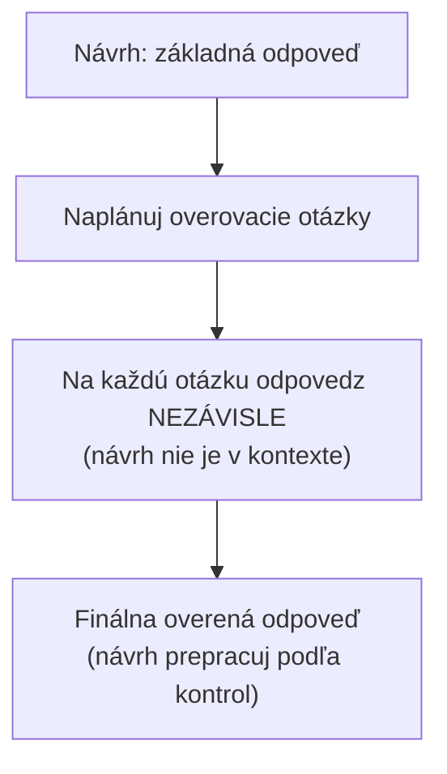
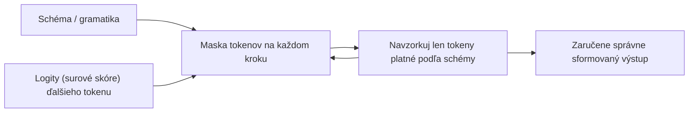

# Odpovede, ktoré si samy overia, výstup, ktorý sa nedá zdeformovať, a skladanie kontextu za tým všetkým

[Časť 1](./index.md) postavila vrstvu Generation na jedinom rámci — odpovedať z kontextu, nie z pamäte — a dala ti základné páky: grounding instructions, citácie napojené na metadáta chunkov, povolené odmietnutie a faithfulness ako číslo, ktoré premosťuje k vrstve Evaluation. Pomenovala aj zlyhanie, kvôli ktorému celá táto vrstva existuje: chunk (kúsok dokumentu), ktorý si potreboval, v kontexte bol, no odpoveď aj tak vyšla zle. Táto stránka to všetko predpokladá a z toho rozvíja pokročilé postupy. Rámec zlyhania generovania sa tu už znova nevysvetľuje, len sa naň nadväzuje.

Najprv jedna hranica — tá istá, akú si vytýčilo prehĺbenie lekcie Retrieval. Všetko na tejto stránke je generovanie v jednom prechode: model poskladá jednu odpoveď z pevného kontextu a ten kontext sa nemení. Sebakontrola nižšie je model, ktorý si preveruje vlastný návrh — nie agent, ktorý sa vracia po ďalší kontext. Vo chvíli, keď sa systém zacyklí naspäť a znova vyhľadáva, lebo usúdil, že odpoveď nestačí, si opustil jeden prechod a ocitol sa v iteratívnej, agentnej podobe (Self-RAG, corrective RAG, dostatočný kontext) — a tá patrí do [prehĺbenia lekcie Agentic RAG](../../part-2-agents/agentic-rag/deep-dive). Táto stránka robí jedno: aby bol ten jediný prechod taký dobrý, dobre sformovaný a overiteľný, ako len jeden prechod môže byť.

Chrbtica po poriadku: minúť výpočtový výkon pri inferencii na zachytenie vlastných chýb modelu (sebakontrola); vtlačiť odpoveď do tvaru, ktorému parser aj kontrolór citácií môžu veriť (štruktúrovaný výstup a vynútené citácie); postaviť sa konfliktu medzi kontextom a pamäťou čelne, namiesto dúfania, že grounding vyhrá; poskladať dlhý kontext za hranicou pravidla lost-in-the-middle; a tvarovať formát, tón a dĺžku odpovede tak, aby tvarovanie neprebilo grounding.

## Výpočtový výkon navyše, ktorý zachytí vlastné chyby modelu

**Grounding instruction** (inštrukcia na opretie o kontext) z Časti 1 znižuje mieru halucinácií. Neoverí ani jednu konkrétnu odpoveď. Dve publikované techniky minú výpočtový výkon navyše pri inferencii, aby preverili samotnú odpoveď — obe na strane generovania, ani jedna nevyhľadáva nanovo, obe vymieňajú tokeny a latenciu za **faithfulness** (vernosť zdrojom). Riešia problémy odlišného druhu a najrýchlejšie ich odlíšiš takto: jedna vzorkuje a hlasuje, druhá generuje a kontroluje.

### Self-consistency: navzorkuj viac ciest, hlasuj raz

**Self-consistency** (navzorkuj viac ciest a hlasuj) nahradí jediné hladné (greedy) dekódovanie chain-of-thought (reťazec úvah) malým ansámblom behov (Wang a kol., „Self-Consistency Improves Chain of Thought Reasoning in Language Models“, arXiv 2203.11171, marec 2022; ICLR 2023). Pri teplote nad nulou navzorkuješ rozmanitú množinu ciest úvah, tie potom marginalizuješ (odmyslíš si konkrétnu cestu) a na finálnej odpovedi spravíš väčšinové hlasovanie.

Intuícia: naozaj ťažký problém pripúšťa viac platných ciest, ktoré sa zbiehajú k tej istej správnej odpovedi, kým nesprávne odpovede sa rozutekajú — zhoda je teda dôkaz a ojedinelý odlišný hlas väčšina prehlasuje.

Na benchmarkoch samotného článku sú zisky oproti hladnému CoT veľké: GSM8K +17,9 %, SVAMP +11,0 %, AQuA +12,2 %, StrategyQA +6,4 %, ARC-challenge +3,9 %. Ber ich však také, aké sú — benchmarky uvažovania typu chain-of-thought, nie RAG — lebo pre RAG je použiteľnosť užšia, než napovedajú čísla z titulku.

V systéme RAG sadne self-consistency na odpoveď s diskrétnou, vytiahnuteľnou hodnotou, o ktorej sa naozaj dá hlasovať: číslo, meno, kategória, áno/nie opreté o nájdený kontext. Spustíš N opretých generovaní a vezmeš väčšinovú odpoveď; jediné odchýlené generovanie hlasovanie prehrá. To je celý test použiteľnosti.

To ti zároveň povie, kedy po nej nesiahať. Otvorená, dlhá odpoveď nemá jednu hodnotu na hlasovanie — niet čo odmyslieť a self-consistency sa jednoducho nedá použiť. Navyše násobí náklad N-krát: N plných generovaní na každý dopyt. Preto je to uvážené rozhodnutie o latencii a rozpočte pri úzkej triede otázok, nikdy nie predvoľba, ktorú zapneš všade.

### Chain-of-verification: najprv návrh, potom výsluch návrhu

**Chain-of-verification (CoVe)** (Dhuliawala a kol., „Chain-of-Verification Reduces Hallucination in Large Language Models“, arXiv 2309.11495, september 2023) je výslovná slučka, v ktorej si model sám kladie kontrolné otázky, v štyroch krokoch: napíš základný návrh odpovede; naplánuj sadu overovacích otázok, ktoré ten návrh faktograficky preveria; na každú overovaciu otázku odpovedz nezávisle; a nakoniec vygeneruj finálnu overenú odpoveď, v ktorej návrh prepracuješ podľa toho, čo kontroly ukázali.

Nosný je tretí krok a rozhoduje pri ňom nezávislosť — v článku „faktorizované“ overovanie. Overovacie otázky sa zodpovedajú bez základného návrhu v kontexte, takže model nemôže potichu zopakovať práve tú chybu, ktorú má odhaliť. Nechaj ho pri „overovaní“ znova čítať vlastný nesprávny návrh a chybu len odobrí: sebavedomá formulácia návrhu sa stane východiskom jeho vlastnej kontroly a vráti sa mu ako ozvena. Izolovať každú overovaciu otázku tú ozvenu preruší.

Halucinácie naozaj znižuje len faktorizovaný variant a variant „faktorizuj a preprac“, ktoré overovanie oddelia od návrhu; naivná spoločná verzia (všetko v jedinom prompte) chybu prepustí rovno naspäť dnu.



V RAG sa overovacie otázky nanovo opierajú o nájdený kontext — každá sa stane malou kontrolou „podporujú toto tvrdenie naozaj zdroje?“. Tým sa jediná grounding instruction z Časti 1 mení na výslovný audit tvrdenie po tvrdení — a práve o takú zrnitosť ide, keď je chybou jedna vymyslená veta v inak správnej odpovedi.

Postav si tie dve techniky vedľa seba a deľba práce je čistá: self-consistency vzorkuje a hlasuje (bez kritiky, potrebuje odpoveď, o ktorej sa dá hlasovať, a funguje tam, kde je jedna diskrétna hodnota); CoVe generuje a kontroluje (výslovné kladenie kontrolných otázok samému sebe, funguje na dlhej próze, kde niet o čom hlasovať). Obe stoja prechody navyše. Ani jedna nevyhľadáva nanovo.

## Prestaň o štruktúru prosiť, vynúť si ju

Časť 1 model prosila, nech cituje zdroje a nech odpovie čisto. Na pokročilej úrovni prestaneš prosiť a začneš vynucovať — tvar výstupu sa stane tvrdou zárukou namiesto nádeje.

Dôvod: „len poprosiť“ je v lepšom prípade iba pokus — a ten sa pod záťažou láme. Prompt, ktorý povie „vráť JSON“ alebo „cituj zdroje“, ti prinesie čiarku navyše na konci, ukecaný prozaický úvod pred samotným JSON alebo vymyslené `source_id` — a ďalej po prúde parser spadne alebo citácia ukazuje do prázdna. V ukážke to funguje a na okrajových prípadoch zlyhá, čo je najhorší spôsob zlyhania, aký môžeš nasadiť, lebo ho neuvidíš, kým naň nenarazí produkčná prevádzka.

**Obmedzené dekódovanie (constrained decoding)** tú možnosť neodstraňuje znížením pravdepodobnosti, ale úplne. Štruktúru vynucuje počas generovania: v každom kroku dekódovania schéma (skompilovaná do gramatiky) určuje, ktoré ďalšie tokeny sú prípustné, a vzorkovač zamaskuje (vylúči) každý token, ktorý by schému porušil, takže vôbec môžu vyjsť len tokeny platné podľa schémy. Zle sformovaný výstup prestáva byť nepravdepodobný a stáva sa štruktúrne nemožným. (Termín je v glosári už z lekcie o volaní nástrojov; je to ten istý mechanizmus, namierený na formát odpovede.)



Tu sa „režim JSON“ a výstup so zárukou schémy rozchádzajú a ten rozdiel je dôležitý. Obyčajný režim JSON zaručí len to, že výstup je platný JSON — o tom, či ten JSON zodpovedá tvojej schéme, nehovorí nič.

**Structured Outputs** od OpenAI (`strict: true`, august 2024) skompiluje JSON Schema, ktorú dodáš, do gramatiky a obmedzí ňou dekódovanie, takže dostaneš **štruktúrovaný výstup** (structured output) s dodržaním schémy: každé povinné pole prítomné, správne typy, žiadne kľúče navyše. So zárukou prichádzajú dve ceny: podporuje len podmnožinu JSON Schema, takže nie každú schému, ktorú vieš napísať, vieš aj vynútiť; a prvá požiadavka s novou schémou si vyžiada jednorazové oneskorenie na kompiláciu gramatiky, ktoré sa pre ďalšie požiadavky s tou istou schémou uloží do cache — a túto cenu zaplatíš raz na schému, nie pri každom volaní.

Vynútené **citácie** (citations) majú dva tvary a skladajú sa so všetkým vyššie.

Prvý je **zabudovať citáciu priamo do schémy**. Objekt odpovede nesie pole `claims`, kde každé tvrdenie nesie svoje `source_id`, takže z citácie sa stane povinné, typované pole, ktorému parser môže veriť — namiesto reťazca, o ktorom dúfaš, že ho model napísal. Vezie sa na tých istých metadátach, ktoré si pripojil pri chunkingu (Časť 1 a vrstva [Ingestion](../ingestion/)) — identifikátor zdroja tam bol vždy. Schéma len robí jeho prenášanie povinným.

Druhý sú **citácie natívne od poskytovateľa**. Anthropic **Citations API** (23. januára 2025) vezme zdrojové dokumenty, ktoré podáš, a vráti štruktúrované objekty citácií so znakovými posunmi do zdrojového textu — presné vety alebo úryvky, o ktoré sa tvrdenie opiera, zaručené na úrovni API namiesto vyprosené promptom. Anthropic uviedol až o 15 % vyššiu úplnosť (recall) oproti vlastnej promptovej schéme citovania.

Jedno obmedzenie treba zvážiť už pri návrhu, nie ho odsúvať pod čiaru: v API Anthropicu sa Citations API a Structured Outputs navzájom vylučujú — oboje naraz nevynútiš, takže pre dané volanie volíš medzi citáciami zaručenými cez API a schémou zaručenou cez API.

Toto všetko má svoju cenu a kľúčové je vedieť, kedy ju neplatiť. Vtlačenie výstupného rozdelenia do rigidnej schémy môže zhoršiť uvažovanie odpovede: model minie rozpočet na uspokojenie gramatiky namiesto premýšľania. Nechaj preto uvažovanie voľné a obmedz len finálnu odpoveď — nech model uvažuje v neobmedzenom scratchpade či poli na premýšľanie a schémou zamknutú odpoveď vygeneruje až na konci. Obmedz to, čo dodávaš, nie to, ako uvažuješ.

## Keď si kontext a pamäť modelu protirečia

Časť 1 dala pravidlo: odpovedaj z kontextu, potlač **parametrickú pamäť** (parametric knowledge). Pravidlo nie je absolútne a predstierať, že je, ti prinesie celú triedu potichu nesprávnych odpovedí.

RAG zámerne pripútava odpoveď ku kontextu, ktorý podáš, no model aj tak nesie silné parametrické znalosti — priory zapečené počas trénovania. Grounding instructions ho ku kontextu naklonia. Priory nevypnú a nijaké znenie ich nevypne.

Tak vzniká **konflikt znalostí (knowledge conflict)**, nazývaný aj konflikt medzi kontextom a pamäťou: nájdený kontext protirečí tomu, čo model „verí“, a nie je zaručené, že výsledok padne v prospech kontextu. Ktorá strana vyhrá, závisí od viacerých vecí: aký sebavedomý a zakorenený je parametrický prior a ako vierohodne a súvislo pôsobí kontext. Model skôr prebije kontext, ktorý číta ako nevierohodný alebo ktorý tvrdo naráža na silno zakorenený prior — aj keď je ten kontext správny, práve nájdený fakt. To je presne to zlyhanie generovania, ktorého by sa podnik mal báť: tvoj čerstvý, povolený dokument prehrá so zastaraným presvedčením z čias trénovania a odpoveď pritom znie úplne v poriadku.

Máš páky nad rámec základnej grounding instruction, hoci ani jedna nie je vypínač:

- **Konflikt výslovne ošetri v inštrukcii.** Povedz modelu, že kontext je smerodajný a že keď protirečí predchádzajúcej znalosti, má sa prikloniť ku kontextu a rozpor pomenovať, nie ho potichu zladiť. Potiché zladenie je presne ten mechanizmus, ktorým sa nesprávna odpoveď skryje — zakryje miesto, ktoré si potreboval vidieť.
- **Sprav zdroje čitateľnými.** Zreteľné oddelenie a citácie pri každom tvrdení (predošlá sekcia) zdvihnú cenu potichého podsunutia prioru, lebo každé tvrdenie teraz musí ukázať na zdroj — a prior nemá žiadny.
- **Meraj to.** Či sa odpoveď naozaj oprela o zdroje, je metrika faithfulness, sformalizovaná vo vrstve [Evaluation](../cross-cutting/evaluation/). Faithfulness je nástroj, ktorý zachytí parametrické prebitie, nad ktorým by ľudský čitateľ len prikývol a išiel ďalej.

Ostáva jedna úprimná hranica. Nijaký prompt nespraví grounding absolútnym — parametrické prebitie znižuješ a meriaš, neodstraňuješ ho. Práve preto je faithfulness sledované číslo, nie vyriešený problém.

## Skladanie dlhého kontextu za hranicou lost-in-the-middle

Použi kánonový termín, netreba ho vymýšľať nanovo: **lost-in-the-middle** (strata uprostred) (Liu a kol., arXiv 2307.03172, TACL 2023). Časť 1 ti dala orientačné pravidlo — málo najlepších chunkov, najrelevantnejšie na okraje. Tu je mechanizmus a disciplína za ním.

Presne: model využíva informáciu najlepšie, keď sedí na začiatku alebo na konci vstupu, a najhoršie, keď je zahrabaná uprostred — pozičná krivka v tvare U, meraná na viacdokumentovom QA a na vyhľadávaní typu kľúč-hodnota. Čo ľudí zaskočí: platí to aj pre modely stavané a predávané ako long-context. Veľké kontextové okno nie je rovnomerne využiteľné okno; práve v jeho strede sa signál stráca.

```text
využiteľný
signál
  ▲    ●                                   ●
  │      ●                               ●
  │        ●                           ●
  │          ●● ● ● ● ● ● ● ● ● ● ● ●●
  └──────────────────────────────────────▶  pozícia v kontexte
     začiatok           stred            koniec
```

Preto viac nie je lepšie. Pridaj nájdené dokumenty za istú hranicu a uškodí to: chunky navyše pridajú šum, rozriedia ten jeden, na ktorom záležalo, potlačia ho do stratového stredu a k tomu spotrebúvajú tokeny. Efektívny kontext nie je veľkosť kontextového okna. **Context packing** (skladanie kontextu) je problém výberu, nie problém „napchaj okno“ — a práve preto existuje reranking (preusporiadanie) vyššie vo vrstve Retrieval. Vďaka rerankingu si môžeš dovoliť podať len málo chunkov.

Vzhľadom na krivku U nie je poradie kozmetika. Poskladané chunky umiestni tak, aby najvyššie hodnotené skončili na okrajoch — na začiatku a na konci — a najslabšie do stredu, kde ich model aj tak spola prehliadne. Reranker už poradie podľa skóre zostavil; pozícia pri skladaní sa naň priamo mapuje. Retriever určuje poradie; skladanie ho premieta na pozíciu.

Ešte dvoma krokmi získaš rozpočet skôr, než vôbec naďabíš na hranicu okna. **Deduplikuj**: chunky z prekryvu pri ingestion, plus takmer duplicitné zdroje, plytvajú tokenmi a opakovaním znova pochovávajú signál — zahoď nadbytočnosť pred skladaním. A **komprimuj**, keď sa to oplatí: kompresia kontextu alebo sumarizácia nájdených chunkov vtesná viac signálu na token, za cenu ďalšieho prechodu LLM. Pomenuj to, siahni po tom, keď je okno naozaj úzkym hrdlom, a inak zaň neplať.

Niť naprieč všetkým: skladanie dlhého kontextu je pravidlo z Časti 1 „málo najlepších, na okraje“, dotiahnuté do prísnosti — vyber (rerank), deduplikuj, usporiadaj podľa krivky U. Okno sa zväčšilo. Disciplína nezvoľnela.

## Tvarovanie odpovede bez toho, aby prebilo grounding

Vygenerovaná odpoveď je tá časť produktu, ktorú používateľ naozaj číta, a **tvarovanie odpovede** (answer-shaping) rozhoduje, ako dopadne. Jednu výhradu si drž od začiatku, lebo je zároveň pointou: tvarovanie nesmie nikdy prebiť správnosť.

Formát je skutočná páka kvality, nie ozdoba. Tvar zvoľ podľa toho, komu je odpoveď určená: próza pre ľudského čitateľa, odrážky alebo tabuľky na porovnanie, ktoré sa dajú preletieť očami, a štruktúrovaný výstup (zo sekcie vyššie), keď je čitateľom stroj. Stena prózy tam, kde otázka chcela tabuľku, je horšia odpoveď aj vtedy, keď je každý fakt v nej správny — čitateľ si nevytiahne to, po čo prišiel.

Dĺžka je regulátor, ktorý nastavíš podľa úlohy. Zadaj cieľovú dĺžku a zhora ju ohranič cez `max_tokens`. Pridlhá odpoveď rozriedi pointu, pochová výhradu, na ktorej záležalo, a míňa tokeny; priveľmi oseknutá zahodí potrebné spresnenie alebo nuansu. Jednoriadkové vyhľadanie a viacodsekové vysvetlenie chcú iné nastavenie; dĺžka nie je pevná predvoľba, ktorú necháš tak.

Tón nastavíš v systémovom prompte a držíš ho vyrovnaný. Register zlaď s publikom — prostý pre podporu, presný pre analytika — a udrž ho konzistentný naprieč odpoveďami, lebo kolísanie tónu číta používateľ ako nespoľahlivý systém, aj keď fakty sedia.

A teraz pravidlo, ktorému to všetko slúži. Tvarovanie odpovede je podriadené groundingu a faithfulness. „Buď stručný“ nesmie nikdy zahodiť citáciu, výhradu ani úprimné „toto v dokumentoch nie je“. Keď sa inštrukcia na tvarovanie a grounding instruction zrazia, vyhráva grounding, zakaždým. Nejde tu len o poriadok: krásne naformátovaná, sebavedomo ladená nesprávna odpoveď je najhorší výsledok, aký vie celá vrstva vyprodukovať, lebo tvarovanie spraví nesprávnu odpoveď presvedčivejšou. Práve preto prichádza tvarovanie posledné a ustupuje správnosti — je to leštidlo, ktoré nanášaš na niečo, čo si už spravil pravdivým.

## Čo si odniesť z lekcie

- Sebakontrola minie výpočtový výkon navyše pri inferencii na preverenie vlastnej odpovede modelu: self-consistency navzorkuje viac ciest úvah a väčšinovo odhlasuje diskrétnu hodnotu, kým chain-of-verification najprv napíše návrh a potom odpovedá na izolované overovacie otázky, aby vlastnú chybu nemohol len odobriť — a ani jedna technika nevyhľadáva nanovo.
- Obmedzené dekódovanie spraví z tvaru výstupu záruku namiesto prosby: schéma v každom kroku zamaskuje (vylúči) neplatné tokeny, takže zle sformovaný JSON je nemožný, a Structured Outputs od OpenAI (`strict: true`) zaručí dodržanie tvojej schémy, nie iba platný JSON.
- Citáciám sa dá veriť len vtedy, keď sú typovaným poľom schémy alebo natívne od poskytovateľa (Citations API od Anthropicu vráti znakové posuny do zdroja zaručené na úrovni API, nie voľnotextovú nádej). A keďže prehnané obmedzenie uvažovania má svoju cenu, obmedz finálnu odpoveď a premýšľanie nechaj voľné.
- Konflikt medzi kontextom a parametrickou znalosťou je reálny: grounding instructions naklonia model ku kontextu, no jeho priory nevypnú, tak mu prikáž prikloniť sa ku kontextu a rozpor pomenovať a potom faithfulness zmeraj, či to spravil.
- Skladanie dlhého kontextu za hranicou lost-in-the-middle je disciplína v troch krokoch — vyber málo (rerank), deduplikuj a najvyššie hodnotené chunky daj na začiatok a koniec — lebo väčšie okno nie je rovnomerne využiteľné.
- Tvarovanie odpovede (formát, tón, dĺžka) je skutočná páka kvality, ale ostáva podriadené groundingu: dobre otvarovaná nesprávna odpoveď je horšia než škaredá správna, lebo tvarovanie len spraví nesprávnu odpoveď presvedčivejšou.

**Nové pojmy** → [Glosár](../../glossary.md): self-consistency, chain-of-verification (CoVe), knowledge conflict (context–memory conflict), answer-shaping. (Structured output, constrained decoding, strict mode, lost-in-the-middle, faithfulness, parametric knowledge — z predošlých lekcií.)
