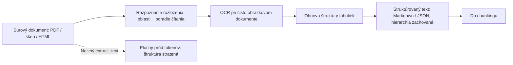
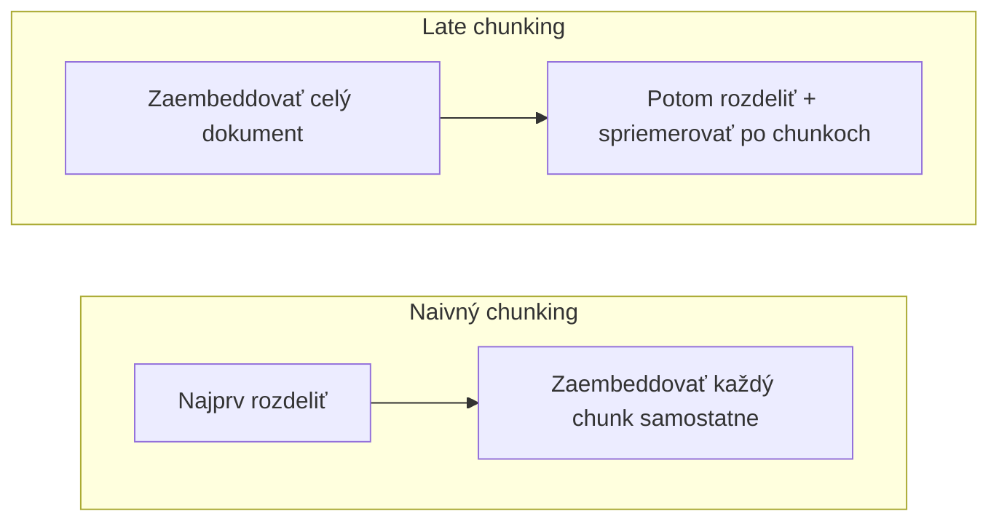

# Čistý text zo surových dokumentov a vektory na mieru doméne, rozpočtu a jazykom

[Časť 1](./index.md) postavila vrstvu Ingestion (offline prípravu dokumentov) na dvoch pilieroch. Prvým bol chunking (delenie dokumentov na chunky): ako veľký má byť chunk (kúsok dokumentu), stratégie od delenia na pevnú veľkosť (fixed-size) po delenie s ohľadom na štruktúru dokumentu (document-structure-aware) a metadáta, ktoré chunku priradíš hneď pri delení. Druhým boli embeddingové modely: rozdiel medzi bi-encoderom a cross-encoderom, osi výberu modelu, kosínusová podobnosť a dve časté pasce. Tri veci pritom nechala len načrtnuté — a presne tým sa venuje táto stránka.

Po prvé, prvá časť mlčky predpokladala, že čistý text na delenie už máš. V podnikovom prostredí práve tento predpoklad neplatí: na vstupe nie je próza, ale PDF, skeny, tabuľky a HTML. Niečo ich musí najprv premeniť na text, ktorý potom delíš. Kvalita sa pritom stráca bez toho, aby sa ohlásila jediná chyba. Po druhé, aj keď je text čistý, chunk vytrhnutý z dokumentu stráca okolitý kontext — a existujú techniky, ktoré mu ho vracajú. Po tretie, embeddingový model si doteraz bral ako hotový; dá sa však prispôsobiť tvojej doméne, rozpočtu a jazykom.

Najprv parsovanie dokumentov; potom pokročilé delenie — late chunking a contextual retrieval; nakoniec embeddingy do hĺbky: fine-tuning, skracovanie vektorov cez Matryoshka Representation Learning a viacjazyčné modely. Znalosť prvej časti všade predpokladáme: kompromis veľkosti chunku ani rozdiel medzi bi- a cross-encoderom už nevysvetľujeme, iba na ne nadväzujeme.

## Parsovanie dokumentov: strop kvality pre všetko, čo nasleduje

Pipeline prvej časti sa začínal krokom „rozdeľ dokument na chunky“. Niečo však musí dokument na text najprv premeniť — a práve v tomto kroku enterprise RAG najčastejšie zlyháva a nikto si to nevšimne. **Parsovanie dokumentov** (document parsing) sa riadi neúprosným pravidlom: zo smetí na vstupe nevznikne nič iné než smeti na výstupe (garbage in, garbage out). Kvalita vytiahnutého textu zhora ohraničuje každú stratégiu delenia aj každý neskorší trik s vektormi. Ak parser vstup skomolil, nižšie v pipeline to už nič nenapraví — delíš nezmysel a ten istý nezmysel potom verne embedduješ.

Jadro problému: vizuálne rozloženie dokumentu nesie význam, ktorý plochá extrakcia textu zahodí. PDF nie je logický dokument — je to množina glyfov rozmiestnených po strane. Naivný `extract_text` tie glyfy prejde v poradí, v akom ležia v súbore, a vráti lineárny prúd, ktorý sa rozpadá potichu a predvídateľne. Viacstĺpcovú stranu prečíta naprieč, takže sa dva stĺpce prepletú do nezmyslu. Tabuľky sa zosypú do nezarovnaného prúdu tokenov: vzťahy riadkov a stĺpcov, ktoré dávali každému číslu význam, zmiznú. Pre finančné a špecifikačné tabuľky, ktorých sú podnikové korpusy plné, je práve toto najhoršie poškodenie zo všetkých. Hlavičky, päty, popisky obrázkov a poznámky pod čiarou skončia na nesprávnom mieste alebo zmiznú. A stratí sa hierarchia nadpisov — presne tá, o ktorú sa opiera delenie s ohľadom na štruktúru dokumentu aj metadáta s cestou po sekciách (heading path) z prvej časti.

Typy dokumentov si zoraď podľa stúpajúcej náročnosti — nie je to jeden problém, ale odstupňovaný rad:

- **Natívne textové PDF, DOCX a HTML** — znaky v súbore sú; rieši sa čisto štruktúra a poradie čítania.
- **Tabuľky** — štruktúru buniek, riadkov a stĺpcov treba zachovať výslovne, nie linearizovať. Sploštiť tabuľku riadok po riadku znamená zničiť stĺpec, ktorý dával každému číslu význam — presne tak, ako veta „V treťom kvartáli vzrástla o 20 %.“ z prvej časti stratila odsek, ku ktorému sa viažu jej slová.
- **Skenované a čisto obrázkové PDF** — textová vrstva neexistuje. Text najprv treba obnoviť cez **OCR** (optické rozpoznávanie znakov) — z pixelov písma späť na znaky — a až potom ho môže spracovať ďalší krok pipeline.
- **Zložité rozloženie** — viacstĺpcové strany, formuláre, obrázky popretkávané textom: všetky predchádzajúce problémy naraz.

Moderná odpoveď znie: parsovanie **layout-aware** (s ohľadom na rozloženie strany) — najprv rozpoznať štruktúru, až potom vyťahovať text. Namiesto toho, aby glyfy pozbieral v poradí ich uloženia v súbore, parser najprv pustí vizuálny model alebo model rozloženia, ktorý na strane rozpozná oblasti — nadpis, odsek, tabuľku, obrázok, zoznam, hlavičku, pätu — a určí poradie čítania, a až potom siahne po texte. Výsledok vracia ako štruktúrovaný Markdown alebo JSON so zachovanou hierarchiou aj tabuľkami. Celý rozdiel oproti staršiemu plochému extraktoru je práve v tomto obrátenom poradí krokov.

V nástrojoch sa zorientuješ podľa niekoľkých mien. Nie je to nákupný zoznam — za každým z nich stojí iný konštrukčný prístup:

- **Unstructured** ([unstructured.io](https://unstructured.io)) — univerzálna prvá voľba: knižnica a platforma na ingestion dokumentov, ktorá rozloží dokumenty v množstve formátov (PDF, DOCX, PPTX, HTML) na typované elementy — tie potom delíš a filtruješ.
- **Docling** ([GitHub](https://github.com/docling-project/docling)) — IBM Research ho uvoľnil ako open source v roku 2024; spája rozpoznávanie rozloženia so špecializovaným modelom na štruktúru tabuliek (TableFormer) a s obnovou poradia čítania; vracia štruktúrovaný Markdown alebo JSON. Malý vision-language model Granite-Docling (IBM, 2025), ktorý číta obraz strany a text naraz, neskôr celú premenu strany na štruktúru zvládol sám — od obrazu strany rovno po štruktúrovaný text.
- **LayoutLM** (Microsoft, prvá verzia 2019; arXiv 1912.13318) — výskumný koreň, z ktorého vyrástol celý odbor: transformer, ktorý spoločne modeluje text, jeho 2D pozíciu na strane a obraz strany. Dal vzniknúť celej rodine modelov na porozumenie dokumentom.
- **Parsery na báze vision-language modelov** (2024–2025) — posúvajú myšlienku jediného modelu ešte ďalej: čítajú priamo obraz strany a rovno z neho generujú štruktúrovaný text. Najviac vynikajú pri naozaj neusporiadaných rozloženiach.

Strategická voľba je medzi kvalitou parsovania a cenou, latenciou a zložitosťou — a otázka „kedy nie“ je rovnako dôležitá ako „kedy áno“. Na čistú jednostĺpcovú prózu s natívnym textom úplne stačí lacný plochý extraktor (pypdf a podobné); nasadzovať tam ťažký parser znamená vyhadzovať peniaze a pridávať latenciu. Parsery layout-aware a modely na štruktúru tabuliek sa oplatia presne vtedy, keď sú dokumenty tabuľkové, viacstĺpcové alebo skenované. Presne tak vyzerá väčšina skutočných podnikových korpusov. Parsery na báze vision-language modelov dosahujú najvyššiu kvalitu na najneusporiadanejších vstupoch — za cenu vyššej latencie a vyšších nákladov na každú stranu.

Jedna štrukturálna okolnosť pritom hovorí jednoznačne v prospech kvality: parsovanie je offline a beží raz na dokument, tak ako zvyšok vrstvy Ingestion. Prebehne skôr, než príde prvá otázka. Môžeš si tu preto dovoliť oveľa drahší parser, než aký by si kedy obhájil v čase dopytu — náklad sa rozloží medzi všetky budúce otázky.

:::warning[Sploštenú tabuľku už žiadny neskorší krok nezachráni]

Na výstup parsovania nadväzuje delenie s ohľadom na štruktúru dokumentu aj metadáta (cesta po sekciách, štruktúra tabuliek), obidvoje z prvej časti. Chunker dokáže rešpektovať iba štruktúru, ktorá prežila extrakciu. Ak sa tabuľka sploští už pri parsovaní, nijaká stratégia delenia, nijaký embeddingový model ani neskorší reranking (preusporiadanie) stĺpce neobnoví. Rozhodnutia pri parsovaní sú stropom kvality všetkého, čo zvyšok vrstvy dokáže vyprodukovať.

:::

## Pokročilý chunking: ako chunku vrátiť stratený kontext

Základný problém chunkingu z prvej časti: chunk zaembeddovaný izolovane stráca kontext okolo seba. Veta „V treťom kvartáli vzrástla o 20 %.“ je nanič, len čo odsek, ktorý hovorí, čo vzrástlo a za ktorý rok, skončí v inom chunku. S touto stratou sa vyrovnávajú dve techniky z roku 2024, každá v inom kroku pipeline — a oplatí sa položiť si ich vedľa seba, lebo tú istú stratu riešia na dvoch rôznych miestach.

**Late chunking** (neskoré delenie), technika od Jina AI zo septembra 2024 (arXiv 2409.04701), obracia poradie operácií. Štandardný pipeline najprv delí a každý chunk embedduje samostatne, takže embedding chunku (vektorová reprezentácia textu) vidí len vlastné tokeny — kontext susedov je vo chvíli výpočtu vektora dávno preč. Late chunking najprv preženie cez transformer celý dlhý dokument: self-attention prebehne nad celým textom, takže reprezentácia každého tokenu nesie kontext celého dokumentu. Až potom sa vyznačia hranice chunkov a vektory tokenov v každom chunku sa spriemerujú (mean-pooling) do embeddingu chunku. Vektor stále zodpovedá presne jednému chunku, vznikol však z reprezentácií tokenov, ktoré už „videli“ celý dokument. Zámená a spojenia s ukazovacím zámenom — „ona“, „tá firma“, „ten kvartál“ — tak majú svoj význam doplnený priamo vo vektore.

Príťažlivá je nízka cena techniky: late chunking mení iba to, *kedy* sa vektory tokenov priemerujú, nie aký model beží — nepotrebuje nijaký tréning ani LLM a k výpočtovým nákladom nepridá takmer nič. Jediná skutočná podmienka je zároveň hlavným obmedzením: potrebuje embeddingový model s dlhým kontextom, lebo celý dokument sa musí zmestiť do kontextového okna — inak self-attention nad celým dokumentom neprebehne. Keď je dokument dlhší než okno, rozdelíš ho najprv na makro-chunky a late chunking uplatníš vnútri každého z nich; to je priznaná hranica techniky. Ide o mechanickú opravu straty kontextu: doplní významy, ktoré v dokumente naozaj sú, a nevymyslí nič, čo v ňom nie je.

**Contextual retrieval** (kontextové vyhľadávanie) od Anthropicu (september 2024) mieri k rovnakému cieľu iným mechanizmom. Pred embeddovaním pripája pred každý chunk krátky text vygenerovaný LLM (50–100 tokenov), ktorý chunk zasadí do celého dokumentu, napríklad: „tento chunk pochádza zo správy 10-K spoločnosti ACME za druhý kvartál 2023, zo sekcie o tržbách…“. Takto doplnený chunk sa potom zaembedduje aj zaindexuje pre fulltextové vyhľadávanie BM25. Náklady na generovanie kontextu ku každému chunku znižuje **prompt caching** (opakujúca sa časť promptu sa uloží do vyrovnávacej pamäte a neplatí sa znova). Celú mechaniku — vrátane čísel, o koľko technika znižuje podiel zlyhaní vyhľadávania — vysvetľuje [prehĺbenie lekcie Retrieval](../retrieval/deep-dive.md); čísla tu neopakujeme.

V čom sa v skutočnosti líšia:

- **Late chunking je mechanický** — kontext dodáva self-attention samotného embeddingového modelu. Žiadny ďalší model, žiadny generovaný text; cenou je požiadavka na embeddingový model s dlhým kontextom.
- **Contextual retrieval je generatívny** — explicitný kontextový text píše LLM a zakódovať ho potom dokáže ľubovoľný embeddingový model; cenou je spotreba tokenov LLM, ktorú zmierňuje prompt caching.

Jedna technika druhú nevylučuje — obe pracujú v čase indexácie a pokojne ich nasadíš obe. Za pozornosť stojí jedna pasca v názvosloví: článok od Jina AI opisuje late chunking aj slovami „contextual chunk embeddings“ — takmer rovnaké slovné spojenie ako Anthropicov contextual retrieval, no úplne iná technika. Keď každú z nich voláš jej vlastným menom, kolízia zmizne.

A tretieho príbuzného už poznáš: parent-document / small-to-big retrieval z prvej časti. Vyhľadávaš v malých chunkoch, ktoré dávajú ostrý embedding, a modelu podávaš väčší rodičovský fragment — tá istá strata kontextu sa tu rieši až v čase dopytu, vnútri vrstvy Retrieval, nie pri indexácii. Jeden a ten istý problém sa teda rieši na troch miestach: dvakrát pri indexácii, raz v čase dopytu; detail z času dopytu žije v [prehĺbení vrstvy Retrieval](../retrieval/deep-dive.md).

## Embeddingy do hĺbky: doladenie, Matryoshka a viac jazykov

Prvá časť povedala, že kvalitu vyhľadávania zhora ohraničuje kvalita embeddingov, a naučila ťa vyberať model podľa osí. Keď však hotový model — taký, aký ponúka výrobca — už nestačí, ostávajú ti tri páky priamo na samotnom embeddingu.

### Doladenie embeddingového modelu na vlastnú doménu

Všeobecný embeddingový model bol trénovaný na všeobecnom webovom texte. Tvoja doména — právo, medicína, interný žargón, kódy produktov — môže obsahovať vzťahy medzi dopytom a úryvkom (passage), ktoré základný model jednoducho chápe naopak: blízko kladie to, čo má byť ďaleko, a ďaleko to, čo má byť blízko. **Fine-tuning** (doladenie modelu) prispôsobí vektorový priestor tvojim dátam. Základným mechanizmom je **contrastive learning** (kontrastné učenie) na trojiciach z tvojej domény — dopyt, úryvok, ktorý naň naozaj odpovedá, a úryvok, ktorý neodpovedá: učenie priťahuje správne dvojice dopyt–úryvok k sebe a nesprávne odtláča od seba. O tom, či naozaj zaberie, rozhodujú **hard negatives** (tvrdé negatívy) — úryvky, ktoré vyzerajú správne, no správne nie sú; ľahké negatívy model nenaučia nič, čo by už nevedel. Trénovacie dvojice vyťažíš z logov kliknutí a spätnej väzby — a keď žiadne nemáš, siahneš po syntetickom generovaní: LLM napíše ku každému chunku pravdepodobné dopyty. Syntetické dopyty (synthetic queries) sú bežný spôsob, ako začať bez jediného označeného príkladu.

Tu naplno udrie dôsledok, ktorý prvá časť len pomenovala: fine-tuning mení model — a zmena modelu znamená nanovo zaembeddovať celý korpus, teda úplnú preindexáciu. Dopyt aj dokument musí vždy kódovať tá istá verzia modelu; inak ich vektory žijú v rôznych priestoroch a vyhľadávanie vracia nepoužiteľné výsledky. Fine-tuning je preto záväzné offline rozhodnutie, nie parameter, ktorý si len tak prepneš. Z toho vyplýva aj „kedy nie“: model dolaďuj až vtedy, keď evaluácia naozaj ukáže, že úzkym hrdlom je aj silný hotový model — všeobecný či trénovaný priamo na pároch dopyt ↔ úryvok (retrieval-optimised). Je to prácne a potrebuješ dosť doménových dát, aby sa to oplatilo. Najprv skús lepší hotový model na vyhľadávanie a **hybrid search** (hybridné vyhľadávanie) — prekvapivo často stačia — a záväzok je neporovnateľne menší.

### Matryoshka Representation Learning: dimenzia, ktorú nastavíš aj dodatočne

Prvá časť podala dimenziu (dimensionality) ako pevný kompromis: viac rozmerov zachytí viac odtieňov významu, ale znamená aj viac pamäte, pomalšie vyhľadávanie a vyššiu cenu — väčší nie je automaticky lepší. **Matryoshka Representation Learning (MRL)** (Kusupati a kol., arXiv 2205.13147, máj 2022; NeurIPS 2022) robí z tohto pevného kompromisu parameter, ktorý nastavíš aj dodatočne. Meno technika dostala po matrioške — ruskej bábike, v ktorej sú menšie vložené do väčších: model sa trénuje tak, aby informáciu ukladal od hrubej k jemnej do vnorených prefixov, takže už prvých N rozmerov vektora tvorí použiteľný samostatný embedding. Vektor preto smieš skrátiť na prvých 256, 512 či 1024 rozmerov a väčšina sémantického signálu ostane — bez opätovného embeddovania, bez ďalšieho prechodu modelom; vektor jednoducho odrežeš a znormalizuješ.

Výsledkom je jeden embedding s viacerými pracovnými bodmi — rôznymi pomermi rýchlosti a presnosti. Ukladáš a vyhľadávaš na malej dimenzii — rýchlo a pamäťovo úsporne — a tam, kde treba presnosť, máš poruke plné rozmery. Vďaka tomu je **adaptive retrieval** (adaptívne vyhľadávanie) prakticky použiteľný: lacný prvý prechod celým korpusom na nízkej dimenzii a preskórovanie užšieho výberu plnými vektormi. Ukážkový príklad: parameter `dimensions` modelov OpenAI `text-embedding-3` (január 2024) vychádza priamo z MRL — a OpenAI uvádza, že vektor `text-embedding-3-large` skrátený na 256 rozmerov na benchmarku MTEB stále poráža starší `text-embedding-ada-002` s plnými 1536 rozmermi.

Skrátenie však nie je zadarmo: oproti plnému vektoru časť presnosti naozaj stratíš. Je to kontrolovaný kompromis, ktorý meriaš na vlastných metrikách — a funguje len na modeli, ktorý bol pre MRL trénovaný. Bežný embedding jednoducho odrezať nejde — prefix bez tréningu pre MRL neobstojí.

### Viacjazyčné embeddingy: spoločný priestor nie je samozrejmosť

Prvá časť označila jazyk a doménu za jednu z osí výberu a viacjazyčnosť nazvala kritickou pre podnikové prostredie. Podstata je v tom, čo ti **viacjazyčné embeddingy** (multilingual embeddings) musia naozaj zaručiť: **spoločný medzijazykový vektorový priestor** (shared cross-lingual space), v ktorom rovnaký význam v rôznych jazykoch skončí na blízkych vektoroch — takže dopyt v jednom jazyku nájde úryvky v inom. Presne také medzijazykové vyhľadávanie potrebuje podnikový korpus, v ktorom sa jazyky miešajú. A zároveň je to vlastnosť, ktorú každý predpokladá a málokto overí.

Tri spôsoby zlyhania, ktoré sa oplatí overiť priamo:

- **Nerovnomerná kvalita naprieč jazykmi.** Model, ktorý je silný v jazykoch s množstvom dát, ako je angličtina, môže na jazykoch s menším objemom zdrojov výrazne stratiť na kvalite. Kvalitu overuj na svojich jazykoch — a never jedinému súhrnnému skóre, do ktorého sa spriemerujú aj výsledky z jazykov, na ktorých ti nezáleží.
- **Písmo a tokenizácia.** Jazyky s bohatou morfológiou alebo nelatinským písmom — ruština je medzi nimi — môžu v tokenizácii dopadnúť zle: tá istá veta spotrebuje viac tokenov z kontextového okna a kvalita klesá.
- **Zosúladenie nie je automatické.** Niektoré „viacjazyčné“ modely embeddujú každý jazyk dobre sám osebe, ale významy naprieč jazykmi nezosúladia: tá istá veta po anglicky a po rusky skončí na dvoch vzdialených vektoroch a medzijazykové vyhľadávanie zlyháva bez ohlásenia. Medzijazykové zosúladenie je samostatný trénovací cieľ — over si ho na karte modelu (model card) alebo vlastnou evaluáciou, nepredpokladaj ho.

Zopár rozumných východísk — zoznam, nie rebríček: multilingual-E5 (Microsoft, 2024), BGE-M3 (BAAI, 2024 — viacjazyčný, s podporou viacerých úrovní granularity), Cohere Embed multilingual a viacjazyčný granite-embedding od IBM (278 mil. parametrov).

A mostík späť k prvej páke: pri konkrétnej kombinácii jazyka a domény fine-tuning — alebo model výslovne trénovaný na medzijazykové vyhľadávanie — poráža generický viacjazyčný model. Pre celú sekciu platí jedna podniková zásada: meraj na vlastných jazykoch a vlastnej doméne vo vrstve [Evaluation](../cross-cutting/evaluation/) — zverejnený viacjazyčný rebríček totiž priemeruje skóre aj naprieč jazykmi, ktoré ty možno vôbec nemáš.

## Čo si odniesť z lekcie

- Parsovanie je strop kvality celej vrstvy Ingestion: vytiahnutý text ohraničuje každú techniku delenia aj embeddovania nižšie v pipeline a sploštenú tabuľku už neskôr nikto neobnoví — práve tu enterprise RAG najčastejšie zlyháva bez ohlásenej chyby.
- Parsovanie layout-aware najprv rozpozná štruktúru a až potom vyťahuje text — oblasti strany a poradie čítania pred samotnými znakmi. Zachováva tabuľky a hierarchiu, o ktoré sa opiera delenie s ohľadom na štruktúru dokumentu a metadáta z prvej časti; siahni po ňom (a pri skenoch po OCR) presne vtedy, keď sú dokumenty tabuľkové, viacstĺpcové alebo skenované — na čistú prózu stačí lacný plochý extraktor.
- Late chunking zaembedduje celý dokument a až potom priemeruje vektory po chunkoch — mechanické riešenie: vyžaduje embeddingový model s dlhým kontextom, k nákladom nepridá takmer nič a nepotrebuje LLM ani tréning.
- Contextual retrieval rieši tú istú stratu na inom mieste: kontextový prefix napísaný LLM funguje s ľubovoľným embeddingovým modelom za cenu tokenov. Obe techniky pracujú pri indexácii a dajú sa kombinovať — čísla, o koľko contextual retrieval znižuje podiel zlyhaní, nájdeš v prehĺbení vrstvy Retrieval.
- Fine-tuning je contrastive learning na trojiciach dopyt – správny úryvok – nesprávny úryvok z tvojej domény: o výsledku rozhodujú hard negatives (úryvky, ktoré vyzerajú správne, no nie sú), rozbehnúť sa dá aj syntetickými dopytmi a je to záväzné rozhodnutie, lebo si vynúti úplnú preindexáciu korpusu — najprv skús lepší hotový model a hybrid search.
- MRL trénuje model tak, aby informáciu ukladal do vnorených rozmerov od hrubých k jemným, takže vektor sa dá skracovať ako nastaviteľný parameter „veľkosť/presnosť“ — jeden embedding, viac pracovných bodov; živým príkladom je parameter `dimensions` v modeloch OpenAI. Viacjazyčné embeddingy zasa potrebujú skutočne spoločný priestor: kvalitu aj medzijazykové zosúladenie over pre každý jazyk, nie cez súhrnné číslo.

**Nové pojmy** → [Glosár](../../glossary.md): document parsing / layout-aware extraction, OCR, late chunking, embedding fine-tuning, Matryoshka Representation Learning (MRL), contextual retrieval, multilingual embeddings, dimensionality.
