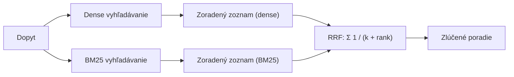
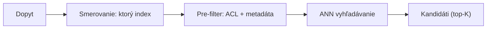

# Vnútro fúzie, neskorá interakcia a filtre, ktoré tvarujú množinu kandidátov

[Časť 1](./index.md) vystavala vrstvu Retrieval od naivného vektorového top-K: transformácia dopytu, hybrid search, reranking a filtre s riadením prístupu, poskladané do dvojfázovej schémy (najprv úplnosť, potom presnosť), aby klesalo zlyhanie vyhľadávania, teda prípad, keď potrebný chunk chýba vo výsledku. Táto stránka tie škatule otvára a ukazuje: ako trik s hypotetickým dokumentom naozaj posunie dopyt v priestore embeddingov a kedy ho potiahne nesprávnym smerom; prečo sa skóre dvoch retrieverov nedá len tak sčítať a čo s tým robí fúzia; čím sa cross-encoder ako reranker líši od LLM; kde medzi dvoma enkodérmi, ktoré už poznáš, sedí neskorá interakcia; ako sa kus textu, na ktorom vyhľadávaš, a kus, ktorý podáš modelu, môžu rozísť; a ako smerovanie a umiestnenie filtra rozhodnú o množine kandidátov skôr, než sa k slovu dostane hociktorý mechanizmus radenia. Znalosť prvej časti všade predpokladáme — štyri vrstvy, dvojfázovú schému ani rámec zlyhania vyhľadávania už nevysvetľujeme, iba na ne nadväzujeme.

Najprv jedna hranica. Všetko tu je *statické* vyhľadávanie: jeden prechod, rozhodnutý vopred, bez cyklu. Vo chvíli, keď sa vyhľadávanie stane niečím, čo model spúšťa znova (preformuluj, vyhľadaj nanovo, posúď, či máš dosť, zastav), si už v iteratívnej podobe — a to územie (Self-RAG, corrective RAG, dostatočný kontext, naučená trasa pre každý dopyt) patrí do [prehĺbenia lekcie Agentic RAG](../../part-2-agents/agentic-rag/deep-dive). Táto stránka vyťaží z jediného prechodu maximum.

## HyDE: čo posúva a kedy sa obráti proti tebe

Prvá časť predstavila HyDE ako „načrtni hypotetickú odpoveď, zaembedduj ju a vyhľadávaj ňou“. Mechanizmus je premyslenejší, než napovie tá jedna veta (Gao a kol., 2022). LLM, ktorý sa riadi inštrukciami, napíše k dopytu hypotetický dokument s odpoveďou, zero-shot (bez trénovacích príkladov). Enkodér trénovaný kontrastne bez učiteľa (contrastive learning) — v pôvodnej práci Contriever — zaembedduje *práve tento dokument* a v korpuse potom vyhľadávaš jeho vektorom, nie vektorom dopytu. Vymyslený dokument sa v konkrétnostiach často mýli; to nevadí. Dense enkodér je stratové úzke hrdlo: podrží si vzor relevantnosti, vymyslené detaily zahodí a hľadanie tým ukotví pri reálnych susedoch.

Prečo to pomáha, je otázka geometrie. Krátka otázka a jej odpoveď ležia v priestore embeddingov ďaleko od seba — iný tvar, iná dĺžka, iný slovník. To je asymetria medzi otázkou a odpoveďou (query–answer asymmetry): vektorom v tvare otázky hľadáš chunky v tvare odpovede. Hypotetická odpoveď v tvare dokumentu skončí v susedstve reálnych chunkov s odpoveďou, takže hľadanie najbližšieho suseda má ľahší cieľ. Kde sa to vypláca najviac, prezrádza samo rámcovanie pôvodného článku: HyDE dorovná doladené retrievery *bez jediného označeného príkladu*, takže najväčší zisk je v zero-shot a medzijazykových scenároch, kde doménové trénovacie dáta nemáš.

To isté rámcovanie ti povie, kedy HyDE nechať tak.

- **Leží na kritickej ceste.** HyDE pridá plné generovanie LLM ku každému jednému dopytu ešte pred samotným vyhľadávaním. Pri rozpočte latencie (latency budget) to často stačí ako námietka.
- **Zvedie ťa vlastným výmyslom.** Pri úzkej, čerstvej alebo naozaj neznámej téme si model vymyslí vierohodný dokument, ktorý ukazuje *preč* od tvojho korpusu, a ty potom hľadáš na základe výmyslu — horšie, než keby si hľadal holým dopytom.
- **Zisk sa scvrkáva, ako sa tvoj retriever zlepšuje.** Veľké výhry sa merali oproti retrieverom trénovaným bez učiteľa. Dobre vyladený, doménovo natrénovaný dense retriever už väčšinu asymetrie preklenie, takže priestor pre HyDE sa zúži alebo zmizne.
- **Pri dopyte na presný token zavadzia.** Pri chybovom kóde, čísle dielu či mene osoby ukryje mnohovravná hypotéza to jediné kľúčové slovo — a tie už spoľahlivo trafí hybrid search s BM25.

Verdikt je teda úzky: po HyDE siahni, keď nemáš doménové označené dáta a dopyty sú krátke a nedopovedané. Vynechaj ho, keď ťa tlačí latencia, keď je retriever už vyladený, alebo pri vyhľadávaní na presnú zhodu.

## Prečo sa skóre dvoch retrieverov nedá len tak sčítať

Hybrid search bol najväčší jediný krok vpred z prvej časti a vo vnútri slova „spojiť“ ukryl skutočný problém. Podobnosť pri dense vyhľadávaní je ohraničená — kosínus sa pohybuje zhruba v [-1, 1], často stiahnutý do [0, 1]. BM25 je neohraničený a jeho stupnica sa posúva s korpusom aj dopytom. Tie dve veličiny ležia na nezlučiteľných osiach, takže ich sčítať nemôžeš. Celá fúzia je spôsob, ako to obísť.

Jedna rodina postupov opravuje stupnice. **Score fusion (fúzia skóre)** normalizuje obidva retrievery na spoločný rozsah a potom vezme vážený súčet. Min-max zobrazí každé skóre do [0, 1] ako `(s − min) / (max − min)`; z-score štandardizuje ako `(s − mean) / std`. Potom `combined = α·norm(dense) + (1 − α)·norm(sparse)`, kde α je regulátor medzi významom a presnou zhodou. Zachováva *veľkosť* skóre (vyslovene najlepšia zhoda ostane viditeľne najlepšia) a práve v tom je jej pôvab. Je však aj krehká: min-max nad množinou kandidátov jediného dopytu divoko kolíše, keď je najvyššie skóre odľahlá hodnota, a keďže sa rozdelenia skóre líšia dopyt od dopytu, jedna pevná normalizácia zle skalibruje ten ďalší.

Druhá rodina odmieta skóre dôverovať vôbec. **Reciprocal Rank Fusion (RRF)** (Cormack, Clarke a Büttcher, SIGIR 2009) zahodí surové skóre a ponechá len pozíciu v poradí:

```text
score(d) = Σ_i  1 / (k + rank_i(d))
```

Konštanta `k = 60` je empirické východisko z článku. Sploští to, ako prudko klesá príspevok dokumentu s pozíciou, takže jediné prvé miesto nedokáže ovládnuť zlúčené poradie. Vážený variant `Σ wᵢ / (k + rankᵢ(d))` ti dovolí jeden retriever uprednostniť. RRF je robustný práve preto, že nepotrebuje nijakú kalibráciu — normalizačný problém obíde, namiesto toho, aby ho riešil, a preto je v mnohých vektorových databázach predvolenou fúziou.



Kompromis je zrkadlovým obrazom toho pri score fusion. RRF je jednoduchý a robustný, ale slepý voči veľkosti — zhoda, ktorá zvyšok necháva ďaleko za sebou, je zaevidovaná ako „pozícia 1“ a nič viac. Score fusion tú veľkosť zachová, no aby sa mu dalo veriť, žiada si dôkladnú normalizáciu podľa rozdelenia, dopyt po dopyte. Predvolene teda nasaď RRF a ku score fusion sa pohni, až keď si naozaj odmeral, že veľkosť skóre nesie pre tvoje dáta signál, *a* zároveň ju vieš spoľahlivo normalizovať pre každý dopyt. Siahnuť po score fusion ako prvom je spôsob, ako zdediť jeho krehkosť bez jeho výnosu.

## Ktorý reranker a kedy

Druhá fáza preusporiada top-K a v prvej časti to robil cross-encoder, ktorý pár (dopyt, úryvok) zakóduje spoločne. Na majstrovskej úrovni je otázka, ktorý druh rerankera — a rozdiel je krivkou medzi latenciou a kvalitou.

**Cross-encoder ako reranker** je účelovo natrénovaný model (trénovaný na dátovej sade relevantnosti ako MS MARCO), ktorý každý pár (dopyt, úryvok) skóruje spoločne, jeden dopredný priechod na kandidáta, teda O(K) pre celú dávku. Je malý, rádovo v triede 100 mil. parametrov, lacný na jeden pár, s nízkou latenciou, a vráti deterministické skóre, na ktoré vieš nasadiť prah. Práve táto kombinácia z neho robí produkčné východisko: predvídateľná cena, predvídateľný výstup, vysoká priepustnosť.

**LLM reranker** zverí posúdenie relevantnosti všeobecnému modelu cez prompt a má tri podoby, ktoré sa oplatí rozlíšiť:

- **Pointwise** — každý úryvok oskóruj samostatne, nezávisle od ostatných.
- **Pairwise** — porovnávaj dva úryvky naraz a víťazstvá sčítaj.
- **Listwise** — celý zoznam zoraď vnútri jediného promptu (v štýle RankGPT).

Jeho silné stránky sú tie, ktoré natrénovaný cross-encoder ponúknuť nevie: zero-shot, bez trénovacích dát, a *riadi sa inštrukciami* („uprednostni novšie“, „uprednostni autoritatívny zdroj“), čím do radenia vnáša uvažovanie. Náklady sú tie, ktoré všeobecný model nesie vždy: drahý, s vysokou latenciou, cena tokenov rastie s počtom úryvkov krát ich dĺžka, nedeterministický výstup, ktorý musíš potom parsovať, a pri listwise podobe navyše citlivosť na *poradie* na vstupe a strop daný kontextovým oknom.

Tým je jasné, kedy si každý zaslúži svoje miesto. Cross-encoder je východisko tam, kde tlačí latencia a beží veľa dopytov za sekundu. LLM reranker je pre prípady, keď kvalita preváži latenciu, keď je objem nízky, alebo keď radenie naozaj potrebuje relevantnosť vedenú inštrukciou. Bežné usporiadanie si necháva oba: cross-encoder spraví prvý prechod preusporiadania nad celým top-K a LLM preusporiada len tú hŕstku najlepších, čo prežije — riadenie inštrukciou tak zaplatíš len pri zopár kandidátoch namiesto pri celej dávke.

## Kde medzi dvoma enkodérmi sedí neskorá interakcia

Tri paradigmy vyhľadávania ležia na jednej osi a pomenovať ich spolu spraví tú tretiu čitateľnou. **Bi-encoder** — dense retriever z prvej časti — zakóduje každý dokument do jediného vektora offline; v čase dopytu je interakciou jeden skalárny súčin (dot product). Lacné, predpočítateľné a hrubé, lebo celý úryvok je stlačený do jedného bodu. Cross-encoder sedí na opačnom konci: dopyt aj dokument kóduje spoločne, takže nič sa nepredpočíta, a je najpresnejší aj najdrahší, a preto len preusporiadava K kandidátov, v celom korpuse nikdy nevyhľadáva.

**Neskorá interakcia (late interaction)**, ktorú predstavil **ColBERT** (Khattab a Zaharia, SIGIR 2020), pristáva medzi nimi. Namiesto jedného vektora na dokument vyrobí *zväzok vektorov na každý token* (multivektorovú reprezentáciu), pričom tokenové vektory dokumentu sú predpočítané offline presne ako pri bi-encoderi. Interakcia sa odkladá až na čas skórovania. Pre každý token dopytu vezme **MaxSim** maximum kosínusovej podobnosti spomedzi všetkých tokenových vektorov dokumentu a skóre relevantnosti je súčtom týchto maxím naprieč tokenmi dopytu. „Neskorá“ je to nosné slovo: jemné porovnávanie na úrovni tokenov prebehne *až po* nezávislom zakódovaní, v čase skórovania — na rozdiel od „skorej“ interakcie, ktorú cross-encoder robí vnútri svojho transformera, kde si tokeny dopytu a dokumentu venujú pozornosť navzájom od prvej vrstvy.

Čo z toho máš, je väčšina tokenovej presnosti cross-encodera (silná na presnú zhodu, na zhodu entít a na zovšeobecnenie mimo domény), pričom strana dokumentu ostane predpočítateľná, takže dokáže vyhľadávať v celom korpuse, nielen preusporiadať K. Čo za to platíš, je úložisko, a účet je vysoký: vektor *na každý token* namiesto na chunk znamená stovky vektorov na jeden úryvok. ColBERTv2 (2021) pridáva reziduálnu kompresiu, aby tú stopu zmenšil, a index nie je obyčajný ANN (približné hľadanie najbližších susedov) nad jedným vektorom na dokument — potrebuje špecializovaný engine. Práve táto cena za úložisko a infraštruktúru, nie akási slabina v kvalite, je dôvod, prečo je neskorá interakcia mocná stredná cesta, a nie predvolená voľba.

## Problém chunku z dvoch strán

Ingestion nechala jedno napätie nevyriešené. Malý chunk sa zaembedduje tesne a vyhľadá sa presne, no generátoru dá primálo, s čím pracovať. Veľký chunk nesie kontext, ktorý generátor chce, ale jeho embedding je rozmazaný a nesústredený, takže sa vyhľadá horšie. Kus textu, ktorý sa dobre vyhľadáva, nie je ten istý kus, z ktorého sa dobre generuje — a tú medzeru vieš riešiť na oboch koncoch pipeline.

**Parent-document retrieval** — tiež nazývaný small-to-big — rieši ju v čase dopytu. Indexuješ a vyhľadávaš nad malými *detskými* chunkami kvôli presnej zhode, ale modelu vrátiš *rodičovský* fragment, ktorý toto dieťa obsahuje: väčšiu sekciu alebo dokument, z ktorého dieťa pochádza. Jednotka vyhľadávania a jednotka kontextu sú zámerne oddelené. Variant s vetným oknom (sentence-window) vyhľadá jedinú vetu a rozšíri ju na okno okolo nej; variant rodič–dieťa (parent-child) vyhľadá detský chunk a vráti jeho rodičovskú sekciu. Tak či onak, zhodu ženie presnosť a model aj tak dostane priestor na uvažovanie.

**Contextual retrieval (kontextové vyhľadávanie)** (Anthropic, september 2024) rieši tú istú chorobu v čase indexácie. Pred embeddovaním pripojí pred každý chunk krátky text vygenerovaný LLM (50–100 tokenov), ktorý chunk zasadí do celého dokumentu: *„tento chunk pochádza zo správy 10-K spoločnosti ACME za druhý kvartál 2023, zo sekcie o tržbách…“*. Takto doplnený chunk potom zaembedduje *aj* zaindexuje pre BM25, takže samotný embedding teraz nesie kontext dokumentu, ktorý holý chunk zahodil. Náklady na generovanie tohto kontextu ku každému chunku znižuje prompt caching (opakujúca sa časť promptu sa uloží do vyrovnávacej pamäte a neplatí sa znova) — rádovo na 1,02 USD za milión tokenov dokumentu. Ohlásený účinok, meraný ako zlyhanie vyhľadávania pri top-20 oproti východiskovým 5,7 %, sa čisto skladá:

- Samotné kontextové embeddingy znížia podiel zlyhaní o 35 % (5,7 % → 3,7 %).
- Pridanie kontextového BM25 ich zníži o 49 % (→ 2,9 %).
- Reranking navrch ich zníži o 67 % (→ 1,9 %).

Ten posledný riadok si prečítaj správne: contextual retrieval nie je náhrada za hybrid search a reranking, je to násobiteľ, ktorý sa s nimi skladá. A postav si tie dve techniky vedľa seba, lebo sú to tie isté lieky na dvoch rôznych miestach — parent-document obohacuje to, čo *vraciaš*, rozhodnuté v čase dopytu; contextual retrieval obohacuje to, čo *indexuješ*, rozhodnuté v čase príjmu. Rovnaká choroba, dve miesta zásahu, a nič ti nebráni nasadiť obe.

## Ako sa dostať do správnej množiny kandidátov

Každá technika vyššie predpokladá, že správny chunk je niekde v množine kandidátov. Smerovanie a filtrovanie rozhodnú, či sa tam vôbec dostane — a tým sú vrcholom lievika: chybu tu spravíš najľahšie a napravíš najťažšie.

**Smerovanie dopytov (query routing)** je predbežná voľba *kde a ako* daný dopyt vyhľadávať: v ktorom indexe či kolekcii, či vôbec ísť do vyhľadávania, dense alebo hybrid, v akom reze metadát. Router (smerovač) môže byť ručne napísané pravidlo, klasifikátor alebo LLM. Podstata na majstrovskej úrovni spočíva v pozícii, nie v mechanizme: smeruj zle a správny chunk sa nikdy nestane kandidátom — a žiaden neskorší reranking nedokáže vytiahnuť dokument, ktorý v množine nie je. (Naučená podoba pre každý dopyt — adaptive RAG — je rozhodnutie v čase cyklu a žije v [prehĺbení vrstvy Agentic RAG](../../part-2-agents/agentic-rag/deep-dive); tu je smerovanie statické a spraví sa raz.)

Filtrovanie má otázku umiestnenia, ktorá rozhoduje o správnosti aj rýchlosti: beží predikát nad metadátami alebo ACL pred vektorovým vyhľadávaním, alebo až po ňom?

- **Pre-filter (filter pred vyhľadávaním)** uplatní predikát pred vyhľadávaním alebo počas neho, takže kandidátmi sú len vektory, ktoré ním prejdú. *Zaručí* K výsledkov, ktoré filtru vyhovujú, a pri riadení prístupu je povinný. Cenou je výkon: vysoko selektívny filter bojuje s ANN indexom, lebo prechod grafom HNSW stále pristáva na uzloch, ktoré filter vylúčil, a v najhoršom prípade sa zvrhne až k hrubej sile (brute force) — ak engine nepodporuje natívne filtrované vyhľadávanie.
- **Post-filter (filter po vyhľadávaní)** spustí najprv obyčajný ANN a výsledky, ktoré predikátu nevyhovujú, zahodí až potom. Je rýchly, lebo vyhľadávanie nič nezväzuje. Lenže pri selektívnom filtri vytiahneš K vektorov a väčšinu či všetky potom zahodíš, takže skončíš s *menej* než K výsledkami, niekedy s nulou — problém prázdneho výsledku, keď dokonalý dopyt nevráti nič, lebo filter vyradil celú stránku výsledkov.

Kompromis je teda medzi pre-filtrom, ktorý je správny, ale môže byť pomalý, a post-filtrom, ktorý je rýchly, ale môže vrátiť primálo — a jeden prípad tú voľbu ruší úplne: riadenie prístupu nie je nikdy post-filter. Ak sa kontrola oprávnení uplatní až po vyhľadávaní, systém už zoradil obsah, ktorý používateľ vidieť nesmie, a môže potichu vrátiť primálo — oprávnenia musia rezať pred vyhľadávaním, presne ako žiadala bezpečnostná požiadavka z prvej časti. Moderné vektorové databázy čoraz častejšie ponúkajú jednofázové filtrované ANN, ktoré predikát zabuduje priamo do prechodu — tak dostaneš správnosť aj rýchlosť naraz, namiesto toho, aby si jedno menil za druhé.



## Ktorá metrika stráži ktorú fázu

Prvá časť sľúbila, že sa metriky sformalizujú vo vrstve Evaluation, a plný výklad naozaj žije v [Evaluation](../cross-cutting/evaluation/). Čo má mať inžinier vyhľadávania poruke, je toto: ktorá metrika stráži ktorú fázu. Recall@K — dostal sa potrebný chunk do top-K — je metrikou prvej fázy, priamou mierou zlyhania vyhľadávania. Precision@K je podiel top-K, ktorý je relevantný. Ďalšie dve známkujú *poradie*, ktoré vytvorí reranker.

**MRR** (mean reciprocal rank) vezme `1 / rank` *prvého* relevantného výsledku a spriemeruje ho naprieč dopytmi. Odmeňuje, keď jednu správnu odpoveď dostaneš vysoko, a je slepý voči všetkému za tým prvým zásahom — a preto je to tá pravá metrika, keď existuje v podstate jedna správna odpoveď: vyhľadanie konkrétnej známej položky (known-item) alebo navigačný dopyt, kde je druhý najlepší výsledok z definície nerelevantný.

**nDCG** (normalized discounted cumulative gain) známkuje celý zoradený zoznam odstupňovanou relevantnosťou. `DCG = Σ rel_i / log2(i + 1)` sčíta relevantnosť každého výsledku so zľavou podľa jeho pozície, takže relevantný dokument hlboko v zozname prispeje menej; delenie DCG ideálneho poradia (IDCG) normalizuje výsledok do [0, 1]. Kým MRR je binárny, na prvý zásah a slepý za ním, nDCG je odstupňovaný, po celom zozname a so zľavou podľa pozície — je to metrika, po ktorej siahneš, keď je relevantnosť odstupňovaná a záleží na celom poradí.

Naprieč celou stránkou vedie jedna niť: meraj tú fázu, ktorú ladíš. Recall@K ti povie, či retriever prvej fázy vôbec dostal odpoveď do množiny kandidátov; nDCG alebo MRR ti povedia, či ju reranker potom zoradil správne. Daj metriku radenia na fázu úplnosti, alebo metriku úplnosti na reranker, a budeš slepý voči presne tomu zlyhaniu, ktoré sa snažíš opraviť.

## Čo si odniesť z lekcie

- HyDE vyhľadáva zaembeddovanou hypotetickou odpoveďou, aby preklenul rozdiel medzi tvarom otázky a tvarom jej odpovede; vyhráva najviac bez doménových označených dát a pri krátkych dopytoch a obráti sa proti tebe pri rozpočte latencie, vyladenom retrieveri, vyhľadávaní na presný token a neznámej téme, kde si model vymyslí dokument mieriaci preč od tvojho korpusu.
- Skóre z dense a z BM25 sú na nezlučiteľných stupniciach, takže ich nemôžeš sčítať: fúzia podľa poradia je robustné východisko, lebo nepotrebuje kalibráciu, a fúzia podľa skóre sa oplatí za svoju krehkosť až vtedy, keď si odmeral, že veľkosť skóre nesie signál, ktorý vieš pre každý dopyt normalizovať.
- Natrénovaný cross-encoder je nízkolatenčné, deterministické a priepustné východisko medzi rerankermi; LLM reranker kúpi zero-shot radenie vedené inštrukciou za skutočnú cenu a nedeterminizmus, a tie dva sa skladajú — cross-encoder nad K, LLM nad hŕstkou, čo prežije.
- Medzi enkodérom s jedným vektorom a spoločným enkodérom sedí predpočítané porovnávanie na úrovni tokenov, skórované metódou MaxSim: udrží väčšinu jemnej presnosti a dokáže vyhľadávať v celom korpuse, pričom jediný dôvod, prečo to nie je predvolená voľba, je úložisko — jeden vektor na každý token.
- Chunk, ktorý sa dobre vyhľadáva, a chunk, z ktorého sa dobre generuje, sa rozchádzajú; obohať to, čo vraciaš, v čase dopytu, alebo zabuduj kontext dokumentu do toho, čo indexuješ, ešte pred embeddovaním — a obe sa skladajú s hybrid search a rerankingom, namiesto toho, aby ich nahrádzali.
- Smerovanie a umiestnenie filtra rozhodnú o množine kandidátov skôr, než sa spustí radenie: zlá trasa alebo neskoro uplatnená kontrola oprávnení stratí odpoveď tam, kde ju už nič ďalej nezachráni — preto riadenie prístupu reže pred vyhľadávaním, vždy.

**Nové pojmy** → [Glosár](../../glossary.md): score fusion / score normalisation, LLM reranker, late interaction / ColBERT, multi-vector retrieval, contextual retrieval, query routing, pre-filter / post-filter.
