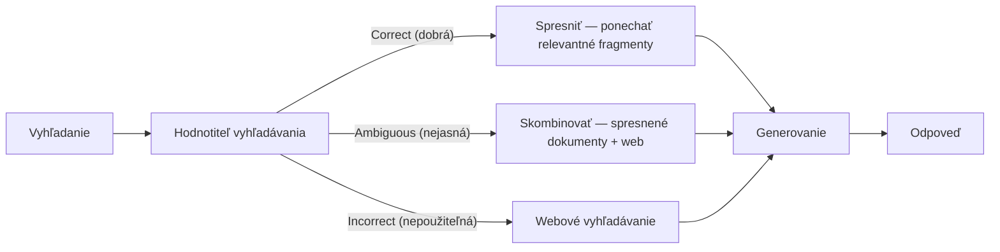
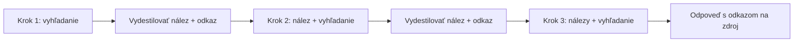

# Naučené rozhodnutia o vyhľadávaní, ohraničenie slučky a hodnotenie trajektórie

[Časť 1](./index.md) vytýčila zmenu: vyhľadávanie prestáva byť pevným krokom `retrieve → generate` a stáva sa akciou, ktorú si model volí v slučke: vyhľadávať či nie, preformulovať, ísť znova, nasmerovať na zdroj, zastaviť, keď má dosť. Táto stránka dotiahne slučku do hĺbky: pomenované architektúry, ktoré z „rozhodni sa, či vyhľadávať“ robia *naučené* rozhodnutie; ako slučku vyhľadávania udržať, aby sa netočila na mieste; ako medzi krokmi odovzdať nájdený kontext tak, aby model neutonul v jeho objeme; a ako ohodnotiť celú trajektóriu vyhľadávania, nie iba jej poslednú odpoveď. Prvú časť predpokladáme. Slučku úvaha → rozhodnutie → akcia → pozorovanie, spektrum router → plánovanie → plná slučka, sebaopravu aj iteratívne vyhľadávanie znova nevysvetľujeme, iba na ne nadväzujeme.

Najprv jedna hranica, lebo o toto územie sa delia dve susedné lekcie. Všeobecná vrstva riadenia slučky (plan-and-execute oproti ReActu ako stratégie, rozpočty krokov, detekcia zacyklenia, reflexia nad celou trajektóriou) patrí do lekcie [plánovanie a slučky](../planning-loops/). Táto stránka ostáva ukotvená na vyhľadávaní ako akcii: kedykoľvek treba všeobecnú myšlienku, dostane jeden riadok špecifický pre vyhľadávanie a odkaz tam, nikdy nie nové odvodzovanie.

## Zo sebaopravy k pomenovaným vzorom vyhľadávania

Sebaoprava a iteratívne vyhľadávanie boli v prvej časti mechanizmy v abstraktnej rovine. Majú aj konkrétne, publikované podoby. Tri pomenované architektúry — každá je iná odpoveď na tú istú otázku: kedy a ako sa slučka rozhodne vyhľadávať, vyhľadať znova alebo zastaviť?

**Self-RAG (sebareflexívny RAG)** trénuje model, aby to rozhodnutie robil sám, priebežne. Počas generovania vkladá špeciálne **reflexné tokeny (reflection tokens)**. Jeden token rozhodne, či pre práve písaný úsek vôbec vyhľadávať: niektoré úseky zdroj potrebujú, iné model jednoducho napíše. Keď vyhľadá, tri hodnotiace tokeny posúdia, čo sa vrátilo: či je úryvok relevantný voči otázke, či sa vygenerovaný text o daný úryvok naozaj opiera (je podložený) a nakoľko je výsledná odpoveď užitočná na krátkej škále. Tie posudky sú votkané priamo do generovania, nie prilepené zvonku ako oddelená nadstavba. Model uvažuje nad vlastným vyhľadávaním a opretím o zdroj token po tokene.

**Corrective RAG (CRAG, korektívny RAG)** prenáša ten istý inštinkt do samostatného ľahkého **hodnotiteľa vyhľadávania (retrieval evaluator)**. Po vyhľadaní hodnotiteľ posúdi dokumenty a vráti **skóre dôvery (confidence score)**, ktoré zaradí do troch priehradiek.

- **Correct (dobrá)** — dokumenty sú dosť dobré na použitie, ale nie doslova: krok spresnenia rozreže každý dokument na menšie kúsky a ponechá iba fragmenty, ktoré sa dopytu naozaj týkajú, aby sa k signálu nepribalil aj šum.
- **Incorrect (nepoužiteľná)** — nájdená sada je mimo, tak ju CRAG zahodí a siahne po webovom vyhľadávaní, aby získal čerstvý zdroj.
- **Ambiguous (nejasná)** — hodnotiteľ si nie je istý, tak spojí oboje: spresnené interné dokumenty aj výsledok z webu.

Celé je to **plug-and-play** — nadstavba nad ľubovoľným existujúcim RAG bez úprav, bez pretrénovania generátora.

*CRAG: hodnotiteľ vyhľadávania rozdelí nájdené do troch priehradiek — ponechať a spresniť, dobrať webom alebo ním celkom nahradiť — a až potom prichádza generovanie.*

**Adaptive RAG (adaptívny RAG)** pracuje o úroveň vyššie, pri samotnom dopyte. Natrénovaný **klasifikátor** odhadne, aký zložitý je prichádzajúci dopyt, a nasmeruje ho na najlacnejšiu stratégiu, ktorá naň ešte odpovie: pri niečom, čo model už vie z **parametrickej pamäte** (parametric memory), žiadne vyhľadávanie; pri priamočiarom dohľadaní jednokrokové vyhľadávanie; pri naozaj viackrokovej otázke plné viackrokové iteratívne vyhľadávanie. Ide o hospodárnosť — neplať za iteratívnu slučku pri dopyte, ktorý by vyriešilo jediné vyhľadanie, ale ani nenechaj ťažký dopyt vyhladovať tým, že mu dáš jediný pokus.

Postav tie tri proti spektru z prvej časti a vzor sa vyjasní. Adaptívny RAG je router (smerovač) urobený pre každý dopyt zvlášť a *naučený*: rozhodnutie o smerovaní z prvej časti, lenže ho predpovedá natrénovaný klasifikátor namiesto ručne napísaného pravidla. Self-RAG je sebaoprava zatlačená nadol do natrénovaných tokenov, na úroveň vyhľadania a opretia o zdroj. CRAG je sebaoprava s výslovným hodnotiteľom a únikovým východom cez webové vyhľadávanie. Všetky tri berú zavedenú voľnosť a menia „rozhodni sa, či vyhľadávať“ na rozhodnutie, ktoré sa systém *naučí*, a pridávajú výslovného sudcu relevancie a podloženia.

Ešte poznámka, kam to celé patrí (ľahko sa to popletie). Posudky Self-RAG aj CRAG sú o *kvalite vyhľadávania* — je tento úryvok relevantný, opiera sa oň odpoveď. To je rodina **self-correction (sebaoprava)** z prvej časti a je zámerne odlíšená od **reflexie (reflection)** v lekcii [plánovanie a slučky](../planning-loops/), ktorá posudzuje celú trajektóriu: napredujem, mám preplánovať? Tá istá slovná rodina, iná rovina pohľadu — jedno hodnotí úryvok, druhé hodnotí plán.

Je tu aj voľba stratégie, ktorá je vlastná práve vyhľadávaniu. Vyhľadávanie v štýle ReAct prepletá úvahu, vyhľadanie a pozorovanie a ďalší dopyt formuluje z toho, čo každý výsledok naozaj vrátil — to je iteratívne vyhľadávanie z prvej časti. **plan-and-execute (plánovanie a vykonanie)** ide pri viackrokovej otázke opačnou cestou: rozloží ju vopred na plán podotázok, na každú podotázku vyhľadá raz a napokon z čiastkových odpovedí poskladá výslednú. Voľba medzi pružným a štruktúrovaným prístupom je všeobecný kompromis; všeobecne ho rozoberá [plánovanie a slučky](../planning-loops/) — tu je pointa špecifická pre vyhľadávanie **rozklad dopytu na podotázky (query decomposition)**: z otázky „kto vedie tím, ktorý dodal smernicu X“ sa stane „ktorý tím dodal X“ a potom „kto ten tím vedie“, a každá podotázka je čisté jednokrokové vyhľadanie.

Kedy po ničom z toho nesiahať: Self-RAG potrebuje zvlášť natrénovaný model. CRAG aj adaptívny RAG pridávajú hodnotiteľa alebo klasifikátor — náklad navyše a nové riziko zlyhania: hodnotiteľ sa môže pomýliť, zatajiť dobrý úryvok alebo spustiť zbytočné webové vyhľadávanie, ktoré dovlečie horší kontext, než aký nahradilo. Pri mnohých korpusoch solídny statický retriever (vyhľadávač) plus jednoduchý filter relevancie poráža naučeného hodnotiteľa na celej čiare. Rovnaká disciplína ako všade v Časti II príručky — zvoľ najjednoduchšiu úroveň, ktorá úlohu vyrieši, a zložitosť sa oplatí len vtedy, keď ju slučka naozaj potrebuje.

## Ako udržať slučku vyhľadávania konvergentnú a ohraničiť ju

Keď vyhľadávanie beží v slučke, môže sa stať, že sa nezastaví — z tej istej príčiny ako ktorákoľvek slučka agenta; všeobecný príbeh **nezastavenia cyklu (non-termination)** je v lekcii [plánovanie a slučky](../planning-loops/). Vyhľadávanie má dve vlastné podoby tohto problému.

Prvá je **slučka opakovaného vyhľadávania (re-retrieval loop)** — agent pošle dopyt, výsledok sa mu nepáči, preformuluje ho na čosi nepatrne odlišné, dostane naspäť tie isté dokumenty, preformuluje znova, no do kontextu nikdy nepribudne nová informácia. Vyzerá to ako pokrok, v skutočnosti je to deterministické točenie na mieste. A pomenuj to presne: je to **chyba** v behu, nie „odmietnutie“ — slučka, ktorá sa nezastaví, je chyba (nezastavenie cyklu), nikdy nie rozhodnutie systému zdržať sa odpovede.

Druhá je **nadmerné vyhľadávanie (over-retrieval)** — agent hľadá ďalej dávno po tom, čo mal dosť, a napcháva kontext okrajovo relevantným materiálom, ktorý nikdy nepoužije.

Obe ukazujú na kritérium zastavenia slučky vyhľadávania: **sufficient context (dostatočnosť kontextu)** — mám už dosť na odpoveď? Tokeny podloženia a užitočnosti zo Self-RAG sú jeden spôsob, ako ten úsudok spraviť; samostatný hodnotiteľ relevancie je druhý. Pomýliš sa na ktorúkoľvek stranu a zaplatíš. Zastavíš priskoro → **nedostatočné vyhľadanie** (under-retrieve): odpoveď je bez opory, halucinácia na spadnutie. Nezastavíš nikdy → nadmerné vyhľadávanie: platíš za volania navyše a kontext natiahneš tak, že sa do dôkazov začne zahrýzať **lost-in-the-middle (strata uprostred)** — model si zo stredu dlhého kontextu všíma najmenej.

Keďže sa múdre kritérium môže zmýliť, podoprieš ho hlúpym. **retrieval budget (rozpočet vyhľadávania)** je **tvrdý strop** — najviac krokov, najviac vyhľadávaní, najviac vytiahnutých tokenov — ktorý slučku zastaví bez ohľadu na to, čo si model myslí. Zrkadlí rozpočet krokov a rozpočet tokenov z lekcie [plánovanie a slučky](../planning-loops/); všeobecnú myšlienku znova neodvodzuj, iba ju uplatni na vyhľadávanie. Toto je poistka, ktorá zaručí, že sa slučka zastaví, aj keď každá múdrejšia obrana zlyhá.

Medzi tými dvoma stojí **detekcia zacyklenia (loop detection)** pre vyhľadávanie. Všeobecná podoba je v [plánovanie a slučky](../planning-loops/); rukoväťou špecifickou pre vyhľadávanie je **signatúra** — znormalizuj dopyt a vezmi odtlačok vrátenej sady výsledkov, a keď ten istý dopyt vracia stále tú istú sadu, vyskoč zo slučky namiesto toho, aby si ju nechal odkrútiť ďalšie kolo. To zachytí slučku opakovaného vyhľadávania skôr, než ju musí zastaviť tvrdý strop.

Kedy z tohto nestavať nič: systém s jediným rozhodnutím (čistý router) sa točiť fyzicky nedokáže — je to jedno rozhodnutie a žiadna slučka, nie je kam sa vracať. Celý ten aparát rozpočtov, kontrol dostatočnosti a detekcie zacyklenia je náklad, ktorý na seba berieš až vtedy, keď sa zaviažeš púšťať plnú slučku. Ak tvoju úlohu vyrieši jediné rozhodnutie o smerovaní, nič z toho nepotrebuješ.

## Ako odovzdať nájdený kontext medzi krokmi

Toto je časť, ktorú susedné lekcie pokrývajú najmenej — a zároveň tá, ktorá najviac rozhoduje, či multi-hop agent (viackrokový) funguje. Každý krok vysype svoje nájdené úryvky do kontextu. Sprav to naivne cez päťkrokovú trajektóriu a kontext napuchne: cena stúpa s každým volaním a lost-in-the-middle (z lekcie o generovaní) začne zavadzať presne vtedy, keď má agent najviac vecí, ktoré si treba udržať pohromade.

Náprava: prestaň so sebou vláčiť surovinu. Z jedného kroku neputujú ďalej vyhľadané chunky (kúsky), ale **vydestilovaný nález** — to, čo z kroku vyšlo: odpoveď na podotázku, vytiahnutý fakt — a s ním jeho pôvod, **odkaz na zdroj** (citation). Tak ostane pracovný kontext malý a pri téme. Je to obdoba pracovnej pamäte (scratchpadu) z lekcie [plánovanie a slučky](../planning-loops/), akú si žiada multi-hop; špecifické pre vyhľadávanie je *čo* do scratchpadu destiluješ — nálezy, nie úryvky — a že odkaz na zdroj ostáva pripnutý, aby sa výsledná odpoveď stále opierala o zdroj.

Tri návyky udržia prenášaný kontext čistý.

- **Deduplikuj** naprieč krokmi — ten istý úryvok vyhľadaný v kroku 1 a znova v kroku 3 nesmie zaberať kontext dvakrát.
- **Zhutni** ho, ako rastie — keď sa trajektória natiahne, zhrň dôkazy zo starších krokov na to, čo ešte stále platí (prípad „zhrň históriu“ z [plánovanie a slučky](../planning-loops/), špecifický pre vyhľadávanie).
- Dávaj pozor na **poradie** — najčerstvejšie a najrelevantnejšie dôkazy klaď tam, kam model naozaj pozerá, na konce, nie zahrabané do stredu — lost-in-the-middle uplatnené zámerne, nie odtrpené náhodou.

Spôsob zlyhania, ktorému to bráni, je konkrétny: nes so sebou surové chunky z každého kroku a kontext napuchne, kým model nestratí niť a na otázku kroku 3 neodpovie z dôkazov kroku 1. Odpoveď je plynulá, o *čosi* opretá — a nesprávna; a to je najťažší druh chyby na odhalenie ďalej v reťazci.

## Ako hodnotiť trajektóriu vyhľadávania

Prvá časť povedala, že evaluácia teraz „meria kvalitu trajektórie“. Pri agentickom RAG sa to rozdvojuje na **výsledok a proces** a práve v procesnej polovici žije hodnotenie špecifické pre vyhľadávanie; a len keď tie dve udržíš od seba, dá sa pri zlom behu dohľadať, kde sa stala chyba.

**Výsledok verzus proces.** Výsledok je kvalita finálnej odpovede — **faithfulness (vernosť zdrojom)**, **relevancia odpovede (response relevancy)**, metriky z lekcie o evaluácii. Proces je to, či dávala cesta zmysel: vyhľadal agent vtedy, keď mal, a zdržal sa, keď nemal; vytiahol každý krok správne dokumenty; zastavil v pravú chvíľu; koľko krokov a koľko nákladov ho to stálo. Správna odpoveď dosiahnutá zlou cestou je šťastie. A šťastie neprežije stret s ďalším dopytom.

**Kvalita vyhľadávania, na každom kroku.** Metriky vyhľadávania — **context precision (presnosť kontextu)**, **context recall (úplnosť kontextu)**, relevancia — uplatni na *každom* kroku, nie iba na finálne pozbieranej sade. To je rozlíšenie zlyhaní z prvej časti prenesené do slučky: trajektória sa môže dopracovať k správnej odpovedi zlou cestou, alebo ísť správnou cestou a aj tak zlyhať pri generovaní — a práve hodnotenie po krokoch odlíši **zlyhanie vyhľadávania** od **zlyhania generovania** a lokalizuje **chybu** na konkrétny krok.

**Signály na úrovni trajektórie.** Počet krokov a vyhľadávaní ako signál efektívnosti — agent, ktorý odpovie za osem krokov na to, čo by zvládlo šesť, nie je dobrý agent. Či sa slučka vôbec zastavila. Či nasmeroval dopyt na správny zdroj. A dostatočnosť kontextu: obsahoval odpoveď ten kontext, ktorý agent naozaj poskladal — nezávisle od toho, či ho generátor potom použil? Ten posledný signál pripichne najzahmlenejšie chyby: správna odpoveď nad nedostatočným kontextom znamená, že sa model oprel o parametrickú pamäť a nerobí RAG.

Práve pri posudzovaní cesty, nie jedinej odpovede, si **LLM-as-a-judge** (LLM ako sudca) nad trajektóriou nájde svoje miesto — a nástroje na to existujú. [Ragas](https://www.ragas.io) pokrýva metriky vyhľadávania — context precision, context recall, faithfulness, relevancia odpovede — a pridáva agentne zamerané: **presnosť dosiahnutia cieľa (agent goal accuracy)**, **dodržanie témy (topic adherence)** a **správnosť volaní nástrojov (tool call accuracy)**. Siahaj po ňom s mierou; samotná disciplína evaluácie aj Observability (pozorovateľnosť), o ktorú sa opiera, sú vlastné lekcie, a táto stránka len ukazuje, kam sa hodnotenie trajektórie do nich zapája.

Predpoklad, ktorý sa oplatí povedať priamo: *trajektóriu, ktorú nevidíš, nevyhodnotíš.* Hodnotenie po krokoch, kontroly dostatočnosti, počty krokov — všetko ráta s úplným záznamom behu (trace), oproti ktorému sa dá hodnotiť. Observability tu nie je príjemný doplnok — práve ona vôbec umožňuje hodnotenie trajektórie, presne ako to povedala prvá časť, keď pre agentov vyhlásila pozorovateľnosť za povinnú.

A ešte raz zdržanlivosť. Systém s jediným rozhodnutím (čistý router) nemá trajektóriu, ktorú by bolo čo hodnotiť (jedno rozhodnutie a potom statická cesta), takže stačí hodnotenie výsledku. Neinštrumentuj priamku, akoby bola slučka; aparát na hodnotenie trajektórie je náklad, ktorý na seba berieš iba vtedy, keď je naozaj čo hodnotiť.

## Čo si odniesť z lekcie

- Sebaoprava a iteratívne vyhľadávanie z prvej časti majú pomenované, publikované podoby: Self-RAG robí rozhodnutie o vyhľadaní a ohodnotení priamo natrénovanými reflexnými tokenmi; CRAG stavia pred generovanie samostatného hodnotiteľa so záložným webovým vyhľadávaním; adaptívny RAG klasifikuje zložitosť dopytu a smeruje ho na najlacnejšiu dostačujúcu stratégiu. Všetky tri menia „rozhodni sa, či vyhľadávať“ na naučené rozhodnutie — a všetky tri pridávajú náklad a nové riziko zlyhania, takže dobrý statický retriever plus filter relevancie často vyhrá.
- Sebaopravu pri vyhľadávaní (ohodnoť *tento* úryvok) drž oddelene od reflexie pri plánovaní (ohodnoť *celý* plán) — ten istý inštinkt, iná rovina pohľadu.
- Slučka vyhľadávania sa nezbieha dvoma spôsobmi — opätovným dopytom, ktorý nevráti nič nové, a hľadaním dávno za hranicou dostatku. Kritériom zastavenia je dostatočnosť kontextu; tvrdý retrieval budget je poistka, ktorá zaručí zastavenie slučky; signatúra dopytu a výsledku je spôsob, akým detekcia zacyklenia zachytí točenie na mieste.
- Medzi krokmi nes vydestilovaný nález a jeho odkaz na zdroj, nie surové chunky — a potom dedupluj, zhutňuj, ako kontext rastie, a dôkazy usporiadaj tam, kam model pozerá. Prenášať surový kontext ho napcháva, kým model neodpovie na otázku jedného kroku z dôkazov iného.
- Výsledok a proces hodnoť oddelene, vyhľadávanie hodnoť na každom kroku, nie raz, a pridaj signály na úrovni trajektórie — počet krokov, zastavenie, smerovanie, dostatočnosť kontextu — posúdené cez LLM-as-a-judge nad zaznamenaným tracom. Bez toho záznamu nič z toho nejde, takže Observability je predpoklad, nie prídavok.
- Systém s jediným rozhodnutím (čistý router) sa nevie zacykliť a nemá trajektóriu — nepotrebuje nič z aparátu proti slučkám ani z hodnotenia trajektórie. Zvoľ najjednoduchšiu úroveň, ktorá úlohu vyrieši.

**Nové pojmy** → [Glosár](../../glossary.md): Self-RAG, corrective RAG (CRAG), adaptive RAG, retrieval budget, sufficient context.
