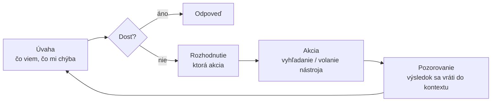

# Z vyhľadávania sa stáva rozhodnutie, nie krok

V celej Časti I príručky si mal pred očami jeden obraz — pevnú pipeline. Dopyt príde a zakaždým ide tou istou cestou `retrieve → generate`: jedno vyhľadanie, jedno generovanie, hotovo. Pipeline sa na dopyt nepozerá a nevyberá cestu; pri každom dopyte iba zakrúti tou istou kľukou.

**Agentický RAG** presne s tým skoncuje: vyhľadávanie prestáva byť pevným krokom a stáva sa akciou, ktorú si model volí sám — v slučke a s pohľadom na priebežný výsledok. Model rozhoduje: či vôbec vyhľadávať, čo hľadať, či dopyt preformulovať, či sa vrátiť po ďalšie kolo, z ktorého zdroja ťahať a či už má na odpoveď dosť.

Celú lekciu zhrnie jediná veta: *v statickom RAG riadi kód, v agentickom model.* Tok riadenia (control flow) prechádza na model — kód mu prestáva diktovať cestu.

:::tip[▶ Video]

<YouTube id="JB2P5Gk23VI" title="RAG's Evolution: From Simple Retrieval to Agentic AI — IBM Technology" />

Presne tá zmena, o ktorej je táto lekcia: ako z jednoduchého vyhľadávania vyrastie agentický systém. (Video je v angličtine.)

:::

## Prečo — kde statický RAG zlyháva

Agentnosť sa nepridáva pre módu. Pevné `retrieve → generate` na celých triedach dopytov naozaj zlyháva.

- **Multi-hop otázky (viackrokové — každý krok nadväzuje na predchádzajúci).** „Kto vedie oddelenie, ktoré vydalo smernicu X?“ Jedno vyhľadanie na to nestačí: najprv nájdi smernicu X, z nej zisti oddelenie a až potom jeho vedúceho. Druhý dopyt sa skladá z výsledku prvého — a ten druhý krok pevná pipeline spraviť fyzicky nevie.
- **Otázky, na ktoré netreba nič vyhľadávať.** „Prelož predchádzajúcu odpoveď do angličtiny“ alebo „koľko je 15 % z 200“. Statický RAG aj tak vlezie do databázy a primieša nepotrebný kontext. Agent vie usúdiť, že tu nie je čo hľadať.
- **Rôzne zdroje pre rôzne otázky.** Niektoré patria do znalostnej báze, iné do SQL (dopyt) nad tabuľkou, ďalšie na čerstvý web. Pevná pipeline ide vždy na jedno miesto; agent dopyt nasmeruje tam, kde odpoveď naozaj je.
- **Zlý prvý výsledok.** Vyhľadávanie vráti nerelevantné chunky (kúsky) — a statická pipeline ich aj tak posunie do generovania a vyrobí slabú odpoveď. Agent sa na to, čo prišlo, pozrie, vidí, že je to mimo, dopyt preformuluje a vyhľadá znova. To je **self-correction** (sebaoprava); a návrat k vyhľadávaniu so spresneným dopytom sa volá **iterative retrieval** (iteratívne vyhľadávanie).

Spoločný menovateľ: skutočný dopyt potrebuje premenlivý počet krokov a voľbu cesty — pipeline ponúka jednu pevnú.

## Mechanizmus: slučka agenta

V jadre je jednoduchá **slučka agenta** (agent loop). Točí sa dovtedy, kým model neusúdi, že má na odpoveď dosť.

- **Úvaha** — model zváži, čo už nazbieral a čo mu ešte chýba.
- **Rozhodnutie** — vyberie ďalšiu akciu. V Časti I príručky žiadnu voľbu nemal.
- **Akcia** — najčastejšie volanie vyhľadávania, no môže to byť aj iný nástroj (o tom je nasledujúca lekcia o používaní nástrojov).
- **Pozorovanie** — výsledok akcie sa vráti do kontextu a slučka sa zopakuje, teraz už s novou znalosťou.

Práve v tejto slučke „premysli → sprav → pozri sa → zopakuj“ spočíva agentnosť. Vyhľadávanie je tu jednou z akcií vnútri slučky, nie prvou priečkou pevného rebríka.

:::tip[▶ Video]

<YouTube id="0z9_MhcYvcY" title="What is Agentic RAG? — IBM Technology" />

Tá istá slučka z iného uhla: prejde roly agenta — plánovanie, volania nástrojov, uvažovanie. (Video je v angličtine.)

:::

## Čo agentnosť konkrétne pridáva

Rozmeňme „model má riadenie“ na konkrétne schopnosti.

| Schopnosť | Statický RAG | Agentic RAG |
|---|---|---|
| Vyhľadávať, alebo nie | Vyhľadáva vždy | Rozhodne sa podľa dopytu |
| Počet vyhľadávaní | Práve jedno | Nula, jedno alebo mnoho |
| Preformulovanie | Dopyt taký, aký je (nanajvýš jedna transformácia vopred) | Prepisuje ho medzi krokmi, podľa výsledku |
| Zdroj | Jeden pevný | Nasmeruje na ten správny (znalostná báza / SQL / web / API) |
| Reakcia na zlý výsledok | Pošle ho ďalej | Vidí, že je „mimo“, a ide znova |
| Počet krokov | Pevný | Premenlivý, rozhoduje model |

## Spektrum, nie prepínač

Nemysli na to ako „buď statický, alebo agentický“. Medzi tými dvoma pólmi je plynulé spektrum, odstupňované podľa toho, koľko voľnosti modelu odovzdáš.

1. **Router (smerovač).** Najľahší krok do agentnosti. Model urobí jediné rozhodnutie — kam dopyt poslať (do ktorého indexu, na ktorý nástroj, alebo „vyhľadávanie netreba“) — a všetko ďalej je statické. Lacný, predvídateľný, pokryje väčšinu prípadov.
2. **Query planning (plánovanie dopytu).** Model rozloží ťažkú otázku na čiastkové dopyty ešte pred vyhľadávaním.
3. **Plná slučka (v štýle ReAct).** Skutočná úvaha → rozhodnutie → akcia → pozorovanie v slučke, so **ReAct** (Reasoning + Acting), so sebaopravou a premenlivým počtom krokov.

Jedno praktické pravidlo si zafixuj hneď teraz: zvoľ najjednoduchšiu úroveň, ktorá úlohu vyrieši. Plná agentická slučka nie je výhra, je to náklad. Router nad dobrým statickým RAG často prekoná „plného agenta“ v nákladoch, latencii aj stabilite.

## Cena — a most späť k Časti I

Keď riadenie odovzdáš modelu, presne za to aj zaplatíš.

- **Latencia a náklady.** N krokov znamená N volaní modelu a N vyhľadávaní. Jedna otázka sa ľahko rozrastie na 5–10 volaní modelu.
- **Nepredvídateľnosť.** Počet krokov aj cesta teraz závisia od modelu — správanie sa ťažšie zaručuje.
- **Ladenie a evaluácia sa sťažujú.** Chyba môže nastať v ktoromkoľvek kroku slučky: zlé rozhodnutie o smerovaní, zlé preformulovanie, slučka, ktorá sa nezastaví.

Práve tu vedie priamy most na prierezovú vrstvu. **Observability** (pozorovateľnosť) sa mení z užitočnej na povinnú: bez záznamu celej reťaze krokov a volaní jednoducho neodladíš zlú odpoveď agenta. A evaluácia teraz meria už nielen „našlo sa / vygenerovalo sa“, ale kvalitu celej **trajektórie** — či bola cesta zvolená správne a či sa agent nezacyklil donekonečna.

Časť I príručky sa neruší — stáva sa základom, nad ktorým agent rozhoduje.

## Čo si odniesť z lekcie

- Statický RAG je pevná pipeline `retrieve → generate`, riadenie má kód. Agentický RAG mení vyhľadávanie na akciu v slučke a riadenie prechádza na model.
- Agentnosť potrebuješ tam, kde pipeline zlyháva: multi-hop, „vyhľadávanie netreba“, smerovanie na správny zdroj, sebaoprava po zlom výsledku.
- Mechanizmom je slučka úvaha → rozhodnutie → akcia → pozorovanie, opakovaná dovtedy, kým model nemá dosť na odpoveď.
- Je to spektrum: router → query planning → plná slučka. Zvoľ najjednoduchšiu úroveň, ktorá úlohu vyrieši.
- Cenou je vyššia latencia, vyššie náklady, nepredvídateľnosť a ťažšie ladenie — a práve preto sa Observability a evaluácia z Časti I príručky stávajú povinnými.

**Nové pojmy** → [Glosár](../../glossary.md): Agentic RAG, agent loop, ReAct (Reasoning + Acting), routing / query router, multi-hop retrieval, query planning, self-correction / self-reflection, iterative retrieval.

---

:::note[Ďalej — druhá časť lekcie]

**[Iteratívne vyhľadávanie a hodnotenie](./deep-dive.md)** — hlbší prechod slučkou vyhľadávania: pomenované vzory agentického RAG (Self-RAG, corrective RAG, adaptive RAG), ako slučku udržať, aby sa netočila na mieste, ako medzi krokmi odovzdať nájdený kontext a ako ohodnotiť celú trajektóriu vyhľadávania, nie iba jej poslednú odpoveď.

Pozri aj: ako slučku agenta vo všeobecnosti viesť a ohraničiť — [Plánovanie a slučky](../planning-loops/); ako tieto akcie fungujú v Claude, OpenAI a Gemini — [záverečná stránka časti](../real-agents/).

:::
