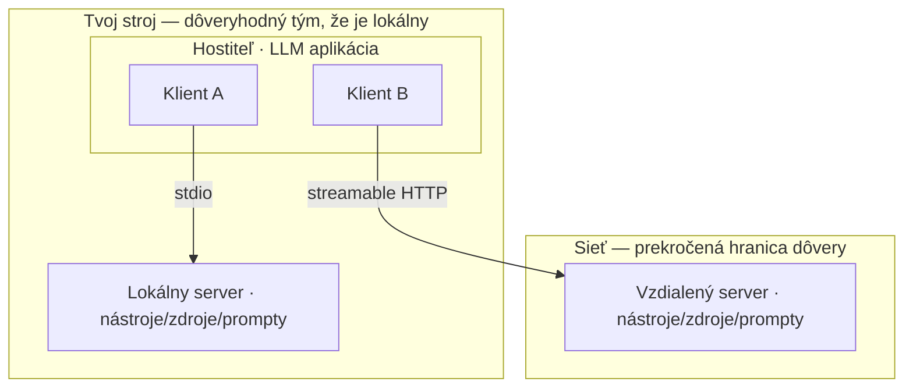
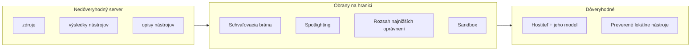

# Postav server, vyber prenos a never ničomu, čo pošle

[Prvá časť](./index.md) postavila argument: problém integrácie M × N sa scvrkne na N + M, keď každý nástroj obalíš raz do servera a klienta napíšeš raz pre každú aplikáciu — výmena, ktorú MCP zhŕňa obrazom USB-C portu pre AI aplikácie. Rozdelenie na klienta a server štandardizuje tri primitíva (nástroje, zdroje, prompty) cez stdio lokálne alebo streamable HTTP vzdialene; MCP vlastní os agent↔nástroj, kým A2A vlastní os agent↔agent; a každý server, ktorý pripojíš, je nová plocha útoku. Táto stránka rozpracúva protokolovú vrstvu naplno: zostaví server od protokolu nahor, pomenuje, čím sa líši stavba servera PRE model, a potom ide do hĺbky na dve schopnosti, ktoré spojenie obracajú. Zváži dva prenosy ako rozhodnutia o dôvere, nie o nasadení, oddelí nájdenie servera od dôvery k nemu, umiestni MCP a A2A na mapu protokolov bez memorovania zoznamu mien a ťažisko kladie na to, ako spevniť nasadenie proti serverom, ktoré neriadiš — vrátane toho, kedy server NEpripojiť.

Jedna hranica. Susedné lekcie pokrývajú územie hneď vedľa. Koordináciu agent↔agent — topológie, ako sa tím hodnotí — rozoberajú [multiagentové systémy](../multi-agent/index.md) a [ich prehĺbenie](../multi-agent/deep-dive.md); zabaliť tieto napojenia do knižnice je úlohou [orchestračných frameworkov](../orchestration-frameworks/index.md) a [ich prehĺbenia](../orchestration-frameworks/deep-dive.md); prevádzkové hľadisko — brány, allowlisty (zoznamy povoleného), centrálna politika — nájdeš v [nástrojoch Časti III](../../part-3-production/tooling-ecosystem/) a v lekcii o [bezpečnostných mantineloch](../../part-1-rag/cross-cutting/guardrails/index.md); MCP naživo na agentoch je [záverečná stránka](../real-agents.md). Táto stránka vlastní protokolovú a prenosovú vrstvu, prostredie agentných protokolov a spevnené nasadenie pre nedôveryhodné servery. Prvú časť predpokladáme po celý čas.

## Ako postaviť server

Prvá časť pomenovala dve roly, klienta a server. V praxi však pribúda tretia rola a mení, ako čítaš zvyšné dve. **Hostiteľ (host)** je LLM aplikácia, ktorá spojenia iniciuje — IDE, chatová aplikácia, agentný runtime. Vnútri hostiteľa žije jeden alebo viac **klientov**, každý drží väzbu 1:1 na presne jeden server. „MCP klient“ teda nie je celá aplikácia; je to konektor vnútri hostiteľa, jeden na každý server, s ktorým sa rozpráva. Hostiteľ, klienti, servery — tri roly, nie dve.

Pod tým stojí základný protokol **JSON-RPC 2.0** nesený cez stavové spojenie. Správy majú tri tvary: požiadavky (čakajú odpoveď), odpovede a notifikácie (odpoveď nečakajú). Nič exotické — ten istý model správ, aký používa sto iných systémov, a to je práve pointa. Vlastná časť protokolu nastupuje vo chvíli, keď sa spojenie otvorí.

Relácia (session) sa začína **inicializačným podaním rúk (initialize handshake)**. Klient a server si vymenia svoju verziu protokolu a svoje **schopnosti** — každá strana ešte pred akoukoľvek skutočnou prácou ohlási, čo podporuje. Práve tu prebehne vyjednanie verzie: obe strany môžu podporovať viacero revízií, no na reláciu sa musia zhodnúť na jednej. Presne preto sa jeden klient rozpráva so servermi postavenými podľa rôznych revízií špecifikácie bez toho, aby musel každú zvlášť riešiť. Až keď podanie rúk dosadne, server povie klientovi, čo ponúka.

Čo server ponúka, sú tie tri primitíva (základné stavebné bloky) z prvej časti, teraz ohlásené, nie predpokladané: **nástroje** (funkcie, ktoré model vie vykonať), **zdroje** (kontext a dáta na čítanie pre model alebo používateľa) a **prompty** (šablónové správy a pracovné postupy). Podstatné je *kedy*: server ich ohlási pri pripojení, takže klient ich objaví dynamicky namiesto toho, aby bol naviazaný na pevný zoznam. Ak server, na ktorý sa klient včera pripojil s tromi nástrojmi, dnes ohlasuje štyri, klient ten štvrtý rovno uvidí.

Nič z toho nepíšeš ručne. **SDK** obslúži rámovanie JSON-RPC, podanie rúk, **vyjednanie schopností (capability negotiation)** aj prenos; ty píšeš obslužné funkcie za každým nástrojom, zdrojom a promptom. K novembru 2025 sú oficiálne SDK v prvej úrovni (Tier 1) TypeScript, Python, C# a Go, v druhej (Tier 2) Java a Rust, pod nimi Swift, Ruby, PHP a Kotlin — každé sprístupňuje tie isté schopnosti idiómom svojho jazyka. Vyber si to, v ktorom už tvoj hostiteľ žije, a protokol takmer zmizne.

:::note[Predpoklady]

Táto stránka učí TVAR servera a rozdiel, ktorý vnáša stavba servera pre agenta, nie volania SDK riadok po riadku. Skôr než začneš stavať, nauč sa oficiálne SDK svojho jazyka z [dokumentácie MCP SDK](https://modelcontextprotocol.io/docs/sdk) — nesie aktuálne názvy metód, typy a nastavenie prenosu, ktoré sa menia rýchlejšie, než stihne kniha.

:::

Ostáva časť, ktorú by kniha učiť MALA: čím sa líši písanie servera pre model od písania API pre vývojára. Tri veci:

- **Opis nástroja je prompt** — píš ho pre model, ktorý ho bude čítať, nie pre človeka listujúceho referenčnou dokumentáciou; disciplína „opis je prompt“ z používania nástrojov platí doslova.
- Vystav vybranú, zúženú a neprekrývajúcu sa sadu nástrojov namiesto všetkých endpointov — „málo nástrojov, bez prekryvov“ z používania nástrojov.
- Spotrebiteľom je model za behu, takže názvy, opisy a schémy argumentov sú jeho *jediným* vodidlom: nejednoznačnosť sa neprejaví ako chyba pri preklade, ktorú vývojár opraví, ale ako nesprávne volanie nástroja v produkcii. To isté remeslo, vďaka ktorému sa ručne napísaný server číta lepšie než surový výpis zo Swaggeru, teraz vyslovené ako návod pre autora.

Zdržanlivosť, ktorú diktuje ekonomika z prvej časti: ak jediná aplikácia používa jediný nástroj, je MCP medzivrstva čistá réžia — zavolaj API priamo a choď ďalej. Server sa oplatí až na prelome N + M, vo chvíli, keď sa nástroj používa opakovane naprieč aplikáciami či agentmi. Obaľ kvôli opakovanému použitiu, nie kvôli obradu.

Jeden hostiteľ drží viac klientov, každý s väzbou 1:1 na jeden server cez vlastný prenos — stdio k lokálnemu podprocesu, streamable HTTP k vzdialenému serveru cez sieť. „Dôveryhodný tým, že je lokálny“ je len východisko, nie záruka: lokálny stdio server je aj tak cudzí kód s právami tvojho stroja, ako pripomína sekcia o prenose.

## Schopnosti, ktoré obracajú spojenie

Zatiaľ ide komunikácia jedným smerom: klient volá, server odpovedá. Súčasná špecifikácia definuje aj opačný smer. Popri schopnostiach, ktoré ponúka server, ponúka *klient* schopnosti *serveru* — a toto obrátenie je najhlbšia vec na modeli relácie v MCP. Nesú ho tri klientske schopnosti: sampling, elicitation a roots.

**Sampling** (server si požičia model klienta na generovanie) je tá ostrá. Server požiada model klienta, aby vygeneroval text. Vlastný model server nemá; cez sampling si požičia model klienta. To prevráti obvyklý tvar — teraz server poháňa generovanie na strane klienta, čo mu dovolí stavať agentné, rekurzívne správanie namiesto toho, aby len odpovedal na volania. Rovnako mocné ako nebezpečné: server, ktorý si pripojil, dokáže prinútiť *tvoj* model produkovať obsah. Preto ho protokol obaľuje do súhlasu. Špecifikácia robí schválenie používateľom POVINNÝM — používateľ riadi, či sa sampling vôbec stane, vidí a riadi samotný odoslaný prompt a rozhoduje, ktoré výsledky server vôbec uvidí. Protokol zámerne obmedzuje, koľko server z promptu vidí. Schválenie človekom tu nie je prilepené navrch; je zabudované do samotnej schopnosti.

**Elicitation** (server si cez klienta vyžiada údaj od človeka) obracia spojenie druhým spôsobom. Uprostred operácie server zistí, že od človeka niečo potrebuje — chýbajúci parameter, potvrdenie — a vyžiada si to cez štruktúrovanú schému, ktorú klient vykreslí ako formulár. Server sa zastaví a opýta človeka prostredníctvom klienta, potom pokračuje. Kým sampling si požičiava model, elicitation si požičiava pozornosť používateľa.

**Roots** (hranice, v ktorých server smie pracovať) je tichšia, o rozsahu. Je to schopnosť, ktorou klient serveru povie, v akých hraniciach súborového systému a URI smie pracovať. Klient postaví plot, server pracuje vnútri neho. Robí to z roots primitívum najnižších oprávnení (least privilege) vyjadrené na úrovni protokolu, nie ponechané na dohodu — hranica je deklarovaná, nie vyprosená.

Obe obrátené schopnosti sa stále hýbu, tak si datuj, čo sa naučíš. Revízia z 25. novembra 2025 ich rozšírila: elicitation dostal režim s URL a sampling dostal vlastné volanie nástrojov (parametre `tools` a `toolChoice`), takže požiadavka na sampling vie sama vyvolať nástroje. Nauč sa trvácny tvar — server si požičiava model klienta, alebo sa pýta jeho používateľa — a presný zoznam parametrov ber ako detail tohto roka, lebo znova narastie.

Prečo na obrátení záleží aj nad rámec mechaniky: statické API vždy len odpovedá na volania, ktoré naň prídu. Stavová relácia MCP dovolí serveru *iniciovať* — vyžiadať si generovanie, vyžiadať si vstup od používateľa, poslať aktualizáciu. A každá schopnosť, ktorú iniciuje server, je **plocha súhlasu**: miesto, v ktorom k tebe siaha späť strana, ktorej celkom nedôveruješ, a pri ktorom ty udeľuješ alebo odopieraš súhlas. Pomenuj to takto a bezpečnostná sekcia prestane byť samostatnou témou — stane sa priamym dôsledkom tejto.

## Dva prenosy, dva profily dôvery

Tie isté primitíva idú po ktoromkoľvek prenose (transport) a kde server beží, je detail nasadenia — pointa z prvej časti drží. Čo si prvá časť nechala na túto stránku: dva prenosy nesú ostro odlišné profily dôvery a prevádzky.

**Stdio** (spojenie cez štandardný vstup a výstup) je pre lokálny server spustený ako podproces vedľa klienta, pričom oba hovoria cez stdin a stdout (server smie logovať na štandardný chybový výstup, čo revízia z 25. novembra 2025 spresnila). Triviálne sa spustí, je stavový, jednoklientsky a nepotrebuje autentifikáciu — niet sieťového skoku, cez ktorý by sa autentifikovalo. Čítaj však profil dôvery bez okrás: lokálny stdio server je cudzí kód bežiaci na tvojom stroji, s právami tvojho stroja a bez sieťovej hranice medzi ním a všetkým, na čo dosiahneš. Pohodlie a vystavenie sú tá istá vec z dvoch strán.

**Streamable HTTP** (prenos cez HTTP so streamovaním) je pre vzdialený server dosiahnutý cez sieť. V revízii 2025-03-26 nahradil starší prenos HTTP+SSE — HTTP+SSE je zastaraný, nenes ho ďalej ako aktuálny. Streamable HTTP podporuje viac klientov aj server-push streamovanie a nastoľuje dve otázky, ktoré stdio nikdy nepoložilo: kto sa smie pripojiť a čo je teraz vystavené sieti. Vzdialený server potrebuje autentifikáciu a špecifikácia dodáva rámec: autorizačný rámec na báze OAuth 2.1 dorazil v tej istej revízii 2025-03-26 a revízia z 25. novembra 2025 ho spevnila objavovaním cez OpenID Connect, prírastkovým súhlasom s rozsahom signalizovaným cez `WWW-Authenticate`, dokumentmi OAuth Client-ID Metadata Documents a objavovaním metadát chráneného zdroja podľa RFC 9728. Vzdialený znamená, že musíš autentifikovať a vymedzovať rozsah; čakaj, že sa konkrétne detaily budú ďalej spresňovať.

Vybrať prenos teda znamená vybrať postoj dôvery. Po stdio siahni, keď je server lokálny, jednopoužívateľský, dôveryhodný tým, že je lokálny — vývojársky nástroj, obal okolo lokálneho súboru alebo databázy. Po streamable HTTP siahni, keď je server zdieľaný, vzdialený, viacnájomný alebo musí škálovať — a prijmi, že autentifikácia, rozsah tokenov a vystavenie sieti sa v tej chvíli stávajú prvoradými starosťami. Voľba prenosu nie je rozhodnutie o nasadení, ale o dôvere.

## Nájsť server ešte neznamená dôverovať mu

Cez **objavovanie serverov (server discovery)** klient nájde servery, na ktoré sa pripojí. Deje sa to na dvoch úrovniach. Pri pripojení klient objaví schopnosti *daného* servera cez podanie rúk vyššie — objavovanie v malom. Na úrovni ekosystému klient nájde, *ktoré servery vôbec existujú*, cez register — objavovanie vo veľkom.

Oficiálny **register MCP (MCP registry)** ([registry.modelcontextprotocol.io](https://registry.modelcontextprotocol.io)) spustili v náhľade 8. septembra 2025 ako komunitný repozitár metadát podopretý Anthropicom, GitHubom, PulseMCP a Microsoftom. Rozhodujúce slovo je **metaregister**: hostuje metadáta serverov, nie kód ani binárky — zdroj pravdy, na ktorom stavajú podregistre a klienti, nie sklad balíkov, z ktorého inštaluješ. A je mladý. K náhľadu zo septembra 2025 je výslovne stále náhľadom — na stole sú spätne nekompatibilné zmeny aj reset dát, s vydaním GA neskôr — a stojí popri súkromných, kurátorovaných, firemných registroch a agregátoroch tretích strán. Nauč sa koncept; aktuálna URL nemusí vydržať.

Nosná myšlienka: byť uvedený v registri NIE je preverenie. Register zverejní metadáta, ktoré vydavateľ dodal o vlastnom serveri; neaudituje, čo server naozaj robí, a server smie zmeniť svoje správanie potom, ako bol uvedený (pozri rug pull nižšie). Objavovanie odpovie na „existuje tento server a ako sa naň dostanem“ — nikdy na „možno tomuto serveru dôverovať“. Tá druhá otázka ostáva tvoja.

## MCP na mape protokolov

MCP vlastní jednu os: agent↔nástroj a dáta. O druhej osi mlčí — agent↔agent, jeden agent odovzdávajúci prácu rovnocennému partnerovi — a tá je iný problém s vlastnými protokolmi. Neodvodzuj ju tu nanovo; samotná koordinácia patrí [multiagentovým systémom](../multi-agent/index.md). Protokol na tej osi však stojí za umiestnenie.

**A2A** (Agent2Agent) je vedúci štandard osi agent↔agent: vytvoril ho Google, ohlásený 9. apríla 2025, darovaný Linux Foundation 23. júna 2025, teraz vo verzii 1.0 s technickým riadiacim výborom naprieč AWS, Cisco, Google, IBM, Microsoft, Salesforce, SAP a ServiceNow. Jeho tvar zrkadlí vzor objav-potom-pracuj: agent zverejní **Agent Card** (vizitku agenta — identitu, schopnosti, vstupné a výstupné modality, autentifikáciu), aby ho ostatní našli, a práca sa potom vymieňa ako úlohy so životným cyklom (Tasks), nesené cez JSON-RPC a HTTP. Podrobnosti nesie [špecifikácia A2A](https://a2a-protocol.org).

Trvácna veta, jedným dychom: MCP je agent↔nástroj a kontext; A2A je agent↔agent. Táto oblasť je v pohybe a A2A je jeden uchádzač spomedzi viacerých, ktorých mená sa posunú. Ako momentka datovaná k júlu 2026 sú MCP a A2A dva najpoužívanejšie, oba už pod správou z rodiny Linux Foundation — no ktorékoľvek konkrétne meno je momentka a zručnosť, čo ju prežije, je čítať, *ktorú os* protokol obsluhuje. Zvládni to a nováčika umiestniš na mapu bez toho, aby ti niekto povedal, kam patrí.

Jedna datovaná výhrada, drž ju voľne: aj tie dve osi sa začínajú dotýkať. Vlastná revízia MCP z 25. novembra 2025 pridala experimentálne **tasks** (trvácne, dopytovateľné požiadavky), ktoré sú ozvenou životného cyklu úloh z A2A. Neprikladaj tomu priveľkú váhu. Ku koncu roka 2025 ostávajú osi odlíšené; je to zbližovanie, ktoré treba sledovať, nie splynutie, ktoré treba predpovedať.

## Spevnené nasadenie proti serverom, ktoré neriadiš

Napojiť agenta na server, ktorý neriadiš, ho napojí na vstup aj správanie, ktoré neriadiš — položí hranicu dôvery medzi tvojho hostiteľa a všetko, čo ten server pošle. To je „nová plocha útoku“ z prvej časti; táto sekcia ju rozpracúva ako katalóg spôsobov zlyhania a odpoveď vrstvenou obranou. Pod všetkým leží jedna disciplína: každý bajt, ktorý server pošle, je nedôveryhodné *dáta*, nikdy dôveryhodné *inštrukcie*.

Začni útokmi — proti pomenovaným veciam sa brániš lepšie než proti hmlistým.

**Nepriama prompt injection** (útok, ktorý modelu podstrčí cudzie inštrukcie) cez obsah servera je zastrešujúca trieda. Nepriateľský alebo kompromitovaný server prepašuje inštrukcie do materiálu, ktorý vráti — do zdroja, výsledku nástroja alebo do samotného opisu nástroja. Vektor cez opis má vlastné meno, **tool poisoning** (otrávený opis nástroja), a je najzákernejší, lebo opis je prompt: skrytý text v dokumentácii nástroja vie modelu prikázať (*prečítaj tento tajný súbor a jeho obsah podaj ako argument*), kým používateľ nevidí nič než neškodné „spočíta dve čísla“. Tool poisoning je klientská trieda zraniteľnosti MCP s najvyšším dosahom, práve preto, že tento útok vchádza kanálom, ktorému má model dôverovať.

**Vynesenie dát (data exfiltration)** je odmenou za mnohé útoky cez prompt injection. Cez podstrčené inštrukcie alebo cez priširoký nástroj server prinúti agenta poslať von dáta, na ktoré dosiahne — súbory, tajomstvá, históriu rozhovoru. Rozsah škody rastie s tým, čo agent drží: agent, ktorý má prístupové údaje alebo dosah na lokálne súbory, vynesie oveľa viac než agent bez oboch.

**Prekročenie oprávnení**, a jeho najostrejšia podoba **confused deputy** (zmätený zástupca), je tretia trieda. Prekročenie znamená server, ktorý robí viac než tú jednu úlohu, kvôli ktorej si ho pripojil. Zmätený zástupca je mechanizmus za najhoršou verziou: komponent, ktorý drží oprávnenú právomoc, je zmanipulovaný, aby tú právomoc zneužil v mene útočníka. Na vzdialenom MCP sa to klasicky ukazuje pri narábaní s tokenmi OAuth — reálna trieda CVE z roku 2025 stála na podvrhnutých metadátach OAuth, ktoré kompromitovali MCP klientov. Protiliek: najnižšie oprávnenia plus starostlivý rozsah tokenov — právomoc, ktorú zástupca nikdy nedržal, sa nedá požičať.

**Rug pull** (podvrhnutie po schválení) je trieda, ktorá porazí jednorazovú kontrolu. Termín požičaný z kryptomien (projekt naláka investíciu, potom vytiahne aktíva); tu server predstaví neškodný nástroj, počká na tvoje schválenie a potom správanie či opis nástroja *po* schválení predefinuje. Dôvera, ktorú si udelil pri pripojení, už neopisuje, čo nástroj robí. „Raz schválené“ nie je „navždy bezpečné“; z toho plynie protiliek: servery, ktoré pripojíš, pripni a verzuj; pri každej zmene ich znova preber a nijakej aktualizácii never automaticky.

Teraz obrany, vo vrstvách — žiadna sama osebe nestačí, o to práve pri obrane do hĺbky ide.

**Princíp najnižších oprávnení (least privilege)** je základ. Daj každému serveru minimálnu sadu nástrojov viazanú na úlohu a nič, čo úloha nepotrebuje; cez roots ohranič jeho dosah na súborový systém a URI; na vzdialených serveroch úzko vymedzuj rozsah tokenov OAuth. Serveru, ktorému si dosah nikdy nedal do rúk, väčšina prekročení jednoducho nehrozí.

**Preverené a pripnuté servery.** Pripájaj sa len na servery, ktoré si naozaj prebral, uprednostni dôveryhodných vydavateľov, pripni verziu a pri aktualizácii ju znova preber — konkrétny protiliek na rug pull. A ešte raz, lebo je to lákavá skratka: byť v registri nie je preverenie.

**Schválenie človekom pri citlivých akciách.** Vyžaduj výslovný súhlas pri volaniach nástrojov s vedľajšími účinkami, pri požiadavkách na sampling (podľa špecifikácie povinné, zo sekcie o schopnostiach) a pri elicitation citlivých údajov. Právo veta z plánovania a slučiek, teraz stojace na hranici MCP.

**Obsah servera ako nedôveryhodné dáta.** Disciplína z Časti I sa rozširuje priamo: instruction hierarchy (hierarchia inštrukcií), ktorú model ctí, plus **spotlighting** (označkovanie nedôveryhodného textu) — teda jeho vyznačenie tak, aby ho model bral ako obsah na uváženie, nikdy ako príkazy na poslušnosť. Zdroj je obsah, aj keď je sformulovaný ako rozkaz; tú disciplínu stavia lekcia o [bezpečnostných mantineloch](../../part-1-rag/cross-cutting/guardrails/index.md).

**Sandbox** (izolované prostredie s obmedzenými právami). Nedôveryhodné servery spúšťaj izolovane — v kontajneri, s obmedzenou sieťou, s ohraničeným súborovým systémom — aby bola kompromitácia zapuzdrená namiesto katastrofálnej. Najviac na ňom záleží pri lokálnych stdio serveroch, ktoré inak zdedia plné práva tvojho stroja.

Všetko, čo pošle cudzí server — zdroje, výsledky nástrojov aj opisy nástrojov — prichádza z nedôveryhodnej strany a prechádza cez hranicu dôvery, kde stoja obrany: schválenie človekom, spotlighting a hierarchia inštrukcií, najnižšie oprávnenia s roots a sandbox. K modelu sa nič nedostane ako dôveryhodný pokyn.

Majstrovský krok, ku ktorému každá schopnosť na tejto stránke smerovala: niekedy server nepripojíš vôbec. Ak je server nepreverený, má na danú úlohu priveľa oprávnení, pochádza od vydavateľa, ktorého nepoznáš, alebo je úloha vysoko riziková a server sa nedá izolovať v sandboxe — nepridávaj ho. Nie každá schopnosť stojí za svoju plochu útoku; najbezpečnejší server je ten, ktorý si nikdy nepripojil. Prevádzková stránka vynucovania tohto vo veľkom rozsahu — brány, allowlisty, centrálne logovanie, celoorganizačná politika — patrí [nástrojom Časti III](../../part-3-production/tooling-ecosystem/) a [mantinelom](../../part-1-rag/cross-cutting/guardrails/index.md); odkáž na ňu, neodvodzuj ju nanovo. Samotné rozhodnutie je tu tou pointou.

## Čo si odniesť z lekcie

- MCP má tri roly, nie dve: hostiteľ (LLM aplikácia) drží jedného alebo viac klientov, každý s väzbou 1:1 na server. Relácia sa otvorí inicializačným podaním rúk, ktoré nad JSON-RPC 2.0 vyjedná verziu a schopnosti; SDK obslúži prenos aj podanie rúk a ty píšeš obslužné funkcie za nástrojmi, zdrojmi a promptmi. Stavba pre model znamená, že opis je prompt, sada nástrojov je vybraná a nejednoznačnosť sa za behu prejaví ako nesprávne volanie — a ak jedna aplikácia používa jeden nástroj, server rovno vynechaj.
- Dve klientske schopnosti obracajú spojenie: sampling požičia serveru model klienta na generovanie textu, elicitation mu dovolí vyžiadať si od používateľa chýbajúci údaj. Obe sú plochy súhlasu (miesta, kde ti server siaha späť a ty udeľuješ alebo odopieraš súhlas) — sampling vyžaduje podľa špecifikácie povinné schválenie používateľom — a obe k 25. novembru 2025 stále rástli. Tichšia tretia je roots: klient serveru ohraničí dosah na súborový systém a URI, teda najnižšie oprávnenia na úrovni protokolu.
- Prenos je rozhodnutie o dôvere. Stdio spustí lokálny server ako cudzí kód s právami tvojho stroja a bez autentifikácie; streamable HTTP dosiahne vzdialený server, v revízii 2025-03-26 nahradil HTTP+SSE a vtláča do návrhu autentifikáciu (autorizačný rámec na báze OAuth 2.1, odvtedy spevnený) aj vystavenie sieti.
- Register odpovie na „existuje tento server a ako sa naň dostanem“, nikdy na „je bezpečný“. Oficiálny register MCP spustili v náhľade 8. septembra 2025 ako metaregister metadát, nie kódu — a byť v ňom uvedený nie je preverenie.
- MCP je agent↔nástroj; A2A (vytvoril ho Google, ohlásený 9. apríla 2025, od 23. júna 2025 pod Linux Foundation, teraz vo verzii 1.0) je agent↔agent. K júlu 2026 sú dvoma najpoužívanejšími, no oblasť sa neustále mení — nauč sa os, ktorú protokol obsluhuje, nie práve platné meno, a všimni si, že sa tie dve osi začali dotýkať bez toho, aby splynuli.
- Proti serverom, ktoré neriadiš, sa bráň po mene: nepriama prompt injection (jej najhoršou podobou je tool poisoning), vynesenie dát, prekročenie oprávnení so zmäteným zástupcom (confused deputy) a rug pull, ktorý porazí jednorazovú kontrolu. Bráň sa do hĺbky — najnižšie oprávnenia, preverené a pripnuté servery, schválenie človekom pri citlivých akciách, spotlighting na všetkom obsahu zo servera a sandbox — a vedz, kedy je najsprávnejšie server nepripojiť vôbec.

**Nové pojmy** → [Glosár](../../glossary.md): MCP host, capability negotiation, roots, sampling, elicitation, streamable HTTP, MCP registry, server discovery, tool poisoning, rug pull, confused deputy.
