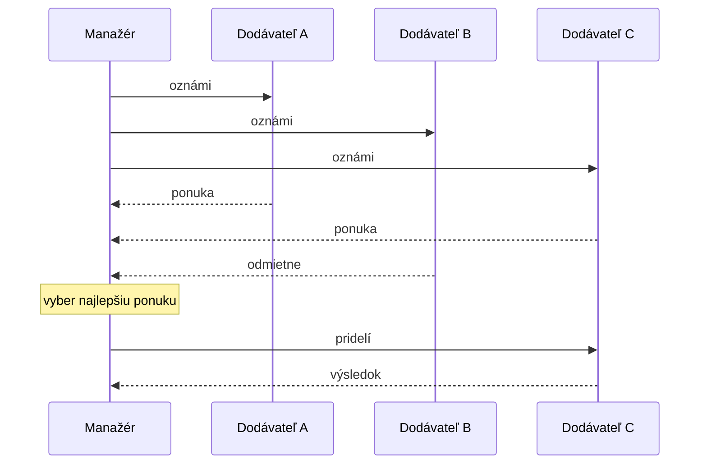
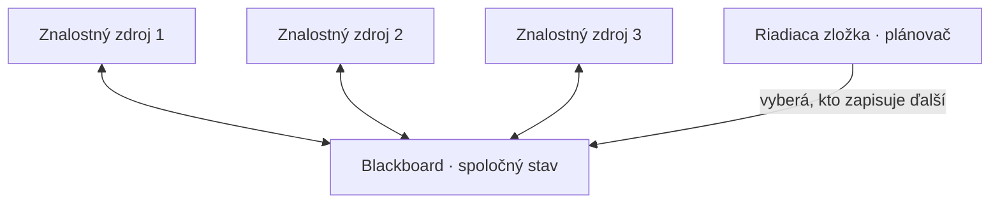
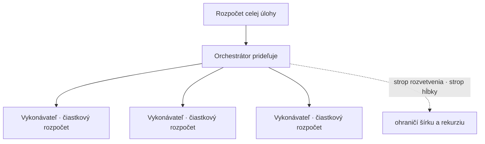

# Reč cez protokol, spoločná tabuľa a známkovanie tímu

[Prvá časť](./index.md) zvážila dôvody za aj proti tomu, aby si z jedného agenta urobil viacerých: rozdeľ pre špecializáciu, izoláciu kontextu, modularitu a paralelizmus; poskladaj ich ako orchestrátor–vykonávateľov, reťaz, hierarchiu alebo debatu; prácu presúvaj odovzdaním riadenia — riadenie plus kontext; a orchestrátor je sám iba agent, ktorý rozkladá, smeruje a syntetizuje. To všetko proti brzde, že cena sa násobí približne N×, chyby sa šíria bez spoločnej pravdy, koordinácia niečo stojí a hodnotí sa ťažšie. Táto stránka rozpracúva vrstvu koordinácie naplno: dá medziagentovej správe konkrétny tvar a pridá primitívum zdieľaného priestoru, ktoré samotné odovzdanie riadenia vyjadriť nevie. Ukáže, ako sa roly prideľujú a vyjednávajú, vyrieši známkovanie tímu s roztrúsenou trajektóriou a udrží účet za tokeny na uzde.

Jedna hranica. Všeobecná vrstva riadenia slučky a rozpočtu — rozpočty krokov, detekcia zacyklenia, reflexia, rozpočet ako politika, základy hodnotenia trajektórie — patrí [plánovaniu a slučkám](../planning-loops/index.md) a [ich prehĺbeniu](../planning-loops/deep-dive.md). Táto stránka vlastní vrstvu priamo nad jedným agentom: agent↔agent. Na úrovni prenosu stoja dva štandardy: MCP pre os agent↔nástroj a A2A pre os agent↔agent (nižšie); zabaliť ktorúkoľvek z týchto topológií do knižnice je úlohou [orchestračných frameworkov](../orchestration-frameworks/index.md). Znalosť prvej časti predpokladáme po celý čas.

## Ako dať správe tvar

V prvej časti agenti „hovorili cez správy“ a tá formulka spravila kus tichej roboty. Tu správa dostane konkrétny tvar — a jestvuje tridsať rokov stará práca, ktorú dnešné frameworky nanovo objavujú.

**FIPA** — Foundation for Intelligent Physical Agents, založená v roku 1996 — vydala v roku 2002 sadu na agentovú komunikáciu a od roku 2005 ju vedie štandardizačný výbor IEEE Computer Society. Definovala agentový komunikačný jazyk (Agent Communication Language), **FIPA ACL**. Správa v ACL je obálka. Vonkajšia vrstva je *performatív* (performative) — komunikačný akt, ktorý správa vykonáva: `inform`, `request`, `propose`, `cfp`, `agree`, `refuse`, `query-if` a zvyšok definovanej knižnice. Vnútri sú polia: `sender`, `receiver`, `content`, `language`, `ontology`, `protocol`, `conversation-id`, `reply-with`/`in-reply-to`, `reply-by`.

Stojí na **teórii rečových aktov (speech-act theory)** — na Austinovej a Searlovej myšlienke, že výpoveď je *činom*, nie iba dátami — so sémantikou definovanou nad modelom **presvedčenie–túžba–zámer (belief–desire–intention, BDI)**, ktorý opisuje mentálny stav agenta. Jej predchodca **KQML** vzišiel začiatkom 90. rokov z programu DARPA Knowledge Sharing Effort ako prvý praktický ACL postavený na rečových aktoch; FIPA ACL k nemu pridala formálnu sémantiku.

Prečo sa učiť normu z roku 2002: pomenúva niečo, čo moderní agenti stále potrebujú. Zásada z prvej časti *odovzdávacia správa je prompt* je tenšou verziou toho istého kroku — oddeliť *akt* (čo chceš, aby druhý agent spravil) od *obsahu*, na ktorom koná. Polia obálky sa priamo premietajú do dnešných otázok: kto a komu, samotný náklad a ktorým krokom ktorého viackrokového protokolu je táto správa.

**Contract net protocol (protokol kontraktných sietí)** (Reid G. Smith, *IEEE Transactions on Computers*, roč. C-29, č. 12, december 1980) prideľuje úlohu vyjednávaním, nie príkazom. Manažér oznámi úlohu; voľní dodávatelia (contractor) na ňu podajú ponuku; manažér ju pridelí najlepšej ponuke; víťazný dodávateľ vráti výsledok. FIPA neskôr tento cyklus štandardizovala ako svoj Contract Net Interaction Protocol — `cfp`, potom `propose`/`refuse`, potom `accept-proposal`/`reject-proposal`, napokon `inform`/`failure`. Dynamické prideľovanie úloh ako výmena správ — alternatíva k supervízorovi, ktorý každú čiastkovú úlohu napevno smeruje ručne.

Moderné frameworky obálku stavajú nanovo, zvyčajne oveľa tenšiu. Správa, ktorú si podáva framework agentov nad LLM, býva `{role, content, name}` plus metadáta o volaní nástroja — bez výslovného performatívu, ontológie či poľa protokolu. Bohatší koniec spektra sa však vracia, a to už s vlastným menom. **A2A**, protokol Agent2Agent, je otvorený štandard, vďaka ktorému agenti spolupracujú bez toho, aby si odhalili vnútro. Agent zverejní **Agent Card** — identitu, schopnosti, vstupné a výstupné modality, autentifikáciu — aby ho ostatní vedeli objaviť. Práca sa vymieňa ako úloha so životným cyklom (`submitted`, `working`, `input-required`, `completed`, `failed`, `canceled`), ktorá nesie správy poskladané z častí (Parts: text, súbor, dáta); výsledky sa vracajú ako artefakty (Artifacts). Prenos beží cez JSON-RPC 2.0 nad HTTP ([špecifikácia](https://a2a-protocol.org/latest/specification/) 1.0.0 pridáva väzby na gRPC a HTTP/REST) so streamovaním cez SSE.

Užitočný je kontrast s MCP, a je to os, nie súperenie. MCP štandardizuje os agent↔nástroj: model siahajúci po nástrojoch a zdrojoch. A2A štandardizuje os agent↔agent: dvaja *nepriehľadní* agenti sa koordinujú, pričom nepriehľadný znamená, že ani jeden neodhalí svoj vnútorný stav ani sadu nástrojov. Google predstavil A2A 9. apríla 2025 na konferencii Google Cloud Next s vyše 50 partnermi pod licenciou Apache 2.0, v polovici roka ho daroval Linux Foundation a predstavil ho ako doplnok k MCP, nie ako súpera — je to náprotivok osi agent↔agent, na ktorý základná lekcia o [MCP](../mcp/) ukázala dopredu.

Nech skončíš pri akejkoľvek schéme, živá návrhová otázka je tá z prvej časti: aký kontext na každej správe cestuje. Málo, a príjemca nekoná; priveľa, a kontext napuchne. Schéma je iba potrubie; disciplína pri náklade je zručnosť. Jedno pole si zaslúži osobitnú zmienku: výslovné ID rozhovoru alebo úlohy. Práve vďaka nemu neskôr zošiješ roztrúsenú trajektóriu dokopy, keď príde čas oznámkovať tím.

## Druhé primitívum: spoločná tabuľa

Odovzdanie riadenia je z bodu do bodu. Jeden agent zabalí kontext a podá ho presne jednému inému; všetko mimo tej obálky ostáva súkromné — výhra izolácie kontextu z prvej časti, a zároveň jej medza. Niektorá práca chce opak: spoločnú plochu, z ktorej každý agent číta a na ktorú zapisuje. Klasicky sa volá **blackboard (spoločná tabuľa)**.

Model je starší, než vyzerá. Nezávislí špecialisti — **znalostné zdroje (knowledge sources)** — nespolupracujú tým, že sa navzájom volajú, ale tým, že čítajú zo spoločnej globálnej dátovej štruktúry, z blackboardu, a zapisujú do nej, kým **riadiaca zložka (control)**, teda plánovač, rozhoduje, ktorý špecialista smie konať ďalší. Nijaký špecialista neoslovuje druhého priamo; každý sleduje tabuľu a prispeje vždy, keď je aktuálny stav niečím, čo vie zlepšiť.

Architektúra vzišla zo systému na porozumenie reči Hearsay-II, ktorý postavili na Carnegie Mellon približne v rokoch 1971–1976; jej kanonický opis je dvojdielny prehľad H. Penny Niiovej „Blackboard Systems“ (*AI Magazine*, roč. 7, 1986), napísaný na Stanforde. Predstav si tím okolo skutočnej tabule: každý vidí tú istú tabuľu, ktokoľvek pridá riadok, keď vie pomôcť, a jeden koordinátor rozhoduje, kto píše ďalší. Tri časti, a to je celá architektúra — tabuľa (spoločný stav), znalostné zdroje (špecialisti) a riadiaca zložka (plánovač).

Dnešné frameworky to zhmotňujú nanovo ako zdieľaný stav, zdieľaný scratchpad (spoločný poznámkový blok) alebo zdieľanú pamäť — graf, ktorého jediný stavový objekt každý uzol číta aj prepisuje (v štýle [LangGraph](https://www.langchain.com/langgraph)), alebo spoločné úložisko, s ktorým tím pracuje. Meno sa zmenilo, tvar nie.

Voľba medzi spoločnou tabuľou a odovzdávaním správ je skutočný kompromis — jadro celej tejto sekcie. Spoločná tabuľa veľa prináša: niet čo udržiavať v prepojení každého s každým, každý agent má plný výhľad na vyvíjajúci sa stav a nového špecialistu pridáš tak, že ho jednoducho namieriš na tabuľu. Lenže ten istý výhľad je aj cenou. Tabuľa priťahuje napúchanie kontextu — priebežný šum každého je teraz problémom všetkých, čím sa potichu ruší výhra izolácie kontextu z prvej časti — a v okamihu, keď dvaja agenti zapíšu naraz, potrebuješ riešiť konflikty, lebo paralelní vykonávatelia, ktorí upravujú tú istú bunku, sa zrazia. Tá zrážka nie je hypotetická; je to chyba pri súbežnom zápise, na ktorú upozorňuje [záverečná stránka časti](../real-agents/), tu už celkom konkrétna.

Odovzdávanie správ platí opačný účet. Odovzdanie riadenia drží kontext každého agenta izolovaný — vykonávateľ vidí iba to, čo dostal do rúk — ale platíš za smerovanie a prepojenie a informácia sa jednoducho nemusí dostať k agentovi, ktorý ju potreboval.

Teda: po spoločnej tabuli siahni vtedy, keď agenti naozaj potrebujú spoločný vyvíjajúci sa artefakt — spoločný plán, priebežný dokument, riešenie budované spoločne. Odovzdanie riadenia uprednostni tam, kde je izolácia zmyslom veci a práca sa delí na etapy. Väčšina produkčných systémov skončí ako hybrid — orchestrátor drží spoločný stav, kým vykonávatelia dostávajú izolované odovzdania — a berie tak výhľad tam, kde pomáha, a izoláciu tam, kde na nej záleží.

## Kto čo robí a ako sa to rozhodne

Roly môžu byť pevne dané alebo vybojované. Oboje je legitímne; menia predvídateľnosť za pružnosť.

**Statické roly (static roles)** sú určené pri návrhu. Každý agent dostane rolu, cieľ, personu a sadu nástrojov — známym príkladom sú tímy v [CrewAI](https://www.crewai.com) s rolou, cieľom a príbehom postavy — a nič z toho sa za behu nemení. Predvídateľné, ľahko pochopiteľné, bez réžie vyjednávania.

**Dynamické prideľovanie (dynamic assignment)** rozhoduje za behu. Buď orchestrátor podáva čiastkové úlohy vykonávateľom priebežne — dekompozícia a smerovanie z prvej časti — alebo si agenti prácu vyjednajú sami. Contract net protocol z predošlej sekcie je presne tento druhý prípad: oznám, ponúkni, prideľ je dynamické prideľovanie rolí ako výmena správ, malý trh, na ktorom najvhodnejší alebo najmenej vyťažený agent získa úlohu na základe ponuky.

Vyjednávanie nie je len o tom, kto prácu urobí; agenti môžu vyjednávať aj o *odpovedi*. **Multiagentová debata (multi-agent debate)** necháva niekoľko inštancií modelu nezávisle navrhnúť odpoveď, potom si navzájom cez pár kôl odpovede skritizujú a zrevidujú, až sa zídu na niečom presnejšom a súdržnejšom, než vyprodukoval ktorýkoľvek jediný prechod. Pôvodná štúdia (Du, Li, Torralba, Tenenbaum a Mordatch, „Improving Factuality and Reasoning in Language Models through Multiagent Debate“, arXiv:2305.14325, máj 2023) hlási zisky v matematickom aj strategickom uvažovaní a vo faktickej správnosti, s menším počtom halucinácií, a celé usporiadanie výslovne modeluje podľa Minského „Society of Mind“. Je to topológia debaty a kritika z prvej časti, ktorej sa dal skutočný protokol — kolá *navrhne → skritizuje → zreviduje*.

Háčik je aritmetika. Debata násobí cenu počtom agentov × počtom kôl, takže sa vyplatí len na ťažkých úlohách uvažovania alebo faktickej správnosti bez lacného overovateľa — na čomkoľvek, čo jeden agent plus rýchla kontrola už zvládnu správne, je čistým plytvaním. Úprimná brzda: dražba, vyjednávanie aj debata pridávajú kolá volaní modelu, teda cenu a latenciu. Supervízor, ktorý smeruje napevno, je lacnejší a väčšinou stačí. Po vyjednávaní siahni len vtedy, keď statické smerovanie naozaj nevie rozhodnúť — rôznorodí vykonávatelia, meniaca sa záťaž alebo prostredie, kde chceš na kvalitu vyvinúť súperivý tlak.

## Známkovanie tímu, ktorého trajektória je roztrúsená

Prvá časť varovala, že multiagentové systémy sa hodnotia ťažšie, lebo trajektória je rozprestretá cez agentov. Takto to naozaj spravíš. Základy — výsledok verzus proces, LLM-as-a-judge (LLM ako sudca) nad trace (záznam behu), observability (pozorovateľnosť) ako predpoklad — sú rozobraté pre jedného agenta v prehĺbeniach [agentického RAG](../agentic-rag/deep-dive.md) a [plánovania a slučiek](../planning-loops/deep-dive.md); nový problém je tu ten, že trace už nesídli na jednom mieste.

Každý agent vyrobí vlastný lokálny trace — svoju úvahu, volania nástrojov, čiastkové kroky. Aby si oznámkoval tím, tie kúsky pozošívaš do jedného trace od začiatku po koniec, a niťou, ktorá šije, je spoločné **korelačné ID (correlation id)**: ID rozhovoru alebo úlohy, ktoré niesla obálka správy, prevlečené cez každú správu tak, aby spany (úseky trace) z každého agenta viseli na jednom strome — span orchestrátora ako rodič, span každého vykonávateľa ako dieťa a každé volanie nástroja ako dieťa toho. Toto je konkrétna podoba vety z prvej časti, že „observability musí jednotlivé kúsky pozošívať“. Je to obyčajné **distribuované trasovanie (distributed tracing)** uplatnené na tím, usporiadané do stromov rodič–dieťa, ktoré poskladajú odovzdania a slučky nástrojov do jedného trace. Sémantické konvencie [OpenTelemetry](https://opentelemetry.io) pre GenAI už definujú druhy spanov, ktoré na to treba: volania LLM, spustenia nástrojov, spany orchestrácie agentov. Nástroje na trasovanie už multiagentové trace skladajú takto; disciplína je prevliecť ID cez každú správu od začiatku, lebo trajektóriu, ktorú si nikdy nekoreloval, nezložíš späť.

S jedným trace v ruke ho oznámkuj na troch úrovniach. *Výsledok* je ten ľahký: dal tím správnu konečnú odpoveď, podľa akejkoľvek metriky kvality odpovede, ktorú úloha používa. *Proces* na úrovni tímu sa pýta, či koordinácia dávala zmysel — rozumná dekompozícia, správne smerovanie, žiadna zdvojená práca, žiadny deadlock (vzájomné uviaznutie), zastavenie v rozumnom počte agentových krokov a za rozumné peniaze. *Pripísanie jednotlivému agentovi* je úroveň, ktorá patrí tímom, a tá naozaj ťažká: keď je konečná odpoveď zlá, ktorý agent alebo ktoré odovzdanie zaviedlo chybu? Zlokalizuj ju, inak ju neopravíš. Je to hodnotenie po jednotlivých preskokoch z agentického RAG posunuté o úroveň vyššie — teraz po agentoch namiesto po vyhľadaniach.

Tímy zlyhávajú aj spôsobmi, ktorých jeden agent nikdy nie je schopný, a tie zlyhania sú zmapované. **MAST (Multi-Agent System failure Taxonomy)** — taxonómia zlyhaní multiagentových systémov — pochádza zo štúdie Cemriho a kol. „Why Do Multi-Agent LLM Systems Fail?“ (arXiv:2503.13657, marec 2025), postavenej empiricky zo siedmich multiagentových frameworkov naprieč vyše 200 úlohami so silnou zhodou anotátorov (κ = 0,88). Triedi štrnásť **spôsobov zlyhania (failure modes)** do troch kategórií: **špecifikácia a návrh systému**, **medziagentová nezladenosť** (zlá komunikácia, ignorovaný vstup, odklon) a **overenie a zastavenie úlohy**.

Kategórie sa premietajú priamo na incidenty, na ktoré naozaj narazíš. Vykonávateľ zle prečíta odovzdanie a orchestrátor tú chybu vezme ako fakt — to je šírenie chýb, zlyhanie medziagentovej nezladenosti; rovnako ako dvaja vykonávatelia, ktorí bez vedomia o sebe robia tú istú prácu. Tím, ktorý sa háda dokola a nikdy sa nezíde, patrí pod overenie a zastavenie. Vykonávateľ potichu zíde zo svojej pridelenej čiastkovej úlohy. Pomenovať triedu, do ktorej incident patrí, mení „tím to pokazil“ na niečo, čo vieš odladiť.

A ako vždy, aj tu platí zdržanlivosť. Dvojagentová reťaz sotva má trajektóriu na zošívanie; router plus jeden vykonávateľ nemá takmer žiadnu. Cena korelácie a pripisovania rastie s veľkosťou tímu — vybav ho nástrojmi, až keď je tím dosť veľký na to, aby mal trajektóriu, ktorú sa oplatí známkovať.

## Ako udržať účet na uzde

Prvá časť odhadla násobič ceny zhruba na N×. Teraz sú na to čísla. V [zázname Anthropicu](https://www.anthropic.com/engineering/multi-agent-research-system) z 13. júna 2025 o ich multiagentovom výskumnom systéme agenti míňajú približne 4× toľko tokenov ako chatová interakcia a multiagentové systémy približne 15×. V ich hodnotení samotný počet tokenov vysvetlil približne 80 % rozptylu výkonu, pričom zvyšok dopĺňal počet volaní nástrojov a voľba modelu.

Poučenie, ktoré z toho vyvodzujú, je *brána*, nie zelená: ekonomika multiagentových systémov vychádza len vtedy, keď je úloha dosť cenná na to, aby zaplatila výkon navyše — silné paralelizovanie, kontext, ktorý pretečie jedno okno, mnoho zložitých nástrojov — a poriadne sa nehodia vtedy, keď každý agent potrebuje ten istý kontext alebo keď majú agenti mnoho vzájomných závislostí. To je „~Nד z prvej časti so zmeranou konštantou.

Vrstva politiky, ktorá to drží na uzde, je *rozpočet ako politika* z prvej časti, rozšírený z jedného agenta na tím. [Plánovanie a slučky](../planning-loops/deep-dive.md) už z rozpočtu spravili politiku, nie jediné číslo; naprieč agentmi mu pribudne pár ďalších pák.

- **Rozpočet celej úlohy (whole-task budget)** stojí nad čiastkovými rozpočtami jednotlivých agentov. Orchestrátor drží celý prídel a každému vykonávateľovi podá výsek, takže jeden utrhnutý vykonávateľ nespáli celý mešec skôr, než sa ostatní dostanú na rad — a čokoľvek, čo vykonávateľ neminie, si vezme späť. Supervízor držiaci mešec, ktorý opisuje prehĺbenie plánovania a slučiek, teraz doslovne.
- **Strop rozvetvenia (fan-out cap)** obmedzuje, koľko vykonávateľov orchestrátor rozvetví na jeden krok — šírku stromu.
- **Strop hĺbky (depth cap)** obmedzuje, ako hlboko ide hierarchia (orchestrátori orchestrátorov), aby rekurzia potichu nevybuchla.
- **Odstupňovanie modelov (model tiering)** dá lacný model do vykonávateľov a silný do orchestrátora alebo syntetizátora (alebo naopak), aby si za každé volanie subagenta neplatil špičkovú cenu.
- Dvojúrovňový pár **mäkký strop / tvrdý strop (soft cap / hard cap)** prechádza priamo: mäkký varuje alebo zhoršuje kvalitu, tvrdý zastaví.

Ostáva otázka, okolo ktorej stránka krúžila: kedy sa čokoľvek z toho oplatí? Odpoveď je tá z agentického RAG — vezmi najjednoduchšiu úroveň, ktorá úlohu vyrieši. Po tíme siahni len vtedy, keď máš skutočnú špecializáciu na využitie, kontext, ktorý sa do jedného okna nezmestí, alebo naozaj paralelné čiastkové úlohy. Na väčšine práce jeden dobre navrhnutý agent alebo supervízor so statickým smerovaním porazí vyjednávajúci blackboardový tím úplne a za zlomok ceny. Protokoly, zdieľanú pamäť, vyjednávanie, hodnotenie tímu a rozpočtovú politiku pridávaš až vtedy, keď je tím opodstatnený — nezačínaš nimi.

## Čo si odniesť z lekcie

- Medziagentová správa je obálka: performatív, ktorý hovorí, čo chceš urobiť, obalený okolo obsahu a polí, ktoré ho smerujú — kto, komu, ktorý rozhovor. FIPA ACL tieto kúsky pomenovala už v roku 2002, contract net protocol premenil prideľovanie úloh na oznám → ponuka → prideľ a A2A je moderná verzia osi agent↔agent, s Agent Cards na objavovanie a úlohami so životným cyklom — náprotivok osi agent↔nástroj z MCP.
- Dve koordinačné primitíva, jeden kompromis. Spoločný blackboard dá každému agentovi plný výhľad a ušetrí ti prepojenie každého s každým, ale priťahuje napúchanie kontextu a súbežný zápis; odovzdanie riadenia z bodu do bodu drží izoláciu kontextu, ale môže agenta pripraviť o to, čo potreboval. Väčšina reálnych systémov ide hybridom — orchestrátor drží stav, vykonávatelia dostávajú izolované odovzdania.
- Roly sú statické alebo vyjednané. Tímy s pevnou rolou, cieľom a sadou nástrojov sú predvídateľné a lacné; dražba cez contract net a multiagentová debata kupujú kvalitu na ťažkých problémoch za cenu agentov × kôl. Predvolene smeruj napevno a vyjednávaj len tam, kde statické smerovanie naozaj nevie rozhodnúť.
- Známkovanie tímu sa začína prevlečením jedného korelačného ID cez každú správu a zošitím roztrúsených spanov do jedného stromu rodič–dieťa. Potom známkuj na troch úrovniach — výsledok, proces tímu a pripísanie jednotlivému agentovi, teda otázka ktorý-agent-to-pokazil — a pri tej poslednej sa opri o tri kategórie zlyhaní z MAST ako o slovník.
- Rozpočtuj to. Multiagentové systémy míňajú okolo 15× toľko tokenov ako chat a samotný počet tokenov hnal približne 80 % rozptylu výkonu v systéme Anthropicu — tak drž rozpočet celej úlohy nad čiastkovými rozpočtami agentov, zastropuj rozvetvenie aj hĺbku, odstupňuj modely a mäkké stropy drž oddelene od tvrdých.
- Toto všetko pridáš, až keď je tím opodstatnený, nie ako východisko. Jeden silný agent alebo supervízor so statickým smerovaním vyhrá väčšinu úloh za zlomok ceny.

**Nové pojmy** → [Glosár](../../glossary.md): FIPA ACL, contract net protocol, blackboard, A2A (Agent2Agent), multi-agent debate, trajectory stitching.
