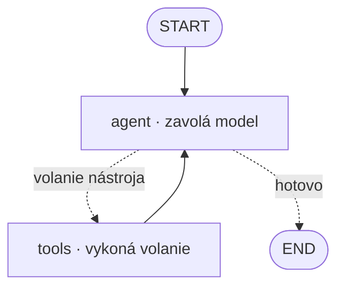

# Prejsť jeden graf, prežiť pád a definovať agenta dvojako

[Prvá časť](./index.md) obhájila framework: zmaže obslužný kód okolo holej slučky — kód slučky, volanie nástrojov, stav a pamäť, tok riadenia (control flow), multiagentové odovzdania riadenia aj sprievodnú produkčnú výbavu na trasovanie, streaming (priebežné odosielanie výstupu) a ukladanie checkpointov. Väčšina frameworkov sa pritom zhodne na tej istej jadrovej myšlienke: agent je graf či konečný automat, kde uzly sú kroky a hrany (aj tie spätné) sú tok riadenia. Rozdiel, ktorý vnáša AI, je práve ten graf — mení nepriehľadnú slučku `while` na stroj, ktorý vieš skúmať, pozastaviť a obnoviť. Jednotlivé frameworky si po vrstvách roztrieď, ak chceš, ale ber to vrstvenie ako momentku, ktorá už zastaráva — tou cenou je práve abstrakcia, tak najprv siahaj po primitívach. Táto stránka rozpracúva frameworkovú vrstvu naplno: prejde jeden konkrétny graf uzol po uzle, ukáže, čím naozaj sú odolné vykonávanie a checkpoint backendy pod ním, postaví pamäť samotného frameworku proti jeho multiagentovým konštrukciám, porovná dva spôsoby, ako definovať agenta (kód alebo konfigurácia), a zavŕši tým, ako sa trasovanie a hodnotenie zapájajú na úrovni frameworku.

Jedna hranica skôr, než sa vydáme na prechádzku (susedné lekcie pokrývajú, čo je vedľa). Všeobecná taxonómia pamäte, rozpočty krokov a tokenov a mašinéria riadenia slučky patria [plánovaniu a slučkám](../planning-loops/index.md) a [ich prehĺbeniu](../planning-loops/deep-dive.md); multiagentové topológie, ich protokoly a to, ako oznámkuješ tím, žijú v [multiagentových systémoch](../multi-agent/index.md) a [ich prehĺbení](../multi-agent/deep-dive.md); prenos pod tým (os agent↔nástroj je [MCP](../mcp/index.md), os agent↔agent je A2A) je samostatná lekcia; a prevádzka obsluhy modelov, pozorovateľnosti a hodnotenia je [tretia časť](../../part-3-production/overview/). Táto stránka vlastní frameworkovú vrstvu a zvyšok odkazuje, namiesto toho, aby ho odvodzovala nanovo. Prvú časť predpokladáme po celý čas.

## Prejdime jeden graf

Vezmi „agenta ako graf“ z prvej časti a sprav ho konkrétnym. [LangGraph](https://www.langchain.com/langgraph) modeluje agenta ako **StateGraph** (graf stavu): typovaný zdieľaný objekt stavu, z ktorého každý uzol číta a do ktorého zapisuje, plus uzly a hrany, ktoré cez neho posúvajú vykonávanie. Ten zdieľaný stav je celý trik, práve ním sa práca jedného kroku dostane k ďalšiemu bez toho, aby si ju prevliekal ručne.

Graf ohraničujú dve kotvy: **START**, vstup, a **END**, výstup. **Uzol** je len funkcia, ktorá vezme aktuálny stav a vráti jeho úpravu. Zavolaj model, zavolaj nástroj, rozhodni sa: každé z toho je uzol.

Hrany sú dvojaké. Obyčajná **hrana** (edge) je bezpodmienečný prechod, A vždy ide do B. **Podmienená hrana** (conditional edge) je funkcia, ktorá si pozrie stav a vráti, ktorý uzol pobeží ako ďalší, a práve tam sedí vetva slučky. Žiada model nástroj? Smeruj na uzol `tools`. Odpovedal? Smeruj na END.

Zapoj to do kánonického ReAct agenta (Reasoning + Acting) a tvar je malý. Máš uzol `agent`, ktorý volá model, a uzol `tools`, ktorý spustí to, čo si model vyžiadal. START vteká do `agent`. Podmienená hrana z `agent` pošle riadenie do `tools`, keď model vytvoril volanie nástroja, a do END, keď nie. Bezpodmienečná hrana vedie `tools` rovno späť do `agent`. Tá posledná hrana, spätná hrana, je agentická slučka z [agentického RAG](../agentic-rag/deep-dive.md), teraz nakreslená ako výslovná šípka namiesto skrývania sa vnútri `while`. Toto je základný tvar uzlov-nástrojov s podmienenými hranami, ktorý prvá časť pomenovala.

:::tip[▶ Video]

<YouTube id="qAF1NjEVHhY" title="LangChain vs LangGraph: A Tale of Two Frameworks — IBM Technology" />

[LangChain](https://www.langchain.com) verzus LangGraph v podaní IBM: prečo LangGraph jestvuje ako vrstva stavovej orchestrácie nad LangChainom — dobrá orientácia k prechádzke grafom vyššie. (Video je v angličtine.)

:::

Väčšinu času nič z toho ručne nezapájaš. LangGraph prináša predpripraveného ReAct agenta (`create_react_agent`), ktorý vráti presne tento graf poskladaný vopred; vlož model a zoznam nástrojov a bežíš. To je ten volač nástrojov „so všetkým v balení“ z prvej časti. Po ručne stavanom grafe siahneš len vtedy, keď potrebuješ tvar, ktorý ti predpripravený nedá — vlastné vetvenie, uzol navyše, prerušenie, kde zasiahne človek.

Keď je slučka raz grafom, všetko ostatné nižšie — checkpointy, odolnosť, human-in-the-loop (HITL — schválenie človekom), trasovanie — je niečo, čo k tomu grafu PRIPOJÍŠ, nie nová mašinéria, ktorú staviaš. Celé je to prepájanie, ktoré visí na uzloch a hranách, čo už máš.

## Prežiť pád: odolné vykonávanie

Perzistencia sa začína **checkpointerom**, komponentom, ktorý na každom **super-stepe** (super-step), teda pri každom prechode uzla, uloží snímku stavu grafu viazanú na thread (vlákno — rozhovor/beh). Toto ukladanie checkpointov (checkpointing) je krátkodobá pamäť LangGraphu viazaná na thread: stav jedného rozhovoru, ukladaný za pochodu. Obnoviť beh potom znamená len načítať posledný checkpoint a pokračovať od neho.

**Thread**, čiže jeho `thread_id`, oddeľuje jeden beh od druhého. Oddelené thready nesú oddelené histórie checkpointov, takže jedno sedenie nikdy nevidí stav druhého. To je „drží jednotlivé thready oddelene“ z prvej časti, teraz presne o tom, čo thread je.

Keďže je uložený každý krok, obnovenie nie je jediné, čo vieš. Vieš sa pretočiť späť k skoršiemu checkpointu, pozrieť si stav v tom kroku, upraviť ho a pokračovať novou vetvou — **cestovanie v čase** (time-travel) po behu. To je konkrétna podoba „checkpointov, ku ktorým sa vieš vrátiť“ z prvej časti.

Checkpointer je jedno rozhranie nad vymeniteľným úložiskom a tým úložiskom je **checkpoint backend** (backend pre checkpointy). K júlu 2026 sú konkrétne možnosti tieto:

- `InMemorySaver` — drží stav v RAM a pri reštarte ho stratí; LEN NA VÝVOJ.
- `SqliteSaver` (balík `langgraph-checkpoint-sqlite`, v3.1.0, máj 2026) — na lokálne jednouzlové použitie.
- `PostgresSaver` (balík `langgraph-checkpoint-postgres`, tiež v3.1.0) — na produkciu, stav je zdieľaný a odolný.
- `RedisSaver` (`langgraph-checkpoint-redis`) — ďalšia produkčná možnosť, keď už Redis prevádzkuješ.

Je to rozhodnutie medzi vývojom a produkciou, nič viac — in-memory na notebook, skutočná databáza na čokoľvek, čo musí prežiť reštart.

Práve vďaka tomu uloženému stavu je možné **odolné vykonávanie** (durable execution): beh sa obnoví od posledného úspešného kroku namiesto toho, aby po páde, reštarte, nasadení alebo dlhej pauze začínal od nuly. Opiera sa o checkpointer (bez checkpointera niet odolnosti) a LangGraph vystavuje nastavenie **`durability`** s tromi režimami (k júlu 2026):

- `"exit"` — zapisuje len vtedy, keď vykonávanie skončí: najrýchlejšie, ale bez zotavenia z pádu uprostred behu.
- `"async"` — zapisuje na pozadí, kým beží ďalší krok: dobrý kompromis medzi výkonom a odolnosťou, s malým rizikom, že sa posledný zápis stratí, ak proces spadne.
- `"sync"` — zapisuje synchrónne skôr, než sa spustí ďalší krok: najvyššia odolnosť, najväčšia réžia.

Režimy riadia iba to, KEDY checkpointer zapisuje; každý z nich stále predpokladá, že checkpointer existuje.

Prečo na tom pri agentoch záleží? Opäť pre ten rozdiel, ktorý vnáša AI. Behy agentov sú dlhé, nedeterministické a drahé — tridsaťkrokový výskumný agent, ktorý zomrie na kroku 28, nesmie znova zaplatiť za 27 volaní modelu, aby sa dostal späť. Vďaka odolnosti sa stáva reálnym aj human-in-the-loop: uzol-prerušenie uloží stav a beh jednoducho čaká (hodiny, dni), kým to niekto schváli, a potom pokračuje presne tam, kde sa zastavil. To je HITL uzol z prvej časti, teraz ukotvený v tej istej perzistencii. Všeobecná vrstva human-in-the-loop a rozpočtu je [plánovanie a slučky](../planning-loops/index.md); tu je to len uzol podopretý checkpointom.

A tá zdržanlivosť, ktorá sprevádza každú schopnosť na tejto stránke: bezstavový jednorazový agent nepotrebuje nič z toho. Žiadny checkpointer, žiadny backend, žiadny režim odolnosti. Odolnosť sa vyplatí na dlhých, obnoviteľných alebo človekom strážených behoch — nestavaj Postgres kvôli jednokrokovému klasifikátoru.

## Dva druhy pamäte — a prečo to nie je tím

Pamäť frameworku sa delí na jednej osi na dva rozsahy. Krátkodobá pamäť viazaná na thread je stav checkpointera — žije v rámci jedného threadu (rozhovoru, ktorý práve beží) a zaniká, keď thread skončí. Dlhodobá pamäť je samostatný **store** (dlhodobá pamäť frameworku), ktorý prežíva naprieč threadmi; jeho kľúčom sú menné priestory — povedzme jeden na používateľa — takže si agent zapamätá človeka aj medzi sedeniami, ktoré nezdieľajú žiadny thread. Tej dlhodobej strane hovorí LangGraph Store.

Framework ti tu dá obslužný kód — perzistenciu a API pre store, a tým končí. KTORÉ typy pamäte modelovať (epizodická, sémantická, procedurálna) je taxonómia z [prehĺbenia plánovania a slučiek](../planning-loops/deep-dive.md), a ČO si pamätať, kedy zhrnúť, kedy zahodiť, to patrí rozpočtovej vrstve, za hranicu právomocí frameworku. Tú hranicu sa oplatí držať ostrú: odkáž na ňu, neodvodzuj ju nanovo.

Frameworky sa líšia v tom, nakoľko ti ich API pamäte diktuje spôsob použitia. LangGraph ti podá nízkoúrovňové rozdelenie (checkpointer verzus Store) a nechá na tebe, ako každý použiješ. [CrewAI](https://www.crewai.com) k júlu 2026 prináša namiesto toho jediné zjednotené API `Memory`: samo kategorizuje, čo uložiť, a vybavovanie z pamäte skóruje podľa relevancie, čerstvosti a dôležitosti — vyššie položené API, ktoré za teba rozhoduje viac, no stojí na tom istom rozdelení na krátke a dlhé. Ktoré API vyhrá, je menej dôležité než fakt pod tým: pamäť je schopnosť, ktorú dodáva framework, s perzistentným backendom za ňou, nech ju framework tvaruje akokoľvek.

Multiagentové konštrukcie sedia na úplne INEJ osi a ľahko sa zlejú s pamäťou. Framework prináša aj predpripravené TÍMOVÉ konštrukcie — **supervízora** (supervisor), ktorý smeruje prácu vykonávateľom, rolových agentov v štýle „crew“ (model CrewAI) — topológie z [multiagentových systémov](../multi-agent/index.md), poskladané vopred, takže ich konfiguruješ namiesto toho, aby si ich kódil.

Drž teda tie dve od seba — to je nosné rozlíšenie celej sekcie. Pamäť je **perzistencia stavu** (state persistence): čo prežije cez kroky a cez sedenia. Multiagentové konštrukcie sú **rozdelenie práce** (work distribution): ako sú subagenti navzájom pozapájaní. Sú kolmé na seba — môžeš mať jediného agenta s bohatou dlhodobou pamäťou, bezstavový multiagentový tím, alebo oboje naraz. Siahnuť po supervízorovi, aby si „získal pamäť“, je skutočná chyba návrhu. Framework každú schopnosť zabalí; KONCEPTY žijú v plánovaní a slučkách (pamäť) a multiagentových systémoch (topológie) a táto lekcia iba ukazuje, ako ich framework sprístupňuje. Dôsledok: po store naprieč threadmi siahni len vtedy, keď ťa checkpoint viazaný na thread naozaj nepokryje. Prispôsob konštrukciu potrebe.

## Dva spôsoby, ako definovať toho istého agenta

Dva štýly definovania agenta a to rozdelenie prechádza každým frameworkom. **Imperatívne** (imperative) znamená, že agenta POSTAVÍŠ v kóde, krok po kroku: vytvoríš graf, `add_node`, `add_edge`, pridáš podmienenú hranu, skompiluješ. Tok riadenia píšeš sám. Graph API v LangGraphe je imperatívne presne takto. (LangGraph ponúka aj ľahšiu imperatívnu možnosť, **Functional API** — dekorátory `@entrypoint` a `@task`, ktoré ti dajú agenta ako funkciu so stavom vymedzeným na tú funkciu, na chvíle, keď chceš imperatívne riadenie bez kreslenia výslovného grafu.)

**Deklaratívne** (declarative) znamená, že agentov a ich pospájanie OPÍŠEŠ v konfigurácii a poskladanie behu necháš na framework. K júlu 2026 konfiguračné súbory CrewAI deklarujú rolu, cieľ a nástroje každého agenta bez jediného riadka toku riadenia — YAML v klasickom rozložení projektu, JSONC štandardne v novších. [Microsoft Agent Framework](https://learn.microsoft.com/en-us/agent-framework/) prináša deklaratívne pracovné postupy a jeho vlastná dokumentácia to vystihuje presne: *opisuješ, čo má tvoj pracovný postup robiť, nie ako to implementovať.*

Kompromis má dve strany. Imperatívne ti kúpi riadenie a vyjadrovaciu silu (ľubovoľné vetvenie, vlastné uzly, čokoľvek, čo vieš vyjadriť kódom) a pýta si viac kódu a náročnejšie čítanie. Deklaratívne kúpi rýchlosť, jednotnosť a prístupnosť: neinžinier vie prečítať a upraviť konfiguráciou definovanú „crew“, tvary ostávajú konzistentné, konfigurácia sa čisto porovnáva vo verziovaní a vedia ju generovať nástroje. Háčik je hranica: vo chvíli, keď potrebuješ tok riadenia, ktorý slovník konfigurácie nevyjadrí, musíš siahnuť po kóde. Vlastné odporúčanie Microsoftu sa delí rovnako: deklaratívne pre štandardné vzory, často sa meniace pracovné postupy a neprogramátorov, ktorí to upravujú; programové pre zložitú vlastnú logiku a maximálnu pružnosť.

Nič z toho nie je nové. Je to tá istá deliaca čiara deklaratívne verzus imperatívne, ktorú softvér narysoval už všade inde — SQL oproti procedurálnemu kódu, infraštruktúra ako konfigurácia oproti skriptom. Deklaratívne pre bežné tvary; imperatívne, keď narazíš na stenu. A väčšina reálnych frameworkov ti dá oboje a nechá ťa ich miešať — deklaratívnu „crew“ s imperatívnym únikovým východom pre ten jeden tok riadenia, ktorý konfigurácia nevie povedať. A tým sa kruh uzatvára: ručne stavaný graf z prvej sekcie je imperatívna podoba a konfiguráciou deklarovaná „crew“ je deklaratívna podoba TEJ ISTEJ multiagentovej topológie z [multiagentových systémov](../multi-agent/index.md). Jeden koncept, dva spôsoby, ako ho zapísať.

## Jeden artefakt, každá produkčná starosť

Keďže agent je graf POMENOVANÝCH uzlov, framework vie trace (záznam trasovania) vytvoriť sám. Každé vykonanie uzla, volanie modelu i volanie nástroja sa stane **spanom** — úsekom trasovania — v strome rodič–dieťa, s malou inštrumentáciou od teba alebo úplne bez nej. To je ten obslužný kód „napojení na trasovanie“ z prvej časti, splatený samotnou štruktúrou grafu.

[LangSmith](https://www.langchain.com/langsmith) je natívny príklad pre LangChain a LangGraph: keď raz trasovanie zapneš — premenná prostredia a API kľúč — volania modulov LangChainu vnútri grafu sa trasujú automaticky. K tomu pridáva hodnotiaci aparát napojený na ten istý graf: datasety, ktoré rámcuje ako „unit testy pre tvoju LLM appku“, evaluátory typu LLM-as-a-judge (LLM ako sudca) — heuristické, pairwise (párové) alebo ľudské — a porovnanie behov naprieč verziami. LangSmith je jeden taký nástroj spomedzi viacerých.

Od dodávateľa nezávislý štandard sú sémantické konvencie [OpenTelemetry](https://opentelemetry.io) pre GenAI, ktoré definujú štandardné druhy spanov pre záťaže LLM a agentov — `invoke_agent`, `execute_tool` a spany inferencie modelu a pamäte — takže framework vie vytvoriť tracy, ktoré prečíta ľubovoľný OTel backend, a nie si priviazaný na tracer (nástroj na trasovanie) jedného dodávateľa (LangSmith sám hovorí OTLP oboma smermi). Jedna výhrada k dátumu: k júlu 2026 sú konvencie pre GenAI stále v stave „Development“ — nastupujúci štandard, ktorý sa ešte ustaľuje. Sú to tie isté konvencie, o ktoré sa opiera [prehĺbenie multiagentových systémov](../multi-agent/deep-dive.md), keď pozošíva trajektóriu celého tímu do jedného stromu.

Ten zachytený trace je VSTUP hodnotenia. Hodnotíš nad ním dve veci: **výsledok** — konečnú odpoveď, podľa akejkoľvek metriky, ktorú úloha používa — a **proces** — vydal sa graf rozumnou cestou, zasiahol správne uzly, vyhol sa slučke, ktorá sa nikdy nezastaví? Je to rozdelenie výsledok verzus proces z [prehĺbenia agentického RAG](../agentic-rag/deep-dive.md), teraz živené vlastným trace frameworku. Framework ZACHYTÁVA; hodnotiaca disciplína — metriky, sudcovia, etalónové sady — je [tretia časť](../../part-3-production/overview/).

Všetko sa to zbieha do jedného objektu. Graf, ktorý si definoval v prvej sekcii, je ten istý, ktorý checkpointuješ, cez ktorý si pamätáš, ktorý definuješ deklaratívne či imperatívne a ktorý teraz aj trasuješ a známkuješ. Jeden artefakt, na ktorom visí každá produkčná starosť. To je najhlbšia podoba toho rozdielu, ktorý vnáša AI, z prvej časti: graf nie je len niečo, čo vieš skúmať — je to jediné miesto, na ktoré sa perzistencia, pamäť aj pozorovateľnosť napájajú.

Záverečná zdržanlivosť zrkadlí „najprv primitíva“ z prvej časti. Toto všetko sú schopnosti, ktoré si zapneš, len keď ich chceš. Jednoduchý agent nepotrebuje nič z toho — žiadny checkpointer, žiadny store, žiadnu deklaratívnu konfiguráciu, žiadny backend na trace. Po každom kúsku siahni len vtedy, keď je beh dosť dlhý, aby potreboval odolnosť, dosť stavový, aby potreboval pamäť, alebo dosť zložitý, aby potreboval trasovanie. Pridať ktorúkoľvek z nich je vďaka frameworku lacné, ale zadarmo nie je ani jedna. A pridať niektorú, ktorú nepotrebuješ, je tá istá cena abstrakcie, pred ktorou varovala prvá časť — zaplatená dvakrát.

## Čo si odniesť z lekcie

- LangGraph modeluje agenta ako StateGraph — zdieľaný objekt stavu, uzly, ktoré volajú model / volajú nástroj / rozhodujú, obyčajné hrany a podmienené hrany, ktoré smerujú podľa stavu. ReAct agent je uzol `agent` plus uzol `tools`, s podmienenou hranou z `agent` a spätnou hranou z `tools` do `agent`; `create_react_agent` ti ten graf podá poskladaný vopred.
- Checkpointer ukladá stav na každom kroku s väzbou na `thread_id`, takže sa beh obnoví od posledného úspešného kroku namiesto reštartu — a tá istá perzistencia dovolí prerušeniu human-in-the-loop čakať hodiny a potom pokračovať. Režimy `durability` (`exit`, `async`, `sync`) menia rýchlosť za bezpečnosť; backendy sa voľne vymieňajú (in-memory na vývoj, Postgres alebo Redis na produkciu); bezstavový jednorazový agent nepotrebuje nič z toho.
- Pamäť frameworku má dva rozsahy a ani jeden nie je tím: krátkodobý stav viazaný na thread (checkpointer) verzus dlhodobá pamäť naprieč threadmi (store, ktorého kľúčom je menný priestor). Supervízor a konštrukcie „crew“ sú iná os — rozdelenie práce, nie perzistencia stavu — a zamieňať ich je chyba návrhu.
- Imperatívne definovanie stavia graf v kóde pre riadenie a vyjadrovaciu silu; deklaratívne definovanie opisuje agentov v konfigurácii — súbory CrewAI, deklaratívne pracovné postupy Microsoft Agent Frameworku — pre rýchlosť, jednotnosť a úpravy neinžiniermi, až do chvíle, keď narazíš na tok riadenia, ktorý konfigurácia nevyjadrí. Väčšina frameworkov ponúka oboje a nechá ťa ich miešať.
- Graf pomenovaných uzlov vytvorí strom spanov (úsekov trasovania) sám — natívne cez LangSmith, alebo od dodávateľa nezávisle cez konvencie OpenTelemetry pre GenAI, hoci tie sú k júlu 2026 stále nastupujúci štandard. Framework trace zachytí; hodnotiacu disciplínu, ktorú nad ním spustíš, vlastní tretia časť.
- Graf je jediné miesto, na ktoré sa napája každá produkčná starosť — checkpointuješ ho, pamätáš si cez neho, definuješ ho dvoma spôsobmi a trasuješ ho. Jednoduchý agent každú vrstvu preskočí a pridať jednu, ktorú nepotrebuje, je cena abstrakcie zaplatená dvakrát.

**Nové pojmy** → [Glosár](../../glossary.md): state graph, checkpointer, checkpoint backend, thread (thread_id), durable execution, conditional edge, framework long-term memory (store), declarative vs imperative agent definition.
