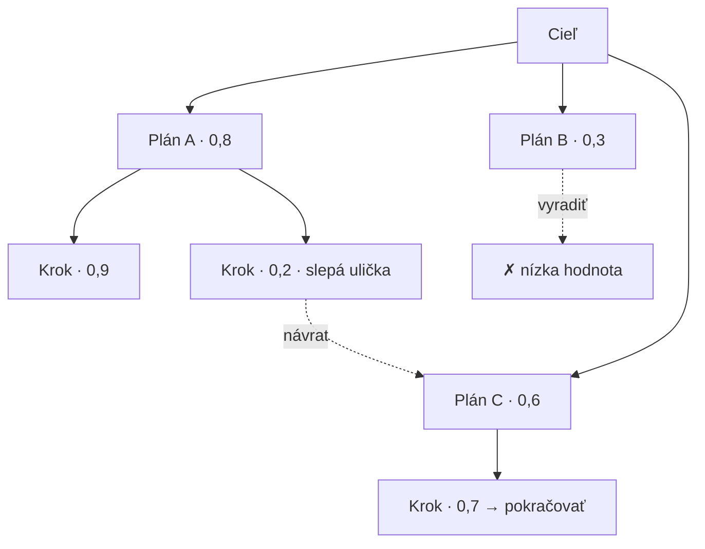
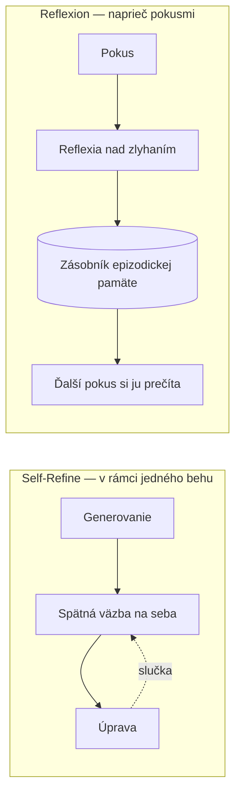
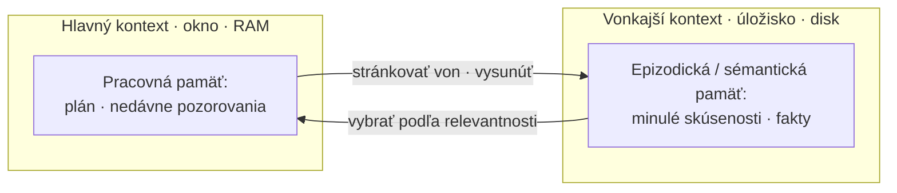

# Prehľadávanie plánov, tvar reflexie a ako prežiť dlhé behy

[Prvá časť](./index.md) dala agentovi jeden plán a spôsob, ako ho revidovať: rozlož cieľ, kroky zoraď cez ReAct alebo plan-and-execute, sleduj tri podoby nezastavenia cyklu a bráň sa proti nim vo vrstvách. Táto stránka dovedie tú riadiacu vrstvu do hĺbky: na plánovanie sa pozrie ako na prehľadávanie mnohých kandidátnych plánov, z reflexie ako pojmu spraví pomenované publikované frameworky, z rozpočtu ako jediného čísla spraví politiku, za pracovnú pamäť postaví skutočnú pamäťovú architektúru a namiesto konečnej odpovede oznámkuje celú trajektóriu.

Najprv jedna hranica, lebo o toto územie sa delí susedná lekcia. Vyhľadávací variant tých istých myšlienok — ohraničenie slučky vyhľadávania, destilovanie nálezov medzi krokmi, hodnotenie trajektórie vyhľadávania — žije v [prehĺbení Agentic RAG](../agentic-rag/deep-dive.md). Táto stránka vlastní všeobecný tvar: riadenie slučky a plánovanie pre ľubovoľného agenta, či už vyhľadáva, alebo nie. Kde sa tie dve témy prepoja, odkáže tam a neodvodzuje nanovo. Prvú časť predpokladáme — dekompozíciu, kompromis medzi ReActom a plan-and-execute, tri podoby nezastavenia cyklu, vrstvenú obranu aj reflexiu ako pojem už nevysvetľujeme, iba na ne nadväzujeme.

## Plánovanie ako prehľadávanie, nie jediná čiara

V prvej časti agent naplánoval jednu postupnosť a preplánoval ju, keď sa rozbila. Pre väčšinu agentov to úplne stačí. Pri úlohách, ktoré si to môžu dovoliť, však existuje silnejšia možnosť: prestaň sa vôbec upínať na jeden plán a k plánovaniu pristúp ako k **prehľadávaniu priestoru kandidátnych plánov (plan search)**.

Ten posun je konkrétny. Namiesto toho, aby agent napísal plán a revidoval ho, vygeneruje niekoľko kandidátnych ďalších krokov — nazvime ich myšlienky alebo čiastočné plány — každý ohodnotí hodnotovou funkciou alebo heuristikou (spravidla model posudzuje vlastné priebežné stavy) a výsledný priestor prehľadáva: rozvíja vetvy, ktoré vyzerajú sľubne, díva sa dopredu a vracia sa zo slepých uličiek. Uvažovanie prestáva byť čiarou a stáva sa stromom, ktorý agent prechádza.

**Tree of Thoughts (ToT)** (Shunyu Yao a kol., arXiv:2305.10601, 17. máj 2023) je kanonická podoba, prehľadávanie stromu myšlienok. Zámerné riešenie problému rámcuje ako prehľadávanie stromu medzikrokov uvažovania: model navrhuje kandidátne myšlienky, sám ohodnotí každý stav a prechádza strom do šírky alebo do hĺbky, s výhľadom dopredu a s návratmi — tam, kde sa obyčajný **chain-of-thought (reťazec úvah)** upne na jednu lineárnu cestu a stojí či padá s ňou.

Rozdiel, ktorý štúdia hlási, nie je jemný. Na hre Game of 24 dosiahol ToT úspešnosť 74 %, kým štandardné promptovanie cez chain-of-thought iba 4 %. Keď úloha naozaj žiada uvažovanie, prehľadať niekoľko ciest a orezať zlé je úplne iná úroveň schopností než napísať jednu a dúfať.

**Graph of Thoughts (GoT)** (Maciej Besta a kol., arXiv:2308.09687, 18. aug 2023) zovšeobecňuje strom na ľubovoľný graf. Myšlienky sa stávajú vrcholmi a hrany vyjadrujú závislosti, takže vetvy možno nielen štiepiť, ale aj agregovať a spájať. Motivácia: niektoré problémy chcú kombinovať čiastočné riešenia (zliať dve polovičné odpovede do lepšej), čo prísny strom, kde má každý uzol jediného rodiča, vyjadriť nevie.

**LATS (Language Agent Tree Search)** (Andy Zhou a kol., arXiv:2310.04406, 6. okt 2023) vynáša myšlienku z čistého uvažovania do slučky konania. Nad akciami agenta púšťa **Monte Carlo Tree Search (MCTS)** (prehľadávanie stromu metódou Monte Carlo), s jazykovým modelom v úlohe hodnotovej funkcie, so sebareflexiou a so skutočnou spätnou väzbou z prostredia cez výsledky nástrojov — a zjednocuje tak uvažovanie, konanie i plánovanie pod jedno prehľadávanie.

Toto je most od prehľadávania myšlienok k prehľadávaniu trajektórií: agent skúsi vetvu akcie, pozoruje, čo prostredie vráti, a môže sa vrátiť a skúsiť inú. Strom už nie je hypotetický — jeho hrany sú veci, ktoré agent naozaj spravil.

Cenu povedzme priamo, lebo rozhoduje o tom, kam čokoľvek z tohto patrí. Prehľadávanie násobí volania modelu: skóruješ mnoho stavov a rozvíjaš mnoho vetiev, takže beh ToT alebo LATS môže stáť niekoľko- až mnohonásobok jediného prechodu. A celé sa opiera o **dôveryhodného hodnotiteľa stavu**. Ak model nedokáže spoľahlivo odlíšiť sľubný čiastočný plán od plánu odsúdeného na neúspech, prehľadávanie jeho úsudok nenapraví — zosilní ten omyl a míňa ďalšie volania na to, aby s istotou naháňalo horšie vetvy.

Preto väčšina produkčných agentov plány neprehľadáva. Bežia jeden plán a po zlyhaní preplánujú, presne ako v prvej časti, lebo je to oveľa lacnejšie a zvyčajne to stačí. Prehľadávanie plánov si nechaj na úlohy s vysokou hodnotou, overiteľnými medzikrokmi a spoľahlivým hodnotiteľom (matematika, kód, hlavolamy, obmedzená optimalizácia), kde je zlá vetva lacno odhaliteľná a návrat sa oplatí. Pri otvorenej práci bez čistého signálu úspechu na každom kroku je hodnotiteľ slabým článkom a volania navyše sa málokedy vrátia. Disciplína je tá istá ako v prvej časti: vezmi najjednoduchšiu úroveň, ktorá úlohu vyrieši.

## Reflexia, ktorá dostala tvar

**Reflexiu (reflection)** zaviedla prvá časť ako pojem — agent posudzuje vlastnú trajektóriu. Výskum dal tomu pojmu pomenované podoby a existuje jeden princíp, ktorý rozhoduje, či niektorá z nich vôbec pomôže.

**Self-Refine** (Aman Madaan a kol., arXiv:2303.17651, 30. mar 2023) je kompaktná verzia. Jediný model, bez tréningu: vygeneruje výstup, sám si k nemu dá spätnú väzbu a upraví ho — v slučke, kým výsledok nie je dosť dobrý. Naprieč siedmimi úlohami cez GPT-3.5, ChatGPT a GPT-4 štúdia hlási zhruba 20 % absolútne priemerné zlepšenie. Jeho záber je jedna úloha, jeden beh: slučka žije vnútri jediného behu a vylepšuje odpoveď práve tohto behu.

**Reflexion** (Noah Shinn a kol., arXiv:2303.11366, 20. mar 2023) pracuje na inej časovej škále a tu na mene záleží. Reflexion je framework — s veľkým R, vlastné meno — a netreba si ho pliesť s reflexiou ako pojmom, ktorý napĺňa. Štúdia svoju metódu nazýva **verbálne posilňované učenie (verbal reinforcement learning)**: po neúspešnom pokuse agent napíše reflexiu v prirodzenom jazyku o tom, čo sa pokazilo, a uloží ju do **zásobníka epizodickej pamäte (episodic memory buffer)**; pri ďalšom pokuse si tie reflexie prečíta a vedie si lepšie. Agent sa učí naprieč pokusmi bez jedinej úpravy váh — poučenie ostáva v texte, nie vo váhach ani gradientoch. Práve tu reflexia po prvýkrát siahne po pamäti, a to pripravuje pamäťovú architektúru z ďalšej sekcie.

Rozdiel, ktorý si treba podržať, je teda časová škála. Self-Refine vylepší aktuálnu odpoveď vnútri jedného behu; Reflexion vynesie poučenie z jedného behu do ďalšieho. Oboje je agent, ktorý kritizuje sám seba — líšia sa v tom, či kritika ostane lokálna, alebo pretrvá.

Pod oboma leží princíp, ktorý riadi každú reflexiu: je len taká dobrá ako signál, nad ktorým sa zamýšľa. Čistá sebakritika — ten istý model, čo urobil chybu, ju aj známkuje — naráža na hranicu, lebo model, ktorý je pri generovaní sebavedomo vedľa, býva sebavedomo vedľa aj pri kritike. Reflexia opretá o vonkajší signál je oveľa silnejšia: padnutý jednotkový test, chyba nástroja, zamietnutie od validátora, spätná väzba oproti etalónu. Zamýšľaj sa nad dôkazmi, nie nad vlastnou mienkou modelu o sebe.

Ten princíp má aj svoju odvrátenú stranu a je to dôvod, prečo sa nereflektuje všade. Reflexia stojí volania navyše a latenciu a pri ľahkých vstupoch dokáže aj uškodiť — model, ktorého požiadaš, aby prehodnotil správnu odpoveď, ju občas rozmýšľaním pokazí. Reflexiu preto podmieň skutočným signálom zlyhania, padnutou kontrolou alebo zaseknutou slučkou, namiesto toho, aby si ju spúšťal na každom kroku. To isté pravidlo najjednoduchšej úrovne, uplatnené na sebakritiku.

## Rozpočet ako politika, nie iba číslo

V prvej časti bol rozpočet nespochybniteľnou poistkou: tvrdý strop, ktorý zaručí, že sa slučka zastaví. Spresnenie znie, že rozpočet je politika a že to, čo pri strope urobíš, váži rovnako ako samotný strop.

Začni tým, že rozpočty sú viacrozmerné. Beh môžeš zastropovať na krokoch alebo iteráciách, na tokenoch, na reálnom čase, na peniazoch aj na počte volaní nástrojov — a jeden z nich môže prekročiť, kým pod ostatnými pohodlne sedí. Lacná, ale nekonečná slučka narazí na strop krokov; beh s drahým uvažovaním narazí najprv na strop tokenov alebo nákladov. Produkcia stropuje viacero rozmerov naraz, lebo ktorýkoľvek jediný necháva dieru.

Rozpočty sa aj vnárajú. Rozpočet celej úlohy stojí nad čiastkovými rozpočtami jednotlivých podúloh, takže jedna utrhnutá podúloha nespáli celý prídel skôr, než sa dostanú na rad ostatné. Pri plan-and-execute (plánovanie a vykonanie) alebo v multiagentovom usporiadaní prideľuje rozpočet krokom plánovač alebo **supervízor (supervisor)** a dokáže si vziať späť to, čo krok neminul — tá istá rola supervízora, akú opisuje lekcia o multiagentových systémoch, tu drží mešec.

Zo stropu spraví politiku dvojúrovňové rozdelenie:

- **Mäkký strop (soft cap)**, dosiahnutý skôr, spustí nápravnú akciu, nezastaví beh — zhrň a zhutni históriu, vynúť reflexiu, preplánuj alebo sa spýtaj človeka. Dá behu šancu dobre skončiť. Práve tu sa reflexia z predošlej sekcie a zhutňovanie pamäte z tej nasledujúcej vyvolajú zámerne, nie náhodne.
- **Tvrdý strop (hard cap)** zastaví beh bezpodmienečne. Je to záruka, nezmenená z prvej časti.

A to, čo pri strope urobíš, je návrhové rozhodnutie, nie dodatočná myšlienka. Najhorší výsledok je tiché ukončenie uprostred behu: náklad úplne minutý, nevrátené nič. Vyhni sa mu. Vráť najlepší doterajší čiastočný výsledok s čestným príznakom, že sa dosiahol strop; eskaluj na človeka, kde **human-in-the-loop (schválenie človekom)** z prvej časti zastupuje rozpočet poslednej záchrany; alebo vráť typované „rozpočet prekročený“ a rozhodnutie nechaj na volajúceho. Zhoršuj sa dôstojne — tiché ukončenie, ktoré nevráti nič, je jediný výsledok, ktorý treba z návrhu vylúčiť.

Napokon míňaj rozpočet tam, kde sa vypláca. Drahé techniky vyššie — prehľadávanie plánov a reflexia z predošlých sekcií — násobia volania, takže uplatniť ich plošne je plytvanie. Lacné a ľahké úlohy pošli na jediný prechod a prehľadávanie i reflexiu si nechaj na tie ťažké. Toto je všeobecný tvar smerovania podľa zložitosti dopytu, ktoré [prehĺbenie Agentic RAG](../agentic-rag/deep-dive.md) volá adaptívny RAG (adaptive RAG); tam smeruje vyhľadávanie, tu riadi celú slučku agenta.

Ešte jedna páka si zaslúži vlastné meno: **thinking budget (rozpočet uvažovania)** — koľko rozšíreného uvažovania (extended thinking, reasoning effort) úloha dostane — je oddelený od rozpočtu krokov a tokenov a ladí sa podľa náročnosti úlohy, nie podľa dĺžky slučky.

## Pamäť pre dlhé trajektórie

Scratchpad z prvej časti bol jednou z ochrán proti napúchaniu kontextu. Za tým pracovným priestorom stojí celá pamäťová architektúra s typmi, ktoré sa líšia podľa toho, ako dlho žijú a kde fyzicky sedia.

**Pracovná pamäť (working memory)** je ten scratchpad z prvej časti: poznámky v kontexte pre aktuálnu úlohu — plán, uzavreté podúlohy, posledných pár pozorovaní. Je pominuteľná. Žije v okne a zomiera s behom.

**Epizodická pamäť (episodic memory)** je úložisko minulých skúseností (čo sa stalo, kedy a ako to dopadlo), ktoré prežije aktuálny kontext a vyberie sa vtedy, keď je pre novú situáciu relevantné. Zásobník reflexií z Reflexionu zo sekcie o reflexii je epizodická pamäť v akcii. Od pracovnej pamäte ju delia dve veci: životnosť, lebo pretrváva naprieč behmi a sedeniami, a umiestnenie, lebo žije vo vonkajšom úložisku, nie v živom okne.

Taxonómiu dopĺňajú ešte dva typy. **Sémantická pamäť (semantic memory)** sú trvácne fakty, ktoré agent pozná alebo sa naučil, často držané v znalostnej báze alebo vektorovom úložisku. **Procedurálna pamäť (procedural memory)** je naučené „ako na to“ — zručnosti, ktoré agent pochytil. Celé rozdelenie — pracovná a krátkodobá pamäť na jednej strane, dlhodobá (epizodická, sémantická, procedurálna) na druhej — rozkladá video nižšie.

:::tip[▶ Video]

<YouTube id="BacJ6sEhqMo" title="The Four Types of Memory Every AI Agent Needs — IBM Technology" />

Pozri si ho kvôli taxonómii, ktorú táto sekcia formalizuje: pracovná a krátkodobá pamäť, dlhodobá, epizodická aj sémantická a procedurálna — pomenované a rozlíšené za štyri minúty. (Video je v angličtine.)

:::

Vyberať z epizodickej pamäte je samo osebe úloha RAG. Nemôžeš do okna naliať každú minulú epizódu, tak vyberáš tie relevantné — a to, ako ich zoradíš, je návrhová otázka so známou odpoveďou. **Generative Agents** (Joon Sung Park a kol., arXiv:2304.03442, 7. apr 2023) skóruje spomienky podľa aktuálnosti, dôležitosti a relevantnosti a periodicky zlieva zhluky nízkoúrovňových spomienok do vyšších reflexií, ktoré zapisuje späť do toho istého prúdu. Reflexia a pamäť sa napokon ukazujú ako jeden systém: agent reflektuje, aby si stlačil vlastnú históriu, a reflexiu uloží ako ďalšiu spomienku.

Ostáva hranica, na ktorú každý dlhý beh raz narazí — samotné kontextové okno. **MemGPT** (Charles Packer a kol., arXiv:2310.08560, 12. okt 2023) naň odpovedá tým, že si požičia pamäťovú hierarchiu operačného systému. Kontextové okno ber ako „hlavný kontext“ (rýchly, malý, ako RAM) a vonkajšie úložisko ako „vonkajší kontext“ (veľký, pomalý, ako disk) a nechaj model stránkovať informácie dnu a von cez volania nástrojov. Agent potom pracuje nad dátami oveľa väčšími než jeho okno. Toto je **virtuálna správa kontextu (virtual context management)** a je to mechanizmus, vďaka ktorému pracovná pamäť fakticky prekročí limit kontextu namiesto toho, aby v ňom ostala uväznená.

Praktická mechanika dlhej trajektórie je trojaká a oplatí sa ju pomenovať čo len stručne. Zhŕňaj a zhutňuj staršiu históriu, namiesto toho, aby si ju vliekol surovú — všeobecný tvar techniky vydestilovaného nálezu, ktorú [prehĺbenie Agentic RAG](../agentic-rag/deep-dive.md) uplatňuje na vyhľadávanie. Vyberaj relevantné epizodické spomienky, namiesto toho, aby si do okna napchal celú históriu. A drž štruktúrovaný stav úlohy — opäť ten výslovný plán, ktorý sa vypláca. Spolu držia od tela problém **lost-in-the-middle (strata uprostred)** z prvej časti, kde prvé kroky dlhej trajektórie vypadnú modelu z pozornosti presne vtedy, keď ich potrebuje.

Nič z toho nie je zadarmo a väčšina úloh to nepotrebuje. Epizodická pamäť pridáva celý vyhľadávací podsystém s vlastnými spôsobmi zlyhania — zastaraná alebo zle vybraná spomienka otrávi kontext a môže byť horšia než žiadna pamäť. Jednorazové úlohy si vystačia s pracovnou pamäťou. Dlhodobú pamäť pridaj vtedy, keď sa agent naozaj musí učiť naprieč sedeniami — osobný asistent, dlho bežiaci projekt — a ani o chvíľu skôr.

## Hodnotenie celej cesty

Prvá časť povedala, že evaluácia teraz meria trajektóriu. V konkrétnostiach je to hŕstka metrík — a nástraha spoľahlivosti, ktorá chytá tímy, čo zastanú pri jedinom úspešnom behu.

Prvé rozdelenie je **výsledok verzus proces (outcome versus process)** — všeobecný tvar rozdelenia, ktoré [prehĺbenie Agentic RAG](../agentic-rag/deep-dive.md) vytýčilo pre vyhľadávanie. Výsledok je, či agent došiel k cieľu: miera splnenia úlohy. Proces je, či cesta dávala zmysel — správne kroky, správne nástroje, správne poradie, rozumné miesto na zastavenie. Správna odpoveď dosiahnutá zlou cestou je šťastie a šťastie neprežije ďalší vstup. Známkovanie iba výsledku to skryje; známkovanie procesu spraví padnutý beh odladiteľným, lebo lokalizuje chybu na krok.

Konkrétne metriky trajektórie, po jednej. **Úspešnosť pri úlohe (task success rate)** — dosiahol agent cieľ používateľa. **Efektívnosť po krokoch (step efficiency)** — koľko krokov spravil oproti tomu, koľko ich bolo treba; agent, ktorý za štyridsať krokov vyrieši to, čo by zvládlo šesť, nie je dobrý agent, priamo z prvej časti. **Správnosť volaní nástrojov (tool-call accuracy)** — správny nástroj, správne argumenty, správne poradie. **Zastavenie (termination)** — či sa vôbec zastavil. A **náklady alebo tokeny na úlohu (cost or tokens per task)**. Procesné metriky sú tie, čo pripichnú chybu ku konkrétnemu kroku; samotný výsledok to nedokáže.

Potom tá nástraha. Agenti sú nedeterministickí, takže jediný úspešný beh — **pass@1** — nadhodnocuje, aký spoľahlivý agent naozaj je. **pass^k** meria podiel úloh vyriešených vo všetkých k nezávislých pokusoch: konzistentnosť, nie najlepší prípad. Čísla z **τ-bench** (Shunyu Yao a kol., arXiv:2406.12045, 17. jún 2024), benchmarku pre nástroje, agenta a používateľa, ten rozdiel spravia názorným: špičkové modely skórujú pod 50 % úspešnosti a **pass^8** padá pod 25 % v doméne maloobchodu. Agent, ktorý raz vyzerá slušne, býva beh za behom nespoľahlivý — a produkcii záleží práve na behu za behom, lebo tvoji používatelia dostanú každý jeden beh. Meraj konzistentnosť, nie šťastný jediný prechod.

Cestu naozaj oznámkuješ cez **LLM-as-a-judge (LLM ako sudca)** nad trajektóriou: schopný model prečíta zaznamenaný trace oproti hodnotiacim kritériám (rubric). To robí jednu podmienku nespochybniteľnou — trajektóriu, ktorú nevidíš, neoznámkuješ. Hodnotenie trajektórie si žiada úplný záznam behu, takže **Observability (pozorovateľnosť)** nie je doplnok, čo prilepíš neskôr; práve ona hodnotenie vôbec umožňuje a zaostruje bod, ktorý prvá časť spravila prvýkrát. Nástroje existujú: [Ragas](https://www.ragas.io) dokumentuje agentne zamerané metriky — presnosť dosiahnutia cieľa (agent goal accuracy), dodržanie témy (topic adherence) a správnosť volaní nástrojov — počítané nad behom. Siahaj po ňom s mierou; všeobecná disciplína evaluácie aj observability sú lekcie samy osebe.

A ešte raz zdržanlivosť. Jednoduchý, krátky agent nepotrebuje plné známkovanie trajektórie — hodnotenie výsledku plus počet krokov býva bohato. Aparát na hodnotenie trajektórie je náklad, ktorý na seba berieš vtedy, keď existuje skutočná viackroková cesta, ktorej správnosť môže zlyhať nezávisle od konečnej odpovede. Keď existuje, [záverečná stránka časti](../real-agents.md) ukazuje celú slučku — plánovanie, rozpočty, pamäť a evaluáciu — v behu naprieč Claude, OpenAI a Gemini.

## Čo si odniesť z lekcie

- Plánovanie sa môže stať prehľadávaním mnohých kandidátnych plánov — Tree of Thoughts prechádza strom krokov uvažovania, Graph of Thoughts graf, ktorý vetvy spája, LATS prehľadávanie akcií so spätnou väzbou z prostredia. Na úlohách s overiteľnými krokmi je to úplne iná úroveň schopností (ToT dosiahol na hre Game of 24 74 % oproti 4 % pri chain-of-thought), ale násobí volania a stojí či padá s dôveryhodným hodnotiteľom. Väčšina agentov len preplánuje — a má na to dobrý dôvod.
- Reflexia má pomenované podoby na dvoch časových škálach: Self-Refine dolaďuje v rámci jedného behu, Reflexion prenáša poučenie naprieč behmi cez epizodický zásobník. Nech je podoba akákoľvek, reflexia je len taká dobrá ako signál pod ňou — uprednostni vonkajší a podmieň ju skutočným zlyhaním, inak správnu odpoveď prehovorí na nesprávnu.
- K rozpočtu pristupuj ako k politike. Stropuj viacero rozmerov naraz, vnor čiastkové rozpočty podúloh pod rozpočet celej úlohy, oddeľ mäkké stropy (spustia nápravu) od tvrdých (zastavia) a pri strope sa zhoršuj dôstojne, namiesto toho, aby si beh potichu zabil. Drahé techniky míňaj len tam, kde sa vyplácajú.
- Pamäť je architektúra, nie scratchpad — pracovná pamäť v okne oproti epizodickej vo vonkajšom úložisku, plus sémantická a procedurálna. MemGPT stránkuje medzi oknom a úložiskom, takže pracovná pamäť prerastie limit kontextu; vyberaj relevantné spomienky namiesto napchávania celej histórie; a dlhodobú pamäť pridaj len vtedy, keď sa agent musí učiť naprieč sedeniami.
- Známkuj celú cestu: výsledok verzus proces, efektívnosť po krokoch, správnosť volaní nástrojov, zastavenie. Spoľahlivosť meraj cez pass^k, nie cez jediný šťastný pass@1 — špičkové modely τ-benchu padnú raz pod 50 % a pass^8 pod 25 % v maloobchode. Všetko to potrebuje úplný záznam, takže Observability je predpoklad.

**Nové pojmy** → [Glosár](../../glossary.md): Tree of Thoughts (ToT), Graph of Thoughts (GoT), LATS, Self-Refine, Reflexion, plan search, episodic memory, semantic memory, virtual context management (MemGPT), trajectory evaluation, pass^k.
