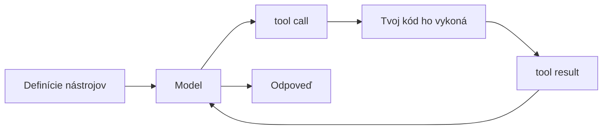

# Claude, OpenAI a Gemini nosia tie isté techniky pod inými menami

Celá druhá časť príručky stavala agenta schopnosť po schopnosti: slučku, ktorá sa rozhoduje sama ([agentický RAG](./agentic-rag/index.md)), nástroje, ktorými koná ([používanie nástrojov](./tool-use/index.md)), spôsob, ako plánovať a naozaj sa zastaviť ([plánovanie a slučky](./planning-loops/index.md)), spoluhráčov na rozdelenie práce ([multiagentové systémy](./multi-agent/index.md)), frameworky, ktoré to celé zabalia ([orchestračné frameworky](./orchestration-frameworks/index.md)), a protokol, ktorý agenta prepojí so svetom ([MCP](./mcp/index.md)). Táto lekcia neučí nič nové. Prenáša celú túto výbavu na troch agentov, s ktorými sa inžinier stretne najskôr — Claude, OpenAI, Gemini — a ukazuje, že každá technika je tá istá trvácna vec pod iným menom a v inom tvare prenosu (v inej podobe, v akej volanie cestuje cez API).

Každú sekciu čítaj rovnako. Najprv trvácny vzor — tú časť, ktorá prežije premeny API. Potom to, ako to dnes robí každý dodávateľ, zámerne s uvedeným dátumom, lebo konkrétnosti rýchlo zastarajú a táto stránka priznáva, že zostarne. Ďalej to, čo sa líši a prečo, lebo tam sídli samotné inžinierstvo. A napokon to, kde sa vec láme, previazané späť s lekciou, ktorá o tej chybe učila. Nauč sa vzor a dokumentácia ktoréhokoľvek dodávateľa sa zmení z opätovného štúdia na obyčajné vyhľadanie údaja. Všetko, čo sa tu píše o konkrétnej fičúre, platí k polovici roka 2026 a zajtra sa to môže pohnúť — API dodávateľov sa hýbu rýchlo. Preto si zapamätaj vzor a detail dodávateľa ber ako niečo, čo si vždy vieš znova overiť v dokumentácii.

:::tip[▶ Video]

<YouTube id="fCHe_fOqlYA" title="Building AI Agent Systems and Scaling Challenges in Agentic AI — IBM Technology" />

IBM rámcuje presne to napätie, na ktorom stojí celý tento záverečný diel: reálni agenti prinášajú latenciu a zložitosť navyše, takže inžinierstvo znamená dať agentovi čo najmenej samostatnosti, s ktorou prácu ešte zvládne, nie čo najviac. (Video je v angličtine.)

:::

## Používanie nástrojov: tá istá spiatočná cesta v troch tvaroch prenosu

Každý agent dostáva ruky rovnako. Nástroj deklaruješ ako názov, slovný opis a JSON Schema jeho argumentov; model vyjadrí štruktúrovaný zámer (structured intent) — ktorý nástroj a s akými argumentmi — no sám nespustí nič; tvoj kód volanie vykoná a výsledok podá späť; slučka pokračuje. To je spiatočná cesta, ktorej sa hovorí tool use (používanie nástrojov), niekde aj function calling (volanie funkcií), a je rovnaká u všetkých troch dodávateľov. Mení sa iba tvar prenosu.

**Claude** deklaruje nástroje v poli `tools` (`name`, `description`, `input_schema` ako JSON Schema); výmena putuje ako bloky obsahu: model vráti `stop_reason: "tool_use"` s blokmi `tool_use` a ty odpovieš používateľskou správou, ktorá nesie bloky `tool_result`. `tool_choice` beží v režimoch `auto`/`any`/vynútený jediný nástroj/`none`; prísny režim (strict mode) je `tool_choice:{type:"any"}` so `strict:true`; paralelné volania nástrojov sú zapnuté predvolene.

**OpenAI** deklaruje nástroj ako `{type:"function", name, description, parameters, strict}`; v Responses API je výmena namiesto blokov postavená na typizovaných prvkoch: model vytvorí prvky `function_call` (každý s `call_id`, `name` a argumentmi ako JSON reťazec) a ty vrátiš prvky `function_call_output` napárované cez zhodný `call_id`. `strict:true` vynúti schému cez Structured Outputs; `tool_choice` prijíma `auto`/`required`/`none`/vynútený nástroj; `parallel_tool_calls` je predvolene `true`.

**Gemini** používa function declarations, ktoré stoja na podmnožine schémy OpenAPI; model vráti `functionCall` a — dokumentácia to hovorí výslovne — „funkciu sám nevykoná“, takže ju spustíš ty a vrátiš `functionResponse`. Režimy sú `auto`/`any`/`none` (staršie API ich písalo `AUTO`/`ANY`/`NONE` pod `function_calling_config`, sémantika je tá istá — nemiešaj oba zápisy). Podľa dokumentácie naposledy aktualizovanej 2026-07-07 dokáže Google Gen AI SDK auto-zavolať Python-funkciu, ktorú mu podáš priamo; vypneš to cez `AutomaticFunctionCallingConfig(disable=True)`.

Líši sa tvar spiatočnej cesty, nie myšlienka: bloky obsahu prevlečené cez správu, samostatné typizované prvky, alebo dvojica `functionCall`/`functionResponse` nad schémou z podmnožiny OpenAPI. Claude aj OpenAI ponúkajú výslovný režim prísnej schémy; Gemini viaže argumenty na svoju podmnožinu OpenAPI. Poznatok z používania nástrojov — že prísna schéma odreže neplatné volania — tak platí u všetkých troch. Trvácne pravidlo platí všade: opis nástroja je prompt, nie signatúra, takže vágny opis zlyhá rovnako, nech si vybral ktoréhokoľvek dodávateľa.

Spôsoby zlyhania sú nezávislé od dodávateľa. Nesprávny nástroj alebo žiadne volanie, neplatné argumenty, model, ktorý si nad výsledkom domýšľa — tie pramenia z návrhu nástrojov, nie z API, ktoré ich prenáša. Prísne schémy a malá, neprekrývajúca sa sada nástrojov sú liekom u všetkých troch; nijaký dodávateľ ťa tejto roboty nezbaví (→ [používanie nástrojov](./tool-use/index.md)).

## Ako získať dáta: vyhľadávanie je nástroj s citáciami

Vyhľadávanie je len nástroj, ktorý si agent zvolí. Po webe alebo súbore siahne rovnako ako po ktorejkoľvek funkcii a odpoveď sa vráti s citáciami, aby si ju človek vedel overiť voči groundingu (opretie odpovede o kontext). To je „vyhľadávanie sa stalo akciou“ z agentického RAG, teraz dodané ako vstavaná funkcia (→ [agentický RAG](./agentic-rag/index.md)).

**Claude** má serverový nástroj webového vyhľadávania s vždy zapnutými citáciami (cena približne $10 za 1 000 vyhľadávaní plus tokeny, verzovaný cez `web_search_20260318`) a samostatný nástroj web fetch, ktorý načíta URL už videnú v rozhovore — bez vykresľovania JavaScriptu, citácie predvolene vypnuté. Popri tom stojí sandbox na spúšťanie kódu (izolované prostredie s obmedzenými právami) a Files API ako serverové nástroje prvej triedy.

**OpenAI** ponúka hostovaný nástroj webového vyhľadávania `{type:"web_search"}`, ktorý vracia vložené anotácie `url_citation`, plus nástroj file search nad vektorovými úložiskami (vector stores) (`{type:"file_search", vector_store_ids:[…]}`) — sémantický RAG ako spravovaná vstavaná funkcia, vracajúca anotácie `file_citation`.

**Gemini** má grounding cez Google Search ako nástroj prvej triedy (`google_search`) napojený rovno na živý index Googlu; vracia metadáta groundingu a automaticky vložené anotácie `url_citation`. Nástroj URL context prijme až 20 URL na požiadavku, File API drží nahraté súbory 48 hodín a spravovaný Vertex AI RAG Engine oprie model o tvoje vlastné dáta.

Všetci traja majú natívne webové vyhľadávanie s citáciami — to je tá trvácna časť. Líši sa dôraz. Claude pridáva nástroj na načítanie URL a sandbox na kód; OpenAI sa opiera o file search nad vektorovými úložiskami, teda o spravovaný RAG; prednosťou Gemini je, že zdrojom groundingu je jeho vlastný vyhľadávací index, podopretý spravovaným RAG Engine pre súkromné korpusy. Optika z Časti I príručky platí ďalej: vstavaný vyhľadávač nevylieči zlyhanie vyhľadávania, iba presunie, kto vyhľadávač spúšťa.

Grounding je vždy len taký dobrý ako to, čo sa vrátilo. Zastarané alebo nesúvisiace zásahy odpoveď aj tak otrávia a model dokáže citovať zdroj, ktorý v skutočnosti nepoužil. Citácie umožnia človeku overiť faithfulness (vernosť zdrojom); nezaručia ju. Práve rozdelenie na zlyhanie vyhľadávania verzus zlyhanie generovania z Časti I je ten nástroj, ktorým tie dve od seba odlíšiš (→ [agentický RAG](./agentic-rag/index.md)).

## Plánovanie a slučky: minúť výpočet na lepšie rozhodnutie a potom ho ohraničiť

Slučka agenta je úvaha → rozhodnutie → akcia → pozorovanie, opakovaná dovtedy, kým sa nespustí podmienka zastavenia. Výslovné uvažovanie pred konaním zaostrí krok rozhodovania; strop na počet krokov je poistka proti slučke, ktorá sa nikdy neskončí. Oboje je nezávislé od dodávateľa (→ [plánovanie a slučky](./planning-loops/index.md)).

**Claude** beží v slučke, kým nepríde `stop_reason:"end_turn"`; `query()` z Claude Agent SDK poháňa tú istú slučku — „kroky pokračujú, kým Claude nevytvorí výstup bez volaní nástrojov“ — ohraničenú cez `max_turns` a `max_budget_usd`. Uvažovanie je viditeľné: extended thinking (rozšírené uvažovanie) sa vynorí ako bloky `thinking` a interleaved thinking (prekladané uvažovanie) necháva model uvažovať medzi volaniami nástrojov, k polovici roka 2026 automaticky na modeloch s adaptívnym uvažovaním.

**OpenAI** zastáva opačný postoj k viditeľnosti. Uvažovanie riadi reasoning effort (miera uvažovania) — `reasoning.effort` nastavené na `none`/`minimal`/`low`/`medium`/`high`/`xhigh` v rodine GPT-5.x — a samotné tokeny uvažovania sú vnútorné a nepriehľadné, účtujú sa ako výstup, no nikdy sa nezobrazia. Jeho Agents SDK poháňa slučku nástrojov cez `Runner.run()`: zastaví na finálnom výstupe bez volaní nástrojov, pri odovzdaní riadenia (handoff) prepne agenta, inak spustí nástroje a ide znova dokola; `max_turns` ju ohraničí a vyhodí `MaxTurnsExceeded`.

**Gemini** vystavuje ten istý gombík ako číslo. Thinking budget (rozpočet uvažovania) (`thinkingBudget`; `-1` znamená dynamický, `0` ho na modeloch, ktoré to dovolia, vypne — v rámci pevných rozsahov na model) sa v Gemini 3 mení na diskrétne úrovne `thinking_level` (`minimal`/`low`/`medium`/`high`), podľa dokumentácie naposledy aktualizovanej 2026-07-07. V Gemini ADK (Agent Development Kit) je slučkou Event Loop: agent beží, kým nemá čo ohlásiť, vyprodukuje `Event` a v tom bode sa pozastaví, kým Runner nezapíše stav.

Tá istá trvácna myšlienka — minúť viac výpočtu na lepšie rozhodnutie — a nad ňou tri riadiace plochy. Claude robí uvažovanie viditeľným a prekladaným; OpenAI ho drží nepriehľadné za nastavením miery; Gemini dáva číselný rozpočet, z ktorého sa stáva sada pomenovaných úrovní. Čo z toho neodstráni ani jeden, je strop na počet krokov.

Viac uvažovania nie je zárukou zastavenia. Slučka, ktorá sa nikdy neskončí alebo sa odkloní od cieľa, je presne tá chyba, pred ktorou varovalo plánovanie a slučky, a rozpočet krokov je poistka, ktorá ju zachytí bez ohľadu na to, koľko uvažovania si si kúpil (→ [plánovanie a slučky](./planning-loops/index.md)).

## Sebazotavenie: podaj chybu späť a nechaj beh obnoviteľný

Dobrý agent sa zotaví, namiesto toho, aby spadol. Chyba nástroja sa podá späť ako text viditeľný pre model, takže model sa opraví a skúsi znova, a dlhšia práca sa spraví obnoviteľnou tým, že sa priebežne ukladá stav — beh potom nadviaže z checkpointu namiesto reštartu od nuly. To je „zrozumiteľné chyby → slučka sa zotaví“ z používania nástrojov, len rozšírené z jedného volania na celý beh (→ [používanie nástrojov](./tool-use/index.md)).

**Claude** vráti chybu nástroja cez `tool_result` s `is_error:true` a poučnou správou; dokumentácia poznamenáva, že „skúsi to s opravami 2- až 3-krát, než sa ospravedlní“. Agent SDK ukladá relácie ako lokálny JSONL a ponúka `continue` (najnovšia relácia), `resume` (výslovné id relácie) a `fork` (vetva-kópia) — a beh, ktorý sa zastavil na `error_max_turns` alebo `error_max_budget_usd`, sa dá obnoviť s vyšším limitom.

**OpenAI** drží kontinuitu na strane servera: `previous_response_id` napojí volanie na predchádzajúcu odpoveď a Conversations API dáva trvácny stav bez 30-dňového TTL úložiska. V jeho Agents SDK `failure_error_function` nástroja vráti chybový reťazec viditeľný pre model, takže model sa zotaví alebo chybu vyhodí nanovo.

**Gemini** balí ten istý postup do `ReflectAndRetryToolPlugin`, ktorý zachytí, keď nástroj zlyhá, podá späť štruktúrované usmernenie a skúsi znova (predvolene `max_retries = 3`); ADK Sessions držia udalosti a stav cez `SessionService`, a s perzistentným backendom (`DatabaseSessionService`/`VertexAiSessionService`) sa relácia znova načíta a pokračuje, namiesto toho, aby sa budovala odznova.

Zaujímavý rozdiel je v tom, kde stav žije. Claude ho drží v lokálnych súboroch relácie; OpenAI na strane servera; ADK vymení backend za jedným rozhraním `SessionService` — v pamäti, v databáze alebo spravovaný. Jeden postup, tri modely úložiska, každý s vlastným kompromisom pri zlyhaní a prenositeľnosti.

Háčik sa štiepi na dvoje. Stav, ktorý si nikdy neuložil, sa nedá obnoviť — a aj keď si ho uložil, „obnova“ je bezpečná len vtedy, keď vieš povedať, čo sa naozaj dokončilo. Tá druhá polovica nie je fičúra API; je to disciplína, a vedie rovno k historke z praxe o tom, ako posudzovať postup podľa reálneho stavu, nie podľa časovej pečiatky (→ [plánovanie a slučky](./planning-loops/index.md)).

## Hooky a guardrails: vlož kontroly, never slučke naslepo

Slučke neveríš naslepo. Okolo volaní nástrojov a I/O vkladáš kontroly: pre-hook, ktorý vie zablokovať alebo vyžiadať schválenie pred nebezpečnou akciou, post-hook, ktorý preverí výstup, vrstvu politík, ktorá určuje, čo je vôbec dovolené. Je to princíp najnižších oprávnení (least privilege) z používania nástrojov prevedený do konkrétnych mechanizmov (→ [používanie nástrojov](./tool-use/index.md)).

**Claude** to dodáva na úrovni harnessu. Claude Code hooks (hooky) sú udalosti životného cyklu, z ktorých vieš spustiť shell — `PreToolUse` (vie zablokovať), `PostToolUse`, `PermissionRequest`, `Stop`, `SubagentStop` a ďalšie — a Agent SDK pridáva režimy oprávnení (permission modes) (`default`/`acceptEdits`/`plan`/`bypassPermissions` a iné), vyhodnocované v pevnom poradí: Hooks → Deny → Ask → režim → Allow → callback `canUseTool`, kde pravidlo `deny` blokuje aj pod `bypassPermissions`.

**OpenAI** ukladá kontrolu dovnútra SDK. Jeho vstupné a výstupné guardrails (bezpečnostné mantinely) (`@input_guardrail`/`@output_guardrail`) vyhodia výnimku tripwire (poistka, ktorá pri narušení vyhodí výnimku) — vstupné guardrails bežia paralelne s agentom, výstupné až po jeho dobehnutí. Podopreté sú hookmi životného cyklu (`RunHooks`/`AgentHooks`) a schválením človekom na úrovni nástroja (`needs_approval` pozastaví beh na schválenie alebo zamietnutie), a popri tom stojí samostatné bezplatné Moderation API (`omni-moderation-latest`, 13 kategórií).

**Gemini** cez ADK vystavuje pevnú šesťbodovú maticu ADK callbacks (callbacky) — `before`/`after` pri každom z agenta, modelu a nástroja — kde vrátenie objektu skratkuje volanie (callback `before_tool`, ktorý vráti dict, preskočí vykonanie úplne), plus bezpečnostné nastavenia v modeli (štyri kategórie ujmy s prahmi, na Gemini 2.5 a 3 predvolene vypnuté, podľa dokumentácie aktualizovanej 2026-06-01) a Model Armor, samostatne nasadenú službu, ktorá preveruje prompty a odpovede na prompt injection (útok, ktorý modelu podstrčí cudzie inštrukcie), PII (osobné údaje) a škodlivé URL (prehľad aktualizovaný 2026-07-10).

Kontrola žije u každého dodávateľa v inej vrstve. Claude dáva hooky na úrovni harnessu a vrstvený reťazec oprávnení; OpenAI dáva guardrails s poistkou tripwire vnútri SDK a samostatné Moderation API; Gemini/ADK dáva pevnú maticu callbackov, bezpečnosť v modeli a prilepený Model Armor. Myšlienka je stále tá istá — vlož kontroly, udeľ najnižšie oprávnenia — no miesta, kam ich uložiť, sú tri.

Ten istý trvácny spôsob zlyhania: mantinel, ktorý vieš obísť, nie je mantinel. Nebezpečnou plochou je nástroj, ktorý zapisuje alebo koná, zasiahnuteľný cez prompt injection, takže skutočnou poslednou poistkou pri citlivých akciách je human-in-the-loop (schválenie človekom). Hook, ktorý len loguje, nezastaví nič (→ [používanie nástrojov](./tool-use/index.md)).

## Multiagentové systémy: rozdeľ na orchestrátora a izolovaných vykonávateľov

Keď jedna slučka pojme priveľa, rozdeľ ju: orchestrátor plus izolovaní vykonávatelia (workers), každý vykonávateľ s vlastným kontextom, robí jednu prácu a vracia výsledok, ktorý orchestrátor poskladá. Izolácia je celá pointa — priebežný neporiadok jedného vykonávateľa nikdy neznečistí ostatných (→ [multiagentové systémy](./multi-agent/index.md)).

:::tip[▶ Video]

<YouTube id="ZVPlLaehjLk" title="Agentic AI Frameworks Explained: Workflows, Multi-Agent, & Production — IBM Technology" />

Pozri si to pre skok, ktorý táto sekcia robí konkrétnym: IBM prejde ten istý presun od jednej slučky k multiagentovým workflow bežiacim v produkcii. (Video je v angličtine.)

:::

**Claude** má subagenty (subagents), ktoré bežia v izolovanom čerstvom kontexte — „rodičovi sa vráti iba záverečná správa subagenta“ — definované cez parameter `agents` alebo súbory `.claude/agents/*.md`, a viac subagentov beží súbežne. Nosným princípom je silná izolácia kontextu.

**OpenAI** pomenúva dva vzory a drží ich oddelené: odovzdanie riadenia (handoff) (`handoff()`, modelu sa ukáže ako nástroj `transfer_to_<agent>`, takže riadenie prejde na partnera) a agent ako nástroj (agent-as-tool) (`Agent.as_tool()`, kde manažér ostáva pri riadení a len dostane výsledok späť); nezávislých agentov bežiacich paralelne rozbehneš výslovným kódom nad `asyncio.gather`.

**Gemini** cez ADK necháva koordinátora delegovať na subagentov (delegačné nástroje si vstrekne sám) a pridáva workflow-agentov (workflow agents) — `SequentialAgent`, `ParallelAgent`, `LoopAgent` — ako deterministické orchestračné primitíva, ktoré určia poradie vykonávania „bez konzultácie s modelom AI“, plus obal `AgentTool` pre agenta ako nástroj.

Rozdiel je v tom, kto riadi topológiu. Claude dáva izolovaných subagentov, predvolene paralelných na pozadí. OpenAI ostro oddeľuje odovzdanie riadenia od jeho podržania. ADK pridáva tok riadenia, ktorý neurčuje model, ale framework — presne to, na čo poukázali orchestračné frameworky: framework zabalí slučku a topológia je návrhové rozhodnutie, ktoré robíš zámerne (→ [orchestračné frameworky](./orchestration-frameworks/index.md)).

Zlyhaním je prehorlivé delenie. Nerozdeľuj, keď by stačil jeden agent — každý vykonávateľ pridáva latenciu, náklady a koordinačné chyby, a paralelní vykonávatelia v spoločnom meniteľnom priestore sa zrazia. To je „kedy nedeliť“ z multiagentových systémov, a vedie to k historke z praxe o tom, ako dať každému vykonávateľovi vlastný worktree (→ [multiagentové systémy](./multi-agent/index.md)).

## MCP: jeden protokol, aby ktorýkoľvek agent hovoril s ktorýmkoľvek nástrojom

Posledná technika je štandard, ktorý ti zabráni znova a znova lepiť každý nástroj ku každému agentovi. Nástroj obalíš raz ako MCP server a klienta implementuješ raz — a potom ktorýkoľvek agent hovorí s ktorýmkoľvek nástrojom: M × N párových konektorov sa scvrkne na N + M. Vlastné znenie štandardu je „postav raz a integruj všade“ a jeho obrazom je USB-C port pre AI aplikácie (→ [MCP](./mcp/index.md)).

Za presné datovanie to stojí — ukazuje, ako rýchlo sa to pohlo. Anthropic predstavil [MCP](https://modelcontextprotocol.io) 25. novembra 2024 a 9. decembra 2025 ho daroval Agentic AI Foundation — účelovému fondu pod Linux Foundation — spoluzaloženému s Blockom a OpenAI. Všetci traja dodávatelia sú dnes MCP klientmi.

**Claude** vystavuje API MCP konektor (iba vzdialené HTTP, iba volania nástrojov) a Claude Code ako MCP klienta, ktorý hovorí aj lokálne cez stdio.

**OpenAI** cez Agents SDK pripája MCP servery (`MCPServerStdio`/`…StreamableHttp`/hostované) a Responses API nesie hostovaný nástroj `{type:"mcp"}` nad katalógom konektorov spravovaných OpenAI.

**Gemini** pripája cez ADK prostredníctvom `McpToolset`, ktorý prevedie schémy servera na nástroje ADK, a Gemini API má natívny vzdialený typ nástroja `mcp_server` — s úprimnou datovanou výhradou: k polovici roka 2026 dokumentácia uvádza „Gemini 3 nepodporuje vzdialené MCP, čoskoro to príde“.

Pod všetkými tromi sú prenosy stdio pre lokál a streamable HTTP pre vzdialené — to druhé nahradilo HTTP+SSE v revízii špecifikácie 2025-03-26 (SSE je odvtedy označené za zastarané naprieč nástrojmi každého dodávateľa) a najnovšia revízia špecifikácie je `2025-11-25`.

Rozdiely sú v role. Anthropic MCP napísal a spoluspravuje ho; jeho API konektor je iba vzdialený, kým Claude Code pokrýva lokálne stdio. OpenAI je spoluzakladajúci konzument s najširším rozsahom prenosov a katalógom hostovaných konektorov. Gemini/ADK ho podporuje cez `McpToolset`, s úprimnou medzerou „vzdialené MCP čoskoro“. Nič z toho sa nedotýka trvácnej pointy: MCP je os agent↔nástroj, A2A je os agent↔agent ([A2A](https://a2a-protocol.org): pôvodom od Googlu, teraz pod Linux Foundation, vo verzii v1.0).

Trvácne zlyhanie k nemu neodmysliteľne patrí. Každý MCP server je nová plocha útoku (attack surface) — nepriateľský server dokáže cez tool poisoning (otrávený opis nástroja) podstrčiť inštrukcie, vyniesť dáta alebo prekročiť udelené oprávnenia. Obrana sa oproti lekcii o MCP nemení: princíp najnižších oprávnení, iba servery, ktorým dôveruješ, a schválenie človekom pri citlivých akciách.

## Sedem techník, tri agenti

| Technika | Claude | OpenAI | Gemini |
|---|---|---|---|
| Spiatočná cesta nástroja | bloky obsahu `tool_use`/`tool_result` | prvky `function_call`/`function_call_output` (Responses API) | `functionCall`/`functionResponse`, schéma z podmnožiny OpenAPI |
| Web a súbory | web search + web fetch + sandbox na kód | web search + file search nad vektorovými úložiskami | grounding cez Google Search + RAG Engine |
| Riadenie uvažovania | viditeľné thinking + interleaved | nepriehľadný `reasoning.effort` | číselný `thinkingBudget` → `thinking_level` |
| Sebazotavenie a stav | lokálny JSONL relácie (`continue`/`resume`/`fork`) | serverový `previous_response_id` / Conversations | ADK SessionService (pamäť/db/spravovaný) |
| Hooky a guardrails | Claude Code hooks + režimy oprávnení | guardrails s tripwire v SDK + Moderation API | ADK callbacks + bezpečnostné nastavenia + Model Armor |
| Multiagentové systémy | izolované subagenty (vráti sa záverečná správa) | handoff verzus agent ako nástroj | koordinátor + deterministickí workflow-agenti |
| MCP | napísal ho; API konektor iba vzdialený | spoluzakladateľ; najširšie prenosy + konektory | `McpToolset`; vzdialené MCP „čoskoro“ |

## Techniky, keď naozaj spúšťaš agentov

Tieto techniky nie sú abstraktné. Takto vyzerajú, keď spúšťaš agentov na stavbu skutočných vecí — zámerne generické: iba verejné nástroje, žiadne tajomstvá.

- **Obnova z checkpointu po limite relácie** (→ sebazotavenie, §4). Agent, ktorý staval fičúru, narazil uprostred behu na limit relácie modelu. Keďže si na svoju vetvu zapísal rozpracovaný checkpoint a harness vedel reláciu obnoviť z uloženého stavu, nič sa nestratilo — ďalší beh pokračoval z checkpointu namiesto reštartu. Uchovávaj dosť stavu na to, aby tvrdé zastavenie bolo pauzou, nie stratou.
- **Postup posudzuj podľa reálneho stavu, nie podľa časovej pečiatky** (→ sebazotavenie §4, guardrails §5). Na otázku „dokončilo sa to?“ treba odpovedať zo skutočnosti — z merged stavu PR, zo stavu nasadenia — nikdy ju neodvodzuj z času úpravy súboru ani z toho, že si len spustil príkaz na zlúčenie, ktorý môže vykonanie potichu odmietnuť. Over `state == MERGED`, nie to, že „`mtime` vyzerá čerstvo“. Sebazotavenie je bezpečné len vtedy, keď vieš povedať, čo sa naozaj dokončilo.
- **Izolácia cez worktree pre paralelných vykonávateľov** (→ multiagentové systémy §6). Viacero agentov, ktoré stavajú vetvy v jednom repozitári, sa zrazí, lebo spoločný checkout má práve jednu vyzdvihnutú vetvu. Daj každému vykonávateľovi vlastný git worktree, nech si paralelná práca nezašliape spoločný priestor — konkrétna podoba „izoluj vykonávateľov“ z multiagentových systémov.
- **Pre-commit hook na sken únikov** (→ guardrails §5). Deterministická grep-brána beží ako pre-commit hook a znova v CI, aby zablokovala tajomstvá, prihlasovacie údaje a lokálne cesty skôr, než ich vôbec možno zverejniť. Hook, ktorý blokuje, má väčšiu hodnotu než sken, ktorý ohlási až dodatočne — vzor guardrails zapnutý na tvojej vlastnej pipeline.

---

Časť II ti podala slučku, nástroje, plán, zotavenie, guardrails, tímy a zásuvku pre nástroje. Na reálnych agentoch sú to tie isté techniky v iných menách a tvaroch prenosu — bloky obsahu u Claude, typizované prvky u OpenAI, prvky `functionCall` u Gemini. API sa budú meniť a znova meniť; vzor ostáva. Keď ho raz vidíš, dokumentácia nového dodávateľa sa zmení z opätovného štúdia na obyčajné nahliadnutie. Zároveň je to tvoja ochrana pred viazanosťou na dodávateľa (vendor lock-in).

## Čo si odniesť z lekcie

- Každý agent dostáva ruky rovnako: deklaruj nástroje (názov, opis, JSON Schema), model vyjadrí štruktúrovaný zámer, tvoj kód ho vykoná, výsledok ide späť. Líši sa iba tvar prenosu — bloky obsahu u Claude, typizované prvky u OpenAI, `functionCall`/`functionResponse` u Gemini.
- Vyhľadávanie je nástroj s citáciami. Všetci traja majú natívne webové vyhľadávanie; Claude pridáva web fetch a sandbox na kód, OpenAI sa spolieha na file search nad vektorovými úložiskami, Gemini opiera model o Google Search so spravovaným RAG Engine.
- Slučka je úvaha → rozhodnutie → akcia → pozorovanie, ohraničená rozpočtom krokov. Riadenie uvažovania je bod, kde sa rozchádzajú: viditeľné thinking u Claude, nepriehľadný `reasoning.effort` u OpenAI, číselný rozpočet uvažovania u Gemini.
- Zotav sa, nespadni: chyby nástrojov idú späť ako text na sebaopravu a stav uchovávaš, aby si mohol obnoviť — lokálne súbory relácie u Claude, serverový `previous_response_id` u OpenAI, backend SessionService v ADK.
- Vkladaj kontroly: Claude Code hooks s režimami oprávnení, guardrails v SDK od OpenAI s Moderation API, ADK callbacks s bezpečnostnými nastaveniami a Model Armor. Najnižšie oprávnenia a schválenie človekom pri nebezpečných akciách sú konštanta.
- Rozdeľ na orchestrátora a izolovaných vykonávateľov len vtedy, keď jedna slučka nestačí: subagenty u Claude, handoff verzus agent ako nástroj u OpenAI, koordinátor plus deterministickí workflow-agenti v ADK.
- MCP to zväzuje dohromady — napísal ho Anthropic v roku 2024, v decembri 2025 ho daroval Agentic AI Foundation pod Linux Foundation; všetci traja sú dnes MCP klientmi. Nauč sa trvácny vzor; dodávateľ je datovaný prípad.

**Nové pojmy** → [Glosár](../glossary.md): extended thinking, interleaved thinking, reasoning effort, thinking budget, Claude Code hooks, ADK callbacks, permission modes.

---

:::note[Ďalej — do hĺbky]

🚧 Druhý prechod: hĺbkové sondy pre jednotlivých dodávateľov (každé SDK prakticky vyskúšané), rytmus kontroly zastaraných faktov pre túto rýchlo starnúcu stránku, computer-use a browser tools, evaluácie naprieč dodávateľmi a benchmarking nákladov a latencie všetkých troch.

:::
