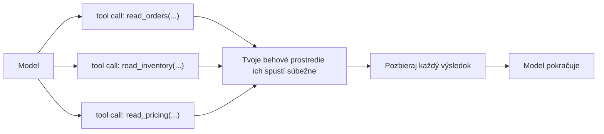
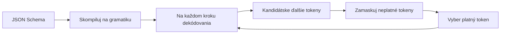

# Paralelné volania, obmedzené dekódovanie, opakovania a cena veľkého súboru nástrojov

[Časť 1](./index.md) rozložila mechanizmus — tool definition (opis nástroja) → tool call (volanie nástroja) → tool result (výsledok nástroja) → pokračuj. Táto stránka ten istý okruh rozoberie do posledného detailu: čo sa deje, keď model vydá viac volaní naraz, ako sa schéma vynucuje token po tokene, ako sa slučka po chybnom volaní zotaví namiesto toho, aby odumrela, a čo sa pokazí, keď súbor nástrojov narastie na desiatky. Prvú časť predpokladáme celý čas — okruh, bezpečnostnú hranicu, „tool definition je prompt“, zoznam znakov dobrého nástroja — neopakujeme ju, len na nej staviame.

## Keď model vydá viac volaní naraz

Jeden ťah nie je jedno volanie. Model dokáže v jednej odpovedi vydať niekoľko *nezávislých* volaní — **parallel tool calls** (paralelné volania nástrojov): tri čítania z databázy, dva dopyty cez API — namiesto toho, aby ich vypúšťal po jednom na ťah.

Tvoje behové prostredie urobí dve veci v poradí: rozdelí ich (fan-out) — spustí súbežne — a pozbiera ich späť (fan-in) — zhromaždí každý výsledok a odovzdá ich modelu spolu, skôr než pokračuje. To je tvar **fan-out / fan-in**: jeden ťah sa rozvetví na N paralelných volaní, N výsledkov sa zloží späť do jednej správy a slučka ide ďalej.

Slovo, na ktorom všetko stojí, je *nezávislé*. Paralelizmus je platný iba vtedy, keď žiadne volanie nepotrebuje výsledok iného a vedľajší účinok žiadneho z nich nemení to, čo vidí druhé. Túto nezávislosť model predpokladá, keď sa rozhodne volania zoskupiť — a tvoje behové prostredie ju neoveruje. Nič nekontroluje, či si volania naozaj neprekážajú; ak áno, nedostaneš chybovú správu, ale **súbeh** (race condition): dve súbežné volania siahnu na to isté a výsledok začne závisieť od náhodného časovania.

Prepínače tohto správania sa líšia podľa poskytovateľa a na presných názvoch záleží.

**Anthropic Claude** zoskupuje volania štandardne — modely Claude 4 vydajú paralelné volania vždy, keď z toho požiadavka ťaží. Vypneš to príznakom `disable_parallel_tool_use: true` — a všimni si, kde býva: vnútri objektu `tool_choice`, nie ako parameter požiadavky na najvyššej úrovni. Pri type `auto` potom model zavolá nanajvýš jeden nástroj na odpoveď; pri type `any` alebo `tool` práve jeden.

**OpenAI** vystavuje `parallel_tool_calls`, ktorý štandardne dovolí viac volaní na ťah; nastavením na `false` vynútiš nula alebo jedno.

**Gemini** podporuje **parallel function calling** (viac nezávislých funkcií v jednom ťahu) a — zámerne odlíšené — **compositional function calling** (zreťazené, závislé volania), kde sa volania viažu do postupnosti a výstup jedného je vstupom pre ďalšie: `get_current_location()`, potom `get_weather(location)`. Prvé je skupina, druhé reťazec závislostí — a práve ich rozlíšenie je jadrom tejto sekcie.

Zbieranie výsledkov má svoj kontrakt. U Anthropicu: za každý blok `tool_use` vrátiš jeden `tool_result`, všetky spolu v nasledujúcej používateľskej správe, každý spárovaný so svojím volaním cez `tool_use_id`, a každý `tool_result` predchádza akémukoľvek textu v tej správe. Ak si sa rozhodol volanie nespustiť — povedzme si skupinu vykonal postupne a skoršie volanie zlyhalo — aj tak zaň vrátiš `tool_result` s `is_error: true` a krátkym dôvodom, namiesto toho, aby si ho ticho zahodil. Gemini funguje v duchu rovnako: každá odpoveď sa spätne mapuje na svoje volanie cez `id` a vrátiť musíš všetky.

Neparalelizuj **závislé volania** — také, kde jedno potrebuje výsledok predchádzajúceho. To je compositional, postupné volanie; spusti ho v poradí. Zoskupiť ho je jednoducho chyba, lebo druhé volanie potrebuje argument, ktorý ešte neexistuje.

Neparalelizuj naslepo ani **zápisy s vedľajším účinkom** (side-effectful writes). Súbežné zápisy do zdieľaného stavu sa dostanú do súbehu a poradie naprieč skupinou je nedefinované — nevieš povedať, ktorý dopadol prvý. Pri zapisovacích nástrojoch buď vypni paralelné volania (`disable_parallel_tool_use` / `parallel_tool_calls: false`), alebo vykonanie serializuj vo vlastnom behovom prostredí. K tomu sa vrátime pri idempotencii.

Keď model tvrdošijne zoskupuje veci, ktoré by nemal, dokumentovaná náprava je samotný prompt: pouč ho v systémovom prompte — „Only batch tool calls that are independent of each other.“ (v preklade: zoskupuj len volania, ktoré sú navzájom nezávislé). Model zoskupuje na základe predpokladu; systémový prompt je miesto, kde ten predpoklad opravíš.

## Ako sa schéma naozaj vynucuje

Argumenty nástroja opisuje **schéma** (schema) — zvyčajne JSON Schema (Gemini používa schému z podmnožiny OpenAPI). Prvá časť brala túto schému ako typované menu, ktoré model vypĺňa. Je to však viac než dokumentácia: v **strict mode** (striktný režim) sa schéma *vynucuje* a model nedokáže vydať argumenty, ktoré ju porušujú.

Mechanizmom je **constrained decoding** (obmedzené dekódovanie). Poskytovateľ tvoju schému skompiluje na **gramatiku** — formálnu gramatiku, vo všeobecnom prípade bezkontextovú. Na každom kroku dekódovania vzorkovač zamaskuje každý token, ktorý by pri doterajšom výstupe gramatiku porušil, a vzorkuje len z toho, čo prežije. Zatváracia zložená zátvorka tam, kde gramatika žiada číslicu, sa v menu ďalších tokenov vôbec neobjaví. Výstup zodpovedá schéme *už z konštrukcie* — nie preto, že sa model snažil a mal šťastie, ani preto, že si ho dodatočne overil a zlé si zahodil.

V praxi to vyzerá takto:

- **OpenAI**: `strict: true` vnútri definície funkcie prinúti volania spoľahlivo dodržať schému namiesto „ako sa dá“, a to cez **Structured Outputs** — pod kapotou constrained decoding. Dve požiadavky: `additionalProperties: false` na každom objekte a každá vlastnosť uvedená ako `required`.
- **Anthropic Claude**: striktné volanie nástrojov cez `tool_choice` s `strict: true`.
- **Gemini**: argumenty sú pripnuté na schému z podmnožiny OpenAPI v deklarácii funkcie.

Constrained decoding nie je zadarmo. Čo stojí a kedy ho vynechať:

- **Cena kompilácie pri prvom volaní.** Prvá požiadavka, ktorá nesie *novú* schému, zaplatí latenciou, kým sa artefakt gramatiky vypočíta a predspracuje na vzorkovanie; neskoršie požiadavky s tou istou schémou trafia cache (vyrovnávacia pamäť) a bežia rýchlo. OpenAI dokumentuje presne toto — schéma na gramatiku pri prvom videní, potom z cache. Dôsledok je praktický: ak pri každom volaní vytváraš čerstvo vygenerovanú schému, cache znefunkčníš a kompilačnú daň platíš zakaždým — cenu, ktorú by inak zaplatila len prvá požiadavka.
- **Nepodporované črty schémy.** Strict mode pokrýva len podmnožinu JSON Schema, a povinné `additionalProperties: false` spolu s pravidlom „všetko `required`“ znamenajú, že niektoré výrazové črty buď nie sú dostupné, alebo sa musia pretvarovať, aby sa zmestili.
- **Paralelizmus — časovo ohraničený fakt.** Parallel function calling pôvodne na OpenAI so strict mode nefungoval spolu — aby si udržal striktnosť, nastavil si `parallel_tool_calls: false`. Neskôr to opravili a paralelné volania dnes so strict mode fungujú.

Buď presný v tom, čo ti striktné dekódovanie zaručuje: dá ti *správne sformované, podľa schémy platné* argumenty (JSON sa naparsuje, typy sedia, enumy sú dodržané). Nezaručí, že argumenty sú *správne*, ani že model siahol po *správnom* nástroji. Štruktúra nie je sémantika — zaceliť túto medzeru je celá práca sekcie o validácii nižšie.

## Keď volanie zlyhá — a ako sa cyklus zotaví

Volanie nástroja zlyhá viacerými spôsobmi a hádzať ich do jedného vreca je prvá chyba, lebo zotavenie, ktoré napraví jeden, iný zhorší. Taxonómia:

- **Chybne sformované argumenty** — argumenty sa nenaparsujú alebo porušujú schému. Striktné dekódovanie ich z veľkej časti zamedzí, ale len pri striktných nástrojoch; neštriktný nástroj môže stále dostať nezmysel.
- **Chyba validácie** — argumenty sú správne sformované, no neprejdú tvojimi kontrolami: hodnota mimo rozsahu, neznáme id (validácia argumentov nižšie).
- **Výnimka nástroja** — nástroj sa spustil a spadol: `500` z nadväzujúcej služby, zlý dopyt.
- **Vypršanie časového limitu (timeout)** — nástroj neodpovedal v rámci svojho rozpočtu.
- **Prázdny alebo nejednoznačný výsledok** — nástroj nevrátil nič užitočné, alebo niečo, čo si model môže zle vyložiť. To je práve riziko domýšľania, ktoré pomenovala prvá časť — model si sebavedomo stavia na nejasnom alebo prázdnom výsledku. Miesto v zozname si zaslúži, hoci technicky nič nezlyhalo.

Najdôležitejší ťah, keď volanie zlyhá, má tvar, s ktorým si sa už stretol. Prvá časť nazvala tool definition promptom; o chybe platí to isté. **Chyba ako prompt**: chybu vrátiš modelu ako správu, ktorú vie prečítať a konať podľa nej — **zotaviteľnú chybu** (recoverable error) formulovanú ako návod („dátum musí byť `YYYY-MM-DD`“; „neznáme `user_id`, najprv zavolaj `list_users`“), nie nečitateľný výpis zásobníka a nie holý nenulový návratový kód. Slučka sa potom opraví sama: chybné volanie → zrozumiteľná chyba → model preformuluje → opakovanie. V podobe od Anthropicu je to `tool_result` s `is_error: true` a poučnou správou; model v ďalšom ťahu vydá opravené volanie.

Nie každé zlyhanie je vinou modelu a tie sa riešia inak. Pri **prechodných chybách** — timeout, rate limit (strop na počet požiadaviek), `5xx` z nadväzujúcej služby — opakuj, ale opakuj s **backoffom** (odstup medzi pokusmi; exponenciálny odstup): pokusy rozostri, obvykle exponenciálne. Tesná okamžitá slučka len bije do závislosti, ktorá už aj tak zápasí, a z výkyvu spraví výpadok.

A zastropuj to. **Retry budget** (rozpočet opakovaní) — tvrdý strop na počet pokusov, na jedno volanie aj na celý beh — zrkadlí rozpočet krokov a rozpočet tokenov z lekcie o plánovaní. Bez stropu sa volanie, ktoré padá deterministicky, zvrhne na **nezastaviteľnú slučku opakovaní**: agent donekonečna vydáva to isté volanie odsúdené na neúspech a nikdy neskončí.

Opakovanie sa oplatí len vtedy, keď je vstup doň *iný* — opravený argument alebo prechodná porucha, ktorá medzičasom pominula. Zopakuj identické volanie po deterministickej chybe a zlyhá rovnako; minul si rozpočet aj peniaze, aby si sa znova naučil, čo si už vedel. Rozpoznaj prípad bez posunu a zastav sa: chybu vynes na povrch, odovzdaj ju človeku alebo skús iný nástroj. A pomenuj ju správne — slučka, ktorá sa nezastaví, je **chyba behu**, defekt v behu, nikdy nie „odmietnutie“.

Dve veci, ktoré neopakovať: po prvé, neopakuj deterministickú chybu nezmenenú — nič sa nezmenilo, takže ani výsledok nie; po druhé, neopakuj zápis s vedľajším účinkom, ktorý mohol čiastočne prejsť, bez záruky idempotencie za ním — opakovanie môže dvojnásobne uplatniť to, čo prvý pokus už spravil. Opakovania sú na prechodné poruchy a na argumenty opravené modelom; nie sú spôsob, ako sa vyhnúť oprave volania. Nasledujúca sekcia to pre zápisy spraví konkrétnym.

## Kontextová cena desiatok nástrojov

Každý tool definition stojí tokeny v každej požiadavke: názov, opis a celá schéma parametrov každého nástroja sa do promptu serializujú pri každom volaní, či sa použijú alebo nie. Tucet nástrojov je **stála daň** — tokeny, latencia, peniaze — platená bez ohľadu na to, či sa modelu čo i len dotkne. To je konkrétna cena za „málo neprekrývajúcich sa nástrojov“ z prvej časti.

Daň nie je len finančná. **Tool selection** (výber nástroja) sa s rastúcim súborom zhoršuje: pri mnohých nástrojoch s blízkym významom model častejšie siahne po nesprávnom a nezavolá, keď mal — presne tie zlyhania „nesprávny nástroj“ a „žiadne volanie“, na ktoré upozornila prvá časť. Veľký plochý súbor nástrojov aktívne zhoršuje agentovu schopnosť vyberať.

Náprava vo veľkom je prestať posielať každý nástroj zakaždým. **Dynamic tool loadout** (dynamický výber nástrojov) — hovorí sa mu aj **tool-RAG** — vyhľadá len nástroje relevantné pre aktuálny dopyt a načíta do požiadavky práve tie. Je to RAG uplatnený na menu nástrojov namiesto dokumentov: krok vyhľadávania nad tvojím katalógom nástrojov, ktorý drží aktívny súbor malý a pri téme, ťah za ťahom.

**Menné priestory (namespacing)** riešia ten istý problém z druhej strany. Daj nástrojom štruktúrované názvy a zoskup ich — podľa domény, podľa servera — aby s nimi vedeli pracovať aj model, aj tvoj krok vyhľadávania; keď je katalóg veľký, oreže to kolízie názvov a prekryvy.

Za istou hranicou odpoveď nie je dlhší zoznam. Keď jeden agent vlečie desiatky nástrojov, rozdeľ ho na **špecializovaných agentov**, každý s malým, ortogonálnym súborom nástrojov — argument špecializácie z [lekcie o multiagentových systémoch](../multi-agent/). Zoznam nástrojov, ktorý stále rastie, je sám signálom, že si jediného agenta prerástol.

Zdržanlivosť platí aj opačne. Nesiahaj po tool-RAG predčasne. Pri hrstke nástrojov je to zbytočná mašinéria s vlastným rizikom zlyhania — krok vyhľadávania, ktorý teraz môže minúť cieľ a skryť nástroj, ktorý model potreboval. Najjednoduchšie, čo funguje, je plný statický súbor; dynamický výber si svoju zložitosť zaslúži, až keď je katalóg naozaj veľký. Tá istá disciplína ako všade v druhej časti: vezmi najjednoduchšiu úroveň, ktorá úlohu vyrieši.

## Idempotencia a zápisy s trvalým následkom

Bezpečnosť opakovania nie je vlastnosťou tvojej politiky opakovaní. Je vlastnosťou *nástroja*. Čítacie a zapisovacie nástroje sa v opakovaní líšia: znova spustiť čítanie ťa nestojí nič okrem latencie, kým znova spustiť zápis — vytvoriť objednávku, odoslať e-mail, strhnúť z karty — môže vedľajší účinok zdvojiť. Či je opakovanie bezpečné, rozhoduje to, čo nástroj robí, nie to, ako ho opakuješ.

Vlastnosť, ktorú chceš, je **idempotency** (idempotencia): spustiť zápis dvakrát s rovnakým vstupom má rovnaký účinok ako spustiť ho raz. Štandardným mechanizmom je **idempotency key** (kľúč idempotencie) — volajúci pripojí ku každej zamýšľanej operácii jedinečný kľúč a server opakovania toho istého kľúča odfiltruje. S kľúčom je opakovanie po nejednoznačnom vypršaní časového limitu bezpečné: ak prvý pokus naozaj prešiel, druhý neurobí nič.

Pri zápisoch, ktoré sú nebezpečné alebo nevratné, rozdeľ operáciu na dve. **Dry-run** (nanečisto) vypočíta a ukáže, čo *by sa* stalo, bez akéhokoľvek účinku; **krok potvrdenia** (confirm) to potom vykoná — a práve tento krok potvrdenia býva bodom schválenia s človekom v slučke (human-in-the-loop). Je to least privilege (princíp najmenších oprávnení) z prvej časti a jej „pri nebezpečných akciách vyžaduj potvrdenie“, pretavené do tvaru dvoch volaní.

Toto oddelenie drž štruktúrne, ako argumentovala prvá časť: čítacie a zapisovacie nástroje udržuj oddelené, aby si agentovi mohol dať široký prístup na čítanie a zápisy pustil cez bránu. Least privilege prestane byť heslom vo chvíli, keď sú samotné nástroje rozdelené presne po línii, ktorú chceš strážiť.

Tu sa sekcia o paralelizme a táto stretávajú. Skupina fan-out má nedefinované poradie, takže dva zápisy vhodené do jednej skupiny sa môžu dostať do súbehu alebo dopadnúť mimo poradia. Nikdy nedávaj zápisy závislé od poradia či konfliktné do tej istej paralelnej skupiny — serializuj ich, alebo pri zapisovacích nástrojoch vypni paralelné volania. Paralelizmus bol predtým výhrou; pri zápisoch je to pasca.

A pravidlo, ktoré viaže opakovania späť k zápisom: nespoliehaj sa na opakovania pri zapisovacom nástroji, ktorý nie je idempotentný a nemá kľúč. Opakovanie po vypršaní časového limitu, ktoré v skutočnosti prešlo, uplatní účinok dvakrát — druhé strhnutie, druhý e-mail. Najprv vyrieš idempotenciu, až potom dovoľ opakovania. Toto poradie sa neobracia.

## Validácia argumentov predtým, než konáš

Striktné dekódovanie ti dá správne sformované argumenty. Nedá ti *prijateľné* — a miesto, kde ten rozdiel rozoznáš, je medzi „model vydal argumenty“ a „ty spustíš nástroj“. **Validuj skôr, než vykonáš** (argument validation, validácia argumentov): vlož bránu, ktorá argumenty preskúma predtým, než sa spustí akýkoľvek vedľajší účinok. Brána má dve úrovne a každá chytá niečo iné.

- **Validácia na úrovni schémy** — typy, povinné polia, enumy, formáty. Striktné, obmedzené dekódovanie to pri generovaní z veľkej časti pokryje, no validuj aj tak: pre neštriktné nástroje a ako obranu do hĺbky.
- **Sémantická validácia** — argumenty sú správne typované a v danom kontexte aj tak nesprávne: id, ktoré neexistuje, dátum v minulosti, suma nad limitom, cesta mimo dovoleného koreňa. Väčšinu z toho schéma vyjadriť nevie; musí to spraviť tvoj kód. To je presne tá medzera, na ktorú upozornila sekcia o schéme — štruktúra prejde, kým sémantika zlyhá.

Keď validácia argument odmietne, vracia sa späť rovnako ako chyba pri vykonaní. Neúspešná kontrola vráti zotaviteľnú, modelom čitateľnú správu — opäť chyba ako prompt — takže model argument opraví a zopakuje. Tá istá samoopravná slučka, len teraz stráži hranicu pred vykonaním namiesto toho, aby chybu chytala až po ňom.

Tým je čiara medzi oboma úrovňami daná. Netlač sémantické kontroly do schémy, kde sa väčšina z nich nedá vyjadriť; a nevynechávaj validáciu preto, že dekódovanie je striktné, veď striktné zaručí správne sformované, nikdy nie správne. Obe vrstvy sa dopĺňajú a ani jedna nezastúpi druhú.

## Čo si odniesť z lekcie

- V jednom ťahu model vydá viac nezávislých volaní; tvoje behové prostredie ich rozdelí, aby bežali súbežne, a výsledky pozbiera naraz. Platí to len vtedy, keď volania naozaj nezávisia jedno od druhého a navzájom si neprekážajú — a nevynucuje to nič okrem teba.
- Strict mode vynucuje schému cez constrained decoding: schéma sa skompiluje na gramatiku a vzorkovač zamaskuje každý token, ktorý by ju porušil. Zaručuje správne sformované argumenty, nie správne, a prvé volanie s novou schémou zaplatí cenu kompilácie, kým sa cache nezahreje.
- Zlyhané volanie sa zotaví, keď chybu vrátiš ako prompt — čitateľnú, uchopiteľnú správu, voči ktorej sa model opraví. Prechodné poruchy opakuj s backoffom pod tvrdým retry budgetom; opakovať nezmenenú deterministickú chybu je nekonečná slučka, nie zotavenie.
- Každý tool definition sú tokeny v každej požiadavke a presnosť výberu s rastúcim súborom klesá. Malý, relevantný výber (tool-RAG) vyhľadávaj, až keď je katalóg naozaj veľký — a za tou hranicou radšej rozdeľ prácu na špecializovaných agentov, než by si rozrastal jedného.
- Čítanie je bezpečné opakovať; zápis nie, iba ak je idempotentný — daj zapisovacím nástrojom idempotency key, pri nebezpečných rozdelenie na dry-run a potvrdenie, a nikdy im nedaj miesto v paralelnej skupine vedľa iného zápisu.
- Validuj argumenty pred vykonaním, na dvoch úrovniach: na úrovni schémy pre tvar, sémanticky pre význam. Striktné dekódovanie pokryje prvú, druhú musí pokryť tvoj kód; a chyba validácie sa vracia modelu presne ako chyba pri vykonaní.

**Nové pojmy** → [Glosár](../../glossary.md): parallel tool calls, constrained decoding, strict mode / Structured Outputs, idempotency / idempotency key, tool-RAG / dynamic tool loadout, argument validation, retry budget.
