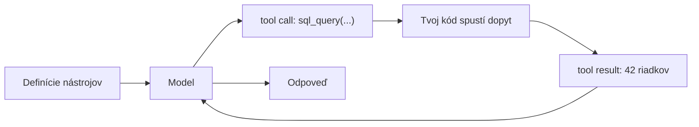

# Ako model koná vo vonkajšom svete

V lekcii o agentickom RAG si si všimol kľúčovú zmenu: vyhľadávanie prestalo byť *krokom* a stalo sa *akciou*, ktorú si model volí v slučke. Lenže vyhľadávanie je len jedna z akcií.

**Tool use** (používanie nástrojov) — hovorí sa mu aj **function calling** (volanie funkcií) — je všeobecný mechanizmus: model dokáže zavolať ľubovoľnú vonkajšiu funkciu. Vyhľadať dokument v znalostnej báze, spustiť SQL dopyt nad tabuľkou, zavolať HTTP API, použiť kalkulačku, spustiť kód, odoslať e-mail. Vyhľadávanie je teda len špeciálny prípad — jeden nástroj spomedzi mnohých.

Práve vďaka tool use prestáva byť model iba „generátorom textu“: dokáže *konať* — čítať živé dáta, presne počítať, meniť stav vonkajších systémov.

:::tip[▶ Video]

<YouTube id="h8gMhXYAv1k" title="What is Tool Calling? Connecting LLMs to Your Data — IBM Technology" />

Ten istý mechanizmus vo výklade IBM: ako volanie nástroja prepojí model s tvojimi dátami a systémami. (Video je v angličtine.)

:::

## Prečo model potrebuje prostredníka — sám generuje iba text

Model sám nevykoná nič — iba generuje text. Nesiahne do databázy ani nezavolá API; nijaký kód nespúšťa. Tool use je protokol, ktorý túto medzeru prekleňuje.

Prebieha v štyroch krokoch. Po prvé, model vyjadrí **štruktúrovaný zámer** (structured intent): „zavolaj funkciu X s argumentmi Y“. Po druhé, tvoj kód volanie vykoná a dostane výsledok. Po tretie, výsledok sa vráti modelu ako kontext. Po štvrté, model pokračuje — teraz už s výsledkom pred sebou.

Deľba práce je jasná: model rozhoduje, *čo* zavolať; tvoja aplikácia volanie vykoná. Model sa reálnych systémov nikdy nedotkne — a práve toto rozdelenie sa napokon ukáže ako **bezpečnostná hranica** (security boundary), k čomu sa ešte vrátime.

## Mechanizmus: volanie nástroja

Mechanizmus sa skladá z niekoľkých častí a beží v tej istej slučke ako agentický RAG — len akciou už môže byť čokoľvek.

- **Definícia nástroja (tool definition)** — názov, slovný opis a schéma parametrov (zvyčajne JSON Schema, jazyk na opis štruktúry a typov dát). Z definícií sa model dozvie, aké nástroje má k dispozícii, čo robia a aké argumenty prijímajú. Odovzdáš ich modelu spolu s otázkou.
- **Volanie nástroja (tool call)** — namiesto bežného textu (alebo popri ňom) model vygeneruje **štruktúrovaný výstup** (structured output): JSON s názvom nástroja a argumentmi.
- **Výsledok nástroja (tool result)** — tvoja aplikácia nástroj spustí a výsledok pridá do rozhovoru ako samostatnú správu.
- Model **pokračuje**: keď vidí výsledok, buď zavolá ďalší nástroj, alebo odpovie.

## Definícia nástroja je prompt, nie iba signatúra funkcie

Práve v tomto sa návrh nástrojov pre model líši od bežného návrhu API: model si nástroj vyberá a jeho argumenty vypĺňa tak, že *číta slovný opis* — do tvojej implementácie nedovidí. Pravdepodobnostný model usudzuje z názvu, z textu opisu a z opisov jednotlivých parametrov, *kedy* a *ako* funkciu zavolať.

Keď je opis vágny, model zavolá nástroj v nesprávnej chvíli, vyberie nesprávny nástroj alebo vygeneruje nezmyselné argumenty. Opisy nástrojov sú preto súčasťou prompt engineeringu (práca s promptom); „volajúci“ tu nie je deterministický kód — je to model, ktorý číta prirodzený jazyk.

## Čo robí nástroj dobrým

- **Jasný, jednoznačný opis** — model rozlišuje nástroje podľa opisu, nie podľa kódu za nimi.
- **Prísne typované, obmedzené parametre** (JSON Schema, `enum`, formáty) zúžia, čo model smie vygenerovať, a znížia počet chybných volaní.
- **Málo nástrojov, bez prekryvov.** Tucet funkcií s blízkym významom model mätie a chýb pri výbere nástroja (tool selection) pribúda. Sadu nástrojov starostlivo zostavuj, nenafukuj ju.
- **Zrozumiteľné chyby.** Keď nástroj zlyhá, vráť správu, vďaka ktorej sa slučka dokáže z chyby zotaviť („dátum musí byť vo formáte `YYYY-MM-DD`“). Model potom môže volanie opraviť a skúsiť ho znova: chybné volanie → zrozumiteľná chyba → preformulovanie → opakovanie.
- **Správna granularita** — nie príliš jemná (desať volaní na jednu úlohu), ani príliš hrubá (jeden nástroj na všetko).

## Kde sa to láme

- **Nesprávny nástroj — alebo žiadny.** Model siahol po nesprávnej funkcii alebo odpovedal z pamäte namiesto použitia nástroja. Rieši to jasnejší opis a menšia sada nástrojov.
- **Neplatné argumenty** — vymyslené alebo nesprávne parametre. Rieši to prísna schéma, validácia a zrozumiteľné chyby, podľa ktorých model dokáže chybné volanie opraviť.
- **Domýšľanie si toho, čo vo výsledku nie je.** Model si k výsledku môže domyslieť fakty, ktoré v ňom nie sú — najmä pri nejasnom alebo prázdnom výsledku. Vráť výsledok ako samostatnú správu, výslovne označenú ako výstup nástroja; riziko to zníži, no neodstráni.
- **Bezpečnosť — nové a vážne riziko.** Či sa nástroj, ktorý *koná* — zapisuje, odosiela, spúšťa kód — naozaj zavolá a s akými argumentmi, rozhoduje teraz výstup modelu. A ten výstup sa dá cez **prompt injection** (podvrhnutie inštrukcií do promptu) zmanipulovať — aj nepriamo, inštrukciami ukrytými v nájdenom obsahu. Obranou je **princíp najnižších oprávnení** (least privilege): obmedz sadu nástrojov, oddeľ čítacie nástroje od zapisovacích a pri nebezpečných akciách vyžaduj potvrdenie. Aj úspešný útok cez prompt injection má potom iba obmedzené následky.

## Späť k RAG

Kruh sa uzatvára: *vyhľadávanie je nástroj.* Agentický RAG je špeciálny prípad tool use, kde je hlavným nástrojom vyhľadávanie.

Keď má agent viac nástrojov, rieši situáciu, v ktorej rôzne otázky potrebujú rôzne zdroje: vyhľadávanie v znalostnej báze, SQL nad tabuľkami, webové vyhľadávanie na aktuálne informácie, kalkulačka na presný výpočet. Vhodný nástroj vyberá práve **router (smerovač)** z predchádzajúcej lekcie.

## Čo si odniesť z lekcie

- Tool use (function calling) je všeobecný mechanizmus: model zavolá ľubovoľnú vonkajšiu funkciu a vyhľadávanie je jeho špeciálny prípad.
- Model zámer iba vyjadrí — samotné volanie vykoná tvoj kód: model rozhoduje „čo“, tvoja aplikácia rieši „ako“. To je zároveň bezpečnostná hranica.
- Mechanizmus je „definícia nástroja → volanie nástroja → výsledok nástroja → pokračuj“; tá istá slučka ako pri agentickom RAG, len s ľubovoľnou akciou.
- Definícia nástroja je prompt: model vyberá podľa slov, nie podľa kódu. Dobrý nástroj má jasný opis a prísnu schému, patrí do malej sady bez prekryvov a vracia zrozumiteľné chyby.
- Nové spôsoby zlyhania: nesprávny nástroj, neplatné argumenty, domýšľanie si toho, čo vo výsledku nie je; k tomu nové bezpečnostné riziko — zapisovací nástroj sa dá zneužiť cez prompt injection; obranou je princíp najnižších oprávnení.

**Nové pojmy** → [Glosár](../../glossary.md): tool use / function calling, tool definition, tool call, tool result, tool selection, JSON Schema, structured output.

---

:::note[Ďalej — druhá časť lekcie]

**[Spoľahlivosť a škálovanie](./deep-dive.md)** — ako dostať volania nástrojov do produkcie: paralelné volania, formáty schém a vynucovanie schémy cez obmedzené dekódovanie, ošetrenie chýb a opakované pokusy, ako aj kontextová cena desiatok nástrojov.

Pozri aj: prepojenie nástrojov cez spoločný štandard — [MCP a agentné protokoly](../mcp/index.md); ako to riešia Claude, OpenAI a Gemini — [záverečná stránka časti](../real-agents.md).

:::
