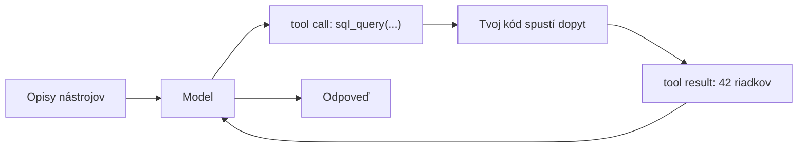

# Ako model koná vo vonkajšom svete

V lekcii o agentickom RAG si zachytil kľúčový posun: vyhľadávanie prestalo byť *krokom* a stalo sa *akciou*, ktorú si model volí vnútri slučky. Lenže vyhľadávanie je len jedna z akcií.

**Tool use** (používanie nástrojov / volanie funkcií) — hovorí sa mu aj **function calling** — je ten všeobecný mechanizmus: model dokáže zavolať ľubovoľnú vonkajšiu funkciu. Vyhľadať v znalostnej báze, spustiť SQL dopyt nad tabuľkou, zavolať HTTP API, použiť kalkulačku, spustiť kód, odoslať e-mail. Vyhľadávanie sa tak ukáže ako špeciálny prípad — jeden nástroj spomedzi mnohých.

Práve tool use je to, čo mení model z „generátora textu“ na niečo, čo dokáže *konať*: čítať živé dáta, presne počítať, meniť stav vonkajších systémov.

:::tip[▶ Video]

<YouTube id="h8gMhXYAv1k" title="What is Tool Calling? Connecting LLMs to Your Data — IBM Technology" />

Rovnaký mechanizmus z dielne IBM: ako tool call prepojí model s tvojimi dátami a systémami. (Video je v angličtine.)

:::

## Prečo model potrebuje prostredníka — vydáva iba text

Model sám nevykoná nič — iba vydá text. Nesiahne do databázy ani nezavolá API; kód fyzicky nespúšťa. Tool use je práve ten protokol, ktorý túto medzeru preklenie.

Priebeh má štyri kroky. Po prvé, model vydá **štruktúrovaný zámer** (structured intent): „zavolaj funkciu X s argumentmi Y“. Po druhé, tvoj kód volanie spustí a dostane výsledok. Po tretie, výsledok sa vráti modelu ako kontext. Po štvrté, model pokračuje — teraz už s výsledkom pred sebou.

Deliaca čiara je ostrá: model rozhoduje, *čo* zavolať; tvoje behové prostredie volanie vykoná. Model sa reálnych systémov nikdy nedotkne — a práve toto rozdelenie sa napokon ukáže ako **bezpečnostná hranica** (security boundary), k čomu sa ešte vrátime.

## Mechanizmus: tool call

Skladá sa z niekoľkých častí a beží v tej istej slučke ako agentický RAG — len akciou už môže byť čokoľvek.

- **Tool definition** (opis nástroja) — názov, slovný opis a schéma parametrov (zvyčajne JSON Schema, jazyk na opis štruktúry a typov dát): „menu“ toho, ktoré nástroje existujú, čo robia a aké argumenty prijímajú. Odovzdáš ho modelu spolu s otázkou.
- **Tool call** (volanie nástroja) — namiesto bežného textu (alebo popri ňom) model vydá **structured output** (štruktúrovaný výstup): JSON s názvom nástroja a argumentmi.
- **Tool result** (výsledok nástroja) — tvoje behové prostredie nástroj spustí a výsledok pridá do rozhovoru ako samostatnú správu.
- Model **pokračuje**: keď vidí výsledok, buď zavolá ďalší nástroj, alebo odpovie.

## Tool definition je prompt, nie iba podpis funkcie

Práve tu AI vnáša hlavný rozdiel oproti bežnému návrhu API: model si nástroj vyberá a jeho argumenty vypĺňa tak, že *číta slovný opis* — do tvojej implementácie nedovidí. Názov, text opisu a opisy jednotlivých parametrov sú presne to, z čoho pravdepodobnostný model usudzuje, *kedy* a *ako* funkciu vyvolať.

Vágny opis znamená, že model zavolá v nesprávnej chvíli, siahne po nesprávnom nástroji alebo vyplní argumenty nezmyslom. Opisy nástrojov sú preto súčasťou prompt engineeringu (práca s promptom); „volajúci“ tu nie je deterministický kód — je to model, ktorý číta prirodzený jazyk.

## Čo robí nástroj dobrým

- **Jasný, jednoznačný opis** — model rozlišuje nástroje podľa opisu, nie podľa kódu za nimi.
- **Prísne typované, obmedzené parametre** (JSON Schema, `enum`, formáty) zúžia, čo model smie vydať, a znížia počet chybných volaní.
- **Málo nástrojov, bez prekryvov.** Tucet funkcií s blízkym významom modelu zamotá hlavu a chyby tool selection (výber nástroja) rastú. Súbor starostlivo zostavuj, nenafukuj ho.
- **Zrozumiteľné chyby.** Keď nástroj zlyhá, vráť správu, z ktorej sa model dokáže zotaviť („dátum musí byť vo formáte `YYYY-MM-DD`“). Slučka sa potom opraví sama: chybné volanie → zrozumiteľná chyba → preformulovanie → opakovanie.
- **Správna granularita** — nie príliš jemná (desať volaní na jednu úlohu), ani príliš hrubá (jeden nástroj na všetko).

## Kde sa to láme

- **Nesprávny nástroj — alebo žiadny.** Model siahol po nesprávnej funkcii, alebo odpovedal z pamäte namiesto toho, aby zavolal. Rieši to opis a menší súbor.
- **Neplatné argumenty** — vymyslené alebo nesprávne parametre. Rieši to prísna schéma, validácia a zrozumiteľné chyby na sebaopravu.
- **Domýšľanie nad výsledkom.** Model si môže domyslieť, čo vo výsledku nie je — najmä pri nejasnom alebo prázdnom. Vráť výsledok ako samostatnú správu, výslovne označenú ako výstup nástroja; riziko to zníži, no neodstráni.
- **Bezpečnosť — nové a vážne riziko.** Nástroj, ktorý *koná* (zapisuje, odosiela, spúšťa kód), je teraz riadený výstupom modelu — a ten výstup sa dá uniesť cez **prompt injection** (podvrhnutie inštrukcií do promptu), vrátane nepriamej, ukrytej v nájdenom obsahu. Odtiaľ obrana: **least privilege** (princíp najmenších oprávnení) — obmedz súbor nástrojov, oddeľ čítacie nástroje od zapisovacích a pri nebezpečných akciách vyžaduj potvrdenie. Aj úspešná injection potom zmôže málo.

## Späť k RAG

Kruh sa uzatvára: **vyhľadávanie je nástroj.** Agentický RAG je špeciálny prípad tool use, kde je hlavným nástrojom vyhľadávanie.

Keď má agent viac nástrojov, pokrýva prípad „iné zdroje pre iné otázky“: vyhľadávanie v znalostnej báze, SQL nad tabuľkami, webové vyhľadávanie na čerstvé veci, kalkulačka na presný výpočet. **Smerovač (router)** z predchádzajúcej lekcie je presne to, čo vyberie, ktorý nástroj použiť.

## Čo si odniesť z lekcie

- Tool use (function calling) je všeobecný mechanizmus: model zavolá ľubovoľnú vonkajšiu funkciu a vyhľadávanie je jeho špeciálny prípad.
- Model vydá iba zámer — vykoná ho tvoj kód: model rozhoduje „čo“, tvoje behové prostredie rieši „ako“. To je zároveň bezpečnostná hranica.
- Mechanizmus je „tool definition → tool call → tool result → pokračuj“; tá istá slučka ako pri agentickom RAG, len s ľubovoľnou akciou.
- Tool definition je prompt: model vyberá podľa slov, nie podľa kódu. Dobrý nástroj má jasný opis, prísnu schému, je jedným z malého počtu neprekrývajúcich sa nástrojov a vracia zrozumiteľné chyby.
- Nové režimy zlyhania: nesprávny nástroj, neplatné argumenty, domýšľanie nad výsledkom a bezpečnosť — zapisovací nástroj plus prompt injection, a teda least privilege.

**Nové pojmy** → [Glosár](../../glossary.md): tool use / function calling, tool definition, tool call, tool result, tool selection, JSON Schema, structured output.

---

:::note[Ďalej — druhá časť lekcie]

**[Spoľahlivosť a škálovanie](./deep-dive.md)** — tool cally do produkcie: paralelné volania, formáty schém a constrained decoding, obsluha chýb a opakovaní a kontextová cena desiatok nástrojov.

Pozri aj: prepojenie nástrojov cez spoločný štandard — [MCP a agentné protokoly](../mcp/); ako to vyzerá naprieč Claude, OpenAI a Gemini — [záverečná stránka časti](../real-agents/).

:::
