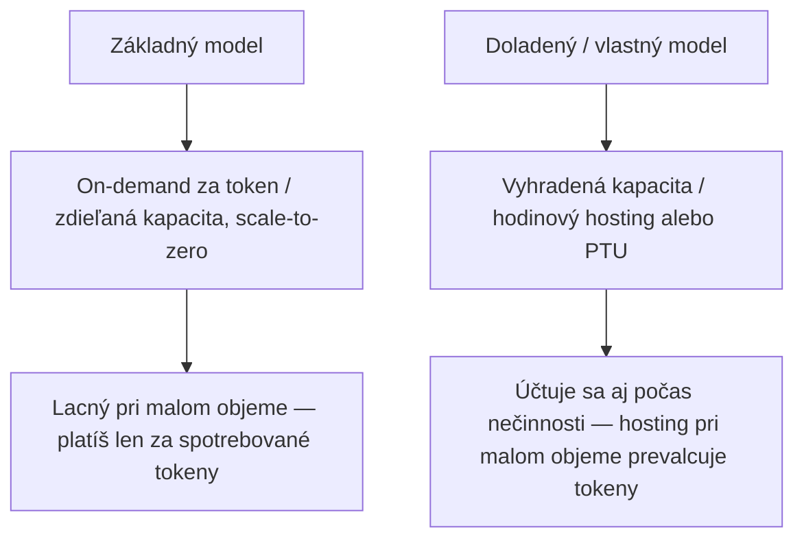
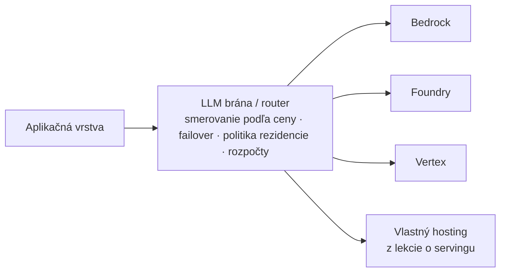

# Účet, agentové prostredie a kto smie čítať tvoje prompty

[Prvá časť lekcie](./index.md) položila základ: tri spôsoby, ako používať model, perimeter, ktorý platforma predáva, a veľkú trojku poskytovateľov. Prešla katalógy modelov, triádu súladu okolo súkromia a rezidencie, spravovaný RAG a platformové guardrails (bezpečnostné mantinely), tri cenové modely (on-demand, rezervovaná priepustnosť, dávka) a to, ako rozhodnutie naozaj vzniká — a ukázala, že názvy sú len momentky. Toto je hlboký druhý prechod, pokročilá nadstavba nad tými istými platformami. Odpovedá na päť otázok, ktoré Prvá časť lekcie nechala otvorené: čo prispôsobuješ, keď prompt a RAG už nestačia, čo prevádzkuje agenta, keď ho raz postavíš, koľko to celé stojí a ako to modelovať, ako ostať prenositeľný naprieč cloudmi a kto sa toho vôbec smie právne dotknúť. Prvú časť lekcie predpokladáme po celý čas, neučíme ju nanovo. Všetko nižšie je momentka k polovici roka 2026 (júl 2026); názvy produktov datované, trvalou vecou je kategória.

## Koľko stojí obsluhovať vlastný model

Každý hyperscaler ponúka rovnaký **rebrík prispôsobenia** a stúpa sa po ňom jedným smerom — od lacnejšieho a voľnejšieho k drahšiemu a tesnejšiemu. Naspodku je prompt engineering a RAG; nad nimi parametricky efektívne doladenie (LoRA a ďalšie metódy PEFT); potom plné supervised fine-tuning (SFT); ďalej preferenčné a reinforcement metódy — DPO (Direct Preference Optimization) a reinforcement fine-tuning (RFT); potom destilácia modelu (model distillation); a na vrchole pokračujúce predtrénovanie (continued pre-training). Názvy priečok aj zoznamy oprávnených základných modelov sa menia každý štvrťrok — konkrétnosti ber ako momentku, drž sa rebríka.

K polovici roka 2026 ho tie tri zapĺňajú takto:

- **AWS Bedrock** — SFT, reinforcement fine-tuning (funkciu odmeny dodáš ako Lambdu), Model Distillation (model-učiteľ označí dáta pre menšieho žiaka; preview na re:Invent 2024, dnes všeobecne dostupné) a pokračujúce predtrénovanie na neoznačených dátach. Tréning sa účtuje za token × epochy plus mesačný poplatok za úložisko vlastného modelu.
- **Azure OpenAI / Microsoft Foundry** — SFT, DPO a reinforcement fine-tuning s modelmi-hodnotiteľmi. Dajú sa skladať na seba, najprv SFT, potom DPO. Úloha RFT má strop $5 000: namiesto neobmedzeného účtovania sa pri ňom pozastaví a poskytne nasaditeľný checkpoint.
- **Vertex AI** (dnes začlenený do Gemini Enterprise Agent Platform) — supervised ladenie pre Gemini, parametricky efektívne ladenie na báze LoRA, kde `adapter_size` určuje rank LoRA, a destilačné ladenie.

Chrbtica tejto sekcie — to, čo návody na fine-tuning (doladenie modelu) preskakujú: vlastný model takmer vždy potrebuje vyhradenú cestu obsluhy — a za vyhradenú kapacitu neplatíš ako za lacné tokeny. Najčitateľnejšie tú pascu ukazuje Azure. Doladené nasadenie sa tam účtuje za token a navyše hodinovým poplatkom za hosting — okolo $1,70/hod. na úrovni Standard alebo Global Standard — alebo z hodín rezervovanej priepustnosti (provisioned throughput) na úrovni Regional Provisioned Throughput. Ostáva ešte úroveň Developer, ktorá hodinový poplatok nemá, no nasadenie po 24 h automaticky zruší, bez SLA a bez záruky rezidencie dát (data residency) — čisto možnosť na evaluáciu a proof of concept. Microsoftov vlastný prepočet: 20 mil. vstupných a 40 mil. výstupných tokenov za mesiac = $1 422, z čoho $1 224 — teda 1,70 × 24 × 30 — je čistý hosting. Pri malom objeme poplatok za hosting mnohonásobne prevýši cenu tokenov. Doladený endpoint, ktorý necháš bežať pri slabej premávke, je zombie: nepretržite platíš za jeho kapacitu, hoci ju sotva využíva.

Bedrock dlho niesol ten istý tvar z opačnej strany: vlastné modely sa bez rezervovanej priepustnosti nedali obsluhovať vôbec. To sa uvoľnilo. Od roku 2026 existuje aj on-demand (platba za tokeny) cesta nasadenia vlastných modelov — no len pre krátky zoznam základných modelov (Amazon Nova Lite, Nova 2 Lite, Nova Micro, Nova Pro a Meta Llama 3.3 70B), len ak boli prispôsobené 16. júla 2025 alebo neskôr a len v regiónoch us-east-1 a us-west-2. Všetko mimo tohto okna stále potrebuje rezervovanú priepustnosť — háčik teda nemizne, len sa zužuje na výnimku. Vertex je na tom rovnako: doladené modely aj ich LoRA adaptéry bežia na spravovaných endpointoch a produkčná obsluha vlastných modelov sa opiera o rezervovanú kapacitu. Presná veta o účtovaní sa mení; náklad na vyhradenú kapacitu nie.

To všetko rozhoduje o tom, *kedy* sa oplatí na rebrík stúpať. Poradie: najprv prompt, potom RAG a fine-tuning až vtedy, keď ani jedno nestačí — a keď už poň siahneš, dolaďuj na formu, nie na fakty. Dobré dôvody: štýl a tón, pevná schéma výstupu, správanie pri odmietaní a formátovaní, menší špecializovaný model, ktorý je vo veľkom lacnejší a rýchlejší. Zlý dôvod: vpichnúť znalosť, ktorá sa mení — to je úloha RAG a zapiecť pohyblivý fakt do váh len zaručí, že časom zostarne. Vracia sa to isté rázcestie medzi prevádzkou u seba a API, aké nakreslila lekcia o [ingestione](../../part-1-rag/ingestion/index.md) pri embeddingových modeloch, a to isté rozhodnutie spravované-či-vlastné, aké pri RAG urobila Prvá časť lekcie — teraz na úrovni samotného modelu.

## Prostredia, ktoré hostia agentovú slučku

Platformy z prvej časti lekcie obsluhujú modely. **Spravované agentové prostredie** (managed agent runtime) obsluhuje čosi o vrstvu vyššie: hostuje ti samotnú agentovú slučku a obaľuje ju perzistenciou relácií a pamäte, vrstvou pre nástroje, identitu a bránu, observability a scale-to-zero (škálovanie na nulu). To sú presne tie rozdiely oproti tomu, keď si agenta prevádzkuješ vo vlastnom kontajneri tak, ako to opísala lekcia o [servingu](../serving/index.md). Ako pri platformách, aj tu sú názvy produktov momentka; učiť sa treba kategóriu.

Tri prostredia:

- **Bedrock AgentCore** — všeobecne dostupný od 13. októbra 2025, spravované serverless prostredie poskladané z pomenovaných komponentov. Runtime dáva vykonávacie okná až osem hodín s izoláciou na reláciu vo vyhradenom microVM a s podporou protokolu A2A; Memory sa stará o spravovanú extrakciu a konsolidáciu pamäte; Gateway premení API, Lambdy a MCP servery na nástroje agenta za IAM a OAuth; Identity poskytuje autorizáciu vedomú identity a trezor tokenov; Observability smeruje do CloudWatch cez OpenTelemetry. Pod dáždnikom AgentCore sú aj sandboxované nástroje na prehliadač a spúšťanie kódu.
- **Microsoft Foundry Agent Service** — všeobecne dostupný od roku 2025 (na Build v máji). Plne spravované prostredie s izoláciou relácií, so zabudovanou identitou a observability, produkčnými SDK, vyše 1 400 konektormi na zdroje dát, podporou vlastného frameworku a nasadením na jeden príkaz.
- **Vertex AI Agent Engine** — všeobecne dostupný od roku 2024, dnes pod Gemini Enterprise Agent Platform. Spravované prostredie, ktoré nasadzuje a autoškáluje agentov postavených cez ADK alebo iný framework, so spravovanými reláciami (Sessions) a pamäťou Memory Bank pre dlhodobú pamäť; `adk deploy` odošle agenta jedným príkazom.

Postav ich vedľa seba — trvalé ponaučenie je ten rozdiel, nie zoznam funkcií. Oproti tomu, keď si slučku ušiješ v kontajneri sám, dostaneš šesť vecí rovno hotových: hostovanú slučku s dlho bežiacimi vykonávacími oknami; relácie plus krátkodobú aj dlhodobú pamäť; bránu pre nástroje, ktorá premení MCP server alebo API na volateľný nástroj, popri vrstve identity na konanie v cudzom mene a trezoroch tokenov; zabudovanú OpenTelemetry; izoláciu relácií pre bezpečnosť pri viacerých nájomcoch; a ekonomiku scale-to-zero. Čím za to platíš: uviaznutím u platformy a menšou kontrolou nad slučkou — presne to isté napätie „postaviť či kúpiť“, aké v Prvej časti lekcie nastolili rozhodnutia o guardrails a spravovanom RAG, a ktoré priamo rieši lekcia o [ekosystéme nástrojov](../tooling-ecosystem/index.md).

## Ako namodelovať účet

Výdavky na LLM majú na každom cloude tie isté páky a **FinOps** je disciplína, ktorá ich ženie k číslu, aké vieš obhájiť — k **jednotkovej ekonomike** (unit economics) danej funkcie, teda k nákladu na požiadavku, na aktívneho používateľa, na dodanú funkciu. Modelovanie nákladov (cost modelling) je odhad tých výdavkov z tokenového tvaru záťaže ešte pred záväzkom; presné zľavy a dolárové čísla nižšie sú momentka a pre akékoľvek tvrdé číslo si znovu over živú cenníkovú stránku, no páky pod tým sú stabilné.

Začni faktúrou. Výstupné tokeny stoja niekoľkonásobne viac než vstupné — bežne tri- až päťnásobne a naprieč škálou modelov dva- až desaťnásobne — pretože výstup vzniká po jednom tokene vo fáze dekódovania, kým vstup sa spotrebuje v jedinom paralelnom prefille. Rozdelenie na prefill a dekódovanie, ktoré ťa lekcia o servingu učila vnútri GPU, sa teraz ukazuje na účte: mnohovravná záťaž s dlhými odpoveďami stojí za jedno kolo oveľa viac, než by jej dĺžka vstupu naznačovala.

Vyhradená kapacita je jedna myšlienka v troch menách. Za hodinovú sadzbu, ktorú platíš bez ohľadu na využitie, ti zaručí rezervovanú priepustnosť výmenou za nižšiu efektívnu cenu za token pri trvalej záťaži. Azure ju predáva ako PTU, ktoré sa dajú ďalej zľavniť mesačnými či ročnými rezerváciami — **zľava za záväzok využitia** (committed-use discount); Vertex ako Provisioned Throughput: úroveň Standard, Priority zhruba za 1,8× ceny a Flex-Batch zhruba za 0,5× ceny; Bedrock ako Provisioned Throughput a záväzky Reserved bez viazanosti, na jeden mesiac alebo na šesť. Ekonomika sa scvrkne na prah využitia, pri ktorom sa to zlomí — bod zvratu. Pod ním vyhráva on-demand (neplatíš za rezervovanú kapacitu, ktorá zaháľa); nad trvalou vysokou záťažou sa to obráti a vyhradená kapacita je lacnejšia. Druhotné odhady kladú bod zvratu u Azure kamsi k $10 000–12 000 ustáleného mesačného výdavku, s úsporou 30–45 % za ním — užitočné ako tvar prahu, nie ako číslo na citovanie.

Dávka je najlacnejšia úroveň, akú ti platforma predá. Všetky tri prevádzkujú zľavnený asynchrónny režim zhruba za polovicu on-demand ceny — Bedrock batch inference, Azure Batch API (50 % zľava z Global Standard s 24-hodinovou dobou spracovania) a Gemini Batch API (50 %). Oplatí sa zopakovať výstrahu z Prvej časti lekcie, lebo ten výraz znamená dve veci: tento **dávkový režim** je cenová úroveň na strane API, nie continuous batching z lekcie o [servingu](../serving/index.md), ktorý je plánovač GPU a robí čosi úplne iné.

A potom páka, ktorá účtom pohne častejšie než ktorákoľvek cenová úroveň: cachovanie. Opätovné použitie ustáleného prefixu promptu — spoločného systémového promptu, dlhej RAG preambuly, pevnej sady few-shot príkladov — sa účtuje hlboko pod cenou čerstvého vstupu. **Cachovanie promptu** (prompt caching) na Bedrocku číta cachované tokeny zhruba o 90 % lacnejšie než vstup, hoci zápisy majú asi 25 % prirážku (pri hodinovom TTL zhruba dvojnásobok). Azure a OpenAI zľavňujú cachovaný vstup o 50–90 % a, čo je dôležité, cachované tokeny nespotrebúvajú kapacitu PTU, čím uvoľňujú rezervovaný priestor na skutočnú prácu. **Cachovanie kontextu** (context caching) u Gemini účtuje cachovaný vstup asi na 10 % štandardného vstupu — opäť okolo 90 % zľava — plus malý poplatok za úložisko za token a hodinu. Tam, kde mnoho požiadaviek zdieľa ten istý veľký prefix, býva cachovanie najväčšou jednotlivou úsporou, akú máš k dispozícii, a stačí naň jediná zmena konfigurácie.

Aj geografia má svoju cenu. **Medziregionálny egress** (cross-region egress) — presun dát medzi regiónmi alebo cloudmi — sa účtuje. Medziregionálne smerovanie inferencie vymieňa záruku rezidencie za kapacitu a cenu. A pripnutie dát do regiónu kvôli rezidencii môže obrať o prístup k lacnejšej medziregionálnej či globálnej kapacite. Páčka medzi rezidenciou a kapacitou z Prvej časti lekcie nie je len nástroj súladu; každý jej zárez má cenu.

Tieto páky premení na zvládnuté číslo až disciplína. Tokenové výdavky priraď tak, že ich oštítkuješ podľa modelu, promptu, tímu a produktu, a každú funkciu drž na cieli nákladu na požiadavku alebo na používateľa presne tak, ako ju držíš na latenčnom cieli. Nejde o maličkosti: FinOps Foundation uvádza 30- až 200-násobný rozdiel v nákladoch medzi neoptimalizovaným a optimalizovaným nasadením AI. Táto sekcia je pohľad na náklady zo strany platformy; stranu na úrovni organizácie — riadenie výdavkov, rozpočty a smerovanie naprieč modelmi, ktoré lacnú premávku pošle lacnému modelu — nesie lekcia o [LLMOps](../llmops/index.md).

Keď prekročenie rozpočtu príde, býva to zvyčajne jeden z troch spôsobov zlyhania. Rozbehnutá agentová slučka posiela s každým kolom rastúci kontext, takže tokenové výdavky sa nabaľujú — to je problém nezastavenia cyklu a rozpočtu krokov z Druhej časti príručky, teraz vyčíslený v dolároch. Plazivé napučiavanie RAG kontextu ticho nafukuje každý vstup — pridá doň viac získaných úryvkov, než odpoveď potrebuje. A najčastejší zo všetkých je zároveň najlacnejší na nápravu: nechať vypnuté páky zadarmo, dávku a cachovanie.

## Ostať prenositeľný — multi-cloud brána

Prvá časť lekcie sa zavŕšila poistkou: aplikačnú vrstvu drž nezávislú od poskytovateľa. Jej konkrétnou podobou je **multi-cloud brána** (multi-cloud gateway) — jednotný router pred mnohými poskytovateľmi a cloudmi, ktorý hovorí jediným protokolom, tým OpenAI-kompatibilným API, ktoré lekcia o servingu už pomenovala, takže tvoja aplikácia sa rozpráva s jedným rozhraním a brána sa za ním vetví k ostatným. Vyhneš sa uviaznutiu, dostaneš failover naprieč cloudmi, smerovanie podľa ceny a centrálne miesto pre rate limity, kvóty, rozpočty a observability. Ktorá konkrétna brána vedie, je momentka; vzor nie.

[LiteLLM](https://www.litellm.ai) je referenčný open-source nástroj: jedno rozhranie vo formáte OpenAI k viac než stovke poskytovateľov — Bedrock, Azure, Vertex, Anthropic a zvyšku — spustiteľné ako proxy u seba alebo ako SDK, s usporiadanými reťazcami fallbackov, opakovaniami, smerovaním podľa rozpočtu, sledovaním nákladov na kľúč aj na nájomcu a virtuálnymi kľúčmi. Portkey a OpenRouter patria do tej istej kategórie. LiteLLM do hĺbky rozvíja lekcia o [LLMOps](../llmops/index.md), takže ho tu len pomenúvame a ostatné prenecháme jej.

Aj samotné cloudy začali dodávať vlastné brány. Najzreteľnejší príklad je AI Gateway v Azure API Management (APIM), ktorý pribral Unified Model API (verejné preview, 2026): klienti hovoria jediným formátom — OpenAI Chat Completions — kým APIM volanie pretransformuje smerom k Anthropicu, Google Vertex AI, Amazon Bedrock a ďalším a navrch pridá metriky tokenov, vyvažovanie záťaže naprieč PTU endpointmi a bezpečnosť obsahu na premávke MCP a A2A. Googlovým náprotivkom je Apigee postavené ako **LLM brána** a AWS mieri AgentCore Gateway skôr na nástroje než na smerovanie modelov naprieč poskytovateľmi. Azurovský prípad naprieč poskytovateľmi je dnes ten konkrétny; ostatné ber skôr ako pohyb rovnakým smerom než ako usadenú rovnocennosť.

Brána nie je zadarmo a existuje reálny dôvod nestavať ju. Pripne ťa na najmenší spoločný menovateľ funkcií, takže natívne cachovanie promptu daného poskytovateľa alebo jeho osobitný formát volania nástrojov môže za jednotným rozhraním vypadnúť. Pridá jeden latenčný skok. Stane sa jediným bodom zlyhania, ktorý si teraz sám žiada vysokú dostupnosť. A zakrýva fakt, že ten istý prompt sa u rôznych poskytovateľov môže správať odlišne — jednotné API to prekryje presne tam, kde to najviac chceš vidieť. Keď ti jeden cloud a tenký klient nezávislý od poskytovateľa už stačia, plná brána je zbytočné prekombinovanie. Tam, kde sa brána naozaj oplatí, si všimni bonus: ten istý router, čo vyberá najlacnejší endpoint, vie presadiť aj rezidenciu — udržať premávku v regióne alebo ju politikou pripnúť na suverénny endpoint. A to je most k poslednej sekcii.

## Kto sa toho smie dotknúť

**Digitálna suverenita** (digital sovereignty) kladie tvrdšiu otázku než rezidencia. Kým rezidencia (z Prvej časti lekcie) hovorí, *kde* tvoje dáta ležia, suverenita je o tom, *kto* ich ovláda — kto k tvojim dátam a záťažiam môže pristupovať, prevádzkovať ich a právne si ich vynútiť, a pod čou jurisdikciou. Práve v tom rozdiele je celá pointa: rezidencia je miesto, suverenita je reťaz ovládania, a tie dve sa rozídu pod jedným konkrétnym modelom hrozby — extrateritoriálnym donútením. US CLOUD Act napríklad dosiahne na dáta v držbe poskytovateľa vlastneného v USA aj vtedy, keď fyzicky ležia v regióne EÚ. Túto medzeru zatvára práve suverenita — a dodáva sa cez regióny prevádzkované EÚ alebo jednotlivými štátmi, partnerské „dôveryhodné cloudy“ a úplne **air-gapped** (izolované od siete) nasadenia. Subjekty a dátumy sú tu pohyblivejšie než čokoľvek iné na tejto stránke.

Tri ponuky:

- **AWS European Sovereign Cloud** — všeobecne dostupný od 15. januára 2026, prvý región v Brandenbursku v Nemecku. Samostatný, nezávislý cloud EÚ prevádzkovaný cez európske právnické osoby podľa nemeckého práva, s konateľmi s pobytom v EÚ, poradným výborom zloženým výhradne z občanov EÚ a s deklarovaným cieľom prevádzky výlučne občanmi EÚ na území EÚ, s investíciou vyše 7,8 mld. € a s expanziou smerom do Belgicka, Holandska a Portugalska. Verejný cieľ bol pôvodne koniec roka 2025 a skĺzol na polovicu januára — drobný datovaný detail, ktorý je sám pripomienkou toho, aký mladý tento trh je.
- **Microsoft Sovereign Cloud** — ohlásený 16. júna 2025, v troch podobách: Sovereign Public Cloud, Sovereign Private Cloud na Azure Local a National Partner Clouds. Partneri, ktorých treba poznať a nezameniť: Bleu vo Francúzsku (spoločný podnik Capgemini a Orange mieriaci na kvalifikáciu SecNumCloud) a Delos Cloud v Nemecku (dcéra SAP zosúladená s kritériami C5 od BSI pre verejnú správu).
- **Google** — pripojený aj air-gapped režim cez Google Distributed Cloud (GDC), kde air-gapped variant beží úplne offline pre regulované a obranné záťaže. K jeho partnerským cloudom patria S3NS / PREMI3NS vo Francúzsku (podnik s väčšinou Thalesu a s Googlom na samostatnej, partnerom prevádzkovanej infraštruktúre, kvalifikovaný na SecNumCloud); novšia, plne Thalesom vlastnená nemecká entita v partnerstve s Googlom, ohlásená 20. mája 2026 s cieľom všeobecnej dostupnosti na koniec roka 2026. A osobitne staršie nemecké partnerstvo T-Systems a Googlu „Sovereign Cloud“ z roku 2021 — tie dve nemecké ponuky nezlučuj. Gemini je na air-gapped GDC dostupný od svojej všeobecnej dostupnosti v roku 2025.

Pre túto príručku váži najviac jedno: pohľad z uhla AI. A ide proti inštinktu, že suverenita je vyriešený sieťový problém. Hraničné modely v suverénnych a air-gapped prostrediach zaostávajú, alebo jednoducho chýbajú; inferencia a ladenie tam bežia na tom, čo je v danej jurisdikcii, často na staršom alebo open-weight modeli. A rezidencia AI nie je to isté čo rezidencia dát: aj s GPU v regióne môžu prompty, telemetria a výstupy stále putovať, takže suverenita musí pokryť, kde beží *model*, nielen kde ležia dáta. [Mistral AI](https://mistral.ai) je z presne tohto dôvodu bežnou, v EÚ rezidentnou a u seba hostovateľnou voľbou v regulovaných a vládnych nasadeniach — model, ktorý si udržíš vnútri perimetra. Toto je páčka medzi rezidenciou a kapacitou z Prvej časti lekcie dotlačená na svoj najprísnejší koniec, kde sa cena suverenity meria v schopnostiach modelu.

Ešte jedna výstraha, ako trh čítať. Presný zoznam hraničných modelov na air-gapped GDC, akékoľvek tvrdenie, že model je schválený na prácu s US Secret alebo Top Secret, aj to, ktoré konkrétne verzie Claude či GPT bežia v pomenovanom suverénnom regióne — to všetko sa mení rýchlo a ľahko sa v tom pomýliš. Nauč sa vzor — hraničná schopnosť zaostáva za suverenitou — a každú maticu model po modeli a región po regióne ber ako momentku na živé overenie, nikdy ako fakt na tvrdenie.

:::tip[▶ Video]

<YouTube id="Chq1LI-3d0A" title="What is Sovereign Cloud? — IBM Technology" />

Prehľadné pojmové uchopenie toho, čo suverénny cloud vlastne znamená — perimeter prístupu a jurisdikcie, okolo ktorého sa točí celá táto sekcia, oddelený od otázky rezidencie, s ktorou sa tak často zamieňa. (Video je v angličtine.)

:::

## Čo si odniesť z lekcie

- Na rebrík prispôsobenia stúpaj po poradí — prompt, potom RAG, až potom fine-tuning — a dolaďuj štýl a schému, nie fakty, ktoré sa menia. Skrytým nákladom je obsluha: vlastný model zvyčajne potrebuje vyhradenú kapacitu, ktorá sa účtuje po hodinách, a pri malom objeme poplatok za hosting prevýši samotné tokeny, ako ukazuje Microsoftov vlastný príklad na $1 422 (z toho $1 224 čistý hosting).
- Spravované agentové prostredie hostuje slučku a dá ti perzistenciu relácií a pamäte, bránu pre nástroje a identitu, observability, izoláciu relácií a scale-to-zero rovno v základe — Bedrock AgentCore, Foundry Agent Service, Vertex Agent Engine — výmenou za uviaznutie a menšiu kontrolu nad slučkou.
- Výdavky na LLM majú všade tie isté páky: výstup stojí niekoľkonásobne viac než vstup, vyhradená kapacita porazí on-demand až za bodom zvratu, dávka je zhruba za polovicu a geografia nesie náklad na egress. FinOps je ženenie toho všetkého k číslu jednotkovej ekonomiky, ktoré oštítkuješ a obhájiš.
- Cachovanie je zvyčajne najväčšia jednotlivá páka — čítanie z cache beží na Bedrocku aj u Gemini okolo 90 % pod cenou vstupu a na Azure cachované tokeny ani nespotrebúvajú kapacitu PTU. Nechať cachovanie a dávku vypnuté je najčastejšie prekročenie rozpočtu.
- Multi-cloud brána ťa drží prenositeľného za jedným OpenAI-kompatibilným rozhraním, so smerovaním podľa ceny, failoverom a politikou rezidencie na jednom mieste — za cenu najmenšieho spoločného menovateľa funkcií, jedného latenčného skoku a komponentu, ktorý si teraz sám žiada vysokú dostupnosť. Nestavaj ju, keď ti jeden cloud a tenký klient už stačia.
- Rezidencia je to, kde tvoje dáta ležia; suverenita je to, kto ich ovláda a pod čím právom — medzera, ktorú CLOUD Act otvára a suverénne regióny, partnerské cloudy a air-gapped nasadenia zatvárajú. Háčik s AI: hraničné modely v suverénnych prostrediach zaostávajú, takže najprísnejšia rezidencia sa platí schopnosťou modelu.
- Prvá časť lekcie vybrala platformu; táto druhá je pokročilá nadstavba nad ňou — čo dolaďuješ, čo prevádzkuje tvojich agentov, koľko to stojí a ako to modelovať, ako ostať prenositeľný a kto sa toho smie dotknúť.

**Nové pojmy** → [Glosár](../../glossary.md): fine-tuning, LoRA / PEFT, DPO, reinforcement fine-tuning (RFT), model distillation, continued pre-training, managed agent runtime, FinOps, cost modelling, unit economics, committed-use discount, prompt/context caching, cross-region egress, multi-cloud gateway, digital sovereignty, sovereign cloud, air-gapped.
