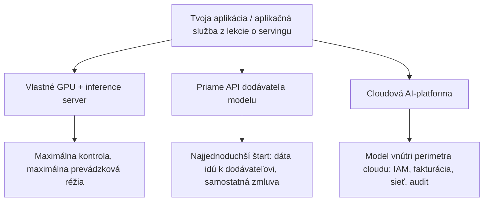

# Kde sa počítajú tvoje tokeny

Lekcia o servingu sa skončila na rázcestí. Aplikačná vrstva — autentifikácia, RAG pipeline, guardrails (bezpečnostné mantinely), streaming — je tvoja tak či onak; nevyriešená ostala až tá druhá škatuľa z lekcie o servingu: spustiť model na vlastných GPU, alebo si ho prenajať? Táto lekcia ide vetvou prenájmu — a tá má svoje vlastné rázcestie.

Tokeny z modelu dostaneš tromi spôsobmi a všetky tri ležia na jednej osi, medzi kontrolou a pohodlím:

- **Prevádzka u seba** — inference server na vlastných GPU (to pokryla lekcia o [servingu](../serving/index.md)): maximálna kontrola a zároveň celá prevádzková réžia na tvojich pleciach.
- **Priame API dodávateľa modelu** (OpenAI, Anthropic, Google) — najjednoduchšie napojenie, lenže tvoje dáta putujú k dodávateľovi a vzťah s ním je samostatná dvojstranná zmluva, ktorú tvoje právne oddelenie vyjednáva a stráži.
- **Medzi nimi cloudová AI-platforma** — modely bežia ako **managed endpointy** (spravované endpointy) vnútri cloudu, ktorý už aj tak používaš. To je téma tejto lekcie.

:::tip[▶ Video]

<YouTube id="XtT5i0ZeHHE" title="AI Inference: The Secret to AI's Superpowers — IBM Technology" />

Prehľadné zhrnutie toho, čo inferencia — vec, ktorú tu predáva každá platforma — vlastne je a prečo je jej prevádzka vo veľkom samostatná disciplína. (Video je v angličtine.)

:::

## Čo vlastne platforma predáva — perimeter

Čím sa platforma líši od priameho volania dodávateľa? Model je často presne tá istá množina váh, ku ktorej by si sa dostal cez API dodávateľa. Kupuješ si čosi iné: ten istý model za **bezpečnostným perimetrom** cloudu, ktorý už používaš.

- **Jednotná autentifikácia** — o prístup k modelu sa starajú tie isté IAM role, čo strážia tvoje úložiská a databázy; žiadna druhá sada API kľúčov.
- **Jednotná fakturácia** — tokeny pristanú na tej istej cloudovej faktúre ako virtuálne stroje a databázy a vzťahujú sa na ne tvoje podnikové zľavy.
- **Sieťová izolácia** — súkromné endpointy, takže premávka k modelu nikdy neprejde cez verejný internet.
- **Zdedený súlad** — certifikácie cloudu sa rozširujú na platformu: SOC 2, služby vhodné pre HIPAA, nástroje pre GDPR.
- **Audit-logy a kvóty** — na úrovni projektu či tímu: vidíš, kto koľko spálil, a stropuješ, kto koľko spáliť smie.

Nič z toho nemení, čo model povie. Všetko z toho mení, či mu tvoja firma vôbec smie niečo povedať.

## Tri platformy — a lekcia o menách

K polovici roka 2026 to na trhu vyzerá takto. Azure OpenAI je od Microsoftu a historicky bol cestou, ako používať modely OpenAI ako vlastnú službu Azure; platformu okolo neho Microsoft na konferencii Ignite v novembri 2025 premenoval z Azure AI Foundry na Microsoft Foundry a modely v nej sa dnes volajú Foundry Models, rozdelené na „Models sold by Azure“ a ponuky z trhoviska.

AWS Bedrock je od Amazonu — jediné z tých troch mien, ktoré sa ani nepohlo.

Vertex AI je od Google Cloudu a je uprostred premenovania: nový názov Gemini Enterprise Agent Platform ohlásili v apríli 2026, migrácia konzoly sa dokončila v máji 2026, no API endpointy sa nepresunuli — a dokumentácia zatiaľ visí medzi oboma menami.

Prečítaj si to ešte raz: dve z troch platforiem sa premenovali v priebehu jediného roka. Názvy produktov a hranice balíkov sa preskupujú neustále. Každé premenovanie prežijú kategórie schopností: katalóg modelov, záruky súkromia a rezidencie, úroveň spravovaného RAG, platformové guardrails a model priepustnosti a cien. Zvyšok lekcie je poskladaný podľa nich — celkom zámerne: nauč sa kategórie a každý názov produktu (vrátane všetkých, čo tu padnú) ber ako momentku. Lekcia o [MCP](../../part-2-agents/mcp/index.md) zvolila pri agentových protokoloch presne ten istý prístup; platí to aj tu.

## Katalógy modelov — ktorá platforma obsluhuje ktoré modely

Prvá kategória je **model catalogue** (katalóg modelov): ktoré modely ti daná platforma dokáže obsluhovať ako managed endpointy?

Pôvodná ponuka Azure OpenAI bola exkluzívna: modely GPT zabalené do podnikovej nadstavby Azure — roky presne to, prečo po ňom firmy siahali. Katalóg Foundry sa odvtedy poriadne rozšíril — asi 1 900 modelov, pričom Anthropic sa pridal na Ignite 2025 popri Microsofte, OpenAI, Mistrale, xAI, Mete, DeepSeeku a Hugging Face.

Bedrock bol multi-vendor od začiatku a staré pravidlo „na AWS žiadne OpenAI“ je dnes jednoducho nepravdivé: modely OpenAI s otvorenými váhami (gpt-oss) dorazili v auguste 2025 a hraničné (frontier) modely GPT sú na Bedrocku všeobecne dostupné od júna 2026.

U Googlu je vlastnou kotvou Gemini, kým Model Garden nesie modely tretích strán aj otvorené modely — názov, ktorý premenovanie platformy okolo seba prežil.

| Platforma | Vlastný základ | Šírka katalógu |
|---|---|---|
| Microsoft Foundry (Azure OpenAI) | rodina OpenAI GPT ako vlastná služba Azure | ~1 900 modelov: Microsoft, OpenAI, Anthropic, Mistral, xAI, Meta, DeepSeek, Hugging Face |
| AWS Bedrock | vlastná rodina Amazonu Nova | multi-vendor od prvého dňa: Anthropic, Meta, Mistral, Cohere a ďalší — teraz vrátane OpenAI |
| Gemini Enterprise Agent Platform (Vertex AI) | Gemini | Model Garden: modely tretích strán (vrátane Claude) plus otvorené modely |

Dôsledok je väčší než ktorýkoľvek riadok tabuľky: kedysi výber modelu diktoval výber cloudu (potrebuješ GPT → ideš do Azure, koniec debaty). Éra exkluzívnych katalógov sa končí — hraničné OpenAI na Bedrocku, Anthropic v katalógu Foundry, Claude dnes na všetkých troch. Čím väzba medzi modelom a cloudom slabne, tým väčšmi sa ťažisko rozdielov presúva na nadstavbu: záruky rezidencie, úroveň spravovaného RAG, ekonomika kapacity. A práve tam mieri zvyšok lekcie.

## Súkromie a rezidencia dát

Všetky tri sa pri svojich podnikových AI-ponukách zaväzujú k rovnakému základu: tvoje prompty a výstupy sa nepoužívajú na trénovanie základných modelov a spracúvajú sa vnútri hraníc služby. Malým písmom sa však líšia dosť na to, aby to malo význam. Google to podmieňuje slovami „v predvolenom nastavení“. Azure nesie výhradu o monitorovaní zneužitia — v predvolenej konfigurácii môže obsah, ktorý monitorovanie zneužitia označí, prejsť ľudskou kontrolou, ak sa tvoja organizácia z toho výslovne neodhlásila. Prečítaj si aktuálnu stránku o ochrane dát tej platformy, na ktorú nasadzuješ — tu je produktom presné znenie.

**Rezidencia dát** (data residency) je záruka toho, kde sa inferencia deje. Vyberáš si región alebo geografiu, ktorá požiadavky spracuje — so stálou výhradou, že dostupnosť modelov sa medzi regiónmi líši a za najnovšími modelmi zaostáva. Každá platforma ponúka páčku medzi rezidenciou a kapacitou pod vlastnými názvami: Azure cez typy nasadenia (Standard regional, Data Zone, Global), Bedrock cez medziregionálnu inferenciu (geografické profily ohraničené na US, EU či APAC oproti globálnym profilom) a Vertex cez regionálne endpointy oproti globálnemu endpointu — kde „globálny“ výslovne znamená žiadnu záruku rezidencie. Názvy sa budú meniť; trvalým mechanizmom je samotná páčka — na jednom konci pripnutá geografia a užšia kapacita, na druhom spoločná celosvetová kapacita a žiadny prísľub rezidencie.

Firmám na tom záleží z celkom konkrétneho dôvodu: regulačné režimy (GDPR, sektorové pravidlá vo financiách či zdravotníctve) viažu, kde sa smú osobné a regulované dáta spracúvať. Rezidencia, záväzok netrénovať na tvojich dátach a súkromné sieťové pripojenie spolu tvoria **triádu súladu**, ktorá dovolí právnemu oddeleniu dať zelenú — a často je to práve rozhodujúci argument pre platformu oproti priamemu API dodávateľa. Toto rázcestie už poznáš: lekcia o [ingestione](../../part-1-rag/ingestion/index.md) ho postavila ako voľbu medzi prevádzkou u seba a API pri embeddingových modeloch. To isté rázcestie, teraz na úrovni samotného modelu.

Tretia noha triády v jednej konkrétnej vete: všetky tri podporujú súkromné pripojenie, takže prompty nikdy neprejdú cez verejný internet — Azure Private Link, AWS PrivateLink s VPC endpointmi a Google Private Service Connect.

## Spravovaný RAG a platformové guardrails

Každá platforma predáva úroveň **spravovaného RAG** (managed RAG) — pipeline z Prvej časti príručky (ingestion → chunking → embedding → vektorové úložisko → retrieval, občas reranking) zabalený ako produkt. AWS má klasické Bedrock Knowledge Bases, ku ktorým v júni 2026 pribudla plne spravovaná Amazon Bedrock Managed Knowledge Base s natívnymi konektormi a integráciou s AgentCore. U Azure je chrbtovou kosťou vyhľadávania Azure AI Search a súčasnou zabalenou úrovňou groundingu (opretie odpovede o kontext) je Foundry IQ; jeho predchodca „On Your Data“ sa vyraďuje v októbri 2026. U Googlu pokrýva pipeline RAG Engine, popri produkte na podnikové vyhľadávanie (Vertex AI Search, ktorý sa práve preznačuje pod Agent Platform). Postup je stále rovnaký: najprv schopnosť, mená až v zátvorke a s predpokladaným dátumom spotreby.

Kompromis, ktorý si treba osvojiť: spravovaný RAG ti dá rýchlosť — funkčný pipeline za pár dní, bez vlastnej infraštruktúry — a platí zaň prepínačmi, ktoré ťa Prvá časť príručky učila otáčať. Stratégia chunkingu, váženie hybridného vyhľadávania, voľba rerankera či napojenia na evaluáciu sa medzi produktmi líšia a môžu byť pevne dané alebo nepriehľadné. Tímom, ktoré potrebujú ladiť kvalitu cez evaluačnú slučku z lekcie o [evaluácii](../../part-1-rag/cross-cutting/evaluation/index.md), spravovaná úroveň často prestane stačiť; nechajú si ju len na ingestion a úložisko a retrieval si vezmú do vlastných rúk. Poctivé východisko: spravovaný RAG pre štandardné korpusy, vlastný vtedy, keď evaluácia ukáže, že predvolené nastavenia nestačia.

Guardrails sú zabalené do produktu rovnako. Bedrock dodáva Guardrails — konfigurovateľné filtre na škodlivý obsah, PII a zakázané témy plus kontextové kontroly groundingu, ktoré odpoveď ohodnotia oproti získanému kontextu a vynútia prahové skóre. Azure dodáva AI Content Safety vrátane Prompt Shields na detekciu prompt injection, vystavené vo Foundry ako „Guardrails + controls“ — a Azure svoje obsahové filtre premenoval na „Guardrails“, čo je ďalší dôkaz, že mená sú len momentky. Google dodáva Model Armor. Všetky tri realizujú koncepty z lekcie o [guardrails](../../part-1-rag/cross-cutting/guardrails/index.md) ako spravované služby — čím sa otvára otázka „postaviť či kúpiť“, ktorú priamo rieši lekcia o [ekosystéme nástrojov](../tooling-ecosystem/).

## Priepustnosť a cenové modely

Jedinú cenu tu nenájdeš — absolútne ceny zastarávajú ešte rýchlejšie než názvy platforiem. Stabilné sú cenové modely a každá platforma ponúka rovnaké dva režimy spotreby. **On-demand** (platba za tokeny) znamená, že platíš za spotrebované tokeny na zdieľanej kapacite, podliehajúcej rate limitom (strop na počet požiadaviek) a kvótam. Rezervovaná kapacita znamená vyhradenú priepustnosť s predvídateľnou latenciou pre ustálenú vysokú záťaž — všeobecne **rezervovaná priepustnosť** (provisioned throughput); v konkrétnych menách je to PTU (provisioned throughput units) na Azure, Provisioned Throughput na Vertexe a na Bedrocku úroveň Reserved, odkedy Bedrock v novembri 2025 preskladal ceny do úrovní Reserved, Priority, Standard a Flex (starý názov „Provisioned Throughput“ prežíva pri starších a vlastných modeloch).

Oplatí sa poznať aj tretiu úroveň: dávku. Všetky tri dokumentujú zľavnené asynchrónne dávkové spracovanie pre neinteraktívne záťaže — zhruba za polovicu on-demand ceny, pri podporovaných modeloch (Azure Batch, Bedrock batch inference, Vertex batch predictions). Ak záťaž nepotrebuje odpoveď v priebehu sekúnd — nočné spracovanie dokumentov, hromadná klasifikácia, offline behy evaluácie — **dávkový režim** ti predá najlacnejšie tokeny, aké platforma má. Nezamieňaj ho s continuous batching z lekcie o [servingu](../serving/index.md): to žije v plánovači GPU inferenčného servera, kým dávkový režim je cenová úroveň na strane API.

Jedna prevádzková konštanta: kvóty sú na región a na model a produkčný návrh musí zvládať chyby 429 bez ohľadu na to, ktorá platforma za ním stojí. To je ten kontrolný zoznam opakovaní a stropov na počet požiadaviek z lekcie o [servingu](../serving/index.md) a zároveň úvodný problém [LLMOps](../llmops/), kde smerovanie a fallbacky dodávajú, čo jediný endpoint zaručiť nevie.

## Ako si vybrať

Začni tým, ako rozhodnutie naozaj vzniká: v praxi platformu spravidla určuje existujúci záväzok voči cloudu — to, kde už žijú tvoje dáta, IAM a podniková zmluva — a nie výsledky modelov v benchmarkoch. Znie to lenivejšie, než to je: nadstavba je produkt a nadstavba sa najviac oplatí práve tam, kde už máš infraštruktúru. Keď to vezmeš do úvahy, naozaj sa oplatí porovnať štyri veci: či obsluhuje modely, ktoré potrebuješ, v tvojom regióne; či rezidencia a súlad vyhovujú tvojmu regulátorovi; či sadne úroveň spravovaného RAG, alebo si radšej postavíš vlastný pipeline; a aká je ekonomika rezervovanej kapacity pri tvojej záťaži.

Nech vyhrá ktorákoľvek platforma, drž si jednu architektonickú poistku: aplikačnú vrstvu nechaj nezávislú od poskytovateľa. OpenAI-kompatibilní klienti a vrstva brány či routera — vzor, ktorý [LLMOps](../llmops/) rozvíja s [LiteLLM](https://www.litellm.ai) a podobnými nástrojmi — ti zachovajú možnosť presunúť sa inam. Všimni si, kde **vendor lock-in** (uviaznutie u dodávateľa) v skutočnosti sídli: endpointy sú čoraz zameniteľnejšie, kým platformové SDK a spravované úrovne ťa priviažu. Uviaznutie nesídli v endpointe, ale v tom, čím je obalený.

## Čo si odniesť z lekcie

- Model získavaš tromi spôsobmi: prevádzkuješ ho na vlastných GPU, voláš priame API dodávateľa modelu, alebo použiješ spravovanú AI-platformu svojho cloudu — os medzi kontrolou a pohodlím.
- Produktom platformy je model za existujúcim perimetrom tvojho cloudu: IAM, fakturácia, súkromné sieťové pripojenie, zdedený súlad, audit-logy a kvóty.
- Mená sú momentky — dve z troch platforiem sa premenovali v priebehu jediného roka. Trvalé sú kategórie schopností: katalóg, súkromie a rezidencia, spravovaný RAG, guardrails, cenový model.
- Katalógy sa líšia, no zbiehajú sa: Claude na všetkých troch, modely OpenAI na Bedrocku. Ako exkluzivita bledne, rozhoduje nadstavba.
- Triáda súladu — rezidencia dát, záväzky netrénovať na tvojich dátach a súkromné sieťové pripojenie — dovolí právnemu oddeleniu dať zelenú a často rozhodne medzi platformou a priamym API.
- Spravovaný RAG vymieňa prepínače z Prvej časti príručky za rýchlosť: dobré východisko pre štandardné korpusy, prekonané vtedy, keď evaluácia ukáže, že predvolené nastavenia nestačia.
- Nauč sa cenové modely a ceny preskoč: on-demand za token, rezervovaná priepustnosť pre ustálenú záťaž, dávka zhruba za polovicu pri asynchrónnej práci. Kvóty sú na región a na model; navrhuj s ohľadom na chyby 429.
- Vyberaj podľa záväzku voči cloudu plus štyroch skutočných rozdielov: modely v tvojom regióne, súlad, spravovaný RAG a ekonomika kapacity.
- Aplikačnú vrstvu drž nezávislú od poskytovateľa — uviaznutie sídli v nadstavbe, nie v endpointe.

**Nové pojmy** → [Glosár](../../glossary.md): managed endpoint, model catalogue, data residency, provisioned throughput, batch mode, managed RAG, vendor lock-in.

---

:::note[Ďalej — druhá časť lekcie]

**[Náklady, agenti a suverenita](./deep-dive.md)** — dôkladný prechod cez tie isté platformy: ponuky fine-tuningu (doladenie modelu) a kam sa hodia, spravované agentové prostredia (Bedrock AgentCore, Foundry Agent Service, Vertex Agent Engine), modelovanie nákladov platformy a FinOps (cenové štruktúry jednotlivých platforiem, zľavy za záväzok využitia, medziregionálny egress), vzory multi-cloud brány a ponuky suverénneho cloudu.

Pozri aj, v Časti III: [serving](../serving/index.md) pre rázcestie prenajať-či-vlastniť, na ktoré táto lekcia odpovedá, [LLMOps](../llmops/) pre riadenie výdavkov na úrovni organizácie a smerovanie naprieč modelmi, [ekosystém nástrojov](../tooling-ecosystem/) pre rozhodnutia „postaviť či kúpiť“ okolo platformy. [Prehĺbenie o servingu](../serving/deep-dive.md) pokrýva serverless GPU a ekonomiku voľby medzi stále teplým GPU a škálovaním na nulu zo strany prevádzky u seba.

:::
