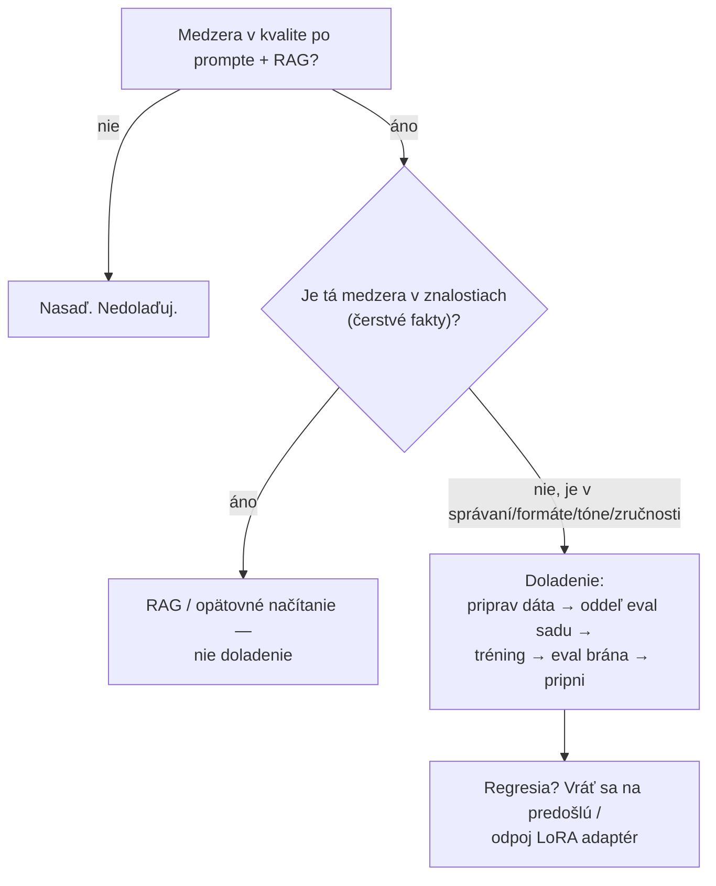
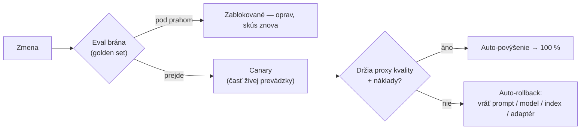
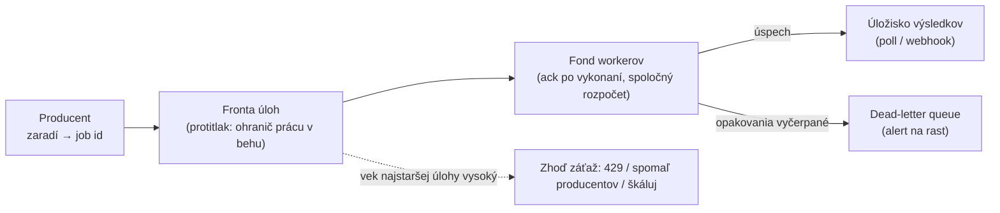

# Prevádzka systému v rozsahu organizácie — doladenie, výdavky a práca, ktorá počká

[Prvá časť lekcie](./index.md) nakreslila prevádzkovú slučku: nasaditeľný artefakt nie je len kód, ale prompt, verzia modelu, snímka indexu, konfigurácia a guardrails (bezpečnostné mantinely) naraz; eval v CI je brána, ktorou prejde každá zmena; monitorovanie stráži drift; a náklady majú vlastné páky. Pomenovala aj vzory vydávania — canary, shadow, A/B — a mechaniku, ktorá ich poháňa: smerovanie medzi modelmi, centrálnu bránu k modelom, cachovanie promptu aj sémantické cachovanie, tokenovú diétu a dávkový režim. Toto je hlboký druhý prechod. Úvod lekcie predpokladáme po celý čas a nič z neho neučíme nanovo; nižšie ide o pokročilú nadstavbu nad tou istou prevádzkou, videnú z úrovne organizácie, ktorá systém prevádzkuje, nie jedného inžiniera, čo mení jeden prompt.

Tri z tém tejto stránky sa prekrývajú s prehĺbeniami, ktoré ich teóriu už rozoberajú — tam ich len prepojíme, nebudeme ich odvodzovať nanovo:

- Mechanika spoľahlivosti podľa SRE — vybrať SLI, nastaviť SLO nad časovým oknom, spočítať rozpočet chýb ako vzdialenosť k dokonalým 100 %, alertovať podľa rýchlosti míňania, trvať na tom, aby aspoň jeden SLI meral kvalitu, a vynucovať mäkký aj tvrdý strop na požiadavku za behu — žije v [prehĺbení o observability](../../part-1-rag/cross-cutting/observability/deep-dive.md) (pozorovateľnosť). Tam patrí aj druhá polovica regresie: *rozpoznať* štatisticky reálny pokles kvality a *priradiť* ho naprieč spanmi trace tej fáze, ktorá ho spôsobila, a potom povýšiť padajúce tracy do golden setu (etalónová sada).
- Mechanika cien jednotlivých platforiem — úrovne za záväzok využitia, násobky cachovania promptu, tvar dávkovej zľavy, medziregionálny egress — žije v [prehĺbení o cloudových platformách](../cloud-platforms/deep-dive.md).

Čo vlastní táto stránka od začiatku do konca: kedy a ako doladiť model, riadenie výdavkov na úrovni organizácie, pohľad releasovej brány a rollbacku na zachytenú regresiu, rozpočty chýb ako písaný organizačný proces a frontovú infraštruktúru, ktorá nesie dávkové záťaže.

## Kedy meniť váhy

:::tip[▶ Video]

<YouTube id="zYGDpG-pTho" title="RAG vs Fine-Tuning vs Prompt Engineering: Optimizing AI Models — IBM Technology" />

Trojcestné rozhodnutie, ktoré táto sekcia formalizuje, prejdené na jeden záťah — oplatí sa pozrieť skôr, než začneš dolaďovať. (Video je v angličtine.)

:::

Fine-tuning (doladenie modelu) mení samotné váhy modelu. Prompt a RAG menia to, čo modelu predložíš pred nezmenené váhy — a práve ten rozdiel určuje poradie, v akom po nich siahaš: najprv prompt, potom RAG, doladiť až naposledy. Prvé dve možnosti sú lacnejšie, vrátiš ich jediným commitom a ani jedna ti nezanechá vlastný modelový artefakt na údržbu. Doladiť model je preto posledná záchrana, po ktorej siahneš, len keď prompt aj RAG narazia na strop *a zároveň* je tá medzera taká, ktorú doladiť naozaj pomôže: správanie, formát či štýl, ktorý model spoľahlivo neudrží; tón alebo idiom domény; cieľ na latenciu či náklady, ktorý malý doladený model splní tam, kde veľký všeobecný nie; alebo zručnosť, ktorú žiadny prompt nevie vyvolať. Na jedno sa model dolaďovať neoplatí — na aktuálnosť znalostí. Fakty doladeného modelu zamrznú v čase tréningu a starnú presne ako neobnovený korpus; držať znalosti čerstvé je úloha retrievera a žiadne dolaďovanie nenahradí [opätovné načítanie do indexu](../../part-1-rag/ingestion/index.md) (re-ingest).

Metódy tvoria rodinu, od najľahšej po najťažšiu:

- **SFT** — supervised fine-tuning, tréning na označených pároch vstup→výstup. Predvoľba a to, čo väčšina tímov myslí slovom „doladiť“.
- **DPO** — direct preference optimisation, učí sa z dvojíc preferovanej a odmietnutej odpovede. Zladí tón a formát bez toho, aby si musel postaviť samostatný model odmeny.
- **RFT** — reinforcement fine-tuning, signál odmeny prichádza od gradera (hodnotiteľ), ktorého si zadefinuješ. Platforma pre každý prompt navzorkuje niekoľko kandidátskych odpovedí, grader im priradí skóre a nasleduje aktualizácia politiky gradientom — navzorkuj, ohodnoť, aktualizuj — až kým sa model neoptimalizuje pre tvojho gradera. Hodí sa na úlohy s overiteľnou odpoveďou, kde grader vie oskórovať správnosť. K polovici roka 2026 (júl 2026) ponúka OpenAI RFT na svojom uvažovacom modeli o4-mini a SFT na malých modeloch ako GPT-4.1 nano; Amazon Bedrock rozšíril RFT aj na modely s otvorenými váhami — GPT-OSS od OpenAI a Qwen — cez OpenAI-kompatibilné fine-tuningové API (február 2026). Tie názvy produktov a modelov sú datovaná momentka; než sa na ktorýkoľvek z nich spoľahneš, over si aktuálnu dokumentáciu poskytovateľa.
- **LoRA / PEFT** — low-rank adaptation, jedna z parametricky efektívnych metód dolaďovania. Namiesto aktualizácie každého parametra trénuje malý LoRA adaptér nad zamrznutými váhami základného modelu: lacný na tréning, lacný na uloženie a — to je ten prevádzkový zisk — vymeniteľný aj skladateľný bez toho, aby si sa čo i len dotkol základného modelu.

Prehĺbenie o cloudových platformách tieto metódy pomenúva zo strany platformy a odvádza aj to, koľko stojí obsluhovať vlastný model; tú aritmetiku tu neopakujeme. Nech siahneš po ktorejkoľvek metóde, výsledok je ďalší nasaditeľný artefakt na tej istej slučke ako prompt či index, s tým istým životným cyklom. Ten cyklus sa začína dátami, pretože kvalita doladeného modelu je kvalita jeho datasetu: bez duplikátov, reprezentatívneho a správne označeného. Oddelíš si eval sadu, ktorú tréning nikdy neuvidí, natrénuješ a potom doladený model prejde tou istou eval bránou ako každé iné nasadenie — eval v CI z úvodu lekcie — ešte než obslúži jediného používateľa. Zhoršiť sa totiž vie ako čokoľvek iné. Doladený model sa môže *nadmerne prispôsobiť* (nádherne skóruje na svojom tréningovom rozdelení a horšie všade inde) alebo *zabudnúť* (stratí všeobecnú schopnosť, ktorú kedysi mal). Jedno aj druhé zachytí len golden set.

Rollback vyplýva z toho, že doladený model je pripnutý artefakt — model pinning (pripnutie modelu) z úvodu lekcie platí na tvoje doladené verzie rovnako ako na verzie poskytovateľa. Predošlú verziu si drž pripravenú obsluhovať; keď sa nová zhorší, pripneš sa späť na ňu — tá istá disciplína ako vrátenie promptu, len o úroveň vyššie. LoRA robí návrat takmer zadarmo: odpojíš adaptér a si okamžite späť na základnom modeli, bez nasadzovania váh. Chyba, ktorej sa treba vyhnúť: vydať doladený model bez pripnutého predchodcu, na ktorého sa dá vrátiť.

Väčšina tímov okolo RAG a agentov toto nikdy nepotrebuje — a to je úprimné zhrnutie celej sekcie. Doladený model je trvalý záväzok: pretrénuj ho, keď poskytovateľ vyradí základný model podľa životného cyklu z úvodu lekcie, pretrénuj ho, keď sa doména posunie, eval dáta vlastníš už navždy a prehlbuješ uviaznutie u dodávateľa, lebo doladený model sa medzi dodávateľmi neprenáša. Ak prompt a RAG latku prekročia, ďalej netreba ísť. Dolaďuj, keď je medzera v správaní reálna a stabilná — nikdy nie preto, aby si vsunul znalosti, ktoré vie retriever podať čerstvé.

## Riadenie výdavkov

Cenové páky platformy — zľavy za záväzok využitia, násobky cachovania promptu, dávkový režim zhruba za polovicu ceny, medziregionálny egress — sú predmetom [prehĺbenia o cloudových platformách](../cloud-platforms/deep-dive.md) a potiahnuť každú z nich je inžinierske rozhodnutie. Riadenie (governance) je vrstva nad nimi. Jej úloha: spraviť výdavky viditeľnými, mať za ne majiteľa a ohraničiť ich naprieč tímami, aby sa páky naozaj ťahali a aby žiaden tím ticho nevyčerpal celý rozpočet sám. Úvod lekcie umiestnil rozpočty na LLM gateway (LLM-brána); toto je organizácia postavená okolo nich.

Prvá prekážka je priradenie nákladov (cost attribution), zvláštne práve pri práci s LLM. Cloudový FinOps značkuje *zdroje* — virtuálny stroj, disk, rozdeľovač záťaže. Za volaním LLM-API taký majetok nestojí: je to transakcia, nie označiteľná vec, na infraštruktúrnej vrstve niet čoho sa chytiť. Priradenie preto treba zachytiť na aplikačnej vrstve. Každé volanie označíš funkciou, tímom, nájomcom, trasou a modelom, ktorý zaň stál — sú to tie isté atribúty trace, ktoré si observability už aj tak zaznamenáva, takže mechaniku priradenia nákladov a OpenTelemetry rozoberá [prehĺbenie o observability](../../part-1-rag/cross-cutting/observability/deep-dive.md) — a tú metadátovú stopu prepošleš do účtovných dát. Preskoč to a mesačný účet sa zosype do jediného neužitočného čísla: vieš, že si to minul, a nič o tom, kam to šlo.

S priradením v ruke sa navrch kladú dva modely alokácie a FinOps Foundation medzi nimi ťahá pevnú čiaru. **Showback** (zobrazenie nákladov) vykáže každému tímu, funkcii či produktu jeho vlastnú spotrebu, kým náklad ostáva na centrálnom rozpočte — viditeľnosť bez interného účtovania. **Chargeback** (preúčtovanie nákladov) ide ďalej a náklad naozaj fakturuje späť do P&L spotrebúvajúceho tímu alebo produktu — silnejšia zodpovednosť za cenu náročnejšieho aparátu. Na poradí záleží: showback je nespochybniteľný základ, vždy potrebný; k chargebacku sa prepracuješ *až keď je priradenie dôveryhodné* — lebo chargeback nad číslami, ktorým ľudia neveria, plodí spory rýchlejšie, než ženie úspory.

Nič z toho už nie je nepovinné. State of FinOps 2026 od FinOps Foundation uvádza, že AI-výdavky dnes riadi 98 % respondentov oproti 31 % spred dvoch rokov, a granulárne monitorovanie AI-výdavkov — tokeny, LLM-požiadavky, využitie GPU — menuje ako najžiadanejšiu nástrojovú schopnosť roka. (Zistenie tej istej organizácie, že neoptimalizované nasadenie môže stáť 30- až 200-násobne viac než optimalizované, cituje prehĺbenie o cloudových platformách; je to dôvod, prečo tie páky vôbec existujú.)

Ohraničenie robia tri kontroly na úrovni organizácie a všetky tri žijú tam, kadiaľ už každá požiadavka prechádza — na LLM-bráne.

1. **Rozpočty s alertmi:** tokenové rozpočty na tím a na funkciu, s mäkkým stropom (soft cap), ktorý varuje, a tvrdým stropom (hard cap), ktorý odmietne alebo prepne na lacnejší variant. Vynucovanie tých stropov za behu je predmet prehĺbenia o observability; *politika* toho, kto akú kvótu dostane, sa rozhoduje tu.
2. **Smerovanie podľa úrovne modelu**, povýšené z taktiky na pravidlo — smerovanie medzi modelmi premenené na governance, aby lacná prevádzka šla na lacný model v predvolenom nastavení a vlajkový model bol vec, ktorú si vedome zvolíš a obhájiš. Páka, ktorá účtom pohne najviac.
3. **Kontrola výdavkov v zozname pred nasadením:** keďže zmena promptu je zmena nákladov, releasová brána z ďalšej sekcie kontroluje aj predpokladaný náklad na požiadavku, nielen kvalitu.

Každá z týchto kontrol zlyhá predvídateľne, keď ju vynecháš. Chargeback fakturovaný skôr, než je priradenie dôveryhodné, splodí spory a hranie sa s číslami. Rozpočet len s mäkkými stropmi rozdá alerty, na ktoré nikto nekoná, a účet aj tak pristane. Bez predvolenej trasy na lacný model platí každá požiadavka vlajkovú cenu z čistej zotrvačnosti.

## Releasová brána a cesta k rollbacku

Rozpoznať regresiu — odlíšiť štatisticky reálny pokles kvality od jedného zlého popoludnia — a priradiť ju naprieč spanmi trace konkrétnej fáze a potom povýšiť padajúce tracy do nových prípadov golden setu je predmet prehĺbenia o observability. Táto sekcia rozoberá druhú polovicu: čo releasový proces s regresiou *urobí*, keď ju už raz zachytí. Buď ju zablokuje, alebo ju vráti späť.

Blokovanie je z tých dvoch lacnejšie — je to eval v CI z úvodu lekcie, videný zo strany vydania. Zmena, ktorej metriky na golden sete klesnú pod prah, je regresia zachytená ešte pred vydaním; zlúčenie či nasadenie sa zastaví pri bráne — na najlacnejšom mieste celého systému, kde ju vôbec možno zastaviť, dávno predtým, než na ňu narazí prvý používateľ. Toto je **release gate** (releasová brána): kontrola kvality, ktorá stojí medzi zmenou a produkciou.

Lenže brána zachytí len to, čo golden set pokrýva, a zvyšok nájde produkčná prevádzka — preto sa vydanie neprepne z nuly na sto percent naraz. Ide von postupne. Canary (kanárikové nasadenie) si vezme časť živej prevádzky, kým riadič vydania (release controller) sleduje proxy kvality (nepriame signály) a náklady popri chybovosti a latencii. Odtiaľ sa automatizujú dva výsledky: keď metriky držia, nasleduje automatické povýšenie na plnú prevádzku; keď sa niektorá proxy prelomí, nasleduje automatický rollback na predošlú verziu. Celý dôvod sledovať kvalitu, a nie len dvestovku, je práve ten canary — rýchly, lacný a mierne nesprávny: musí spustiť rollback, a spraví to jedine signál kvality.

Rollback je pre kód triviálny, no pre každý z piatich artefaktov je jemne iný, takže každý potrebuje vlastnú cestu premyslenú dopredu. Prompt sa vráti tak, že vrátiš commit alebo znova pripneš verziu v prompt registry (register promptov) z úvodu lekcie. Model sa vráti opätovným pripnutím predošlej verzie; doladený model tak, že pripneš jeho predchodcu alebo odpojíš LoRA adaptér (prvá sekcia). Konfigurácia či politika guardrails sa vráti vrátením hodnoty. Index je pasca: vráti sa jedine obnovením predošlej snímky, a re-ingest, ktorý prepíše na mieste, žiadnu snímku na obnovenie nemá — cesta späť neexistuje vôbec. Index preto musí byť verziovaný, pomenovaná snímka, ktorú vieš znova pripnúť, práve preto, aby bol zlý re-ingest rovnako vratný ako každý iný artefakt. Korpus je tiež vydanie a vydanie, ktoré nevieš zvrátiť, je príťaž a riziko.

Existuje jedna releasová kontrola silnejšia než čokoľvek uplatnené na jednotlivú zmenu: organizácia rozhodne, že *žiadne* vydania sa teraz nedejú. To je release freeze (zmrazenie vydávania) a to, čo ho spravuje, je politika rozpočtu chýb — predmet ďalšej sekcie.

## Rozpočty chýb ako organizačná zmluva

Mechanika — výber SLI, nastavenie SLO nad oknom, výpočet rozpočtu chýb ako vzdialenosti k 100 %, alerting podľa rýchlosti míňania aj pravidlo, že aspoň jeden SLI musí byť kvalitatívny SLI počítaný online evaluáciou — patrí celá prehĺbeniu o observability. Táto sekcia preberá to, čo z tých čísel robí rozhodnutie, ktorým je organizácia viazaná: error budget policy (politika rozpočtu chýb).

Politika rozpočtu chýb je písaná dohoda, podpísaná pred akýmkoľvek incidentom, ktorá hovorí, čo sa stane pri vyčerpaní rozpočtu a kto to spraví. Kanonická verzia od Google SRE znie ako pravidlo s dvomi ramenami. Na úrovni SLO alebo nad ňou idú vydania podľa bežnej releasovej politiky. Len čo sa rozpočet vyčerpá za kĺzavé okno — SRE si v rozpísanom príklade berie štyri týždne — všetky zmeny a vydania sa zmrazia okrem opráv P0 a bezpečnostných záplat, kým sa služba nevráti do rámca svojho SLO. To je zmrazenie vydávania a politika musí menovať majiteľa každej akcie; nezhoda eskaluje na menovaného rozhodovateľa, v príklade SRE na CTO. Bez podpísanej politiky je zmrazenie iba návrh, a návrh nie je kontrola.

Keď je systémom pod politikou LLM-aplikácia, menia sa dve veci. Po prvé, to, čo sa zmrazuje, je päťartefaktové nasadenie — úprava promptu, opätovné pripnutie modelu, re-ingest, zmena konfigurácie či politiky guardrails — nielen kód, takže zmrazenie zastaví aj iteráciu promptov spolu so všetkým ostatným. Po druhé, rozpočet môže byť rozpočet kvality. SLO na mieru úspešnosti podľa faithfulness (vernosť zdrojom), ktorého rozpočet sa míňa, môže spustiť zmrazenie presne tak ako SLO na dostupnosť: služba, ktorá je stopercentne dostupná a merateľne halucinuje, je nad rozpočtom, a organizácia sa musí vopred zhodnúť, že prepálenie kvality zmrazí vydania rovnako ako prepálenie dostupnosti.

Tá zhoda je zmluvou medzi dvomi stranami, lebo rozpočet je v spoločnom vlastníctve. Produktová strana ho míňa — každá funkcia a každá zmena ho uberá — a strana spoľahlivosti ho stráži a drží právomoc zmrazenie vyhlásiť. Politika je to, čo si tie dve strany vyjednajú dopredu, aby sa zmrazenie neriešilo nanovo uprostred incidentu, keď ani jedna strana nie je v nálade ustúpiť. Vynechaj podpis a zmrazenie sa nikdy nestane; z rozpočtu ostane iba gesto. Prevádzkuj ho len s jedným SLI na dostupnosť a máš zelené dashboardy nad halucinujúcou službou — divadlo dostupnosti z prehĺbenia o observability, k tomu istému bodu prídeš zo strany governance.

## Fronty pre prácu, ktorá počká

Nie každá práca s LLM je interaktívna. Nočné obohacovanie korpusu, dobehy, generovanie syntetických eval dát, hromadná klasifikácia — sú viazané na zdroje a pomalé, a nechceš, aby súperili so živou prevádzkou o tú istú kapacitu. Job queue (fronta úloh) oddelí tempo, akým práca prichádza, od tempa, akým sa spracúva. Producent zaradí úlohu a okamžite dostane späť job id, nič sa neblokuje; fond workerov (worker pool) vyprázdňuje frontu takým tempom, aké hardvér a limity poskytovateľa dovolia; výsledky pristanú v úložisku, ktoré klient buď periodicky kontroluje (poll), alebo mu prídu webhookom.

Dávkový režim z úvodu lekcie je jeden spôsob, ako prevádzkovať offline prácu, ale ten *spravovaný*. Batch API poskytovateľa — OpenAI, Anthropic, Vertex, zhruba za polovicu ceny a s približne 24-hodinovým SLA k polovici roka 2026, jeho ceny rozoberá [prehĺbenie o cloudových platformách](../cloud-platforms/deep-dive.md) — zoberie súbor požiadaviek, prebehne ho a vráti výsledky, bez workerov na prevádzku. Táto sekcia preberá ten druhý prípad: asynchrónnu infraštruktúru, ktorú prevádzkuješ *ty*, keď práca nie je jediné volanie poskytovateľa. Viackroková pipeline, tvoja vlastná GPU-inferencia, mix poskytovateľov, práca, ktorá sa musí striedať s databázou — nič z toho sa do odovzdávaného súboru nezmestí. Rozhodnutie je čisté: ak je úloha N nezávislých promptov s výsledkami prijateľnými do dňa, použi Batch API poskytovateľa. Ak je to pipeline, ktorú orchestruješ ty, prevádzkuj frontu.

:::note[Predpoklady]

Fronty sú komoditná infraštruktúra, ktorú táto príručka neučí. Ak si žiadnu neprevádzkoval, Celery ([docs.celeryq.dev](https://docs.celeryq.dev)) s brokerom Redis alebo RabbitMQ je zrelá predvoľba v Pythone, a arq ([arq-docs.helpmanual.io](https://arq-docs.helpmanual.io)) s RQ ([python-rq.org](https://python-rq.org)) sú ľahšie, natívne asynchrónne varianty vtedy, keď úloha je naozaj len asynchrónne HTTP-volanie na LLM a prirodzene sa páruje s asynchrónnou webovou službou. Nástroj sa nauč z jeho vlastnej dokumentácie; nižšie ide len o AI-špecifický rozdiel — o to, čo sa mení, keď sú úlohy vo fronte volania LLM.

:::

Prvá zmena je trvanie. Úloha s LLM beží sekundy až minúty, nie milisekundy, čo naťahuje okno, v ktorom worker môže spadnúť uprostred úlohy. Ak worker úlohu potvrdí skôr, než ju dokončí, a potom spadne, úloha sa stratí — je označená ako hotová, hoci hotová nikdy nebola — a pri naivnom prefetchi môže na mŕtvom workeri sedieť rezervovaných naraz aj niekoľko drahých úloh. Náprava: potvrdzuj až po vykonaní — Celeryho `acks_late` s `worker_prefetch_multiplier = 1`, aby bola úloha označená ako hotová až vtedy, keď jej výstup existuje, a pád ju znova doručí inému workerovi namiesto toho, aby ju zahodil. Pri milisekundovej úlohe je to luxus navyše; tu, kde stratená úloha znamená už spálené tokeny a premárnený čas, je to nevyhnutnosť.

Opätovné doručenie znamená, že úloha môže bežať dvakrát, a tým sa dostávame k ďalšej starosti — idempotencii (idempotency). Úloha, ktorá len číta — klasifikuje, embedduje, skóruje — nestojí nič, keď sa spustí znova. Úloha, ktorá zapisuje — aktualizuje záznam, pošle oznámenie, pripíše do indexu — sa pri opakovaní zapíše dvakrát, to isté riziko, aké v [Druhej časti príručky](../../part-2-agents/tool-use/index.md) prináša volanie nástroja s vedľajším účinkom (side effect). Liek je tiež ten istý: daj každej zapisujúcej úlohe deterministický kľúč idempotencie (idempotency key), aby sa z opätovného doručenia stalo prázdne vykonanie namiesto duplicity.

Potom je tu spoločný rozpočet. Každý worker, ktorý ťahá z fronty, čerpá z tej istej tokenovej a rýchlostnej kvóty poskytovateľa, takže keď potiahnu všetci naraz, spolu narazia na chyby 429 a spolu prepália rozpočet výdavkov. Fronta je miesto, kde presadíš protitlak (backpressure, ochrana pred zahltením) — ohraničíš prácu v behu cez `worker_prefetch_multiplier` a zastropuješ súbežnosť tak, aby zostala pod limitom poskytovateľa, ktorý LLM-brána už z úvodu lekcie centralizuje. A keď vek najstaršej úlohy prerastie prahovú hodnotu, zhodíš záťaž (zhadzovanie záťaže, load shedding): vrátiš producentom chyby 429, spomalíš tempo zaraďovania alebo rozšíriš fond workerov. Fronta, ktorá donekonečna prijíma ďalšiu prácu, kým jej workeri zaostávajú, výpadku neušla; len ho presunula z „odmietnuté teraz“ na „doručené o hodiny neskôr a zabudnuté“.

Posledná zmena: niektoré úlohy nikdy neuspejú. Poškodený dokument, prompt, ktorý vždy prekročí limit dĺžky alebo spustí guardrail — opakovaný donekonečna, taká otrávená úloha (poison job) zasekne frontu a na každom pokuse páli tokeny. Ohranič počet opakovaní a vyčerpanú úlohu smeruj do dead-letter queue (DLQ, fronta nedoručených úloh), bočnej fronty pre úlohy, ktoré svoje opakovania minuli. Potom alertuj na rast DLQ, lebo rastúca DLQ je skutočný signál — zlá dávka zhora, zmenený formát vstupu — nie šum na odfiltrovanie.

Keď Batch API poskytovateľa sadne — nezávislé požiadavky, výsledky do dňa — použi ho: lacnejší na polovičnej úrovni a bez workerov na prevádzku. Vlastnú frontu prevádzkuj len vtedy, keď je práca pipeline, ktorú ovládaš, potrebuje tvoj vlastný výpočet alebo sa musí striedať s tvojimi vlastnými systémami.

## Čo si odniesť z lekcie

- Dolaďuj až naposledy, keď prompt a RAG narazili na strop, a len na medzeru v správaní, formáte, tóne či zručnosti — nikdy pre čerstvé znalosti, čo je úloha retrievera. Doladený model je pripnutý artefakt na tej istej eval bráne ako každé nasadenie, vrátený opätovným pripnutím predchodcu alebo odpojením LoRA adaptéra.
- Metódy idú od ľahkej po ťažkú: SFT na označených pároch, DPO na dvojiciach preferovanej a odmietnutej odpovede, RFT s odmenou od gradera, ktorého si zadefinuješ, a LoRA / PEFT, ktoré trénuje vymeniteľný adaptér nad zamrznutými váhami. Ponuky poskytovateľov za nimi sú datovaná momentka na overenie.
- Riadenie výdavkov robí náklady viditeľnými, vlastnenými a ohraničenými: priraď na aplikačnej vrstve (volanie LLM je transakcia bez majetku na označenie), showback prevádzkuj vždy, chargeback pridaj až vtedy, keď je priradenie dôveryhodné, a rozpočty aj predvolenú trasu na lacný model vynucuj na bráne.
- Na releasovej strane regresie ju eval brána zablokuje ešte pred vydaním a postupné vydávanie ju automaticky vráti pri prelomenej proxy kvality alebo nákladov, tam kde by dashboard len na chyby a latenciu ostal zelený. Každý artefakt potrebuje cestu späť — a index ju má jedine vtedy, keď je verziovaný.
- Politika rozpočtu chýb sa podpisuje pred incidentom, nie počas neho: pri vyčerpaní rozpočtu sa zmrazia všetky päťartefaktové vydania okrem opráv P0 a bezpečnostných; prepálenie kvality zmrazí vydania rovnako ako prepálenie dostupnosti; každá akcia má menovaného majiteľa.
- Fronta úloh oddelí príchod od spracovania pre offline prácu. AI-rozdiely: potvrdenie až po vykonaní pri dlhých úlohách, idempotentné zapisujúce úlohy, protitlak nad spoločnou rýchlostnou kvótou a dead-letter queue pre otrávené úlohy. Keď je prácou dávka nezávislých požiadaviek do dňa, uprednostni Batch API poskytovateľa.

---

Pozri aj: mechanika SLI/SLO a rýchlosti míňania rozpočtu chýb spolu so slučkou rozpoznaj → priraď → priveď do evalu žije v [prehĺbení o observability](../../part-1-rag/cross-cutting/observability/deep-dive.md); ceny jednotlivých platforiem nájdeš v [prehĺbení o cloudových platformách](../cloud-platforms/deep-dive.md).

**[Nové pojmy](../../glossary.md)**: SFT, DPO, RFT, grader, LoRA / PEFT, showback, chargeback, error budget policy, release freeze, release gate, job queue, dead-letter queue (DLQ), backpressure, load shedding.
