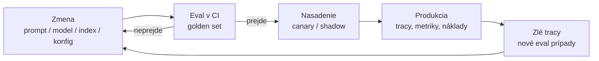
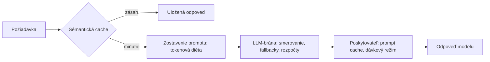

# Život LLM-systému sa vydaním nekončí, ale začína

[Serving](../serving/index.md) zabalil pipeline do služby. [Cloudové platformy](../cloud-platforms/index.md) rozhodli, kde model beží. [Ekosystém nástrojov](../tooling-ecosystem/index.md) dodal evaluáciu, guardrails (bezpečnostné mantinely) a observability (pozorovateľnosť) ako hotové produkty. Ostáva otázka, ktorá vypĺňa celý zvyšný život systému: čo znamená ho prevádzkovať, teda bezpečne ho meniť, sledovať ho a platiť zaň, týždeň čo týždeň.

**LLMOps** je priemyselný názov pre túto disciplínu: MLOps špecializovaný na LLM-aplikácie. Podľa vymedzenia od IBM, ktoré väčšina definícií nasleduje, pokrýva celý životný cyklus vrátane fine-tuningu (doladenie modelu). Táto príručka volí užší záber: ako vývojár aplikácií málokedy niečo trénuješ; to, čo skladáš a prevádzkuješ, sú prompty, verzie modelov, indexy pre vyhľadávanie a konfigurácie. To je náš pohľad, nie priemyselná definícia — výsek, v ktorom tím okolo RAG a agentov žije každý deň.

:::tip[▶ Video]

<YouTube id="cvPEiPt7HXo" title="Large Language Model Operations (LLMOps) Explained — IBM Technology" />

Disciplína jedným pohľadom — čo LLMOps dedí z MLOps a čo mení. (Video je v angličtine.)

:::

## Rozdiel, ktorý vnáša AI — artefakt a test

V klasickom DevOpse je nasaditeľný artefakt kód: nasadíš tú istú zostavu (build) a dostaneš to isté správanie. V LLM-aplikácii určuje správanie päť artefaktov naraz:

- **prompty** — systémový prompt a každá šablóna na ceste požiadavky;
- model — jeho identita a presná verzia;
- snímka indexu — čo je načítané a s akou konfiguráciou chunkingu a embeddingu;
- konfigurácia pipeline — top-K, reranker, prahy;
- politiky guardrails — vstupné aj výstupné kontroly.

Zmena ktoréhokoľvek z nich je **nasadenie** (deployment). A ktorýkoľvek z nich vie zhoršiť kvalitu bez jediného riadka zmeneného kódu.

Spolu s artefaktom sa zmenilo aj testovanie. Výstupy sú nedeterministické a kvalita má odtiene, kým jednotkový test chce čistý verdikt prešiel/neprešiel — nástrojom na zachytenie regresie je preto [evaluácia](../../part-1-rag/cross-cutting/evaluation/index.md), nie iba jednotkové testy. Zvyšok lekcie túto jedinú vetu rozpisuje do konkrétnej prevádzky.

## Nasadenie — CI/CD, keď artefakt nie je len kód

Celá disciplína sa stláča do jedinej slučky. Je chrbticou tejto lekcie — a napokon aj uzatvárajúcim obrazom celej príručky.

Bránou na začiatku je eval v CI. Každá zmena promptu, modelu, indexu či konfigurácie spustí golden set (etalónová sada); ak metriky klesnú pod prah, zlúčenie (merge) sa zablokuje. Je to regresné hodnotenie z Prvej časti príručky povýšené na fázu pipeline: tá istá zostava promptfoo, DeepEval a Ragas z [ekosystému nástrojov](../tooling-ecosystem/index.md), teraz zapojená do CI s verdiktom červená/zelená. Úprava promptu, ktorá potichu zníži faithfulness (vernosť zdrojom) o desať bodov, sa zachytí rovnako ako pokazený build.

### Prompty sú kód — aj konfigurácia

Prompty žijú dvojaký život. Sú kód: držíš ich vo verziovaní, zmena promptu prichádza ako recenzovateľný diff a vráti sa späť ako ktorýkoľvek commit. A sú konfigurácia: keď produktové tímy dolaďujú znenie deň čo deň, **prompt registry** (register promptov) — správa promptov v nástrojoch ako LangSmith alebo Langfuse — im dovolí vydávať verzie promptov bez nasadenia kódu. Oboje je v poriadku. Nemenné ostáva priradenie: každá produkčná odpoveď sa musí dať dohľadať k presnej verzii promptu, a práve preto si ju trace zaznamená.

### Pripni model

Poskytovatelia svoje modely verziujú a vyraďujú. OpenAI odlišuje ukončenie podpory (deprecation) od úplného vypnutia, zverejňuje mapovania na náhrady a vydáva časovo označené snímky, v ktorých dátum býva priamo v identifikátore, ako `gpt-4o-2024-05-13`, hoci tvar identifikátora sa medzi poskytovateľmi líši. Anthropic vedie explicitný životný cyklus — Active, Legacy, Deprecated, Retired — s najmenej 60 dňami predstihu pred vyradením.

Produkcia preto pripína presné verzie. Nepripnutý alias je nasadenie, ktoré si neplánoval: poskytovateľ presunie to, na čo alias ukazuje, a správanie tvojho systému sa pohne bez jediného diffu na tvojej strane. **Model pinning** (pripnutie modelu) mení toto prekvapenie späť na rozhodnutie — keď prechádzaš na novú verziu, ber to ako skutočné nasadenie: znova spusti eval a potom vydávaj postupne.

### Vydávaj postupne

Vzory postupného vydávania pochádzajú z release engineeringu, s jedným zvratom. **Canary release** (kanárikové nasadenie) pošle malý podiel živej prevádzky na nový prompt alebo model a sleduje metriky. **Shadow deployment** (tieňové nasadenie) púšťa nový variant na zrkadlenej prevádzke bez toho, aby sa jeho odpovede dostali k používateľom — bezpečné porovnanie kvality na reálnych otázkach. A/B test je online evaluácia z Prvej časti príručky: dva varianty, ktoré dostanú reálni používatelia, porovnané podľa výsledkov.

Novinkou je predmet sledovania: nielen chyby a latencia, ale aj proxy kvality a náklady. Kanárik, ktorý odpovedá rýchlo, lacno a mierne nesprávne, je zlý kanárik — a povedia to jedine metriky kvality.

### Korpus je tiež vydanie

Index je správanie. Opätovné načítanie do indexu (re-ingest) s novou konfiguráciou chunkingu posunie vyhľadávanie naprieč celým korpusom; výmena embedding modelu si vyžiada úplné preindexovanie — pravidlo o [ingestione](../../part-1-rag/ingestion/index.md) z Prvej časti príručky. Aktualizácie korpusu preto veď tou istou bránou ako všetko ostatné: ako verziované vydanie, ktoré prejde evaluáciou, nie ako úloha na pozadí, čo prebehne cez noc a potichu prekreslí, čo systém vie.

## Monitorovanie v produkcii

Monitorovanie je observability bežiaca nepretržite plus alerting na pohyb. Klasický panel sa prenáša: percentily latencie (p50 / p95), miery chýb a časových limitov, náklad na tokeny na požiadavku. LLM-špecifický panel drží proxy kvality — nepriame signály, že sa kvalita pohla: miera odmietnutí, miera spustenia guardrails, miera spätnej väzby od používateľov a — dnes už bežná prax — online LLM-as-a-judge, ktorý oskóruje vzorku produkčnej prevádzky. Vzorku, pretože aj sudca páli tokeny; jeho náklad ohraničíš ako každý iný výdavok.

### Drift — tri podoby

Zamrznutá konfigurácia neznamená zamrznuté správanie, pretože svet pod ňou sa hýbe. Tomuto posunu hovoríme **drift** (posun) a má tri podoby:

- **drift vstupu** — ustálený termín: používatelia sa začnú pýtať nové druhy otázok a golden set už nezastupuje reálnu prevádzku, takže eval ostáva zelený na otázkach, ktoré už nikto neposiela;
- drift korpusu — rozšírenie tej istej myšlienky v tejto príručke (jav je reálny, dvojica je naša razba): dokumenty starnú a odpovede začnú citovať fakty, ktoré platili v čase načítania;
- drift modelu zhora — poskytovateľ zmení model za nepripnutým aliasom a správanie sa pohne bez jedinej zmeny na tvojej strane. Prívlastok „zhora“ drž — v klasickom MLOps znamená „model drift“ niečo iné, totiž zhoršovanie výkonu tvojho vlastného modelu.

Detekcia je pre všetky tri spoločná: sleduj rozloženie tém a zámerov prichádzajúcej prevádzky a znova spúšťaj eval na čerstvých vzorkách, nie iba na starnúcom golden sete.

### Incidentová slučka, teraz ako runbook

Niť, ktorú príručka ťahá od Prvej časti, sa tu uzatvára — v produkčnom rozsahu. Príde zlý produkčný trace, rozložíš ho na zlyhanie vyhľadávania alebo zlyhanie generovania (dekompozícia z Prvej časti príručky), z otázky sa stane nový prípad do golden setu, opravíš, eval to potvrdí a nasadíš. „Observability živí eval“ bol princíp v Prvej časti; v produkcii je z neho **runbook** — pevný sled krokov, ktorý v utorok popoludní vykoná ktokoľvek z tímu. Platformy z ekosystému nástrojov skrátia prostredný krok na jedno kliknutie: povýš trace na evaluačný prípad.

## Náklady a latencia — páky

:::tip[▶ Video]

<YouTube id="7gMg98Hf3uM" title="What Makes Large Language Models Expensive? — IBM Technology" />

Kam v skutočnosti idú peniaze — anatómia nákladov na tokeny a výpočet za každou pákou tejto sekcie. (Video je v angličtine.)

:::

V klasickej službe sú náklady väčšinou infraštruktúra — starosť prevádzky, no zriedka tá hlavná. Tu každá požiadavka páli merané tokeny a výdavky rastú pozdĺž dvoch osí naraz: s používaním a s dĺžkou promptu. Druhá os je zradná, lebo sa hýbe potichu: dlhší systémový prompt, dva fragmenty navyše z vyhľadávania, agentová slučka, ktorá pribrala kroky navyše — každé z toho znásobí účet na požiadavku bez jediného spusteného alertu, ak si z **nákladu na požiadavku** (cost per request) neurobil plnohodnotnú metriku. Zaobchádzaj s ním na úrovni evalu: číslo, ktoré naozaj optimalizuješ, je **kvalita za dolár** (quality per dollar).

### Smerovanie medzi modelmi

Nie každá požiadavka si zaslúži vlajkový model. Klasifikáciu, jednoduché vyhľadania, krátke faktické otázky zvládne lacný rýchly model; drahý si svoju cenu zaslúži na ťažkom generovaní. **Model routing** (smerovanie medzi modelmi) pošle každú požiadavku najlacnejšiemu modelu, ktorý ju zvládne; smerovač môže byť pravidlo, natrénovaný klasifikátor alebo sám model. Pozor na terminológiu: toto je smerovanie medzi modelmi — tretí význam smerovania v tejto knihe. Smerovač dopytov (query router) z Prvej časti príručky vyberal index, agent z Druhej vyberal nástroj; tento vyberá, kto odpovie.

### Fallbacky a brána

Výpadky poskytovateľa a chyby 429 nie sú incidenty, sú to počasie. Produkcia drží reťaz **fallbackov** (záložných ciest): ten istý model v inom regióne, iný poskytovateľ alebo lacnejší model v núdzovom režime — skúšajú sa v poradí, keď primárny model chybuje alebo naráža na limity. Toto všetko prirodzene zastreší **LLM gateway** (LLM-brána): jedno OpenAI-kompatibilné rozhranie pred každým modelom, ktorý používaš; centralizuje smerovanie, fallbacky, API kľúče, rozpočty aj limity požiadaviek na tím. LiteLLM je open-source príklad, OpenRouter ten hostovaný.

### Cache — dvakrát

Prvá cache je poskytovateľova. **Prompt caching** (cachovanie promptu) uloží opakovaný prefix tvojho promptu — systémový prompt, few-shot príklady, statický kontext — aby sa nespracúval znova pri každom volaní. Obaja veľkí poskytovatelia dnes účtujú cachované vstupné tokeny paušálne, približne za desatinu základnej ceny vstupu (presné násobky sú na ich cenníkoch). Poctivá výhrada: zápis do cache stojí viac než základný vstup — Anthropic účtuje 1,25× alebo 2× podľa životnosti cache, OpenAI 1,25× na svojich najnovších modeloch — takže cachovať prefix, ktorý sa nikdy znova neprečíta, je čistá strata. Dôsledok pre návrh: stavaj prompty tak, aby cache zabrala, teda najprv statický prefix a potom premenlivý koniec, lebo čokoľvek dynamické ukončí použiteľný prefix presne tam, kde sa objaví.

Druhá cache je tvoja. Cachovanie odpovedí vráti uloženú odpoveď na zopakovanú otázku, buď presnou zhodou, alebo cez **semantic caching** (sémantické cachovanie), ktoré páruje takmer duplicitné otázky podľa podobnosti embeddingov. Sémantické cachovanie vymieňa riziko správnosti za náklad: falošný zásah pri jemne odlišnej otázke podá používateľovi cudziu odpoveď.

### Tokenová diéta

Najlacnejší token je ten, ktorý vôbec neodošleš. Súhrnu úsporných techník hovoríme **tokenová diéta** — systematické orezávanie počtu tokenov na vstupe aj na výstupe. Vyhľadaj menej fragmentov, teda výber a zostavenie kontextu z Prvej časti príručky: tie najlepšie namiesto všetkých. Skráť systémový prompt. Ohranič dĺžku výstupu. Zhŕňaj pracovné poznámky agenta (scratchpad), namiesto aby narastali s každým krokom ([plánovanie a slučky](../../part-2-agents/planning-loops/index.md)). Diéta má latenčných súrodencov: streaming pre vnímanú latenciu ([lekcia o servingu](../serving/index.md)), menšie a rýchlejšie modely tam, kde to smerovanie dovolí, a paralelizáciu fáz pipeline, ktoré na sebe nezávisia.

### Dávkový režim

Práca, ktorá počká, nemá platiť interaktívnu cenu. Nočné obohacovanie korpusu, spätné doplnenia, generovanie syntetických dát pre eval — **dávkový režim** (batch tier) z [lekcie o cloudových platformách](../cloud-platforms/index.md) ich spracuje približne za polovičnú cenu výmenou za SLA v ráde hodín. Ako páka je najjednoduchšia tu: označ záťaž za offline a zober si zľavu.

### Rozpočty uzatvárajú slučku

Zrelá prax — bežná, hoci nie štandard — sú tokenové rozpočty na tím a na funkciu s alertmi, vynucované tam, kadiaľ už aj tak tečie všetka prevádzka: na bráne. A do kontrolného zoznamu pred nasadením pribudne prehľad nákladov, lebo úvodný rozdiel tejto lekcie platí aj pre náklady: zmena promptu je zmena nákladov. Slučka z hlavičky tejto stránky beží na kvalite aj na dolároch.

---

Týmto sa uzatvára Tretia časť príručky — a s ňou aj základný kurz celej knihy. Vlastný oblúk Tretej časti bol krátky a praktický: zabalili sme pipeline do [služby](../serving/index.md), zvolili, [kde model beží](../cloud-platforms/index.md), poskladali [nástroje](../tooling-ecosystem/index.md) okolo slučky a — v tejto lekcii — naučili sa prevádzkovať to, čo sme postavili. Dlhší oblúk je oblúkom knihy. Prvá časť príručky postavila pipeline: chunky, embeddingy, vyhľadávanie, generovanie a prierezové disciplíny, ktoré ju robia merateľnou a bezpečnou. Druhá časť príručky jej dala schopnosť konať: slučku, nástroje, plány, spolupracovníkov, protokoly. Tretia časť príručky ju dostala do produkcie. To, čo začalo ako „rozdeľ dokumenty a hľadaj v nich“, odchádza ako bežiaca služba s evaluačnou bránou pred každou zmenou a so slučkou, ktorá vlastné chyby premieňa na testovacie prípady. Tá slučka sa nikdy neskončí — a práve o to ide. Produkčný LLM-systém nie je hotový, je prevádzkovaný.

## Čo si odniesť z lekcie

- Nasaditeľný artefakt je prompt, verzia modelu, index, konfigurácia a politiky guardrails, nie iba kód. Zmena ktoréhokoľvek z nich je nasadenie a ktorékoľvek vie zhoršiť kvalitu bez jediného riadka zmeneného kódu.
- Eval v CI je regresná brána: každá zmena spustí golden set a metriky pod prahom zablokujú zlúčenie.
- Pripínaj presné verzie modelov. Poskytovatelia modely ukončujú a vyraďujú a nepripnutý alias mení správanie pod tvojimi rukami. Aktualizácia modelu u poskytovateľa je nasadenie: znova spusti eval a vydávaj postupne.
- Vydávaj cez canary, shadow alebo A/B a sleduj proxy kvality plus náklady, nie iba chyby a latenciu.
- Monitorovanie pridáva panel kvality: mieru odmietnutí, spustenia guardrails, spätnú väzbu používateľov a vzorku oskórovanú sudcom — a stráži drift: vstupu, korpusu a modelu zhora.
- Incidentová slučka je runbook: zlý trace, rozklad na vyhľadávanie verzus generovanie, nový prípad do golden setu, oprava, potvrdenie evalom a nasadenie.
- Páky na náklady: smerovanie medzi modelmi, fallbacky za LLM-bránou, cachovanie promptu (najprv statický prefix) plus sémantická cache, tokenová diéta a dávkový režim pre offline prácu.
- Rozpočty žijú na bráne a prehľad nákladov patrí do kontrolného zoznamu pred nasadením: zmena promptu je zmena nákladov.

**Nové pojmy** → [Glosár](../../glossary.md): LLMOps, canary release, shadow deployment, prompt registry, model pinning, model routing, fallback, LLM gateway, prompt caching, semantic caching, drift.

---

:::note[Ďalej — druhá časť lekcie]

**[Doladenie, výdavky a fronty](./deep-dive.md)** — doladenie modelu (kedy dolaďovať namiesto meniť prompt a ako doladený model vrátiť späť), riadenie výdavkov na úrovni organizácie, releasová brána + rollback pohľad na regresnú triáž, rozpočty chýb ako organizačný proces, fronty pre dávkové záťaže.

Pozri aj: [serving](../serving/index.md), [cloudové platformy](../cloud-platforms/index.md), [ekosystém nástrojov](../tooling-ecosystem/index.md) a [observability — prehĺbenie](../../part-1-rag/cross-cutting/observability/deep-dive.md).

:::
