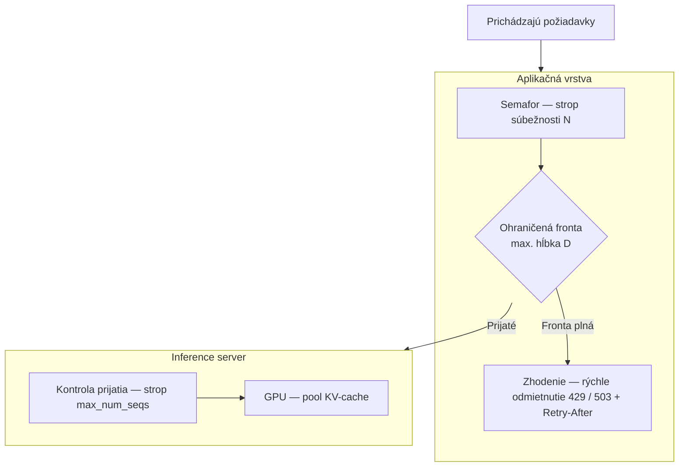
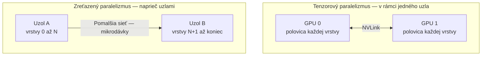

# Odkiaľ sa berie priepustnosť, keď služba narazí na reálnu záťaž

[Prvá časť lekcie](./index.md) postavila službu a pomenovala jej časti: rozdelenie na aplikáciu a model, to, ako asynchrónne FastAPI sadne na záťaž viazanú na I/O (vstup/výstup), streaming (priebežné odosielanie výstupu) cez SSE, produkčný kontrolný zoznam, dockerové rozdiely pri váhach, GPU a studenom štarte, a inferenčné servery s continuous batching a PagedAttention načrtnuté zhruba. Toto je hlboký druhý prechod — tá istá služba pod reálnou záťažou, kde sa z tých názvov stanú vnútorné mechanizmy, spôsoby zlyhania a sada rozhodnutí „kedy to nerobiť“. Prvú časť predpokladáme po celý čas a nič z nej neučíme nanovo.

## Workery, slučka udalostí a odkiaľ sa naozaj berie súbežnosť

Server uvicorn štandardne beží ako jediný proces: jedna slučka udalostí (event loop) pripnutá na jedno jadro CPU. Aby si využil viac než jedno jadro, spustíš viacero procesov typu ASGI worker (pracovný proces) — samostatné kópie ASGI-servera (uvicorn), na ktorých beží tvoja aplikácia. K roku 2026 sú v hre dva spôsoby, ako ich spustiť: klasický gunicorn ako správca procesov, ktorý poháňa `uvicorn.workers.UvicornWorker`, a vlastný zabudovaný prepínač `--workers` priamo v uvicorne; príkaz `fastapi run` ho obaľuje. Dokumentácia FastAPI k nasadeniu predstavuje oba; ber presné odporúčanie ako datovaný detail a podrž si to, čím worker *je*.

Worker ti dá paralelizmus na úrovni procesu: vlastný proces operačného systému, vlastný interpreter Pythonu — takže obchádza GIL (globálny zámok interpretera Pythonu, ktorý v jednom procese pustí k výpočtu vždy len jedno vlákno) — vlastnú slučku udalostí, vlastnú pamäť. Čo ti *nedá*, je súbežnosť, a práve zámena týchto dvoch je klasický omyl pri dimenzovaní LLM-proxy.

Staré pravidlo synchrónneho webu `(2 × jadrá) + 1` tu neplatí, lebo súbežnosť pochádza zo slučky udalostí, nie z počtu procesov: jediná slučka už strieda stovky súbežných čakaní (`await`), keďže LLM-požiadavka takmer celý čas iba čaká. Workery majú dva iné dôvody na existenciu — využiť každé jadro a pokryť úzke úseky práce viazané na CPU: serializáciu požiadavky a odpovede, tokenizáciu, JSON. Počet workerov sa preto riadi počtom jadier a záťažou viazanou na CPU; počet súbežných požiadaviek, ktoré chceš držať, doň nevstupuje.

Ešte jedna výhra zadarmo: uvloop, rýchla implementácia slučky udalostí postavená na libuv, je súčasťou `uvicorn[standard]` a nahrádza štandardnú slučku asyncio — zrýchlenie bez jedinej zmeny v kóde.

Pravidlo o threadpoole (fonde vlákien) z prvej časti teraz dostane aj svoj mechanizmus. Obslužná funkcia cesty (path operation) alebo závislosť napísaná ako obyčajné `def` beží v anyio threadpoole — s predvolenou kapacitou okolo štyridsiatich vlákien — nie na slučke udalostí, takže synchrónna obslužná funkcia slučku rovno nezablokuje. Pod záťažou zlyháva rafinovanejšie: fond sa vyčerpá a ďalšie požiadavky čakajú vo fronte, kým sa nejaké vlákno neuvoľní.

Opačný omyl je horší. Blokujúce volanie vnútri obslužnej funkcie `async def` zmrazí celú slučku udalostí a s ňou každú súbežnú požiadavku v tom procese — to je „jedno blokujúce volanie zastaví všetko“ z prvej časti, teraz aj s dôvodom. Nevyhnutnú synchrónnu prácu presuň na vlákno: `run_in_threadpool` zo Starlette alebo `asyncio.to_thread`, aby blokujúce volanie bežalo na vlákne a slučka obsluhovala ďalej.

Rovnakú starostlivosť si žiada aj vypínanie, len čo sa odpovede začnú streamovať. Na `SIGTERM` má server prestať prijímať nové spojenia a rozbehnuté dokončiť v rámci času na doznenie (graceful timeout) — a LLM-stream môže bežať desiatky sekúnd, dlhšie než predvolené okno na doznenie. Nastav graceful timeout na svoj najdlhší očakávaný stream, inak ti priebežné nasadenie (rolling deploy) odreže odpovede v polovici generovania. (Jedna súvisiaca vec okolo streamingu sa pod záťažou nemení a neodvádzame ju nanovo: voľba medzi validáciou celej odpovede z vyrovnávacej pamäte a validáciou po častiach, ktorú na streamovanú odpoveď kladú výstupné [guardrails (bezpečnostné mantinely)](../../part-1-rag/cross-cutting/guardrails/index.md) — pokrýva ju prvá časť.)

## Ohraničiť prácu skôr, než sa služba utopí

Vďaka asynchrónnosti je držať otvorené spojenie lacné — a práve tá lacnosť je pasca: zvádza službu prijať oveľa viac práce, než dokáže dokončiť.

Neohraničená súbežnosť potom zabije LLM-službu naraz tromi spôsobmi: vyčerpá pamäť (každá rozbehnutá požiadavka drží bloky KV-cache a stav spojenia), vyvolá búrky chýb `429` od poskytovateľa (prekročíš zdieľanú kvótu a škrtený je razom každý volajúci) a skončí strmým zhoršením koncovej latencie (za hranicou kapacity rýchlo narastie čakanie vo fronte a p99 vystrelí). Čo znamená „za hranicou kapacity“, určujú tvoje latenčné SLO — ciele, ktoré vytyčuje [prehĺbenie o observability (pozorovateľnosti)](../../part-1-rag/cross-cutting/observability/deep-dive.md) a ktorým sa celá táto stránka zodpovedá.

Prečo to udrie takto skoro, hovorí Littleov zákon (Little's Law): L = λW, súbežnosť sa rovná miere príchodu krát čas v systéme. Keďže W jednej LLM-generácie beží v desiatkach sekúnd, aj mierna miera príchodu znamená veľkú súbežnosť — desať požiadaviek za sekundu pri dvadsaťsekundovej generácii je dvesto naraz v behu. Na svoj strop súbežnosti narazí LLM-služba pri prekvapivo nízkej miere požiadaviek.

Liekom je protitlak (backpressure) — ochrana pred zahltením: súbežnosť zámerne ohranič semaforom, ktorý stropuje počet súbežných generovaní, a za neho postav ohraničenú frontu s maximálnou hĺbkou. Keď sa fronta zaplní, rýchlo odmietni požiadavku s `429` alebo `503` a hlavičkou `Retry-After` — to je load shedding (zhadzovanie záťaže) — namiesto toho, aby si prijal prácu, ktorú nedokážeš obslúžiť. Požiadavka, ktorú klient môže zopakovať, je oveľa lepší koniec než služba, ktorá sa roztaví pre všetkých.

Kontrola prijatia (admission control) tú istú myšlienku vyostruje: nezaraď do fronty prácu, ktorej v čase, keď sa k nej dostaneš, beztak už vyprší časový limit klienta — odmietnuť ju vopred je lacnejšie než minúť GPU-slot na odpoveď, na ktorú už nikto nečaká. A férovosť si žiada štruktúru — fronty na jednotlivého nájomcu a stropy súbežnosti na nájomcu zabránia tomu, aby jeden nenásytný používateľ obral o zdroje všetkých ostatných. Je to rate limit (strop na počet požiadaviek) na používateľa z prvej časti, teraz zabudovaný priamo do cesty prijímania namiesto prilepenia zvonka.

Základný princíp: ohranič pri vzácnom zdroji, nie pri spojení. Čakajúce spojenie je lacné, no každá rozbehnutá požiadavka aj tak niečo vzácne spotrebúva ďalej v reťazci — batch-slot na GPU alebo kúsok tokenového rozpočtu poskytovateľa. Strop preto patrí práve k nemu. V praxi žije na dvoch úrovniach: aplikačná vrstva ohraničuje vlastným semaforom a frontou a inference server (inferenčný server) presadzuje vlastné prijímanie cez `max_num_seqs` (nižšie). Dvojitá poistka.

## Vnútri inferenčného servera

Priepustnosť inferenčného servera nie je kúzlo; pochádza z hŕstky konkrétnych mechanizmov a vLLM je referenčnou implementáciou väčšiny z nich. Začni plánovačom. Continuous batching je v skutočnosti iteration-level scheduling (plánovanie na úrovni iterácie): plánovač priberá nové požiadavky a vyraďuje dokončené v každom kroku dekódovania, namiesto statického batchingu, pri ktorom celý batch (dávka) čaká na svojho najpomalšieho člena, kým sa smie rozbehnúť ďalší. Myšlienka pochádza z článku Orca (Yu a kol., OSDI 2022), ktorý plánovanie na úrovni iterácie zaviedol; vLLM, TGI aj TensorRT-LLM naň nadväzujú.

Generovanie má dve fázy s opačnými apetítmi. Prefill spracuje celý prompt v jedinom prechode a je viazaný na výpočet. Dekódovanie (decode) generuje po jednom tokene za krok, zakaždým nanovo načítava váhy aj KV-cache a je viazané na priepustnosť pamäte. Zaťažujú rôzne časti GPU — a presne to využívajú nasledujúce dve optimalizácie.

Chunked prefill (prefill po častiach) obe fázy vpletie do jedného kroku: dlhý prefill rozseká na časti a premieša ich s prebiehajúcimi dekódovaniami, takže prefill jedného veľkého promptu už nezastaví generovanie tokenov všetkých ostatných. Kompromis je malý a zvyčajne sa oplatí — o čosi vyššie p50 TTFT za to vpletenie, zato výrazne lepšie p95. Prefix caching (cachovanie prefixu) útočí na opakovanú prácu z druhej strany: keď veľa požiadaviek zdieľa spoločný prefix promptu — povedzme spoločný systémový prompt — použije KV-cache toho prefixu naprieč nimi znova, namiesto toho, aby ju zakaždým počítal nanovo.

Obe sa opierajú o to, ako je KV-cache uložená. PagedAttention (v prvej časti zhruba) drží KV-cache v blokoch pevnej veľkosti tak, ako operačný systém stránkuje pamäť: fragmentácia klesne takmer na nulu a bloky sa dajú zdieľať — a práve na tom mechanizme cachovanie prefixu stojí. Záleží na tom preto, že skutočným stropom nie je hrubý výpočet, ale KV-cache. Jej veľkosť rastie s dĺžkou sekvencie krát počet súbežných sekvencií, a keď sa KV-pool raz zaplní, nepriberieš už ani jednu ďalšiu súbežnú požiadavku, nech má GPU voľných akokoľvek veľa FLOPS.

Ten pool riadia tri prepínače a ich názvy sú momentka roku 2026, ktorú sa oplatí datovať: `max_num_seqs` stropuje počet súbežných sekvencií, `max_num_batched_tokens` určuje rozpočet tokenov na krok a `gpu_memory_utilization` fixuje podiel VRAM vyhradený pre pool KV-cache. Keď sa pool aj tak zaplní, vLLM požiadavky preempuje (vyvlastní) — buď ich KV neskôr prepočíta, alebo ju odloží do pamäte CPU a zase späť.

Jadro pod týmito mechanizmami nedávno prepracovali: vLLM prestaval svoj základ — plánovač, správcu KV-cache, worker aj API-server — do toho, čo nazýva engine V1, ktorý vyšiel ako alfa v januári 2025 a k roku 2026 je predvolený. V1 zapína optimalizácie priepustnosti štandardne, s trvalým batchom a čistým rozdelením medzi procesom plánovača a workera. Označenie verzie sa mení; mechanizmy pod ním nie.

Kvantizácia (quantisation) je posledná páka — vymieňa presnosť za pamäť a rýchlosť. Základnou úrovňou je FP16 alebo BF16. FP8, natívny na tenzorových jadrách Hopper a Blackwell, je takmer bezstratový a v roku 2026 prvá voľba; INT8 (W8A8) ide ďalej; INT4 iba na váhach, cez AWQ alebo GPTQ, zreže pamäť váh v VRAM zhruba o tri štvrtiny — dosť na to, aby sa 70B model zmestil na jedno GPU — za mierne zhoršenie kvality. Samostatnou osou je kvantizácia KV-cache (KV-cache quantisation): keď KV-cache uložíš v FP8, zhruba zdvojnásobíš počet tokenov, ktoré daný pool udrží, a získaš tým dlhšie kontexty alebo väčšiu súbežnosť. Každá z týchto výmen kladie priepustnosť a pamäť proti kvalite; presnosť nie je zadarmo.

## Keď sa model už nezmestí na jedno GPU

Niektoré modely sa na jedno GPU jednoducho nezmestia, a vtedy ich rozdelíš — lenže spôsob rozdelenia rozhoduje o tom, aký hardvér budeš potrebovať.

Tenzorový paralelizmus (tensor parallelism) rozdelí váhové matice každej vrstvy medzi viacero GPU. Každá vrstva potom potrebuje all-reduce na spätné zloženie čiastkových výsledkov, čo ju robí náročnou na komunikáciu a vyžaduje rýchly interconnect (prepojenie) — NVLink — takže patrí dovnútra jedného uzla. Vo vLLM je to prepínač `tensor_parallel_size`.

Zreťazený paralelizmus (pipeline parallelism) reže naopak: vrstvy rozdelí na stupne, každý stupeň posadí na iné GPU alebo uzol a medzi stupňami prúdia mikrodávky. Komunikácie potrebuje oveľa menej, takže znesie pomalší interconnect a funguje naprieč uzlami — za cenu „bubliny“ v zreťazení, prázdneho času, kým sa reťazec napĺňa a vyprázdňuje. Jeho prepínač je `pipeline_parallel_size`.

Orientačné pravidlo vypadne rovno z ceny komunikácie: tenzorový paralelizmus v rámci uzla cez NVLink; zreťazený paralelizmus naprieč uzlami; oba naraz pri naozaj obrovskom modeli. Dátový paralelizmus (data parallelism) je iný nástroj na iný problém — celé repliky modelu za load balancerom (rozdeľovačom záťaže) — pre čistú priepustnosť, keď sa model už na jedno GPU zmestí. Na to, aby vLLM čokoľvek z tohto skoordinoval naprieč strojmi, sa opiera o Ray.

Tá istá disciplína ako všade: nerozdeľuj model, ktorý sa zmestí. Ten, čo pohodlne sedí na jednom GPU, obslúžiš lacnejšie replikovaný než rozštiepený, lebo rozdelenie len pridá komunikačnú réžiu za nič. Paralelizmus sa oplatí pri modeloch, ktoré sa nezmestia, alebo na zníženie latencie — priepustnosť zadarmo nikdy nedostaneš.

## Plánovanie a autoškálovanie GPU na Kubernetes

Na Kubernetes je GPU plánovateľný zdroj a jeho tvar má následky. Device plugin od NVIDIA ho ohlasuje ako `nvidia.com/gpu`, celé číslo — takže pod (nasadzovacia jednotka Kubernetes) štandardne žiada celé GPU a o zlomok GPU požiadať nemožno. Tie drahé stroje si pre záťaže, ktoré ich naozaj potrebujú, udržíš cez node taints a tolerations alebo cez node affinity na vyhradené GPU node pooly, aby obyčajné pody na GPU-uzle nikdy nepristáli.

Keď je prideliť celé GPU jednému podu zbytočne hrubé, jedno GPU vedia zdieľať dva mechanizmy. MIG (Multi-Instance GPU) rozdelí A100 alebo H100 v hardvéri na izolované inštancie, každú s vlastnou pamäťou a izoláciou porúch. GPU time-slicing (delenie GPU v čase) namiesto toho strieda prácu na tom istom GPU úplne bez izolácie pamäte či porúch — v poriadku pre vývojový klaster, rizikové v produkcii, kde porucha alebo špička pamäte jedného nájomcu zasiahne aj ostatných.

Ťažká časť autoškálovania GPU je voľba signálu. Predvolený Horizontal Pod Autoscaler (HPA) škáluje podľa CPU a pamäte, čo je tu na nič: GPU môže byť vyťažené na 100 %, kým CPU zaháľa, takže HPA postavený na CPU sa jednoducho nikdy nespustí. Signál, ktorý niečo znamená, je hĺbka fronty, počet rozbehnutých požiadaviek, tokeny za sekundu alebo využitie GPU odčítané z DCGM (exportér GPU-telemetrie od NVIDIA) — privedené dnu ako vlastné či externé metriky cez Prometheus Adapter alebo KEDA, udalosťami riadený autoscaler, ktorý škáluje presne podľa takýchto externých metrík.

Cold start (studený štart) z prvej časti spôsobí, že každý reaktívny autoscaler mešká. Nová replika musí stiahnuť viacgigabajtový image a načítať váhy — desiatky sekúnd až minúty — skôr, než obslúži jedinú požiadavku, takže škálovanie na špičku dorazí z princípu neskoro. Odpoveďou je držať teplú rezervu alebo škálovať predikatívne, nie čisto na požiadanie; a Cluster Autoscaler vie pridať GPU-uzly, keď sa pool minie, no to trvá ďalšie minúty: príprava uzla navrch k sťahovaniu image. Nad holým plánovačom sedia vrstvy modelového servingu, ktoré to sprístupňujú: KServe a Knative dávajú autoškálovanie riadené požiadavkami — vrátane scale-to-zero (škálovania na nulu) a škálovania podľa súbežnosti — a Ray Serve je ďalšia. Tie názvy produktov sa vymenia; autoškálovanie riadené požiadavkami ako schopnosť nie.

## Prenajať si GPU po sekundách

Na opačnom konci spektra stojí **serverless GPU** — prenajímaš si po sekundách: kapacita GPU účtovaná za sekundu, so škálovaním na nulu, keď je nečinná, a bez klastra na prevádzku. K roku 2026 sem patria Modal, serverless úroveň RunPodu, Replicate, Baseten a Beam — popri nich Fal a Cerebrium — plus Google Cloud Run s pripojeným GPU; ponuka skutočne serverless GPU je u AWS pomerne slabá. Ako v prvej časti, zoznam mien je momentka, ktorá zostarne; trvá kategória.

Tá istá vlastnosť, ktorá kategóriu definuje, je zároveň jej ústredným problémom: daň za studený štart. Každá studená požiadavka najprv zaplatí za načítanie váh a inicializáciu, kým vôbec odpovie, a väčšina inžinierskeho úsilia ide do skracovania práve tohto. Najostrejší nástroj je snímka pamäte a jej obnovenie — Modal urobí snímku už načítaného modelu, takže čerstvá inštancia je pripravená v sekundách, nie v minútach — popri teplých fondoch inštancií, ktoré držia nažive minimálny počet inštancií (čo ukrajuje z úspory zo scale-to-zero, ktorú mali priniesť), a popri rýchlejšom načítavaní váh vôbec. Odvetvie sa za zhruba osemnásť mesiacov posunulo od studených štartov na 30–60 s smerom k tým pod päť sekúnd.

To rozhoduje, kedy po ňom siahnuť. Špičková, nárazová, vývojová alebo dávková premávka serverless sadne, lebo za nečinnú kapacitu medzi špičkami neplatíš. Ustálená vysoká premávka — alebo akákoľvek záťaž, ktorá studený štart neznesie — chce namiesto toho vyhradené, stále teplé GPU: pri vysokom vyťažení lacnejšie na token a bez dane za studený štart. Celé rozhodnutie prenajať-či-vlastniť, a kde má model vôbec bežať, je témou lekcie o [cloudových platformách](../cloud-platforms/index.md); toto je len jej pohľad zo strany servingu.

## Čo si odniesť z lekcie

- Worker je proces — dá ti jadrá, nie súbežnosť; slučka udalostí už strieda stovky čakajúcich požiadaviek, takže počet workerov sa riadi jadrami a prácou viazanou na CPU. Blokujúce volanie v asynchrónnej obslužnej funkcii zmrazí každú požiadavku v procese, tak ho presuň na vlákno — a pri vypínaní daj dlhým streamom čas dobehnúť.
- Neohraničená súbežnosť LLM-službu rozloží a Littleov zákon urobí aj z nízkej miery požiadaviek vysokú súbežnosť. Ohranič ju semaforom a ohraničenou frontou, prebytok zhoď cez `429` a `Retry-After` a strop polož na vzácny GPU- alebo poskytovateľský slot, nie na lacné spojenie.
- Vnútri inferenčného servera priepustnosť pochádza z plánovania na úrovni iterácie (iteration-level scheduling), prefillu po častiach (chunked prefill) a cachovania prefixu nad stránkovanou KV-cache — a práve tá KV-cache sa stane stropom dávno predtým, než GPU dôjde výpočet. Kvantizácia vymieňa kvalitu za pamäť, z ktorej je ten strop postavený.
- Model rozdeľuj medzi GPU len vtedy, keď sa nezmestí: tenzorový paralelizmus v rámci uzla cez NVLink, zreťazený paralelizmus naprieč uzlami, dátovo paralelné repliky, keď sa už zmestí. Rozdelenie ti dá kapacitu, ktorú si nemal; priepustnosť ti zadarmo nedá nikdy.
- Na Kubernetes je GPU celočíselný zdroj, ktorý vie MIG alebo delenie v čase (time-slicing) rozdeliť na menšie. Autoškáluj podľa hĺbky fronty a využitia GPU, nikdy podľa CPU, a rátaj s tým, že studený štart urobí každé reaktívne doškálovanie neskorým.
- Serverless GPU prenajíma kapacitu po sekundách a škáluje na nulu, pričom to platí latenciou studeného štartu, ktorú snímky pamäte a teplé fondy len zmierňujú. Sadne nárazovej a dávkovej premávke; ustálená záťaž je lacnejšia na stále teplom GPU.
- Cez všetkých šesť sekcií vedie jedna myšlienka: čoho má LLM-služba nedostatok, je GPU a jeho KV-cache — pod záťažou chrániš práve tento zdroj, nie spojenie a nie jadro.

**Nové pojmy** → [Glosár](../../glossary.md): ASGI workers, uvloop, threadpool offloading, backpressure, load shedding, admission control, Little's Law, iteration-level scheduling, prefill / decode, chunked prefill, prefix caching, kvantizácia (quantisation), kvantizácia KV-cache (KV-cache quantisation), tensor parallelism, pipeline parallelism, data parallelism, MIG (Multi-Instance GPU), GPU time-slicing, KEDA, KServe, serverless GPU.
