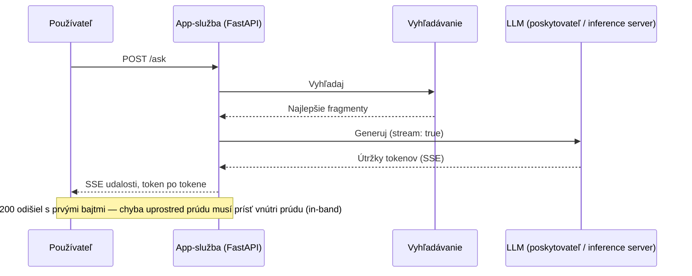
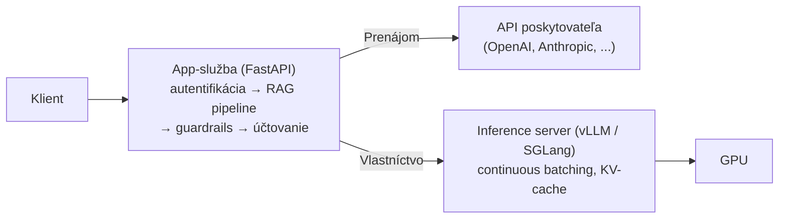

# Z prototypu do produkčnej služby

Druhá časť príručky uzavrela celý systém: z RAG pipeline vyrástol agent, ktorý sa cez štandardné protokoly prepojil so svojimi nástrojmi aj s ďalšími agentmi. Všetko, čo si doteraz postavil, spája jeden nevyslovený predpoklad: beží to na tvojom počítači a pre teba — ty to spustíš, položíš otázku, prečítaš odpoveď, a keď sa to pokazí, sedíš priamo pri tom.

Produkcia z toho postupne odoberie všetko: systém beží ako služba, pre iných ľudí, mnohých naraz, pod záťažou a bez toho, aby sa niekto pozeral. Presne o tomto skoku je Tretia časť príručky a rozvíja ho v jasnom poradí: táto lekcia zabalí to, čo si postavil, do služby; neskoršie lekcie sa pýtajú, kde má model bežať ([cloudové platformy](../cloud-platforms/index.md)), čím bežiaci systém obaliť ([ekosystém nástrojov](../tooling-ecosystem/index.md)) a ako ho prevádzkovať, keď je nasadený ([LLMOps](../llmops/index.md)).

## Jedno slovo, dve úlohy

Pod slovom **serving** (prevádzka modelu alebo pipeline ako sieťovej služby) sa skrývajú dve odlišné úlohy; a zmiešať ich je najrýchlejší spôsob, ako sa stratiť.

Serving aplikácie znamená, že svoj pipeline — vyhľadávanie, slučku agenta, **guardrails** (bezpečnostné mantinely) — zabalíš do API-služby, ktorú volajú klienti. Serving modelu znamená samotný beh LLM-**inferencie** (inference): model počíta výstupy zo vstupov, **dopredný prechod** (forward pass) ako produkčná služba.

Väčšina tímov robí len to prvé; model ostáva za API poskytovateľa a beh inferencie je práca niekoho iného, prenajatá po tokenoch. Táto lekcia pokrýva oboje, v tomto poradí: najprv aplikačnú vrstvu, ktorú potrebuje každý, potom inferenčnú vrstvu pre tímy, čo si model prevádzkujú u seba.

:::note[Predpoklady]

Základy [FastAPI](https://fastapi.tiangolo.com) a [Dockeru](https://docs.docker.com) tu predpokladáme — túto lekciu ani jedno neučí. Oboje je bežná zručnosť s výbornou oficiálnou dokumentáciou; ďalej ide len o rozdiel, ktorý vnáša AI: čo sa zmení, keď je v hre LLM.

:::

## Aplikačná vrstva — prečo zvíťazil FastAPI

Pozri sa, čo taká požiadavka v LLM-aplikácii vlastne robí: rozparsuje vstup, vyšle vyhľadávací dopyt a potom zavolá model — a čaká. Sekundy, občas desiatky sekúnd, služba nerobí nič iné, len drží otvorené spojenie, kým sa tokeny počítajú inde.

Táto záťaž je viazaná na I/O (vstup/výstup) v najčistejšom zmysle a to rozhoduje o architektúre: server s vláknom na požiadavku spáli vlákno pri každom čakaní, kým asynchrónny server strieda stovky čakajúcich požiadaviek v jedinom procese — veď nič iné než čakať aj tak nerobia. Práve tento súlad medzi async-first návrhom a záťažou viazanou na I/O spravil z FastAPI predvolenú voľbu komunity pre LLM-služby.

Tri vlastnosti sa vyplácajú deň čo deň: (a) natívne `async`/`await` obslužné funkcie ciest — vďaka nim je striedanie požiadaviek prosto súčasťou toho, ako píšeš kód; (b) Pydantic modely overia tvar požiadavky a odpovede na hranici — priamo sa spájajú so **štruktúrovaným výstupom** (structured output) z lekcie o [používaní nástrojov](../../part-2-agents/tool-use/index.md): schéma, ktorú mal model vyprodukovať, sa skontroluje skôr, než čokoľvek opustí tvoju službu; (c) automaticky generovaná OpenAPI-dokumentácia drží zverejnený kontrakt aktuálny bez toho, aby ho niekto udržiaval.

Jedna výhrada váži v produkcii viac než ostatné: async pomáha, len ak je asynchrónne všetko v obslužnej funkcii. Jediné blokujúce volanie — synchrónny HTTP-klient, pomalý ovládač databázy — zmrazí **slučku udalostí** (event loop) a s ňou každú súbežnú požiadavku v procese. Nič neohlási chybu; služba len prestane odpovedať, kým jedno volanie blokuje. Toto je klasická produkčná chyba asynchrónnych LLM-služieb a zaslúži si vlastné pravidlo do code review: v asynchrónnej obslužnej funkcii nikdy žiadne synchrónne I/O.

## Streaming — latencia, ktorú naozaj vieš znížiť

Celé generovanie trvá sekundy až desiatky sekúnd a nijaký trik aplikačnej vrstvy to nezmení — model počíta svojím tempom a rýchlejšie nebude. Zmeniť vieš len jedno: ako to čakanie pôsobí na používateľa.

Používateľ nevníma celkový čas generovania — vníma **time-to-first-token** (TTFT), čiže čas do prvého tokenu, to ticho, kým sa objaví čokoľvek. Posielaj tokeny tak, ako ich model tvorí, a desaťsekundová odpoveď začne pôsobiť živo v okamihu, keď dorazia prvé tokeny. **Streaming** (priebežné odosielanie výstupu) je najväčšia páka na vnímanú latenciu, akú máš — a preto streamuje každý veľký chatový LLM-produkt.

Štandardný transport je **SSE** (Server-Sent Events): jednosmerný prúd udalostí cez obyčajné HTTP. Veľké API poskytovateľov (OpenAI, Anthropic) streamujú presne takto, keď zadáš `stream: true`. Na strane FastAPI je to `StreamingResponse` napájaný asynchrónnym generátorom, prípadne pomocník `sse-starlette`, ak nechceš skladať rámovanie udalostí ručne. WebSocket je alternatíva pre prípady, ktoré naozaj potrebujú obojsmernú interakciu počas generovania — hlas, prerušenia od používateľa; pre obyčajné „model hovorí, používateľ číta“ je SSE jednoduchšie a ako obyčajné HTTP prejde cez proxy aj load balancery.

Streaming potichu rozbije chybový model, na ktorý si sa celú kariéru spoliehal: stavový kód HTTP odíde s prvými bajtmi, takže keď sa generovanie v polovici pokazí, dvestovka je už odoslaná a nijaký stavový kód ju nevezme späť. Chyby sa musia prenášať in-band, ako chybová udalosť vo vnútri prúdu — presne to robia API poskytovateľov — a každý klient musí počítať s prúdom, ktorý uprostred odpovede odumrie.

Streaming sa zráža aj s výstupnými [guardrails](../../part-1-rag/cross-cutting/guardrails/index.md) z Prvej časti príručky: úplnú odpoveď, ktorú ešte nemáš, nemôžeš overiť. Máš dve možnosti a obe sú kompromis: (a) celú odpoveď zapíš do vyrovnávacej pamäte a over ju pred odoslaním — tým prídeš o zisk z TTFT; (b) over ju priebežne, útržok po útržku — slabšie: zlý prefix sa dostane k používateľovi skôr, než kontrola zareaguje a ty prúd zrušíš. Reálne systémy sa rozhodujú pre každý typ výstupu zvlášť: prísne bufrované kontroly pre rizikové výstupy, streaming pre nízkorizikový chat.

## Produkčný kontrolný zoznam pre API-vrstvu

Nič z toho nie je exotické — časové limity, opakovania, rate limity (strop na počet požiadaviek), logovanie. AI-špecifické je to, ako sa každé z nich ohne, keď jedna požiadavka môže bežať pol minúty a stáť skutočné peniaze.

**Časové limity.** Predvolené limity HTTP-klientov a proxy — často 30–60 sekúnd — boli nastavené pre služby, čo odpovedajú v milisekundách, a dlhé generovanie ich hravo prekročí a vyvolá falošné prerušenie. Nastav výslovné, štedré limity, a to pre každú fázu zvlášť: volanie vyhľadávania a volanie modelu si zaslúžia iný rozpočet. Streaming pomáha: spojenie, ktoré doručuje tokeny, je preukázateľne živé, takže ho nič nezamení za zaseknutú požiadavku.

**Opakovania.** Chyby poskytovateľa sú bežné — 429 pri rate limite, prechodné 5xx — a poradí si s nimi opakovanie s exponenciálnym backoffom (postupné predlžovanie intervalu medzi pokusmi). Háčik pri AI: nikdy naslepo neopakuj generovanie, ktoré už odstreamovalo pol odpovede; zaplatil by si dvakrát a mohol by si odpovedať dvakrát, zakaždým inak. Opakuj len celé jednotky: návyk idempotencie (idempotency) z distribuovaných systémov, prenesený na generovanie.

**Rate limiting, otočený opačným smerom.** Za tvojou službou je kvóta poskytovateľa — požiadavky za minútu, tokeny za minútu — spoločná pre všetkých. Bez vlastných stropov na používateľa vyčerpá jeden nenásytný používateľ spoločnú kvótu a ostatní dostanú chyby, za ktoré nemôžu. Stropy súbežnosti a rate limity na tvojich vlastných používateľov ich chránia jeden pred druhým.

**Účtovacie napojenia** (hooks). Na každej požiadavke loguj vstupné a výstupné tokeny, ktorý model a latenciu po fázach. Disciplína [observability](../../part-1-rag/cross-cutting/observability/index.md) (pozorovateľnosť) z Prvej časti príručky má tu svoje fyzické miesto — trace (stopa) sa začína v tvojej službe — a produkčné nástroje z [ekosystému nástrojov](../tooling-ecosystem/index.md) budú počítať s tým, že tie napojenia existujú.

## Docker — v čom je to s AI naozaj iné

Ak tvoj kontajner obaľuje len aplikáciu — pipeline, ktorý volá API poskytovateľov — AI tu prakticky nič nemení. Je to bežný štíhly Python image; pravidlá poznáš: malé vrstvy, žiadne zabudované tajomstvá (secrets), konfigurácia z prostredia. Zabaliť LLM-aplikáciu do kontajnera znamená jednoducho zabaliť do kontajnera Python službu.

Všetko sa zmení, keď v kontajneri býva samotný model.

**Najprv váhy.** Váhy modelu majú od gigabajtov po desiatky gigabajtov; keď ich zabuduješ do image, dostaneš image veľký ako samotný model, ktorý sa pomaly zostavuje, nahráva a sťahuje a bolestivo aktualizuje. Bežný vzor drží váhy mimo image: buď cez pripojený zväzok (volume), alebo sťahovaním pri štarte do adresára cache (nasmeruj cache Hugging Face, `HF_HOME`, na trvalý zväzok), takže image ostane iba s kódom. Ten kompromis je citeľný: image so zabudovanými váhami je nemenný a dokonale reprodukovateľný — beží to, čo si otestoval — kým vonkajšie váhy držia image ľahký za cenu závislosti na tom, kde váhy pri štarte ležia.

**Prístup k GPU** je druhý rozdiel. Kontajnery GPU štandardne nevidia: potrebuješ na hostiteľovi NVIDIA Container Toolkit a výslovnú žiadosť o GPU pre každý kontajner — `--gpus` na príkazovom riadku, device requests v Compose alebo Kubernetes. A základné CUDA images, z ktorých tie kontajnery vychádzajú, samy vážia niekoľko gigabajtov skôr, než tvoj kód pridá jediný bajt.

Tretí rozdiel je **cold start** (studený štart). Načítanie váh do pamäte GPU trvá desiatky sekúnd až minúty, takže LLM-kontajner nie je pripravený vo chvíli, keď sa jeho proces spustí. Health check, ktorý hlási „proces beží“, ti nepovie nič užitočné; pripravenosť musí znamenať „model je načítaný a zohriaty“ — a presne túto medzeru Kubernetes rozdeľuje na **sondy pripravenosti a životnosti** (readiness / liveness probes). Cold start je zároveň cena za **scale-to-zero** (škálovanie na nulu): vypnutie nečinných replík ušetrí peniaze za GPU a ďalšia požiadavka to zaplatí tým, že si počká na studený štart.

## Serving modelu — inference servery

Dobre obsluhovať LLM je špecializovaný systémový problém, nie webový. O **priepustnosti** (throughput) rozhoduje úroveň plánovania GPU: **continuous batching**, kde nové požiadavky vstupujú do bežiaceho batchu (dávky) na úrovni jednotlivých tokenov namiesto čakania na dokončenie celého batchu, a správa pamäte ako **PagedAttention** vo vLLM, ktorá stránkuje KV-cache (vyrovnávaciu pamäť kľúč–hodnota) tak, ako operačný systém stránkuje virtuálnu pamäť, a osekáva fragmentáciu, čo inak plytvá pamäťou GPU.

Nič z toho ti nedá nijaký webový framework. Keď za FastAPI postavíš naivnú inferenciu cez `transformers` po jednej požiadavke, kód bude fungovať — no väčšinu priepustnosti GPU necháš nevyužitú. Správny nástroj je vyhradený **inference server** (inferenčný server).

:::tip[▶ Video]

<YouTube id="McLdlg5Gc9s" title="What is vLLM? Efficient AI Inference for Large Language Models — IBM Technology" />

Čo pridáva inferenčný engine oproti webovému serveru — batching a správu pamäte — vysvetlené priamo na vLLM. (Video je v angličtine.)

:::

Ako to vyzerá dnes: **vLLM** je open-source štandard pre serving na GPU; **SGLang** je druhý veľký open-source GPU-server; **Ollama** je pohodlná voľba na lokálny a vývojový beh — nie server produkčnej triedy. (TGI od Hugging Face, kedysi rovnocenný hráč, prešiel v decembri 2025 do režimu údržby a jeho repozitár archivovali — uzamkli len na čítanie — v marci 2026; samotný Hugging Face dnes používateľov posiela na vLLM alebo SGLang.) Ber tento zoznam ako snímku roku 2026 a za trvalé považuj kategóriu: nech zvíťazia ktorékoľvek mená, „inference server“ je tá škatuľa, ktorú tvoja architektúra potrebuje.

Zhodujú sa aj na úrovni protokolu. Inference servery vystavujú **OpenAI-compatible API** (OpenAI-kompatibilné API) a táto kompatibilita sa stala de facto štandardom komunikácie pre LLM-endpointy: tvoja aplikačná vrstva hovorí jedným klientským dialektom, či už je backendom sám OpenAI, vLLM na tvojich vlastných GPU, alebo cloudový endpoint. Výmena backendu má blízko k zmene URL, nie k prepisu — s jednou poctivou výhradou: kompatibilita pokrýva jadro rozhrania chat-completions, nie každý parameter každého backendu.

Zostáva architektonické ponaučenie: čisté rozdelenie práce. Vrstva FastAPI vlastní produkt: autentifikáciu, orchestráciu RAG, guardrails, streaming k používateľovi, účtovanie. Inference server vlastní GPU: batching, KV-cache, načítanie modelu. Ich zreťazenie — app-služba vpredu, inference server vzadu — je štandardná architektúra pri prevádzke u seba; a keď namiesto toho použiješ API poskytovateľa, štrukturálne sa nemení nič, len si tú druhú škatuľu prenajal. Či ju prenajať, alebo vlastniť, je presne otázka lekcie o [cloudových platformách](../cloud-platforms/index.md).

## Čo si odniesť z lekcie

- Serving sú dve úlohy: serving aplikácie (pipeline za API) a serving modelu (inferencia). Väčšina tímov robí to prvé a to druhé si prenajíma od poskytovateľa.
- Požiadavka v LLM-aplikácii je viazaná na I/O — služba väčšinou len čaká na model — a práve preto sa async-first FastAPI stalo predvolenou aplikačnou vrstvou. Jediné blokujúce volanie v asynchrónnej obslužnej funkcii zastaví každú požiadavku v procese.
- Používateľ cíti čas do prvého tokenu (TTFT), nie celkový čas generovania; streaming cez SSE je najväčšia páka na vnímanú latenciu. Stavový kód odíde s prvými bajtmi, takže chyby idú vnútri prúdu (in-band) — a výstupné guardrails ťa nútia pre každý typ výstupu voliť medzi bufrovanou kontrolou a streamingom.
- Klasický kontrolný zoznam sa ohýna: štedré časové limity po fázach, opakovania len pre celé jednotky, tvoje vlastné rate limity pred spoločnou kvótou poskytovateľa a účtovanie tokenov a latencie na každej požiadavke.
- Špecifikum AI sa v Dockeri ukáže, keď v kontajneri býva model: váhy ostávajú mimo image, GPU potrebujú NVIDIA toolkit a výslovné žiadosti a pripravenosť znamená „model načítaný a zohriaty“, nie „proces beží“ — cold start je cena za scale-to-zero (škálovanie na nulu).
- Inference server vlastní GPU (continuous batching, PagedAttention); FastAPI vlastní produkt; OpenAI-compatible API medzi nimi robí backendy vymeniteľnými.

**Nové pojmy** → [Glosár](../../glossary.md): serving, inferencia (inference), inference server, SSE (Server-Sent Events), time-to-first-token (TTFT), streaming, continuous batching, PagedAttention, cold start, OpenAI-compatible API.

---

:::note[Ďalej — druhá časť lekcie]

**[Priepustnosť a škálovanie](./deep-dive.md)** — tá istá služba pod reálnou záťažou: workery a slučka udalostí, fronty a protitlak, vnútro vLLM, viac-GPU a viacuzlový paralelizmus, plánovanie a autoškálovanie GPU na Kubernetes, serverless GPU.

Pozri aj, v Časti III: [cloudové platformy](../cloud-platforms/index.md) pre rozhodnutie prenajať-či-vlastniť a kde model beží, [LLMOps](../llmops/index.md) na prevádzku po spustení, a [ekosystém nástrojov](../tooling-ecosystem/index.md) na to, čím službu obalíš. Pre SLO a rozpočty latencie, na ktoré tieto rozhodnutia o škálovaní odpovedajú, [prehĺbenie o Observability](../../part-1-rag/cross-cutting/observability/deep-dive.md).

:::
