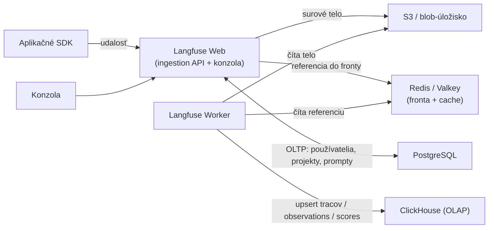
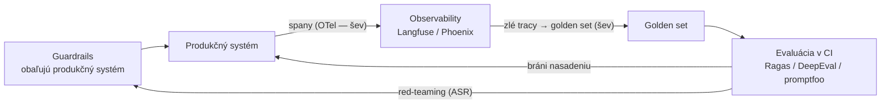

# Štyri dátové úložiská, validátor, ktorý si napíšeš sám, a švy, čo držia stack pohromade

[Prvá časť lekcie](./index.md) premietla tri prierezové témy z Prvej časti príručky — evaluáciu, guardrails (bezpečnostné mantinely), observability (pozorovateľnosť) — na produktovú zostavu roku 2026 a odpovedala: čo si nainštaluješ a kedy? Uzavrela sa predvoleným poradím: najprv tracing, potom evaluácia v CI, napokon guardrails. Tento druhý prechod je *prevádzková* vrstva nad tou istou zostavou. Nie ktorý nástroj vybrať, ale ako si niektorý sám prevádzkovať, keď spravovaná verzia nestačí, ako napísať ten kúsok guardrailu, ktorý ti žiadna knižnica nedodá, a ako sa evaluačné, observability a guardrails nástroje prepoja do jedného stacku (zostava nástrojov) namiesto troch nesúvisiacich produktov. Všetko nižšie je momentka k polovici roka 2026 (júl 2026); ako v Prvej časti lekcie, mená produktov sú datované a trvalou vecou je kategória pod nimi — tentoraz jej prevádzkový tvar.

## Kde žije teória

Táto stránka vlastní prepojenie, nie teóriu. Koncepty, ktoré jednotlivé nástroje realizujú, sa učia raz (v prehĺbeniach, ktoré ich vlastnia) a tu sú prelinkované, nie zopakované:

- **Vnútro metrík** — ako sa faithfulness (vernosť zdrojom), context precision (presnosť kontextu) a context recall (úplnosť kontextu) počítajú ako pipeline typu LLM-as-a-judge — žije v [evaluácii](../../part-1-rag/cross-cutting/evaluation/deep-dive.md).
- **Sémantické konvencie OpenTelemetry pre GenAI** — názvy spanov a atribútov, vzorkovanie — žijú v [observability](../../part-1-rag/cross-cutting/observability/deep-dive.md). Tu iba inštrumentujeme reálny stack a smerujeme spany; konvencie neopakujeme.
- **Teória red-teamingu (útočné testovanie) a prompt-injektáže** — spotlighting, katalóg injektáží, attack success rate (miera úspešnosti útokov), PII pipeline — žije v [guardrails](../../part-1-rag/cross-cutting/guardrails/deep-dive.md). Tu preberáme prevádzkový postup (playbook), nie teóriu.
- **Evaluácia špecifická pre agentov** — skórovanie trajektórie — žije v [plánovaní a slučkách](../../part-2-agents/planning-loops/deep-dive.md) a [multiagentových systémoch](../../part-2-agents/multi-agent/deep-dive.md).

To rozdelenie je zámerné. Definícia metriky a obrana proti injektáži sú trvácne — nauč sa ich raz a platia, nech nasadíš ktorýkoľvek produkt. Prepojenie je opak: mení sa s každým stackom, každou výmenou backendu, každým rozhodnutím o škálovaní, a je to práve tá časť, ktorú dokumentácia nástroja pochová alebo predpokladá. Na to je táto stránka.

## Prevádzka Langfuse u seba: nie jeden kontajner

Začni rozhodnutím, lebo je to naozaj rozhodnutie, nie predvoľba. Po Langfuse siahaš namiesto nástroja, ktorého prvou voľbou je SaaS, a to z jediného dôvodu, ktorý pomenovala Prvá časť lekcie: jadro je pod licenciou MIT a smieš ho prevádzkovať vnútri vlastného perimetra, takže dáta tracov (prompty, získaný kontext, občas obsah od používateľa) nikdy neodídu. Keď tvoje dáta odísť smú, spravovaný Langfuse Cloud alebo LangSmith je jednoducho menej roboty — vezmi ho. Prevádzka u seba (self-hosting) je cena, ktorú zaplatíš za kontrolu a rezidenciu dát. To isté rázcestie „postaviť či kúpiť“ tu prichádza s rozpísaným účtom.

Ten účet: Langfuse nie je jeden proces. Odkedy sa v3 stala stabilnou (9. decembra 2024), je to distribuovaný systém s **dvoma aplikačnými procesmi a štyrmi úložiskami v pozadí**:

- **Langfuse Web** — server v Next.js. Obsluhuje konzolu a ingestion (príjem dát) aj verejné API.
- **Langfuse Worker** — asynchrónny worker, ktorý vyprázdňuje frontu udalostí a spracúva úlohy na pozadí.
- **PostgreSQL** — transakčné úložisko (OLTP, prevádzková databáza riadok po riadku): používatelia, projekty, konfigurácia, prompty.
- **ClickHouse** — analytické úložisko (OLAP, stĺpcová databáza stavaná na agregačné prechody). To je hlavná zmena v3. Traces, observations a scores (tri tabuľky s najväčším objemom) sa presunuli z Postgresu na ClickHouse, lebo Postgres pri miliónoch riadkov prestal stíhať zápis aj dopyt.
- **Redis / Valkey** — fronta príjmu a cache (API kľúče, prompty).
- **S3 / blob-úložisko** — každá prichádzajúca surová udalosť, multimodálny vstup a veľký export pristane najprv sem.

Dôvodom pre všetky tie pohyblivé časti je **ingestion cesta**, ktorú sa oplatí sledovať od začiatku po koniec, lebo vysvetľuje, prečo sa to pri reálnom objeme nedá zliať do jednej škatule. SDK odošle udalosť na `/api/public/ingestion`. Web zapíše surové telo do S3, vloží referenciu do Redis fronty a hneď potvrdí — klient je odblokovaný skôr, než sa čokoľvek naozaj uloží. Worker neskôr vyberie referenciu z fronty, načíta telo späť z S3 a upsertne ho (vloží alebo aktualizuje) do ClickHouse. Endpoint je zámerne asynchrónny: práca sa deje mimo cesty požiadavky. Nápor premávky sa nahromadí vo fronte a v objektovom úložisku namiesto toho, aby blokoval klientov alebo utopil databázu. Fronta, blob-úložisko a OLAP úložisko existujú práve na to, aby pohltili nárazy — a presne preto „len to spusti ako jeden kontajner“ prestane fungovať vo chvíli, keď máš produkčnú premávku.



Kde to prevádzkuješ, stúpa so škálou. **Docker Compose** postaví celú topológiu na jednom stroji — správne pre lokálny vývoj a evaluáciu, nie pre produkčný cieľ. Produkcia je **Kubernetes** cez oficiálny Helm chart, s Terraform modulmi pre AWS, Azure a GCP a s Railway šablónou na rýchlu cestu. Konkrétne prevádzkové fakty, ktoré zdedíš: kvôli vysokej dostupnosti prevádzkuj aspoň dve inštancie Web; autoškáluj Web, keď CPU prekročí 50%; ako spodnú hranicu rátaj zhruba 2 CPU a 4 GB RAM na kontajner. A jeden háčik, ktorý ťa oberie o popoludnie: **každý kontajner musí bežať v UTC.** Iné časové pásmo než UTC prinúti ClickHouse vracať nesprávne alebo prázdne výsledky, a to bez chyby, ktorá by ti prezradila prečo.

Odstúp a skutočnú cenu zrazu vidíš. Prevádzkuješ teraz Postgres aj ClickHouse aj Redis aj objektové úložisko a každé si žiada vlastné zálohovanie, aktualizácie a riešenie porúch. Práve táto prevádzková plocha — nie licenčný poplatok, ktorý je nulový — je skutočnou cenou frázy „prevádzkuj si to sám“, a preto by tá fráza mala spustiť rozhovor „postaviť či kúpiť“, nie `docker compose up`.

Dve poznámky o poctivosti tejto momentky. Presný zoznam komponentov je z polovice roka 2026; Langfuse sa stále hýbe — beží iniciatíva „zjednodušiť pre škálovanie“ a firma sa toho roku pridala ku ClickHouse — takže túto konkrétnu topológiu ber ako aktuálnu, no pohyblivú. Trvalý je tvar: bezstavová aplikačná vrstva plus asynchrónny worker, OLTP úložisko na konfiguráciu, OLAP úložisko na vysokoobjemovú telemetriu, fronta na oddelenie ingestion a objektové úložisko na surové payloady. Každá platforma na tracing s prevádzkou u seba sa pri škále zbehne na tomto vzore, nech je značka akákoľvek.

## Validátor, ktorý si napíšeš sám

Prvá časť lekcie nakreslila deľbu guardrails — frameworky orchestrujú, safety classifiery (bezpečnostné klasifikátory) posudzujú — a všimla si, že Guardrails Hub dodáva hotové validátory z regála. **Validátor** (validator) je jednotka, na ktorej tu záleží: najmenší kúsok vlastného guardrailu, ktorý naozaj napíšeš. Tvoje doménové pravidlo (zakázaná formulácia v politike, obchodné obmedzenie, vlastná výstupná schéma) na Hube zvyčajne nie je; a práve tú medzeru vyplníš. Poradie: najprv sa pozri na Hub, vlastný napíš len na kontrolu špecifickú pre teba.

Pre hotový prípad je Hub inštalátor balíkov:

```bash
guardrails hub install hub://guardrails/competitor_check
```

potom validátor naimportuješ z `guardrails.hub` a použiješ ho. Pre všetko ostatné si jeden napíšeš; API je dosť malé na to, aby si ho udržal v hlave. Dekoruj triedu cez `@register_validator`, odvoď ju od `Validator`, implementuj jedinú metódu — `validate` — ktorá vráti `PassResult()`, keď je hodnota prijateľná, alebo `FailResult(...)`, keď nie je:

```python
from typing import Any, Dict
from guardrails import Guard, OnFailAction
from guardrails.validators import (
    Validator, register_validator, PassResult, FailResult,
)

@register_validator(name="my-org/no_secrets", data_type="string")
class NoSecrets(Validator):
    def validate(self, value: Any, metadata: Dict = {}):
        if "BEGIN PRIVATE KEY" in value or "sk-" in value:
            return FailResult(
                error_message="Output leaks a credential.",
                fix_value="[redacted]",
            )
        return PassResult()

guard = Guard().use(NoSecrets, on_fail=OnFailAction.NOOP)  # measure before enforcing
result = guard.validate(model_output)
```

`fix_value` na `FailResult` je voliteľná — programová oprava, ktorú uplatní politika `fix`. A tým sa dostávame k tej časti API, ktorá nesie skutočnú produkčnú váhu: `on_fail`. Validátor pripojíš k `Guard` cez `.use()` a akcia **on_fail** (`OnFailAction`) rozhodne, čo sa stane, keď kontrola neprejde — a ten istý validátor sa správa úplne inak podľa toho, ktorú zvolíš:

- `exception` — vyhoď výnimku a zavri dvere (fail closed). Tvrdý blok.
- `reask` — vyzvi model, nech to skúsi znova. Stojí ďalšie volanie modelu.
- `fix` — uplatni validátorovu `fix_value` a pokračuj.
- `filter` — zahoď problémovú časť, zvyšok nechaj.
- `refrain` — namiesto odpovede vráť bezpečnú alebo prázdnu.
- `noop` — nerob nič, len to zaznamenaj. Iba pozoruj.

Ponaučenie: pri zlyhaní kontroly zavrieť dvere (fail closed) verzus prepustiť (fail open) je vec politiky, nie zmena kódu. Nasaď nový validátor na `noop`: nič nevynucuje, len meria. A ty tak dostaneš mieru falošných pozitív oproti reálnej produkčnej premávke skôr, než vôbec niekoho zablokuješ. Až keď je tá miera prijateľná, povýšiš ho na `exception` alebo `fix`. Obrátiť to poradie — `exception` od prvého dňa na validátore, ktorý si nezmeral — je presne to, ako dobre mienený guardrail začne v produkcii odmietať legitímne požiadavky.

Dva fakty o skladaní sa viažu späť na úvod lekcie. Kontrola validátora môže byť sama safety classifier: zavolaj Llama Guard alebo Granite Guardian vnútri `validate` a máš framework, ktorý orchestruje, kým klasifikátor posudzuje: presne tá deľba, akú opísala Prvá časť lekcie, teraz v jedinej metóde. A Guardrails AI validuje štruktúrovaný výstup, nielen voľný text — ten istý **štruktúrovaný výstup** (structured output) z lekcie o [používaní nástrojov](../../part-2-agents/tool-use/index.md) — takže validátor vie vynútiť JSON schému pole po poli.

Teraz zdržanlivosť, lebo validátor nie je zadarmo. Neprepisuj validátor z Hubu, ktorý už existuje. Každý validátor je réžia na latenciu a náklady na ceste požiadavky: najviac `reask`, ktorý minie celé ďalšie volanie modelu, a rovnako každý validátor, ktorého kontrola je sama LLM sudca. Rozpočtuj ho preto ako ktorúkoľvek inú synchrónnu závislosť. A validátory testuj ako kód, ktorým sú: práve v tomto bode sa evaluácia v CI z Prvej časti lekcie a guardrails prekrývajú, lebo validátor s nezmeranou mierou falošných pozitív nastavený na `exception` je produkčný incident, ktorý čaká na svojho prvého legitímneho používateľa.

## Stack, prepojený

Tri kategórie z Prvej časti lekcie sa čisto mapujú na dva pruhy každá: open-source pruh s prevádzkou u seba a spravovaný SaaS pruh. Rozložené:

| Kategória | Open source, prevádzka u seba | Spravované / SaaS |
| --- | --- | --- |
| **Evaluácia** | Ragas, DeepEval, promptfoo — beh v CI | Evaluačné funkcie platforiem: datasety a sudcovia v LangSmith / Langfuse / Phoenix; cloudové evaluačné služby |
| **Observability** | Langfuse (MIT), Phoenix (ELv2, source-available) | LangSmith (SaaS-first), spravovaný Langfuse Cloud |
| **Guardrails** | Guardrails AI, NeMo Guardrails, Llama Guard, Granite Guardian | Bedrock Guardrails, Azure AI Content Safety, Vertex Model Armor |

Pri tej hviezdičke zostaň presný ako Prvá časť lekcie: Phoenix je source-available pod ELv2, nie OSI open source — smieš ho prevádzkovať u seba zadarmo, no nezaraďuj ho vedľa Langfuse pod MIT bez tej výhrady.

Kategórie sa rozmazávajú a v reálnom stacku je to funkcia na využitie, nie taxonómia na obranu. Observability platformy dodávajú evaluačné funkcie, lebo produkčný trace je surovinou pre golden set (etalónová sada) — pracovný postup trace → evaluačný prípad, premenený na produkt. Takže jedna platforma, povedzme Langfuse, bežne pokryje tracing aj datasety aj evaluáciu, a vyhradenú evaluačnú knižnicu ako Ragas či DeepEval pridáš len na konkrétne metriky, ktoré jej chýbajú. Chybou je kúpiť štyri nástroje tam, kde dva prekrývajúce sa už pokryjú celé pole.

Skladať tie produkty vôbec umožňuje **OpenTelemetry** (OTel) — a práve k tomuto bodu produkčného prepojenia celá stránka smerovala. Aplikáciu inštrumentuješ raz voči OTel a exportér nasmeruješ tam, kam chceš, aby spany pristáli. Konkrétne: knižnica na automatickú inštrumentáciu (auto-instrumentation), povedzme OpenInference pre Phoenix alebo OpenLLMetry či OTel GenAI, vysiela spany, tie tečú do **OpenTelemetry Collectora** (alebo rovno cez OTLP) a von cez exportér do tvojho backendu. Langfuse prijíma OTLP; Phoenix je postavený priamo na OTel a OpenInference. Výmena observability backendu je potom zmena konfigurácie exportéra, nie prepis aplikácie — tá istá vlastnosť „inštrumentuj raz, exportuj kamkoľvek“, akú Prvá časť lekcie pomenovala, teraz pri skutočnej práci. (Samotné konvencie spanov a atribútov, k polovici roka 2026 stále v stave Development, sú predmetom [observability](../../part-1-rag/cross-cutting/observability/deep-dive.md), tu ich neopakujeme.)

Háčik, ktorý štípe v praxi: neinštrumentuj dvakrát. Spusti SDK-natívny tracing a OTel inštrumentáciu naraz a každý span dostaneš dvakrát — zdvojené dáta, dvojnásobná cena ingestion a prehľady, ktoré potichu počítajú všetko dva razy. Vyber jednu cestu vysielania a druhú vypni.



To je produkčná slučka z Prvej časti lekcie, no pointa tu nie sú škatule — sú to šípky. Slučka sa stane jedným systémom na dvoch švoch: OTel je spojivo medzi produkčným systémom a observability a povýšenie tracu na golden set je odovzdanie medzi observability a evaluáciou. Trafíš tie dve integrácie a slučka sa uzavrie; pokazíš ich a máš tri produkty, ktoré sa nikdy nezhovárajú.

Jedna šípka na tom diagrame je sama osebe prevádzková prax, ktorú sa oplatí ukotviť. Red-teaming je tu kadencia a nástroje, nie teória — katalóg injektáží a mechanika útokov ostávajú v [guardrails](../../part-1-rag/cross-cutting/guardrails/deep-dive.md). Prevádzkovo: naplánuj red-team behy ako brány v CI či pred vydaním (red-teamingové funkcie v promptfoo, vlastné red-team nástroje platformy alebo **PyRIT** z prehĺbenia o guardrails) a sleduj attack success rate v čase ako regresnú metriku — tak, ako sleduješ hociktoré iné číslo, ktoré sa nesmie pohnúť nesprávnym smerom. Prepojenie a rozvrh; teória žije na odkaze.

## Čo si odniesť z lekcie

- Táto stránka je prevádzka, nie teória: vnútro metrík, konvencie OTel, obrany proti injektáži a evaluácie trajektórie sú prelinkované na prehĺbenia, ktoré ich vlastnia, a zámerne sa tu neopakujú.
- Prevádzka Langfuse u seba (v3, od decembra 2024) je distribuovaný systém, nie kontajner — Web + Worker + Postgres (OLTP) + ClickHouse (OLAP, drží tracy, observations a scores) + Redis/Valkey (fronta a cache) + S3/blob (surové udalosti). Asynchrónne frontovaná ingestion pohltí nárazy a ty teraz prevádzkuješ štyri dátové úložiská; práve tá plocha, nie licencia, je cena za udržanie dát vnútri perimetra.
- Cesta nasadenia stúpa so škálou: Docker Compose na vývoj, Kubernetes cez Helm alebo Terraform na produkciu — aspoň dve inštancie Web, autoškálovanie za 50% CPU a každý kontajner v UTC, inak ClickHouse vráti prázdne výsledky.
- Vlastný validátor Guardrails je jednotka guardrailu šitého na mieru: `@register_validator` plus podtrieda `Validator`, ktorej `validate()` vráti `PassResult` alebo `FailResult`, pripojená cez `Guard().use(...)`. Najprv pozri Hub.
- `on_fail` je vec politiky, nie nový kód: začni na `noop`, zmeraj mieru falošných pozitív oproti reálnej premávke a potom povýš na `exception` / `fix` / `filter` / `refrain`. Každý validátor je réžia na latenciu a náklady — testuj ho ako kód, ktorým je.
- Každá kategória má OSS pruh s prevádzkou u seba a spravovaný pruh, a kategórie sa rozmazávajú (observability dodáva evaluáciu), takže dva prekrývajúce sa nástroje porazia štyri. OpenTelemetry je spojivo: inštrumentuj raz, backendy vymieňaj konfiguráciou exportéra a nikdy neinštrumentuj dvakrát.

**[Nové pojmy](../../glossary.md#tooling-ecosystem)**: instrumentation, OpenTelemetry GenAI conventions, safety classifier, red-teaming, observability, guardrails.
