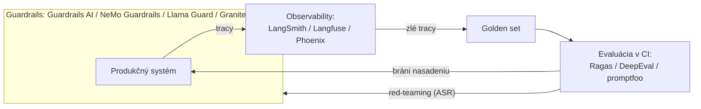

# Splácame dlh z Prvej časti príručky

Tri lekcie z Prvej časti príručky sa skončili rovnakým prísľubom. [Evaluácia](../../part-1-rag/cross-cutting/evaluation/index.md), [guardrails](../../part-1-rag/cross-cutting/guardrails/index.md) (bezpečnostné mantinely) aj [observability](../../part-1-rag/cross-cutting/observability/index.md) (pozorovateľnosť) — každá vyložila svoj princíp a samotné produkty odsunula: nástroje sú samostatná vrstva a prídu neskôr, tu sme pri princípe. Táto lekcia je to sľúbené „neskôr“.

Prvá časť dala pojmy — golden set (etalónová sada), trace, attack success rate. Táto lekcia ich premietne na sadu nástrojov roku 2026 a odpovie na otázku: čo si vlastne nainštaluješ a kedy?

Celú lekciu drží jedno pravidlo. Každá prierezová téma si vypestovala vlastnú kategóriu nástrojov, lenže pojmy sú trvácne a nástroje sú len momentky — nástroj posudzuj podľa toho, ktorý pojem realizuje a kde v tvojej slučke sedí, nie podľa dĺžky zoznamu funkcií.

Hranice medzi kategóriami sa navyše rozmazávajú. Observability platformy **LangSmith** (langchain.com/langsmith), **Langfuse** (langfuse.com) a **Phoenix** (arize.com/phoenix) dodávajú aj evaluačné funkcie: datasety, sudcov, behy so skórovaním. To je spätná väzba (feedback loop) z lekcie o observability, premenená na produkt. Produkčný trace, z ktorého sa stane evaluačný prípad, je jeden pracovný postup, a nástroje dorástli tak, aby pokryli oba konce.

## Evaluačné nástroje

**Ragas** (ragas.io) — open-source knižnica metrík šitých na RAG: faithfulness (vernosť zdrojom), response relevancy (relevancia odpovede), context precision (presnosť kontextu) a context recall (úplnosť kontextu), väčšinu z nich počíta štýlom LLM-as-a-judge. Poznámka k menám: response relevancy je metrika, ktorá sa kedysi volala answer relevancy — Ragasov názov pre relevanciu odpovede z lekcie o evaluácii. Mená sadnú rovno na slovník Prvej časti príručky vrátane deľby na vyhľadávanie a generovanie: context precision a context recall skórujú vyhľadávaciu stranu, faithfulness a response relevancy generačnú. Ragas ti navyše vie vygenerovať kandidátsku testovaciu sadu nad tvojím korpusom.

**DeepEval** (deepeval.com) — open source; jeho prístup je pytest: evaluačný prípad je jednotkový test (unit test), teda `assert_test`, metrika a prah, takže spúšťať evaluácie v CI vyzerá presne ako spúšťať ktorúkoľvek inú sadu testov. Ak už tvoj tím žije v pyteste, cena za osvojenie je takmer nulová.

Konfiguračný prístup (config-driven) nesie **promptfoo** (promptfoo.dev) — open source: YAML súbory opisujú prompty, modely a tvrdenia, nástroj vykreslí porovnávacie matice prompt/model vedľa seba a beží v CI. Prináša aj funkcie na red-teaming (útočné testovanie) — to si nechaj na sekciu o guardrails.

Čo nedodá ani jeden nástroj: **golden set**. Každý z nich počíta metriky nad príkladmi, ktoré poskytneš ty, a kvalita datasetu ostáva tvojou robotou — „malá čistá sada porazí veľkú zašumenú“ z Prvej časti platí aj teraz, keď metriky prichádzajú z knižnice. Ragas ti kandidátske príklady zosyntetizuje, no ľudská kontrola zostáva bránou kvality.

## Observability platformy

**LangSmith** — platforma na tracing a evaluáciu z ekosystému **LangChain** (langchain.com): SaaS ako prvá voľba, prevádzka u seba (self-hosting) len na podnikových plánoch. Ak už bežíš na LangChain alebo **LangGraph** (langchain.com/langgraph), integrácia je najtesnejšia.

**Langfuse** (langfuse.com) — open source (jadro pod MIT, niektoré podnikové funkcie sú za licenciou), prevádzkovateľná u seba cez Docker alebo Kubernetes — predvoľba pre prípad, keď dáta nesmú opustiť tvoj perimeter. Pokrýva tracing, správu promptov, datasety aj evaluácie a nákladové prehľady.

**Arize Phoenix** (arize.com/phoenix) — tracing a evaluácia s prevádzkou u seba, „postavená na OpenTelemetry (opentelemetry.io) a poháňaná inštrumentáciou OpenInference (github.com/Arize-ai/openinference)“ (jej vlastná dokumentácia). Čo sa týka licencie: Phoenix vychádza pod **ELv2** — zdrojový kód je dostupný, smieš ho prevádzkovať u seba zadarmo, no nie je to open source v zmysle OSI. Nezaraďuj ho preto vedľa Langfuse pod MIT bez tejto hviezdičky.

Pod všetkými tromi sa **OpenTelemetry (OTel)** stáva dodávateľsky neutrálnym podložím. Jeho sémantické konvencie pre GenAI zjednocujú názvy spanov a atribútov pre volania LLM (ktorý model, koľko tokenov, ktoré volania nástrojov), takže tvoja **instrumentation** (inštrumentácia), teda háčiky v kóde, ktoré z pipeline vysielajú tracy a metriky, vydrží dlhšie než ktorýkoľvek jednotlivý dodávateľ: inštrumentuj raz a exportér nasmeruj, kam chceš. Výhrada: k polovici roka 2026 sú tieto konvencie stále v stave Development, teda experimentálne a v pohybe. Nachádzajú sa teraz vo vyhradenom repozitári `open-telemetry/semantic-conventions-genai`, ktorý pokrýva aj konvencie pre **MCP** (modelcontextprotocol.io) — protokol z lekcie o [MCP a agentových protokoloch](../../part-2-agents/mcp/index.md), ktorý tak dostáva svoj slovník pre observability.

Zotri značku a všetky tri robia presne jednu vec: základný prvok z lekcie o observability — trace zložený zo spanov (dopyt → fragmenty so skóre → prompt → výstup modelu → kroky agenta), účtovanie nákladov a latencie na každý span, spätnú väzbu od používateľov pripnutú na tracy a tlačidlo s nápisom „povýš tento zlý trace na evaluačný prípad“. Spätná väzba ako funkcia produktu. Aj preto im narástli evaluačné funkcie: len čo držíš tracy, držíš surovinu pre golden set.

:::tip[▶ Video]

<YouTube id="446x7GqXdaA" title="AI Agents Best Practices: Monitoring, Governance, & Optimization — IBM Technology" />

Ako v produkcii vyzerajú monitoring, governance a optimalizácia agentových systémov — kategórie nástrojov z tejto lekcie v pohybe. (Video je v angličtine.)

:::

## Nástroje guardrails

Produkty pre guardrails prichádzajú v dvoch podobách. **Prvá: frameworky**, ktoré vstup aj výstup obalia programovateľnými kontrolami. **Guardrails AI** (guardrailsai.com) — knižnica validátorov v Pythone plus Guardrails Hub, vrátane validácie štruktúrovaného výstupu (structured output) — a **NVIDIA NeMo Guardrails** (developer.nvidia.com/nemo-guardrails), kde sa dialógové „koľajnice“ definujú v konfiguračnom jazyku **Colang**.

**Druhá: safety classifier** (bezpečnostný klasifikátor) — model, ktorý text ohodnotí podľa rizikových kategórií: **Llama Guard** od Mety a **Granite Guardian** (github.com/ibm-granite/granite-guardian) od IBM — kompaktné špecializované modely zamerané na vstup, výstup alebo oboje. Frameworky orchestrujú, klasifikačné modely posudzujú. Tie dve podoby sa skladajú: koľajnica frameworku môže ako jednu zo svojich kontrol zavolať klasifikačný model.

Aj tu narazíš na **rázcestie „postaviť či kúpiť“** — to isté ako všade v Tretej časti príručky. Tie isté koncepty prichádzajú ako spravované platformové služby: **Bedrock Guardrails, Azure AI Content Safety, Vertexove bezpečnostné filtre a Model Armor** — všetky známe z lekcie o [cloudových platformách](../cloud-platforms/index.md). Platformou spravované = menej kontroly, nulová údržba, jeden dodávateľ; open source = plná kontrola a vlastná prevádzka.

Kvalita guardrails sa aj sama meria — Prvá časť príručky dala metriku, **attack success rate (ASR)** (miera úspešnosti útokov). Nástroje na **red-teaming** žijú v evaluačných produktoch: red-teamingové funkcie v promptfoo, vlastné red-team ponuky platforiem. Slučka sa uzatvára: guardrails sa nakonfigurujú, zaútočí sa na ne, zmerajú sa, doladia sa.

## Kedy čo nasadiť

Poradie nižšie je vec úsudku — rozumná predvoľba pre typický produktový tím, nie odvetvový štandard — no zdôvodnenie za každým krokom obstojí.

1. **Najprv tracing.** Najlacnejšie sa pridáva (nepotrebuje nič viac než SDK a exportér) a bez neho nič neodladíš. Bez tracov ani neuvidíš svoje chyby.
2. **Evaluácia v CI**, keď začneš pipeline iterovať, aby ťa chránila pred regresiami — evaluáciou riadený vývoj z Prvej časti. Druhá z poctivého dôvodu: evaluácia potrebuje golden set a ten dá prácu.
3. **Guardrails**, ako sa blížiš k reálnym používateľom a reálnej ploche útoku — skôr, ak je doména regulovaná alebo je vstup od prvého dňa nepriateľský. Guardrails potrebujú model hrozby, a ten sa zvyčajne vynorí až s používaním.

Potom celá produkčná slučka aj s menami produktov — to, čo Prvá časť príručky nakreslila v pojmoch, teraz zabalené do produktu.

Ako táto slučka žije po vydaní, je predmetom lekcie o [LLMOps](../llmops/index.md).

Jeden protipríklad vie celý diagram premeniť na klamstvo: osvojiť si evaluačný nástroj nie je to isté ako mať evaluáciu. Nástroj namierený na plytký, zašumený dataset vyrobí sebavedomo vyzerajúce prehľady nad odpadom — Prvá časť to povedala takto: „bez referencie sa celá evaluácia rozpadne“, a platí to aj s logom produktu navrchu. Nástroje zosilňujú disciplínu, nenahrádzajú ju.

## Čo si odniesť z lekcie

- Pojmy sú trvácne, nástroje sú momentky — nástroj posudzuj podľa toho, ktorý pojem z Prvej časti realizuje a kde v tvojej slučke sedí.
- Veľké observability platformy (LangSmith, Langfuse, Phoenix) si vypestovali evaluačné funkcie, lebo produkčný trace → evaluačný prípad je jeden pracovný postup a nástroje pokrývajú oba konce.
- Mená metrík v Ragas sú slovník Prvej časti (response relevancy = niekdajšia answer relevancy); DeepEval robí z evaluačných prípadov jednotkové testy v pytest-e; promptfoo dodáva YAML porovnávacie matice plus red-teaming.
- Golden set nevyrieši žiadny nástroj: kvalita datasetu ostáva tvojou robotou a zosyntetizované príklady stále prejdú ľudskou kontrolou.
- GenAI konvencie OpenTelemetry sú vznikajúce dodávateľsky neutrálne podložie (k polovici roka 2026 stále experimentálne): inštrumentuj raz, exportuj kamkoľvek. Phoenix je ELv2 source-available — nie open source v zmysle OSI.
- Nástroje guardrails: frameworky (Guardrails AI, NeMo Guardrails) orchestrujú, safety classifiery (Llama Guard, Granite Guardian) posudzujú a tie isté koncepty prichádzajú ako spravované platformové služby — obvyklé rázcestie „postaviť či kúpiť“. Meraj ich cez ASR pri red-teamingu.
- Predvolené poradie nasadenia: tracing → evaluácia v CI → guardrails.

**Nové pojmy** → [Glosár](../../glossary.md): instrumentation, OpenTelemetry GenAI conventions, safety classifier, red-teaming.

---

:::note[Ďalej — druhá časť lekcie]

**[Vlastný hosting a prepojenie](./deep-dive.md)** — tá istá zostava nástrojov posunutá do prevádzkovej vrstvy: nasadenie Langfuse na vlastnú infraštruktúru (topológia, úložiská, škálovanie), písanie vlastných validátorov pre Guardrails AI a to, ako sa evaluačné, guardrails a observability nástroje (spravované aj open-source) prepoja do jedného stacku.

Teória, ktorú každý nástroj realizuje, žije inde a je prelinkovaná, nie zopakovaná: vnútro metrík Ragas v [evaluácii](../../part-1-rag/cross-cutting/evaluation/deep-dive.md), GenAI konvencie OpenTelemetry v [observability](../../part-1-rag/cross-cutting/observability/deep-dive.md), red-teaming a obrana proti injektáži v [guardrails](../../part-1-rag/cross-cutting/guardrails/deep-dive.md), evaluácia trajektórie agenta v [plánovaní a slučkách](../../part-2-agents/planning-loops/deep-dive.md) a [multiagentových systémoch](../../part-2-agents/multi-agent/deep-dive.md).

Pozri aj, v Časti III: [serving](../serving/index.md), [cloudové platformy](../cloud-platforms/index.md) a [LLMOps](../llmops/index.md).

:::
